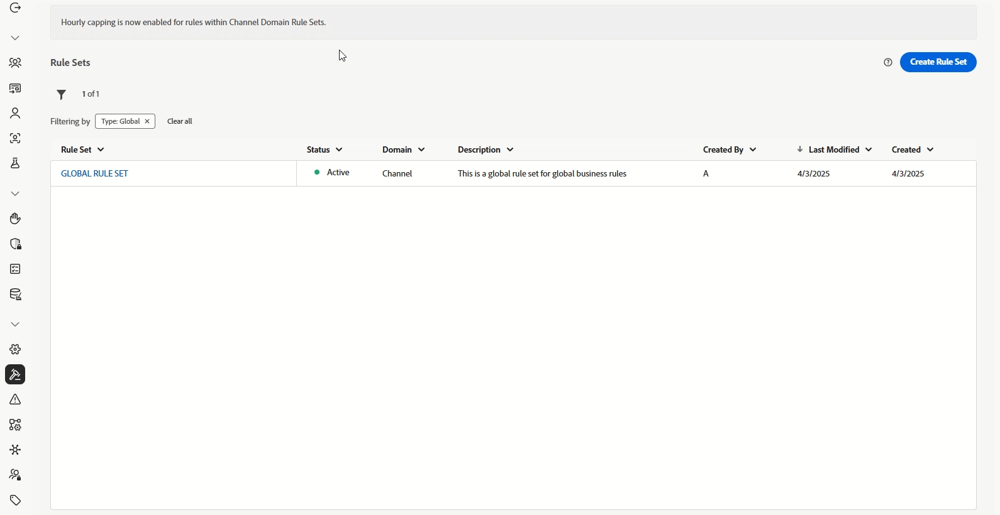
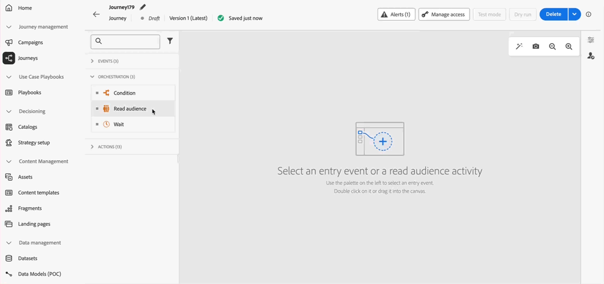

# 2025년 릴리스 정보 {#release-notes-2025}

이 페이지에서는 2025년에 릴리스된 [!DNL Journey Optimizer]의 모든 기능과 개선 사항 목록을 확인할 수 있습니다.

## 25년 10월 릴리스 정보 {#25-10-rn}

### 새로운 기능 {#oct-25-10-features}

<table>
<thead>
<tr>
<th><strong>이미지 HTML 전환기</strong> </th>
</tr>
</thead>
<tbody>
<tr>
<td>

이미지 HTML 전환기는 정적 이미지 디자인을 완전히 사용자 정의 가능한 모듈형 HTML 이메일 콘텐츠 템플릿으로 전환하는 AI 기반 기능입니다. 이 노코드 도구를 사용하면 마케터가 기술 전문 지식 없이도 시각적 디자인을 편집 가능한 반응형 이메일 템플릿으로 전환할 수 있어 플랫폼 마이그레이션, 신속한 템플릿 작성, 재사용 가능한 템플릿 라이브러리 구축에 이상적입니다.

이 기능은 제한적으로 이용할 수 있습니다. 액세스 권한을 얻으려면 Adobe 담당자에게 문의하십시오.

자세한 내용은 <a href="../email/image-to-html.md">세부 설명서</a>를 참조하십시오.

사용 가능한 날짜: 2025년 10월 30일

</td>
</tr>
</tbody>
</table>

<table>
<thead>
<tr>
<th><strong>사용자 정의 액션 모니터링 및 보고</strong> </th>
</tr>
</thead>
<tbody>
<tr>
<td>

이 기능을 사용하면 사용자 정의 액션 엔드포인트 상태 및 성능에 대한 가시성이 향상됩니다. 여정 단계 이벤트 데이터 세트의 새로운 사용자 정의 액션 모니터링 대시보드와 해당 필드는 사용자 정의 액션 엔드포인트에 대한 성공적인 호출, 오류, 처리량, 응답 시간, 큐 대기 시간을 모니터링하는 데 도움이 됩니다. 이제 사용자 정의 액션에서 예외적인 상황이 발생한 시점, 위치, 이유를 빠르게 이해할 수 있습니다.

이 기능은 현재 고객에게 제한된 가용성으로 제공되고 있습니다.

자세한 내용은 <a href="../action/reporting.md">세부 설명서</a>를 참조하십시오.

가용성 일자: 2025년 10월 28일 수요일

</td>
</tr>
</tbody>
</table>

<table>
<thead>
<tr>
<th><strong>랜딩 페이지 사용자 정의 양식</strong> </th>
</tr>
</thead>
<tbody>
<tr>
<td>

이제 [!DNL Journey Optimizer]에서 랜딩 페이지를 통해 프로필 속성을 캡처할 수 있습니다.

특정 데이터 세트를 기반으로 필요에 맞는 사용자 정의 양식을 만들고 디자인하고 관리합니다. 그런 다음 랜딩 페이지에서 이 양식을 활용하여 선택한 프로필 속성을 각 양식별로 정의한 데이터 세트에 추가할 수 있습니다.

이 기능은 현재 미국 및 호주 고객에게 제한된 가용성으로 제공되고 있습니다. 액세스 권한을 얻으려면 Adobe 담당자에게 문의하십시오.

자세한 내용은 <a href="../landing-pages/lp-forms.md">세부 설명서</a>를 참조하십시오.

가용성 일자: 2025년 10월 23일 금요일

</td>
</tr>
</tbody>
</table>

<table>
<thead>
<tr>
<th><strong>방해 금지 시간/시간 기반 제외</strong> </th>
</tr>
</thead>
<tbody>
<tr>
<td>

방해 금지 시간 기능으로 이메일, SMS, 푸시, WhatsApp 채널에 대한 시간 기반 제외를 정의할 수 있습니다. 특정 시간 동안 메시지가 전송되지 않도록 하여 고객 환경 설정과 및 규정 요건을 준수할 수 있습니다.

규칙 세트를 통해 방해 금지 시간을 적용할 수 있으며, 정확한 제어를 위해 이 규칙 세트를 캠페인이나 여정의 개별 액션에 할당할 수 있습니다.

방해 금지 시간대 규칙은 현재 일부 조직에서만 사용할 수 있습니다(제한된 가용성).  향후 릴리스에서 점진적으로 사용 범위를 확대하여 모든 고객에게 제공할 예정입니다.

자세한 내용은 <a href="../conflict-prioritization/quiet-hours.md">세부 설명서</a>를 참조하십시오.

가용성 일자: 2025년 10월 22일 목요일

</td>
</tr>
</tbody>
</table>

<!--table>
<thead>
<tr>
<th><strong>RCS Basic Messaging</strong> </th>
</tr>
</thead>
<tbody>
<tr>
<td>

With the new RCS Basic add-on offering, you can now deliver basic Rich Communication Services (RCS) messaging in Journey Optimizer, enabling the following enhanced messaging capabilities subject to provider and geographical support:

<ul>
<li><strong>Branded and verified sender support:</strong> Send messages using verified business profiles with branding elements (logo, sender name, etc.).</li>
<li><strong>Message delivery insights:</strong> Receive detailed delivery reports including message status updates (e.g., sent, delivered, read).</li>
<li><strong>Link tracking:</strong> Embed and track URLs within RCS messages for engagement analytics.</li>
<li><strong>Fallback to SMS:</strong> Automatic fallback to SMS when the recipient's device does not support RCS or is temporarily unreachable via RCS.</li>
<li><strong>Basic message composition:</strong> Send basic text-based RCS messages.</li>
</ul>
<!--img src="assets/do-not-localize/FILE.gif"-->
<!-- p>For more information, refer to the <a href="../FILE.md">detailed documentation</a>.

<!--/td>
</tr>
</tbody>
</table-->

<!--table>
<thead>
<tr>
<th><strong>Direct mail channel in Orchestrated campaigns</strong> </th>
</tr>
</thead>
<tbody>
<tr>
<td>

Direct mail channel is now available in orchestrated campaigns. The Direct mail activity facilitates direct mail sending within your Orchestrated campaign, for both one-time and recurring messages. It serves to automate the process of generating the extraction file required by direct mail providers. You can combine channel activities into the Orchestrated campaign canvas to create cross-channel campaigns that can trigger actions based on customer behavior and data.

<!--img src="assets/do-not-localize/FILE.gif"-->
<!-- p>For more information, refer to the <a href="../FILE.md">detailed documentation</a>.

<!--/td>
</tr>
</tbody>
</table-->

<!--table>
<thead>
<tr>
<th><strong>Direct Mail channel in journeys</strong> </th>
</tr>
</thead>
<tbody>
<tr>
<td>

Previously limited to Campaigns, Direct Mail channel is now available on the journey canvas, enabling you to incorporate Direct Mail into your journeys. Direct Mail can now be used in both batch and 1:1 journey scenarios, with support for file extraction configuration and time-based frequency settings.

 Previously released in Limited Availability, this capability is now available to all environments (General Availability).

<!--img src="assets/do-not-localize/FILE.gif"-->
<!-- p>For more information, refer to the <a href="../FILE.md">detailed documentation</a>.

<!--/td>
</tr>
</tbody>
</table-->

<!--<table>
<thead>
<tr>
<th><strong>New source connectors for loyalty apps</strong> </th>
</tr>
</thead>
<tbody>
<tr>
<td>

New source connectors are now available in Adobe Experience Platform for the Talon.One, Capillary and Kobie loyalty Apps. These connectors let you seamlessly stream loyalty data into Adobe Experience Platform and leverage these data in Journey Optimizer.

For more information, refer to the <a href="../start/get-started-sources.md">detailed documentation</a>.

Availability date: October 22, 2025

</td>
</tr>
</tbody>
</table>-->

<!--table>
<thead>
<tr>
<th><strong>Decisioning support in email channel</strong> </th>
</tr>
</thead>
<tbody>
<tr>
<td>

You can now add Decision policies into email journeys and campaigns. Decision policies are containers for your offers that leverage the Decisioning engine to dynamically return the best content to deliver for each audience member.

Previously released in Limited Availability, this capability is now available to all environments (General Availability).

For more information, refer to the <a href="../FILE.md">detailed documentation</a>.

Availability date: October 22, 2025

</td>
</tr>
</tbody>
</table-->

<table>
<thead>
<tr>
<th><strong>API 트리거 이메일 캠페인의 높은 처리량 메시지</strong> </th>
</tr>
</thead>
<tbody>
<tr>
<td>

이제 API 트리거 캠페인에서 새로운 높은 처리량 트랜잭션 메시지 모드를 사용할 수 있습니다. 이 모드는 대규모 실시간 트랜잭션 메시지 전송을 위해 설계되었으며 더 높은 가용성으로 초당 최대 5,000개의 트랜잭션을 지원합니다. 또한 이 모드는 고객 프로필을 참조하거나 만들지 않고도 게스트 체크아웃, 주문 확인, 암호 재설정, 보안 알림, 기타 서비스/운영 알림과 같은 트랜잭션 메시지를 지원합니다.

이 기능은 Adobe 높은 처리량 트랜잭션 메시지 추가 기능 서비스를 구입한 조직의 이메일 채널에서만 사용할 수 있습니다. 자세한 내용은 Adobe 담당자에게 문의하십시오.

자세한 내용은 <a href="../campaigns/api-triggered-high-throughput.md">세부 설명서</a>를 참조하십시오.

가용성 일자: 2025년 10월 22일 목요일

</td>
</tr>
</tbody>
</table>

<table>
<thead>
<tr>
<th><strong>재사용 가능한 타기팅 규칙</strong> </th>
</tr>
</thead>
<tbody>
<tr>
<td>

시간과 노력을 절약할 수 있도록, 이제 Journey Optimizer의 전용 UI 메뉴에서 재사용 가능한 규칙을 만들고 캠페인이나 여정 내 콘텐츠 최적화의 일부로서, 또는 여정 최적화 활동에서 타기팅을 작성할 때 활용할 수 있습니다.

타기팅 규칙은 현재 제한된 가용성으로 제공됩니다. 액세스 권한을 얻으려면 Adobe 담당자에게 문의하십시오. 이 기능은 결정 추가 기능 서비스를 구입한 조직에서만 사용할 수 있습니다. 점진적으로 모든 고객을 대상으로 롤아웃될 예정입니다.

자세한 내용은 <a href="../experience-decisioning/rules.md">세부 설명서</a>를 참조하십시오.

가용성 일자: 2025년 10월 22일 목요일

</td>
</tr>
</tbody>
</table>

<table>
<thead>
<tr>
<th><strong>새로운 여정 경고</strong> </th>
</tr>
</thead>
<tbody>
<tr>
<td>

여정 실행을 모니터링하기 위해 새로운 사전 구성된 경고를 사용할 수 있습니다.

<ul><li><a href="../reports/alerts.md#alert-discard-rate">프로필 삭제율 초과</a>: 지난 5분 동안 입력된 프로필에 대한 프로필 삭제율이 임계값 초과</li>
<li><a href="../reports/alerts.md#alert-custom-action-error-rate">사용자 정의 액션 오류율 초과</a>: 지난 5분 동안 성공적인 HTTP 호출에 대한 사용자 정의 액션 오류율이 임계값 초과</li>
<li><a href="../reports/alerts.md#alert-profile-error-rate">프로필 오류율 초과</a>: 지난 5분 동안 입력된 프로필 대비 오류가 발생한 프로필 비율이 임계값 초과</li></ul> 
임계값을 수정하고 개별 여정 수준에서 경고를 받거나 전체적으로 구독할 수 있습니다.

자세한 내용은 <a href="../reports/alerts.md">세부 설명서</a>를 참조하십시오.

가용성 일자: 2025년 10월 14일 수요일

</td>
</tr>
</tbody>
</table>

<table>
<thead>
<tr>
<th><strong>실행 메타데이터 도우미 함수</strong> </th>
</tr>
</thead>
<tbody>
<tr>
<td>

새로운 `executionMetadata` 도우미 함수를 개인화 편집기에서 사용할 수 있습니다. 이를 통해 컨텍스트 정보를 모든 기본 액션에 추가하고 데이터 세트에 캡처하여 외부 시스템으로 내보낼 수 있습니다.

이 기능은 제한적으로 이용할 수 있습니다. 액세스 권한을 얻으려면 Adobe 담당자에게 문의하십시오.

자세한 내용은 <a href="../personalization/functions/helpers.md#execution-metadata">세부 설명서</a>를 참조하십시오.

가용성 일자: 2025년 10월 13일 화요일

</td>
</tr>
</tbody>
</table>

<table>
<thead>
<tr>
<th><strong>Experimentation Accelerator 및 Experimentation Agent</strong> </th>
</tr>
</thead>
<tbody>
<tr>
<td>

Journey Optimizer Experimentation Accelerator에는 이제 실험, 인사이트, 기회와 상호 작용할 수 있는 AI 기반 대화 도구인 Experimentation Agent가 포함됩니다. 실험을 보다 효율적으로 실행하고 효과가 있는 액션을 파악하고 다음 프로젝트를 최적화할 지점을 찾는 데 도움이 되므로 Journey Optimizer Experimentation Accelerator 경험이 향상됩니다.

자세한 내용은 <a href="https://experienceleague.adobe.com/docs/experience-cloud-ai/experience-cloud-ai/agents/agent-experiment.html?lang=ko" target="_blank">세부 설명서</a>를 참조하십시오.

가용성 일자: 2025년 10월 10일 토요일

</td>
</tr>
</tbody>
</table>

<table>
<thead>
<tr>
<th><strong>이메일에 PDF 파일 첨부</strong> </th>
</tr>
</thead>
<tbody>
<tr>
<td>

이제 Journey Optimizer로 보내는 이메일 메시지에 정적 PDF 파일을 첨부할 수 있습니다.

<ul>
<li>매년 프로필별로 최대 6개의 PDF 첨부 파일을 사용하여 메시지를 보낼 수 있습니다.</li>
<li>각 첨부 파일의 최대 크기는 5MB입니다.</li>
<li>용량이나 수량이 더 필요하다면 PDF 첨부 파일 추가 기능을 구매할 수 있습니다. 자세한 내용은 Adobe 담당자에게 문의하십시오.</li>
</ul>

이전에 제한된 가용성으로 릴리스된 이 기능은 이제 모든 환경에서 사용할 수 있습니다(일반 가용성).

자세한 내용은 <a href="../email/pdf-attachments.md">세부 설명서</a>를 참조하십시오.

사용 가능한 날짜: 2025년 9월 30일

</td>
</tr>
</tbody>
</table>

<table>
<thead>
<tr>
<th><strong>여정 검색을 위한 공개 API</strong> </th>
</tr>
</thead>
<tbody>
<tr>
<td>

이제 새로운 Journey Optimizer API를 사용하여 캠페인과 표면 등 여정 및 관련 개체를 검색할 수 있습니다.

자세한 내용은 <a href="https://developer.adobe.com/journey-optimizer-apis/references/journeys-retrieve/">세부 설명서</a>를 참조하십시오.

사용 가능한 날짜: 2025년 9월 25일

</td>
</tr>
</tbody>
</table>

### 개선 사항 {#oct-25-10-improvements}

**WhatsApp 채널의 실행 필드**

이메일 및 SMS 외에도 샌드박스 수준에서 WhatsApp 게재에 대한 기본 실행 필드 업데이트를 알 수 있습니다. 또한 전역적으로 설정된 실행 필드를 재정의할 수도 있습니다. WhatsApp 여정 활동 고급 매개 변수 또는 WhatsApp 채널 구성에서 변경하면 됩니다. [자세히 보기](../configuration/primary-email-addresses.md)

가용성 일자: 2025년 10월 22일 목요일

**Mailto(구독 취소) 주소에 대한 사용자 정의 속성 지원**

Journey Optimizer를 사용하면 Adobe 외부에서 동의를 관리하는 경우 이메일 구성에서 원클릭 구독 취소 링크와 사용자 정의 구독 취소 이메일 주소를 정의하여 외부 사용자 정의 엔드포인트를 설정할 수 있습니다. 수신자가 구독 취소 링크를 클릭하면 Journey Optimizer는 기본 프로필별 매개 변수 몇 가지를 동의 업데이트 이벤트에 추가합니다.

사용자 정의 엔드포인트를 더욱 개인화하기 위해 이제 동의 이벤트에 추가될 사용자 정의 속성을 정의할 수 있습니다. [자세히 보기](../email/list-unsubscribe.md#custom-attributes)

>[!AVAILABILITY]
>
>이 기능은 이미 2025년 8월부터 사용자 정의 **[!UICONTROL 원클릭 구독 취소 URL]**&#x200B;에 사용할 수 있었으며, 이제 제한된 가용성으로 **[!UICONTROL Mailto(구독 취소)]** 옵션이 릴리스되었습니다. 액세스 권한을 얻으려면 Adobe 담당자에게 문의하십시오.

가용성 일자: 2025년 10월 6일 화요일

<!--
### Coming soon {#oct-25-10-soon}

In the next few days, the following capabilities and enhancements are scheduled for release. **Information is subject to change**. Updated links, screens, and documentation will be shared once these updates are live in production.

#### New capabilities {#oct-25-10-soon-features}

<table>
<thead>
<tr>
<th><strong>Themes in the Email Designer</strong> </th>
</tr>
</thead>
<tbody>
<tr>
<td>

You can now quickly apply pre-approved themes to ensure brand consistency across all emails, speed up your campaign creation process, and independently produce high-quality emails while reducing dependency on design teams.

Previously released in beta version, this capability is now available for a set of organizations (Limited Availability). To gain access, contact your Adobe representative.

For more information, refer to the <a href="../email/apply-email-themes.md">detailed documentation</a>.

Availability date: November 4, 2025

</td>
</tr>
</tbody>
</table>

#### Improvements {#oct-25-10-soon-improvements}

**Decisioning in emails through AI models**

You can now use AI models to optimize the best content in your email through the use of Decisioning. For example, this capability allows you to offer the best content based on custom events such as Purchases, Button Clicks, Add to Cart, etc.
-->

<!--
<table>
<thead>
<tr>
<th><strong>New Web Push notifications channel</strong> </th>
</tr>
</thead>
<tbody>
<tr>
<td>

Adobe Journey Optimizer now supports Web Push notifications, expanding the push channel beyond mobile. You can seamlessly deliver notifications to both mobile and desktop browsers, enabling you to reach customers directly on their devices without requiring an app.

This enhancement allows you to engage users with timely, personalized messages in real time, leveraging the same authoring workflows and targeting capabilities already available for mobile push.

For more information, refer to the <a href="../FILE.md">detailed documentation</a>

Availability date: Sept XX, 2025

</td>
</tr>
</tbody>
</table>

<table>
<thead>
<tr>
<th><strong>Custom action monitoring and reporting</strong> </th>
</tr>
</thead>
<tbody>
<tr>
<td>

Custom action monitoring and reporting is now available. This capability provides better visibility into journey health and execution, including lifecycle status and performance alerts. You can now quickly understand when, where, and why an anomalous situation is occurring in a custom action.

For more information, refer to the <a href="../FILE.md">detailed documentation</a>

Availability date: Sept XX, 2025

</td>
</td>
</tr>
</tbody>
</table>

<table>
<thead>
<tr>
<th><strong>New source connectors for loyalty apps</strong> </th>
</tr>
</thead>
<tbody>
<tr>
<td>

New source connectors are now available in Adobe Experience Platform for the Talon.One, Capillary, and Kobie loyalty apps. These connectors let you seamlessly stream loyalty data into Adobe Experience Platform and leverage these data in Journey Optimizer.

</td>
</tr>
</tbody>
</table>

-->

## 25년 9월 릴리스 정보 {#25-9-rn}

**릴리스 일자**: 2025년 9월 23~24일

### 새로운 기능 {#sept-25-9-features}

<table>
<thead>
<tr>
<th><strong>Journey Optimizer Experimentation Accelerator</strong> </th>
</tr>
</thead>
<tbody>
<tr>
<td>

Journey Optimizer Experimentation Accelerator는 실험을 한 단계 더 발전시키기 위해 설계된 AI 중심 제품입니다. Adobe Journey Optimizer 및 Adobe Target 사용자를 위해 구축된 이 솔루션은 실험 관리를 통합하고, AI 기반 인사이트와 기회를 제공하며, 새로운 실험 에이전트를 도입합니다.

다음과 같은 기능을 기대할 수 있습니다.

<ul>
<li><strong>통합 실험 인벤토리:</strong> 하나의 중앙 작업 공간에서 Adobe Journey Optimizer 및 Adobe Target의 모든 실험을 빠르게 보고 필터링하고 관리합니다.</li>
<li><strong>AI 실험 인사이트 및 기회:</strong> 단순한 통계 읽기를 넘어 생성형 AI 기반 인사이트와 추천을 이용할 수 있습니다. 이제 실험별로 실행 가능한 기회를 근거와 함께 표시하므로 팀에서 다음에 테스트할 항목을 보다 자신 있게 결정할 수 있습니다.</li>
<li><strong>Journey Optimizer의 Multi-Armed Bandit(MAB) 지원:</strong> Multi-Armed Bandit 실험으로 트래픽 낭비를 줄이면서 효과를 극대화할 수 있습니다. MAB는 대상자를 균등하게 분할하지 않고 실시간으로 성과가 가장 좋은 베리에이션에 더 많은 방문자를 자동 할당하므로 더 많은 고객에게 더 나은 경험을 제공하면서 효과가 있는 변수를 파악할 수 있습니다.</li></ul>

자세한 내용은 <a href="https://experienceleague.adobe.com/ko/docs/experimentation-accelerator/using/overview">세부 설명서</a>를 참조하십시오.

사용 가능한 날짜: 2025년 10월 3일

</td>
</tr>
</tbody>
</table>

<table>
<thead>
<tr>
<th><strong>Journey 에이전트가 등장했습니다!</strong> </th>
</tr>
</thead>
<tbody>
<tr>
<td>

<a href="https://experienceleague.adobe.com/ko/docs/experience-cloud-ai/experience-cloud-ai/agents/agent-orchestrator" target="_blank">Adobe Experience Platform Agent Orchestrator</a> 기반 Journey 에이전트를 Journey Optimizer에서 사용할 수 있습니다. 이 에이전트를 사용하면 자연어 인터페이스를 통해 여정을 분석할 수 있습니다. 에이전트는 여정에서 대상자 또는 일정 충돌 및 프로필 감소를 감지하여 이를 해결하기 위한 단계를 수행합니다. 곧 에이전틱 지원을 통해 여정을 만들 수 있게 될 것입니다.

자세한 내용은 <a href="https://experienceleague.adobe.com/ko/docs/experience-cloud-ai/experience-cloud-ai/agents/ajo-agent-analyze" target="_blank">세부 설명서</a>를 참조하십시오.

사용 가능한 날짜: 2025년 9월 24일

</td>
</tr>
</tbody>
</table>

<table>
<thead>
<tr>
<th><strong>이메일 디자이너의 다크 모드</strong> </th>
</tr>
</thead>
<tbody>
<tr>
<td>

이제 Journey Optimizer 이메일 디자이너에서 다크모드 보기로 전환할 수 있는 기능을 제공합니다. 이 기능에서는 다크모드에서 이메일을 읽는 수신자에게만 표시되는 특정 사용자 지정 설정을 추가로 정의할 수 있습니다.

다음 사항에 유의하십시오.

<ul>
<li>다크모드 최종 렌더링은 수신자의 이메일 클라이언트에 따라 다를 수 있습니다.</li>
<li>모든 이메일 클라이언트가 사용자 정의 다크모드를 지원하지는 않습니다. 또한 일부 이메일 클라이언트는 수신되는 모든 이메일에 대해 자신의 기본 다크모드만 적용합니다. 두 경우 모두 이메일 디자이너에서 정의한 사용자 지정 설정을 렌더링할 수 없습니다.</li>
</ul>

자세한 내용은 <a href="../email/dark-mode.md">세부 설명서</a>를 참조하십시오.

 
사용 가능한 날짜: 2025년 9월 16일

</td>
</tr>
</tbody>
</table>

<table>
<thead>
<tr>
<th><strong>여정 경로 최적화</strong> </th>
</tr>
</thead>
<tbody>
<tr>
<td>

새로운 최적화 노드를 사용하여 특정 대상자를 타기팅하거나 A/B 테스트를 실행하여 비즈니스 중심 KPI를 충족하는 최상의 경로를 결정합니다.

이 도구를 사용하여 테스트 및 변경을 수행하고 커뮤니케이션, 시퀀스, 타이밍을 사용자 정의하여 고객에게 가장 효과적으로 다가갈 수 있습니다.

이 기능은 제한적으로 이용할 수 있습니다. 액세스 권한을 얻으려면 Adobe 담당자에게 문의하십시오.

자세한 내용은 <a href="../building-journeys/optimize.md">세부 설명서</a>를 참조하십시오.

사용 가능한 날짜: 2025년 9월 4일

</td>
</tr>
</tbody>
</table>

<table>
<thead>
<tr>
<th><strong>하위 도메인에 대한 사용자 정의 위임 방법</strong> </th>
</tr>
</thead>
<tbody>
<tr>
<td>

이제 전체 위임과 CNAME 방법 외에 새로운 하위 도메인 구성 방법인 사용자 정의 위임 방법을 사용할 수 있습니다. 이 방법을 사용하면 메시지 게재, 렌더링, 추적에 필요한 DNS의 모든 측면을 사용자가 완전히 제어하고 유지 관리할 수 있습니다.

이 기능은 제한적으로 이용할 수 있습니다. 액세스 권한을 얻으려면 Adobe 담당자에게 문의하십시오.

자세한 내용은 <a href="../configuration/delegate-custom-subdomain.md">세부 설명서</a>를 참조하십시오.

사용 가능한 날짜: 2025년 9월 4일

</td>
</tr>
</tbody>
</table>

<table>
<thead>
<tr>
<th><strong>개인화 및 결정을 위해 Adobe Experience Platform 데이터 사용</strong> </th>
</tr>
</thead>
<tbody>
<tr>
<td>

이전에 공개 Beta로 릴리스된 이 기능을 이제 모든 환경에서 사용할 수 있습니다. 이번 릴리스에서는 다음과 같은 개선 사항이 도입되었습니다.

<ul><li>인바운드 채널에서 데이터 세트 조회 개인화를 지원합니다.</li>
<li>이제 “datasetLookup” 도우미 함수를 표현식 조각 내에서 사용할 수 있습니다. 현재 이 기능은 제한된 고객들만 사용할 수 있습니다. 액세스 권한을 받으려면 Adobe 담당자에게 문의하십시오.</li>
<li>이제 API 호출을 수행하지 않고도 데이터 세트 관리 인터페이스의 옵션을 통해 조회 개인화를 위한 레코드 기반 데이터 세트를 활성화할 수 있습니다.</li>
<li>데이터 수집 상태를 추적하고 데이터 세트를 조회할 준비가 되었는지 알 수 있도록 모니터링을 개선했습니다.</li>
<li>최적의 성능과 안정성을 보장하기 위해 사용 지침 및 가드레일을 업데이트했습니다.</li>
<li>이제 결정 캡핑 규칙에 Adobe Experience Platform 데이터 세트를 활용할 수 있습니다.</li></ul>

자세한 내용은 <a href="../data/lookup-aep-data.md">세부 설명서</a>를 참조하십시오.

사용 가능한 날짜: 2025년 9월 1일

</td>
</tr>
</tbody>
</table>

### 개선 사항 {#sept-25-9-improvements}

* **API 트리거 캠페인에서 Webhook 지원**\
  이제 API 트리거 캠페인이 Webhook를 지원합니다. 모든 메시지에 대한 실시간 상태 업데이트를 받을 수 있는 웹후크 URL을 구성하여 가시성을 높이고 원활한 모니터링과 자동화를 구현합니다. [자세히 보기](../configuration/feedback-webhooks.md)

  사용 가능한 날짜: 2025년 9월 29일

* **SMS 채널에 대한 mTLS 지원**
이제 사용자 정의 SMS 공급자를 설정할 때 상호 TLS(mTLS) 인증을 활성화하는 옵션이 있습니다. 이 옵션을 선택하면 보안 연결이 설정되기 전에 클라이언트와 서버가 서로의 ID를 확인하도록 요구합니다. [자세히 보기](../sms/sms-configuration-custom.md) - 사용 가능한 날짜: 2025년 9월 23일

* **관계형 스키마**\
  이제 오케스트레이션된 캠페인에서 관계형 모델링 요구 사항을 지원하기 위해 관계형 스키마를 사용할 수 있습니다. [자세히 보기](../orchestrated/gs-schemas.md) - 사용 가능한 날짜: 2025년 9월 23일

* **여정에서 데이터 세트 조회 지원**\
  여정에 새로 추가된 **데이터 세트 조회** 활동을 사용하면 런타임 중에 Adobe Experience Platform 레코드 데이터 세트의 데이터를 동적으로 검색할 수 있습니다. 이 기능을 활용하면 프로필이나 이벤트 페이로드에 없을 수 있는 데이터에 액세스하여 고객 상호 작용이 적시에 적절하게 이루어질 수 있습니다. [자세히 보기](../building-journeys/dataset-lookup.md) - 사용 가능한 날짜: 2025년 9월 23일

  이 활동은 일부 조직에서만 사용할 수 있습니다(제한된 가용성). 액세스 권한을 받으려면 Adobe 담당자에게 문의하십시오.

* **여정 사용자 정의 액션에서 리디렉션 지원**\
  이제 여정 사용자 정의 액션에서 리디렉션(302)이 지원됩니다. - 사용 가능한 날짜: 2025년 9월 23일

* **채널 구성 모니터링 경고** - 이제 사용자 정의 하위 도메인 위임 유형을 사용하는 이메일 채널 구성 오류가 발생한 경우 이메일 또는 Journey Optimizer 알림 센터에서 구독 설정을 통해 시스템 경고를 받을 수 있습니다. [자세히 보기](../reports/alerts.md#alert-channel-config-failure) - 사용 가능한 날짜: 2025년 9월 23일

* **원클릭 구독 취소 요청** - Adobe 관리에서 구성한 원클릭 구독 취소 요청을 더욱 강력하게 처리하여 안정적이고 일관된 처리를 가능하게 하는 개선 업데이트를 진행했습니다. - 사용 가능한 날짜: 2025년 9월 23일

* **이제 사용자 정의 인증에서 중첩된 JSON 본문 매개 변수 지원**\
  사용자 정의 액션에 대한 사용자 정의 인증을 구성할 때 중첩 JSON 오브젝트(예: `bodyParams` 내 하위 오브젝트)가 지원됩니다. [자세히 보기](../datasource/external-data-sources.md#custom-authentication-mode) - 사용 가능한 날짜: 2025년 9월 18일

* **시간 단위 캡핑 빈도 재설정** - 이제 채널 규칙 세트에 대해 시간 단위로 캡핑을 적용할 수 있습니다. 이전에 제한된 가용성으로 릴리스된 이 기능은 이제 모든 환경에서 사용할 수 있으며 1시간을 선택할 수 있습니다(이전에는 3시간). [자세히 보기](../conflict-prioritization/channel-capping.md) - 사용 가능한 날짜: 2025년 9월 17일

* **모든 인바운드 채널에 대한 콘텐츠 베리에이션 시뮬레이션**\
  이전에는 이메일, SMS, 푸시 알림 채널에서만 사용할 수 있던 콘텐츠 베리에이션 시뮬레이션이 이제 모든 인바운드 채널에도 적용됩니다. [자세히 보기](../test-approve/simulate-sample-input.md) - 사용 가능한 날짜: 2025년 9월 17일

* **결정 캡핑 규칙에 표현식 사용** - 이제 결정 항목에 대한 캡핑 규칙의 임계값을 정의하기 위해 자체 표현식을 작성할 수 있습니다. [자세히 보기](../experience-decisioning/items.md#capping) - 사용 가능한 날짜: 2025년 9월 16일

* **동적 도메인 지원** - 이제 Journey Optimizer가 Adobe에서 허용하는 사전 정의된 도메인에 대한 전체/기본 URL 개인화를 지원합니다. [자세히 보기](../personalization/personalization-build-expressions.md#where) - 사용 가능한 날짜: 2025년 9월 12일

  이 기능은 제한된 가용성으로 일부 고객에게만 제공됩니다.

* **웹후크** - 이 릴리스에서는 사용자 정의 SMS 공급자를 구성할 때 웹후크에 대해 다음과 같은 개선 사항이 도입되었습니다.

   * 이제 수집하려는 데이터 유형에 따라 인바운드 또는 피드백 중 웹후크의 목적을 정의할 수 있습니다. [자세히 보기](../sms/sms-configuration-custom.md#webhook) - 사용 가능한 날짜: 2025년 9월 23일

   * 키워드 구성을 위한 인터페이스가 개선되어 설정이 더욱 쉬워졌습니다. [자세히 보기](../sms/sms-configuration-custom.md#webhook) - 사용 가능한 날짜: 2025년 9월 23일

* **SMS**

   * 사용자 정의 SMS 공급자를 설정할 때, 수신 SMS에 인식할 수 없는 키워드가 포함된 경우 사용되는 **기본값** 키워드를 정의할 수 있습니다. 특정 작업에 대해 **사용자 정의** 키워드를 만들 수도 있습니다. [자세히 보기](../sms/sms-configuration-custom.md) - 사용 가능한 날짜: 2025년 9월 23일

   * 이제 SMS 메시지를 통해 전송되는 정의되지 않은 인바운드 키워드 응답에 액세스할 수 있습니다. 여기에는 구성에서 명시적으로 정의되지 않은 오타, 단어 또는 문장이 포함됩니다. 해당 응답은 **AJO 이메일 추적 경험 이벤트** 데이터 세트의 **InboundMessage**&#x200B;에 13개월 동안 저장됩니다. Sinch, Infobip 및 사용자 정의 SMS 공급자를 통해서만 사용할 수 있습니다. - 사용 가능한 날짜: 2025년 9월 23일

## 25년 8월 릴리스 정보 {#25-8-rn}

**릴리스 일자**: 2025년 8월 19일

### 새로운 기능 {#Aug-25-8-features}

이번 릴리스의 새로운 기능을 아래에서 자세히 설명합니다.

<table>
<thead>
<tr>
<th><strong>여정 일시 중단 및 다시 시작</strong> </th>
</tr>
</thead>
<tbody>
<tr>
<td>

이제 여정을 일시 중단했다가 다시 시작할 수 있습니다. 이 기능을 사용하면 고객 경험을 중단하지 않고 라이브 여정을 일시적으로 중단할 수 있으므로 여정 실무자가 여정을 보다 자유롭게 제어하고 유연하게 조정할 수 있습니다. 일시 중단하면 커뮤니케이션이 전송되지 않으며 프로필은 여정이 다시 시작될 때까지 보류 상태로 유지됩니다.

하나의 여정만 일시 중단했다가 다시 시작하거나, 여정 그룹에 일괄 일시 중단 및 다시 시작 작업을 수행할 수 있습니다.

또한 일시 중단된 여정에 프로필 속성 기반 종료 기준(이전 이름: "전역 필터")을 적용하여 속성에 따라 프로필을 제외할 수 있습니다.

이전에 제한된 가용성으로 릴리스된 이 기능은 이제 모든 환경에서 사용할 수 있습니다(일반 가용성).

자세한 내용은 <a href="../building-journeys/journey-pause.md">세부 설명서</a>를 참조하십시오.

</td>
</tr>
</tbody>
</table>

<table>
<thead>
<tr>
<th><strong>캘린더 보기</strong> </th>
</tr>
</thead>
<tbody>
<tr>
<td>

이제 여정 및 캠페인 목록에서 캘린더 보기를 사용할 수 있습니다. 이를 통해 각 목록에 있는 모든 여정 및 캠페인의 활성화를 시각화할 수 있습니다.

이전에 제한된 가용성으로 릴리스된 이 기능은 이제 모든 환경에서 사용할 수 있습니다. 이번 GA 릴리스에서는 다음과 같은 기능이 제공됩니다.

<ul>
<li>날짜 내 탐색에 대한 디자인 개선 사항</li>
<li>시작 및 종료 날짜를 설정한 경우 초안 캠페인을 볼 수 있는 기능</li>
<li>오래 실행되는 일정 항목을 숨기거나 표시하는 새로운 설정</li>
</ul>

자세한 내용은 <a href="../building-journeys/journey-ui.md#calendar">세부 설명서</a>를 참조하십시오.

</td>
</tr>
</tbody>
</table>

<!--table>
<thead>
<tr>
<th><strong>Use Adobe Experience Platform data for personalization</strong> </th>
</tr>
</thead>
<tbody>
<tr>
<td>

Leverage data from [!DNL Adobe Experience Platform] in the personalization editor to personalize your content and decision attributes. In particular, this allows you to extend the definition of your attributes to additional data in datasets for bulk updates that change periodically without having to manually update the attributes one at a time.

With this release, the following enhancements have been introduced:

<ul>
<li>Support of inbound channels,</li>
<li>The "datasetLookup" helper function can now be used within expression and visual fragments to personalize content using data from Adobe Experience Platform datasets,</li>
<li>An option in the dataset now allows you to enable datasets for lookup personalization, without having to perform an API call.</li>
</ul>

This capability is available in Limited Availability. Contact your Adobe representative to gain access.

For more information, refer to the <a href="../personalization/aep-data-perso.md">detailed documentation</a>

</td>
</tr>
</tbody>
</table-->

<!--table>
<thead>
<tr>
<th><strong>Use Decisioning in email channel</strong> </th>
</tr>
</thead>
<tbody>
<tr>
<td>

You can now add Decision policies into email journeys and campaigns. Decision policies are containers for your offers that leverage the Decisioning engine to dynamically return the best content to deliver for each audience member.

Previously released in Limited Availability, this capability is now available to all environments (General Availability).

<For more information, refer to the <a href="../FILE.md">detailed documentation</a>

</td>
</tr>
</tbody>
</table-->

<table>
<thead>
<tr>
<th><strong>여정의 액션 활동</strong> </th>
</tr>
</thead>
<tbody>
<tr>
<td>

Journey Optimizer가 단일 액션과 여러 액션이 있는 인바운드 액션 그룹을 모두 구성할 수 있는 포괄적 액션 활동을 새롭게 지원하여 여정 캔버스 내 액션 구성을 간소화할 수 있습니다. 특히 이 새로운 기능에는 다음과 같은 이점이 있습니다.

<ul>
<li>여정 캔버스 내 기본 액션 구성 간소화.</li>
<li>다중 액션 인바운드 액션 그룹을 만들 수 있는 용량.</li>
<li>모든 기본 제공 채널 액션에 최적화를 더하는 기능.</li>
<li>모든 액션에 실험과 다국어 옵션을 모두 추가하는 기능.</li>
</ul>

이 기능은 제한적으로 이용할 수 있습니다. 액세스 권한을 얻으려면 Adobe 담당자에게 문의하십시오.

자세한 내용은 <a href="../building-journeys/journey-action.md">세부 설명서</a>를 참조하십시오.

</td>
</tr>
</tbody>
</table>

<table>
<thead>
<tr>
<th><strong>이메일에 PDF 파일 첨부</strong> </th>
</tr>
</thead>
<tbody>
<tr>
<td>

이제 Journey Optimizer로 보내는 이메일 메시지에 정적 PDF 파일을 첨부할 수 있습니다.

<ul>
<li>매년 프로필별로 최대 6개의 PDF 첨부 파일을 사용하여 메시지를 보낼 수 있습니다.</li>
<li>각 첨부 파일의 최대 크기는 5MB입니다.</li>
<li>크기나 볼륨이 더 필요하다면 첨부 파일 팩 추가 기능을 구매할 수 있습니다. 자세한 내용은 Adobe 담당자에게 문의하십시오.</li>
</ul>

이 기능은 제한적으로 이용할 수 있습니다. 액세스 권한을 얻으려면 Adobe 담당자에게 문의하십시오.

자세한 내용은 <a href="../email/pdf-attachments.md">세부 설명서</a>를 참조하십시오.

</td>
</tr>
</tbody>
</table>

<!--
<table>
<thead>
<tr>
<th><strong>Landing page custom forms</strong> </th>
</tr>
</thead>
<tbody>
<tr>
<td>

With [!DNL Journey Optimizer], you can now capture profile attributes though your landing pages.

Create, design and manage custom forms tailored to your needs based on a specific dataset. You can then leverage these forms in landing pages to add the profile attributes of your choice into the dataset defined for each form.

This capability is currently in beta version and only available to beta customers. To join the beta program, contact your Adobe representative.

For more information, refer to the <a href="../FILE.md">detailed documentation</a>

</td>
</tr>
</tbody>
</table>
-->

<table>
<thead>
<tr>
<th><strong>캠페인의 최적화</strong> </th>
</tr>
</thead>
<tbody>
<tr>
<td>

이제 Journey Optimizer가 캠페인 대상자에게 개인화되고 최적화된 콘텐츠를 전달할 수 있는 도구를 제공하므로 콘텐츠 실험을 실행하고, 규칙 기반 타기팅을 만들고, 두 방법의 고급 조합을 사용하여 캠페인과 여정의 효과를 극대화할 수 있습니다.

최적화를 사용하면 다음을 할 수 있습니다.

<ul>
<li>여러 콘텐츠 변형을 테스트하여 가장 효과적인 메시징을 식별합니다.</li>
<li>고객 속성 및 컨텍스트 데이터를 기반으로 개인화된 콘텐츠를 제공합니다.</li>
<li>고급 캠페인 전략을 위해 타기팅과 실험을 결합합니다.</li>
<li>변형 기준과 일치하지 않는 사용자를 필터링합니다.</li>
<li>사용자 참여를 유지하기 위한 대체 메커니즘을 확인하십시오.</li>
</ul>

여정이나 캠페인이 라이브 상태가 되면 정의한 기준에 따라 프로필을 평가하고, 일치하는 기준을 기반으로 캠페인의 적절한 경험 또는 콘텐츠를 해당 프로필에 전달합니다.

8월 8일에 캠페인용으로만 릴리스되었던 이 기능을 8월 22일부터 여정에서도 사용할 수 있게 되었습니다.

자세한 내용은 <a href="../content-management/gs-message-optimization.md">세부 설명서</a>를 참조하십시오.

</td>
</tr>
</tbody>
</table>

### 개선 사항 {#Aug-25-8-improv}

다음은 이번 릴리스의 개선 사항 목록입니다.

* **관리**

   * **채널 구성 모니터링 경고** - 이제 구독을 통해 <!--a channel configuration failure happens or if -->DNS 레코드가 누락된 경우 이메일 또는 Journey Optimizer 알림 센터에서 시스템 경고를 받을 수 있습니다. [자세히 보기](../reports/alerts.md#alert-dns-record-missing)

* **AI 어시스턴트**

   * **다국어 콘텐츠 생성** - 이제 프랑스어, 스페인어, 독일어, 이탈리아어, 일본어, 스웨덴어, 네덜란드어, 노르웨이어로 콘텐츠를 생성할 수 있습니다. [자세히 보기](../content-management/generative-uc.md#languages)

     사용 가능한 날짜: 8월 25일

* **캠페인**

   * **아웃바운드 캠페인의 속도 제어** - 이제 아웃바운드 캠페인(이메일, SMS, 푸시 알림)에 대한 속도 제어를 활성화하여 랜딩 페이지나 고객 지원 플랫폼과 같은 다운스트림 시스템의 과부하를 방지할 수 있습니다. [자세히 보기](../campaigns/campaign-schedule.md#set-rate-control)

   * **액션 캠페인 예약** - 되풀이 일정을 보다 세부적으로 제어하는 기능을 제공하기 위해 캠페인 일별, 주별, 월별 스케줄러를 업데이트했습니다. 

      * **주별 반복**: 이제 캠페인 반복 주기를 매주 또는 격주 중 선택하고 실행할 요일도 선택할 수 있습니다.

      * **월별 반복**: 이제 캠페인 반복 주기를 매월 또는 격월 중 선택하고 실행할 날짜도 선택할 수 있습니다.

      * **일별, 주별 또는 월별 일정**: 되풀이 일정을 특정 날짜에 중지할지 또는 특정 실행 횟수 이후에 중지할지 지정할 수 있습니다.

   * **예약된 트랜잭션 액션 캠페인** - 이제 예약된 트랜잭션 액션 캠페인으로 이메일, SMS, 푸시 채널을 통해 대상자 기반 배치 트랜잭션 커뮤니케이션을 보낼 수 있습니다.

* **채널 - 콘텐츠 카드**

   * **콘텐츠 카드 레이아웃 템플릿** - 이제 콘텐츠 카드 채널에서 작성 환경을 간소화하는 OOTB 메시지 레이아웃을 제공합니다. 이 릴리스에는 [작은 이미지], [큰 이미지], [이미지만] 레이아웃 템플릿이 포함됩니다. [자세히 보기](../content-card/design-content-card.md)

* **채널 - 푸시**

   * **푸시 알림 만료일** - 이제 각 푸시 알림에 대해 만료일을 지정할 수 있습니다. 이 기능으로 시간에 민감한 메시지(예: 블랙 프라이데이 세일)가 특정 날짜 이후에 전송되지 않도록 설정해 고객에게 좋지 않은 경험을 전하는 것을 방지할 수 있습니다.

* **채널 - SMS**

   * **퍼지 옵트아웃** - **퍼지 옵트아웃** 옵션을 활성화하면 정의된 옵트아웃 키워드(예: &#39;CANCIL&#39;)와 유사한 인바운드 메시지를 감지하고 자동으로 확인 응답을 보내 사용자의 구독 취소 의도를 확인합니다. 사용자가 정의된 프롬프트를 통해 확인을 완료하면 해당 사용자의 구독을 취소합니다. [자세히 보기](../sms/sms-configuration-sinch.md)

     >[!NOTE]
     >
     >**퍼지 옵트아웃**&#x200B;은 Sinch 및 Infobip에서만 사용할 수 있습니다.

   * **SMS 연결 확인** - 이제 샘플 메시지를 지정된 디바이스로 전송하여 Adobe Journey Optimizer 내에서 SMS API 자격 증명을 쉽게 테스트하고 확인할 수 있습니다. [자세히 보기](../sms/sms-configuration-sinch.md)

* **구성**

   * **원클릭 구독 취소 URL에 사용자 정의 속성 지원** - Journey Optimizer를 사용할 때 Adobe 외부에서 동의를 관리하는 경우 이메일 구성에서 원클릭 구독 취소 링크를 정의하여 외부 사용자 정의 엔드포인트를 설정할 수 있습니다. 수신자가 구독 취소 링크를 클릭하면 Journey Optimizer는 기본 프로필별 매개 변수 몇 가지를 동의 업데이트 이벤트에 추가합니다.

     이제 원클릭 구독 취소 링크의 개인화 수준을 높이기 위해 사용자 정의 속성을 지정할 수 있으며, 이는 동의 이벤트에도 추가됩니다. 이 기능은 제한적으로 이용할 수 있습니다. [자세히 보기](../email/list-unsubscribe.md#custom-attributes)

* **데이터 세트**

   * **경험 결정 오브젝트 저장소 - 맞춤형 오퍼 항목** - 이제 기본 제공 내보내기 데이터 세트에 모든 오퍼 속성 및 라이프사이클 상태가 포함되어 완전한 개인화 및 보고가 가능해집니다. [자세히 보기](../data/export-datasets.md)

   * 일관성을 개선하고 변경 내용을 추적하여 오퍼 항목을 보다 안정적으로 제공하기 위해 `etag` 필드를 통한 버전 검사를 도입했습니다.

* **의사 결정**

   * **결정 항목에 조각 첨부** - 이제 Journey Optimizer가 결정 항목에 조각을 첨부할 수 있는 기능을 제공합니다. 따라서 결정 정책을 통해 코드 기반 경험 캠페인에서 활용할 수 있습니다. 이 기능은 제한된 가용성으로 일부 고객에게만 제공됩니다. [자세히 보기](../experience-decisioning/create-decision.md#fragments)

* **여정**

   * **여정 일괄 작업** - 이제 여정 목록에서 여러 항목을 선택할 수 있습니다. 선택하면 한 번에 최대 10개의 여정을 일시 중지하거나 다시 시작할 수 있습니다.

   * **사용자 정의 액션 리디렉션(302) 지원** - 이제 사용자 정의 액션에서 요청별로 HTTP 302 리디렉션을 처리할 수 있습니다. 이를 통해 요청을 현지화된 URL 또는 지역별 URL로 리디렉션하는 API를 여정에 통합할 수 있습니다. 리디렉션은 자동으로 수행되므로 추가 구성 없이도 정확한 콘텐츠가 전달됩니다.

   * **여정의 여러 인바운드 액션** - 이제 여정 오케스트레이션을 단순화하기 위해 단일 여정에서 여러 인바운드 액션을 정의할 수 있습니다. 이전에는 캠페인에만 사용할 수 있던 이 기능을 사용하면 여러 코드 기반 경험, 인앱 메시지, 콘텐츠 카드 또는 웹 액션을 동시에 다른 위치에 전달할 수 있으며, 각 액션에는 특정 콘텐츠가 포함됩니다. [자세히 보기](../building-journeys/journey-action.md#multi-action)

## 캠페인 오케스트레이션

**사용 가능한 날짜**: 2025년 8월 4일

이제 Journey Optimizer에 브랜드 주도 배치 캠페인을 위해 특별히 설계된 새로운 기능인 **캠페인 오케스트레이션**&#x200B;이 포함됩니다. 이 릴리스에서는 캠페인 오케스트레이션 캔버스 및 향상된 데이터 모델링을 도입하여 마케터가 개인화된 크로스 채널 캠페인을 계획하고, 타깃팅하고, 제공할 수 있도록 함께 작업합니다.

>[!IMPORTANT]
>
>캠페인 오케스트레이션에 액세스하려면 라이선스에 **Journey Optimizer - 캠페인 및 여정** 또는 **Journey Optimizer - 캠페인** 패키지가 포함되어야 합니다. 필요한 경우 Adobe 담당자에게 문의하여 라이선스를 확인하고 업데이트하십시오.

여기에는 [관계형 스키마 및 데이터 세트](#oc-relational) 및 [Campaign 캔버스](#oc-canvas)가 포함됩니다. 이러한 두 가지 혁신적인 기능을 통해 Journey Optimizer에서 배치 캠페인을 오케스트레이션하기 위한 새로운 기준을 마련할 수 있습니다. 주요 기능은 아래에 나와 있습니다.

### 주요 기능 {#oc-capabilities}

* **여러 단계 워크플로**

  특별히 제작된 새로운 캠페인 오케스트레이션 캔버스를 통해 정교한 멀티채널 배치 캠페인을 수행할 수 있습니다.

* **온디맨드 대상자**

  즉각적인 활성화를 위해 온디맨드로 대상자를 세그먼트화합니다.

* **다중 엔터티 세분화**

  제품, 스토어, 갱신, 예약 등과 같은 비즈니스 컨텍스트(비사용자 차원)를 사용하여 대상자를 작성합니다.

* **사전 전송 가시성**

  캠페인 실행 전과 실행 중에 대상자 및 캠페인을 검토, 세분화 및 최적화합니다.

### 캠페인 캔버스 {#oc-canvas}

배치 캠페인을 위해 특별히 빌드된 새로운 시각적 오케스트레이션 인터페이스입니다. 이 캔버스를 통해 다음을 할 수 있습니다.

* 여러 단계, 다중 채널 캠페인 흐름의 시각적 계획

* 관계형 쿼리를 기반으로 구축된 온디맨드 대상 지원

* 고급 대상 분할, 대기 및 조건부 논리

* 비즈니스 규칙 및 필터 적용 후 정확한 사전 전송 카운트

### 관계형 스키마 및 데이터 세트 {#oc-relational}

이제 Adobe Journey Optimizer가 사용자 기반 프로필에 연결된 관계형 엔티티(예: 제품, 스토어, 예약, 계약)를 지원합니다. 이를 통해 다차원 데이터 구조 간에 세분화 및 개인화를 수행할 수 있으므로 다음과 같은 사용 사례가 가능합니다.

* 예약, 구독 또는 계약당 하나의 메시지

* 관련 엔티티 속성(예: 제품 카테고리 또는 스토어 위치)을 기반으로 한 세분화

* 향상된 주소 지정(예: 엔티티에 연결된 알려진 모든 연락처로 전송)

### 이것이 중요한 이유

이 릴리스를 통해 마케터는 유연한 데이터 모델링과 특별히 빌드된 오케스트레이션 경험을 결합하여 브랜드 주도, 대상 기반 일괄 마케팅을 완벽하게 제어할 수 있습니다. 이는 고급 개인화 및 확장성을 제공하면서도 실시간 여정의 배치 캠페인 오케스트레이션을 위해 특별히 설계되었습니다.

### 자세히 알아보기

[캠페인 오케스트레이션](../orchestrated/gs-orchestrated-campaigns.md)에서 자세히 알아보십시오.

## 2025년 7월 릴리스 정보 {#25-7-rn}

**릴리스 일자**: 2025년 7월 29일

### 새로운 기능 {#features-25-7}

이번 릴리스의 새로운 기능을 아래에서 자세히 설명합니다.

#### 기능

<table>
<thead>
<tr>
<th><strong>브랜드</strong> </th>
</tr>
</thead>
<tbody>
<tr>
<td>

이제 커뮤니케이션 전반에 걸쳐 시각적, 언어적 정체성을 명확하게 정의하기 위해 자체 브랜드를 만들고 사용자 정의할 수 있습니다. 브랜드 정렬 점수를 사용하면 콘텐츠가 브랜드의 톤, 스타일, 가이드라인을 얼마나 잘 반영하는지에 대한 실시간 피드백을 받을 수 있으므로 보내는 모든 메시지에서 일관되게 브랜드에 맞는 내용을 전달하는 데 도움이 됩니다.

이전에 Beta로 릴리스된 이 기능은 이제 모든 환경에서 사용할 수 있습니다(일반 가용성).

자세한 내용은 <a href="../content-management/brands.md">세부 설명서</a>를 참조하십시오.

</td>
</tr>
</tbody>
</table>

<table>
<thead>
<tr>
<th><strong>이메일 채널에서 의사 결정 사용</strong> </th>
</tr>
</thead>
<tbody>
<tr>
<td>

이제 이메일 여정 및 캠페인에 의사 결정 정책을 추가할 수 있습니다. 의사 결정 정책은 의사 결정 엔진을 활용하여 각 대상 구성원에 대해 제공할 최상의 콘텐츠를 동적으로 반환하는 오퍼에 대한 컨테이너입니다.

이 기능은 제한적으로 이용할 수 있습니다. 액세스 권한을 얻으려면 Adobe 담당자에게 문의하십시오.

자세한 내용은 <a href="../experience-decisioning/create-decision.md">세부 설명서</a>를 참조하십시오.

</td>
</tr>
</tbody>
</table>

<table>
<thead>
<tr>
<th><strong>LINE 채널</strong> </th>
</tr>
</thead>
<tbody>
<tr>
<td>

Adobe Journey Optimizer는 LINE 채널에 대한 지원을 포함하도록 크로스 채널 기능을 확장했습니다. 이 향상된 기능을 통해 LINE 경험을 만들고 편집하고 미리 볼 수 있으므로 보다 개인화되고 매력적인 상호 작용을 제공할 수 있습니다. LINE을 사용하여 더 많은 고객과 소통하고 관련 콘텐츠를 전송하며 참여도를 개선할 수 있습니다.

이전에는 요청만 사용할 수 있었지만 이제 모든 사용자가 LINE 채널을 사용할 수 있게 되었습니다(일반 가용성).

자세한 내용은 <a href="../../rp_landing_pages/line-landing-page.md">세부 설명서</a>를 참조하십시오.
</td>
</tr>
</tbody>
</table>

<table>
<thead>
<tr>
<th><strong>여정 시험 실행</strong> </th>
</tr>
</thead>
<tbody>
<tr>
<td>

여정 시험 실행은 Adobe Journey Optimizer의 특별한 여정 게시 모드로, 이를 통해 여정 실무자가 실제 고객과 연락하거나 프로필 정보를 업데이트하지 않고도 실제 프로덕션 데이터를 사용하여 여정을 테스트할 수 있습니다. 이 기능은 여정 실무자가 여정을 게시하기 전에 여정 설계와 대상자 타기팅에 대한 자신감을 얻는 데 도움이 됩니다.

이전에 제한된 가용성으로 릴리스된 이 기능은 이제 모든 환경에서 사용할 수 있습니다(일반 가용성).

자세한 내용은 <a href="../building-journeys/journey-dry-run.md">세부 설명서</a>를 참조하십시오.

</td>
</tr>
</tbody>
</table>

<table>
<thead>
<tr>
<th><strong>여정용 보조 ID</strong> </th>
</tr>
</thead>
<tbody>
<tr>
<td>

이제 주문 ID, 구독 ID 또는 처방전 ID와 같은 다른 식별자와 함께 프로필 ID를 사용하여 여정을 트리거함으로써 동일한 프로필이 한 번에 여러 차례 동일한 여정에 있도록 할 수 있습니다. 이를 통해 각 인스턴스가 자체 여정 경로를 따르면서 여러 주문 또는 구독을 동시에 관리할 수도 있습니다.

이전에 제한된 가용성에서 릴리스되었던 여정에서의 보조 ID 사용 기능이 이제 모든 환경에서 사용할 수 있게 되었습니다. 이번 GA 릴리스에서는 이제 대상자 읽기 여정에 대한 지원이 기능에 포함됩니다.

자세한 내용은 <a href="../building-journeys/supplemental-identifier.md">세부 설명서</a>를 참조하십시오.

</td>
</tr>
</tbody>
</table>

### 제품 내 경고

이제 Journey Optimizer 제품 릴리스에 대한 **이메일 및 제품 내 경고**&#x200B;를 구독할 수 있습니다.

구독하려면

* **Adobe Experience Cloud 환경 설정**&#x200B;으로 이동하십시오.
* **알림**&#x200B;에서 **Journey Optimizer 새 릴리스**&#x200B;를 찾습니다.
* 인앱 및 이메일 알림 활성화

{width="70%" align="left"}

### 여정 조건 변경 {#ee-change@}

7월 8일부로 신규 고객 조직의 경우 여정 조건에 사용하는 표현식 편집기에서 경험 이벤트를 사용하여 표현식을 만드는 작업이 지원되지 않습니다. 따라서 표현식을 만드는 데 [Experience Platform 데이터 소스](../datasource/adobe-experience-platform-data-source.md)의 경험 이벤트를 사용할 수 없습니다. 경험 이벤트를 사용하여 표현식/논리를 만드는 다른 방법 및 모범 사례는 [여기](../building-journeys/exp-event-lookup.md)에서 참조할 수 있습니다.

단일 여정에서 여정 컨텍스트 이벤트 데이터에 액세스하는 방법에는 변화가 없습니다. 사용자는 계속 표현식 편집기 및 개인화 편집기에서 초기 여정 이벤트로 전달된 데이터에 액세스할 수 있습니다.

[이 FAQ](../building-journeys/exp-event-lookup.md#faq-ee)에서 자세히 알아보십시오.

### 개선 사항 {#25-7-improv}

다음은 이번 릴리스의 개선 사항 목록입니다.

* **캠페인**

   * **캠페인의 여러 인바운드 작업** - 이제 캠페인 오케스트레이션을 단순화하기 위해 단일 캠페인에서 여러 인바운드 작업을 정의할 수 있습니다. 이 기능을 사용하면 여러 코드 기반 경험, 인앱 메시지, 콘텐츠 카드 또는 웹 작업을 동시에 다른 위치에 전달할 수 있으며, 각 작업에는 특정 콘텐츠가 포함됩니다.
     [자세히 보기](../campaigns/campaign-action.md#multi-action)

   * **캠페인 인벤토리 재구성** - 이제 예약된 캠페인 및 API 트리거 캠페인이 더 쉬운 탐색 및 관리를 위해 캠페인 인벤토리에서 별도의 탭으로 분할됩니다.

[자세히 보기](../campaigns/manage-campaigns.md)

* **데이터 관리**
   * **의사 결정 관리 시스템 데이터 세트 업데이트** - 이제 삭제된 개인화된 오퍼 및 대체 오퍼가 “decision_object_repository_personalized_offers” 및 “decision_object_repository_fallback_offers” 데이터 세트에 보관된 것으로 표시됩니다. 데이터 세트의 기존 레코드는 변경되지 않습니다.

[자세히 보기](../offers/export-catalog/access-dataset.md)

* **여정**
   * **여정 샌드박스 도구 개선 사항** - 패키지 내보내기 및 가져오기 기능을 사용하여 여러 샌드박스에서 여정을 복사할 때 이제 다음 기능도 사용할 수 있습니다.
      * 대상에서 기존 이벤트 선택
      * 여정과 독립적으로 이벤트 복사
      * 필드 그룹/데이터 소스 관계 감지, 대상(있는 경우)에서 연결, 없는 경우 생성.

[자세히 보기](../configuration/copy-objects-to-sandbox.md)

* **채널 - 인앱**
   * **인앱 키/값 쌍** - 인앱 메시지를 사용하여 메시지 페이로드에 사용자 지정 변수를 포함하도록 키 및 값 쌍을 정의할 수 있습니다. 이러한 키-값 쌍을 사용하면 특정 구성 및 사용 사례에 따라 추가 데이터를 전달할 수 있습니다. [자세히 보기](../in-app/design-in-app.md)

* **채널 - 콘텐츠 카드**

   * **규칙 기반 캠페인 결격** - 추가 게재 규칙을 편집할 때 이전 게재 규칙 옵션이 세 가지 개별 규칙 유형으로 대체되어 메시지 타이밍 및 가시성을 더 잘 제어할 수 있습니다.
      * 다음과 같은 경우 메시지 표시: 컨텐츠 카드가 표시되는 시기를 결정하는 조건.
      * 다음과 같은 경우 메시지 닫기: 컨텐츠 카드를 일시적으로 숨기는 조건. 표시 조건이 다시 충족되는 경우 다시 나타날 수 있습니다.
      * 메시지 부적격: 컨텐츠 카드가 다시 표시되지 않도록 영구적으로 차단하는 조건.

[자세히 보기](../content-card/design-content-card.md)

* **의사 결정**
   * **마이그레이션 도구 API** - Journey Optimizer 팀은 현재 의사 결정 관리 엔터티를 Decisioning으로 마이그레이션하기 위한 마이그레이션 도구 API를 작업 중입니다. 이 도구를 사용하면 종속성 해결 및 롤백 기능을 통해 샌드박스 간에 원활하게 마이그레이션할 수 있습니다. 관심이 있는 경우 Adobe 담당자에게 문의하십시오.

* **개인화**
   * 개인화 편집기에 새로운 헬퍼 함수 “SHA256”이 추가되었습니다. 이 함수는 문자열의 sha256 해시를 계산하고 반환하는 데 사용합니다.

[자세히 보기](../personalization/functions/string.md#sha256)

## 25년 6월 릴리스 정보 {#25-6-rn}

**릴리스 일자**: 2025년 6월 18일

### 새로운 기능 {#25-06-features}

이번 릴리스의 새로운 기능을 아래에서 자세히 설명합니다.

<table>
<thead>
<tr>
<th><strong>결정에 Adobe Experience Platform 데이터 세트 사용(Beta)</strong> </th>
</tr>
</thead>
<tbody>
<tr>
<td>

이전에 개인화에 사용할 수 있었던 Adobe Experience Platform 데이터 세트를 이제 결정에 활용할 수 있습니다. 그러면 주기적으로 변경되는 일괄 업데이트 시 속성을 일일이 수동으로 업데이트할 필요 없이 결정 속성의 정의를 데이터 세트의 추가 데이터로 확장할 수 있습니다. 예를 들면 가용성, 대기 시간 등이 있습니다.

이 기능은 현재 모든 고객이 공개 Beta로 사용할 수 있습니다. 액세스하려면 계정 담당자에게 문의하십시오.

자세한 내용은 <a href="../experience-decisioning/aep-data-exd.md">세부 설명서</a>를 참조하십시오.

사용 가능한 날짜: 2025년 6월 20일

</td>
</tr>
</tbody>
</table>

<table>
<thead>
<tr>
<th><strong>RCS 메시지</strong> </th>
</tr>
</thead>
<tbody>
<tr>
<td>

이제 사용자 정의 SMS 공급자 솔루션 통합으로 서드파티 공급자를 통해 RCS(Rich Communication Services) 메시지를 구성, 사용자 정의, 전달할 수 있습니다.

자세한 내용은 <a href="../sms/sms-configuration-custom.md">세부 설명서</a>를 참조하십시오.

</td>
</tr>
</tbody>
</table>

<table>
<thead>
<tr>
<th><strong>코드 기반 경험 콘텐츠의 양식 필드</strong> </th>
</tr>
</thead>
<tbody>
<tr>
<td>

이제 JSON 또는 HTML 콘텐츠 템플릿에서 편집 가능한 특정 필드를 정의할 수 있습니다. 이렇게 하면 기술 전문가가 아닌 사용자도 코드를 조작할 필요 없이 손쉽게 코드 기반 경험 채널 작성 내 양식 보기의 콘텐츠를 편집할 수 있습니다. 더 나아가 이제 코드 기반 경험 콘텐츠 템플릿을 정의할 때 템플릿에 결정 정책을 삽입하여 재사용성과 사용 편의성을 높일 수 있습니다.

자세한 내용은 <a href="../code-based/code-based-form-fields.md">세부 설명서</a>를 참조하십시오.

</td>
</tr>
</tbody>
</table>

<!--
<table>
<thead>
<tr>
<th><strong>Custom delegation method for subdomains</strong> </th>
</tr>
</thead>
<tbody>
<tr>
<td>

In addition to the full delegation and the CNAME method, a new subdomain configuration method is now available: the Custom delegation method, which enables you to fully own controlling and maintaining all aspects of DNS that are required for delivering, rendering and tracking messages.

</td>
</tr>
</tbody>
</table>
-->

<table>
<thead>
<tr>
<th><strong>여정의 콘텐츠 결정 활동</strong> </th>
</tr>
</thead>
<tbody>
<tr>
<td>

이제 여정 캔버스에서 전용 [콘텐츠 결정] 활동을 통해 개인화된 오퍼를 여정에 포함하고 조건 및 사용자 정의 액션을 포함한 여정 활동에 사용할 수 있습니다.

이 기능은 일부 조직에서만 사용할 수 있으며(제한된 가용성) 향후 릴리스에서 전체 사용자를 대상으로 공개될 예정입니다.

자세한 내용은 <a href="../building-journeys/content-decision.md">세부 설명서</a>를 참조하십시오.

</td>
</tr>
</tbody>
</table>

<table>
<thead>
<tr>
<th><strong>여정 시험 실행</strong> </th>
</tr>
</thead>
<tbody>
<tr>
<td>

여정 시험 실행은 Adobe Journey Optimizer의 특별한 여정 게시 모드로, 이를 통해 여정 실무자가 실제 고객과 연락하거나 프로필 정보를 업데이트하지 않고도 실제 프로덕션 데이터를 사용하여 여정을 테스트할 수 있습니다. 이 기능은 여정 실무자가 여정을 게시하기 전에 여정 설계와 대상자 타기팅에 대한 자신감을 얻는 데 도움이 됩니다.

이 기능은 일부 조직에서만 사용할 수 있으며(제한된 가용성) 향후 릴리스에서 전체 사용자를 대상으로 공개될 예정입니다.

자세한 내용은 <a href="../building-journeys/journey-dry-run.md">세부 설명서</a>를 참조하십시오.

</td>
</tr>
</tbody>
</table>

<table>
<thead>
<tr>
<th><strong>여정 일시 중단 및 다시 시작</strong> </th>
</tr>
</thead>
<tbody>
<tr>
<td>

이제 여정을 일시 중단했다가 다시 시작할 수 있습니다. 이 기능을 사용하면 고객 경험을 중단하지 않고 라이브 여정을 일시적으로 중단할 수 있으므로 여정 실무자가 여정을 보다 자유롭게 제어하고 유연하게 조정할 수 있습니다. 일시 중단하면 커뮤니케이션이 전송되지 않으며 프로필은 여정이 다시 시작될 때까지 보류 상태로 유지됩니다.

하나의 여정만 일시 중단했다가 다시 시작하거나, 여정 그룹에 일괄 일시 중단 및 다시 시작 작업을 수행할 수 있습니다.

또한 일시 중단된 프로필에 전역 필터를 적용하여 속성에 따라 프로필을 제외할 수 있습니다.

이 기능은 일부 조직에서만 사용할 수 있으며(제한된 가용성) 향후 릴리스에서 전체 사용자를 대상으로 공개될 예정입니다.

자세한 내용은 <a href="../building-journeys/journey-pause.md">세부 설명서</a>를 참조하십시오.

</td>
</tr>
</tbody>
</table>

<table>
<thead>
<tr>
<th><strong>실험 우승자 적용 확대</strong> </th>
</tr>
</thead>
<tbody>
<tr>
<td>

[실험 우승자 적용 확대] 기능을 사용하면 실험에서 우승한 베리에이션을 전체 대상자에게 자동 또는 수동으로 롤아웃할 수 있습니다. 이 기능을 사용하면 우승자가 식별된 후 지속적인 수동 감독 없이 도달 범위와 효과를 극대화할 수 있습니다.

자세한 내용은 <a href="../content-management/content-experiment.md">세부 설명서</a>를 참조하십시오.

사용 가능한 날짜: 2025년 6월 2일
</td>
</tr>
</tbody>
</table>

<table>
<thead>
<tr>
<th><strong>충돌 및 우선순위 지정</strong> </th>
</tr>
</thead>
<tbody>
<tr>
<td>

Journey Optimizer에서 너무 많은 상호 작용으로 고객에게 부담 주는 상황을 피하려면 캠페인과 여정의 양과 타이밍을 관리하는 것이 필수적입니다. 이제 Journey Optimizer에서 충돌 관리 및 우선순위 지정을 위한 몇 가지 도구를 제공합니다. 이전에는 제한된 액세스(LA) 조직에서만 사용할 수 있었지만 현재는 일반 가용성(GA)으로 사용할 수 있습니다.

이전에 제한된 가용성으로 릴리스된 이 기능은 이제 모든 환경에서 사용할 수 있습니다. 이번 일반 가용성 릴리스에서는 다음과 같은 개선 사항이 도입되었습니다.

<ul>
<li>지원 확대: 이제 충돌 관리 도구가 대상자 읽기 여정 외에도 단일 여정 및 대상자 선별 여정을 모두 지원합니다.</li>
<li>문제 해결 개선: 이제 쿼리 서비스에서 두 개의 새로운 단계 이벤트 필드를 사용하여 여정 또는 캠페인에서 프로필이 거부된 이유를 분석할 수 있습니다.</li>
<li>보고 기능 향상: 이제 보고서에 여정 또는 캠페인에서 특정 프로필을 제외한 규칙이 명시되어 투명도가 향상되고 실행 가능한 인사이트를 얻을 수 있습니다.</li></ul>

자세한 내용은 <a href="../conflict-prioritization/gs-conflict-prioritization.md">세부 설명서</a>를 참조하십시오.

사용 가능한 날짜: 2025년 6월 3일

</td>
</tr>
</tbody>
</table>

### 개선 사항 {#25-06-improv}

다음은 이번 릴리스의 개선 사항 목록입니다.

* **채널 규칙 세트**

   * 캡핑의 **사용자 정의 기간** - 채널 규칙 세트 구성 화면에 새로 추가된 **모든**(반복 주기) 필드를 사용하여 지정된 기간에 따라 여러 날, 주 또는 달에 걸쳐 빈도 상한 규칙을 적용할 수 있습니다.

   * **시간 단위 캡핑 빈도 재설정** - 이제 채널 규칙 세트에 대해 시간 단위로 캡핑을 적용할 수 있습니다. 이 기능은 일부 조직에서만 사용할 수 있습니다(제한된 가용성). 이 기능을 활성화하려면 고객 지원 센터에 문의하십시오.

   * **일별 기간** - 이전에는 제한된 가용성으로 사용할 수 있던 채널 규칙 세트의 “일별” 빈도 제한을 이제 모든 고객이 사용할 수 있습니다.

  자세한 내용은 [세부 설명서](../conflict-prioritization/channel-capping.md)를 참조하십시오.

* **코드 기반 경험**

   * 이제 코드 기반 경험 콘텐츠 템플릿에 결정 정책을 추가할 수 있습니다. 템플릿에서 이 결정 정책으로 편집 가능한 양식 필드의 오퍼를 활용할 수 있습니다. [자세히 보기](../code-based/code-based-form-fields.md)

   * 이제 코드 기반 경험 여정 또는 캠페인 편집 화면에서 개인화 편집기를 열지 않고도 결정 정책을 직접 추가할 수 있습니다. [자세히 보기](../code-based/create-code-based.md#edit-code)

* **이메일 디자이너의 사용자 정의 CSS 지원**

  이제 Journey Optimizer의 [이메일 디자이너] 내에서 바로 이메일 콘텐츠에 사용자 정의 CSS를 추가할 수 있습니다. [자세히 보기](../email/custom-css.md)

* **캠페인에 새로운 탭 탐색 적용**

  새로운 탐색 패턴을 통해 콘텐츠 작성에 보다 빠르게 액세스하고 여러 캠페인 간에 설정을 더욱 확장할 수 있습니다. [자세히 보기](../campaigns/create-campaign.md)

* **의사 결정**

   * **샌드박스 복사 및 결정**(사용 가능한 날짜: 2025년 6월 3일) - 이제 결정 오브젝트를 샌드박스 간에 복사할 수 있으므로 테스트 워크플로및 배포 워크플로가 간소화됩니다. [자세히 보기](../configuration/copy-objects-to-sandbox.md#decisioning)

   * **결정 규칙에서 결정 항목 속성 지원**(사용 가능한 날짜: 2025년 6월 4일) - 이제 결정 항목 속성을 활용하여 결정 규칙을 만들 수 있습니다. [자세히 보기](../experience-decisioning/rules.md#create)

* **Interactive Message Execution API 업데이트** - 사용 가능한 날짜: 2025년 6월 6일

  이제 Interactive Message Execution API를 사용하여 예정된 캠페인 실행 일정을 삭제할 수 있습니다. [자세히 보기](https://developer.adobe.com/journey-optimizer-apis/references/messaging/){target="_blank"}

## 25년 5월 릴리스 정보 {#25-5-rn}

<!--**Release date**: May 20-21, 2025-->

### 새로운 기능 {#25-05-features}

이번 릴리스의 새로운 기능을 아래에서 자세히 설명합니다.

<table>
<thead>
<tr>
<th><strong>캠페인 및 여정 인벤토리에 대한 캘린더 보기</strong> </th>
</tr>
</thead>
<tbody>
<tr>
<td>

이제 여정 및 캠페인 목록에서 캘린더 보기를 사용할 수 있습니다. 이를 통해 각 목록에 있는 모든 여정 및 캠페인의 활성화를 시각화할 수 있습니다.

이 변경은 현재 일부 조직에서만 사용할 수 있습니다(제한된 가용성). 액세스 권한을 요청하려면 <a href="https://forms.cloud.microsoft/r/FC49afuJVi" target="_blank">이 양식</a>을 사용하십시오.

자세한 내용은 <a href="../building-journeys/journey-ui.md">여정 찾아보기 및 필터링</a>, <a href="../campaigns/manage-campaigns.md">캠페인 액세스</a> 섹션을 참조하십시오.

사용 가능한 날짜: 2025년 5월 28일

</td>
</tr>
</tbody>
</table>

<table>
<thead>
<tr>
<th><strong>Adobe Experience Manager 콘텐츠 조각 통합</strong> </th>
</tr>
</thead>
<tbody>
<tr>
<td>

Adobe Experience Manager와 Adobe Journey Optimizer의 통합을 통해 이제 Journey Optimizer 콘텐츠 내에서 Adobe Experience Manager 콘텐츠 조각을 손쉽게 사용할 수 있습니다. 이 원활한 연결을 통해 Journey Optimizer에서 직접 AEM 콘텐츠에 손쉽게 액세스하고 사용할 수 있습니다.

이전에는 제한된 일부 조직에서만 사용할 수 있었던(LA) 이 기능을 이제 다음 개선 사항과 더불어 GA로 사용할 수 있습니다. [편집기 모드]를 사용하여 조각 서명 내에서 자리 표시자를 정의하고 개인화 값을 매핑할 수 있습니다.

<ul>
<!--li>Create offers by directly selecting an AEM Content Fragment.</li>
<li>Define placeholders and map personalization values within the fragment signature using the Editor mode.</li-->
</ul>
 

자세한 내용은 <a href="../integrations/aem-fragments.md">세부 설명서</a>를 참조하십시오.

사용 가능한 날짜: 2025년 5월 23일

</td>
</tr>
</tbody>
</table>

<table>
<thead>
<tr>
<th><strong>Adobe Experience Manager Dynamic Media 통합</strong> </th>
</tr>
</thead>
<tbody>
<tr>
<td>

이제 Journey Optimizer에서 Dynamic Media 자산을 바로 사용 및 액세스할 수 있습니다. 이 통합을 통해 다음과 같은 작업을 수행할 수 있습니다.

<ul>
<li>자산을 중앙에서 관리하며 실시간 업데이트를 확인합니다.</li>
<li>너비 및 높이와 같은 자산 설정을 즉시 수정합니다.</li>
<li>콘텐츠를 업데이트하고 개인화 필드를 추가하여 Dynamic Media 템플릿을 사용자 정의합니다.</li>
</ul>
 

이전에 제한된 가용성으로 릴리스된 이 기능은 이제 모든 환경에서 사용할 수 있습니다(일반 가용성).

자세한 내용은 <a href="../integrations/aem-dynamic.md">세부 설명서</a>를 참조하십시오.

사용 가능한 날짜: 2025년 5월 23일

</td>
</tr>
</tbody>
</table>

<table>
<thead>
<tr>
<th><strong>이벤트 트리거 여정에 대한 보조 ID</strong> </th>
</tr>
</thead>
<tbody>
<tr>
<td>

이제 주문 ID, 구독 ID 또는 처방전 ID와 같은 다른 식별자와 함께 프로필 ID를 사용하여 여정을 트리거함으로써 동일한 프로필이 한 번에 여러 차례 동일한 여정에 있도록 할 수 있습니다. 이를 통해 각 인스턴스가 자체 여정 경로를 따르면서 여러 주문 또는 구독을 동시에 관리할 수도 있습니다.

자세한 내용은 <a href="../building-journeys/supplemental-identifier.md">세부 설명서</a>를 참조하십시오.

이 기능은 일부 조직에서만 사용할 수 있습니다(제한된 가용성). 액세스 권한을 받으려면 Adobe 담당자에게 문의하십시오.

사용 가능한 날짜: 2025년 5월 23일

</td>
</tr>
</tbody>
</table>

<table>
<thead>
<tr>
<th><strong>콘텐츠 변형 시뮬레이션</strong> </th>
</tr>
</thead>
<tbody>
<tr>
<td>
<!--p>Previously available in beta, content variations simulation is now generally available (GA). It allows you to preview different variations of your content using sample input data uploaded from a CSV or JSON file or added manually. All the attributes used in your content for personalization are automatically detected by the system and can be used for your tests to create multiple variants.</p-->

이전에 제한된 가용성으로 릴리스된 이 기능은 이제 모든 환경에서 사용할 수 있습니다. 이번 일반 가용성 릴리스에서는 이 기능에 다국어 콘텐츠 및 콘텐츠 실험 지원이 추가되어 다양한 언어 및 처리 빙식으로 베리에이션을 테스트할 수 있습니다. 또한 이제 프로필 속성 외에도 상황별 속성을 지원하므로 보다 동적이고 상황에 맞는 콘텐츠 테스트가 가능합니다.

자세한 내용은 <a href="../test-approve/simulate-sample-input.md">세부 설명서</a>를 참조하십시오.

사용 가능한 날짜: 2025년 5월 23일

</td>
</tr>
</tbody>
</table>

<table>
<thead>
<tr>
<th><strong>대상자 읽기 일정을 배치 세분화 작업과 동기화</strong> </th>
</tr>
</thead>
<tbody>
<tr>
<td>

배치 세분화 완료 후 일일 여정 실행을 트리거할 수 있습니다. 이제 모든 고객이 일별로 예약된 여정에서 이 옵션을 사용할 수 있습니다. 이 옵션을 사용하면 배치 세분화 작업에서 대상자 데이터를 기다리는 최대 6시간의 대기 시간을 정하여 여정을 최신 데이터로 실행하고, 준비되지 않은 경우 건너뛰도록 할 수 있습니다.

이전에 제한된 가용성으로 릴리스된 이 기능은 이제 모든 환경에서 사용할 수 있습니다(일반 가용성).

자세한 내용은 <a href="../building-journeys/read-audience.md#schedule">세부 설명서</a>를 참조하십시오.

사용 가능한 날짜: 2025년 5월 20일

</td>
</tr>
</tbody>
</table>

<table>
<thead>
<tr>
<th><strong>사용자 정의 SMS 공급자</strong> </th>
</tr>
</thead>
<tbody>
<tr>
<td>

이제 Journey Optimizer에서 Sinch, Infobip, Twilio와 같은 기본 옵션 외에 추가 SMS 공급자를 구성할 수 있습니다. 사용자 정의 SMS 공급자 구성을 통해 서드파티 공급자를 직접 통합하고, 동적 메시지를 위한 고급 페이로드 사용자 정의를 활용하고, 동의 환경 설정(옵트인/옵트아웃)을 관리하여 규정 준수를 보장할 수 있습니다.

자세한 내용은 <a href="../sms/sms-configuration-custom.md">세부 설명서</a>를 참조하십시오.

이전에 제한된 가용성으로 릴리스된 이 기능은 이제 모든 환경에서 사용할 수 있습니다(일반 가용성).

사용 가능한 날짜: 2025년 5월 20일

</td>
</td>
</tr>
</tbody>
</table>

<table>
<thead>
<tr>
<th><strong>이메일 디자이너 테마</strong> </th>
</tr>
</thead>
<tbody>
<tr>
<td>

이제 사전 승인된 테마를 빠르게 적용하여 모든 이메일에 대한 브랜드 일관성을 보장하고, 캠페인을 만드는 프로세스의 속도를 높이고, 디자인 팀에 대한 의존도를 줄이면서 고품질 이메일을 독립적으로 만들 수 있습니다.

이 기능은 현재 Beta 버전으로 Beta 고객에게만 제공됩니다. Beta 프로그램에 참여하려면 Adobe 담당자에게 문의하십시오.

자세한 내용은 <a href="../email/apply-email-themes.md">세부 설명서</a>를 참조하십시오.

사용 가능한 날짜: 2025년 5월 14일

</td>
</tr>
</tbody>
</table>

<table>
<thead>
<tr>
<th><strong>결정 - 새로운 AI 공식 빌더</strong> </th>
</tr>
</thead>
<tbody>
<tr>
<td>

이제 개선된 새 인터페이스에서 기준을 정하고 결합하여 구체적인 결정 순위 공식을 만들 수 있습니다. 정적 오퍼 우선순위에만 의존하는 대신 안내형 인터페이스를 통해 AI 모델 점수, 오퍼 우선순위, 프로필 속성, 오퍼 속성, 상황별 신호를 결합하는 사용자 정의 순위 공식을 정의할 수 있습니다.

자세한 내용은 <a href="../experience-decisioning/ranking/ranking-formulas.md">세부 설명서</a>를 참조하십시오.

사용 가능한 날짜: 2025년 5월 14일

</td>
</tr>
</tbody>
</table>

### 개선 사항 {#25-05-improv}

다음은 이번 릴리스의 개선 사항 목록입니다.

* **샌드박스 복사본에 대한 새 캠페인 오브젝트 지원** - 사용 가능한 날짜: 2025년 5월 15일

  이제 패키지 내보내기 및 가져오기 기능을 사용하여 여러 샌드박스에서 캠페인을 복사할 때 채널 구성, 실험 변형 및 설정, 결정 정책 및 항목 종속성도 복사됩니다. [자세히 보기](../configuration/copy-objects-to-sandbox.md)

* **랜딩 페이지 폴더** - 사용 가능한 날짜: 2025년 5월 9일

  이제 랜딩 페이지를 쉽게 관리하기 위해 폴더를 사용하여 구조화된 계층으로 보다 효과적으로 정리할 수 있습니다. [자세히 보기](../landing-pages/manage-lp.md)

* **다이렉트 메일: SFTP 연결에 대한 SSH 키 지원** - 사용 가능한 날짜: 2025년 5월 5일

  이제 DM 파일 라우팅 구성에서 암호 인증 유형이 있는 기존 SFTP 외에도 SSH 키 인증이 있는 SFTP 서버로 DM 파일을 내보낼 수 있습니다. [자세히 보기](../direct-mail/direct-mail-configuration.md)

* **개인화를 위한 필 활성화** - 사용 가능한 날짜: 2025년 5월 5일

  개인화 편집기에 새로운 &quot;필&quot; 버튼이 추가되었습니다. 활성화하면 프로필 및 상황별 속성이 필 형태로 표시되어 코드의 가독성이 향상됩니다. [자세히 보기](../personalization/personalization-build-expressions.md#options)

  >[!AVAILABILITY]
  >
  >이 기능은 향후 30일 동안 모든 환경에 점진적으로 적용될 예정입니다.

* **웹 채널의 ‘URL로 리디렉션’ 지원** - 사용 가능한 날짜: 2025년 5월 20일

  이제 시각적 편집기에서 새로운 베리에이션을 작성하는 대신 Journey Optimizer 웹 채널을 통해 방문자를 다른 기존 URL로 리디렉션할 수 있습니다. 이 기능을 사용하면 페이지 내 몇 가지 요소만 변경하는 것이 아니라, 완전히 다른 두 페이지를 비교하는 실험을 할 수 있습니다. [자세히 보기](../web/create-web.md#web-redirect-to-url)

* **템플릿 및 조각용 폴더** - 사용 가능한 날짜: 2025년 5월 20일

  폴더를 사용하면 오브젝트를 구조화된 계층으로 보다 쉽고 효과적으로 정리할 수 있습니다. 이전에는 일부 조직에서만 사용할 수 있던(LA) 폴더 기능을 이제 모든 사용자가 사용하여(GA) 콘텐츠 템플릿과 조각을 관리할 수 있습니다. [콘텐츠 템플릿](../content-management/access-content-templates.md#folders) 및 [조각](../content-management/manage-fragments.md#folders) 섹션에서 자세히 알아보십시오.

* **이메일 템플릿의 클릭 추적** - 사용 가능한 날짜: 2025년 5월 20일

  이제 [!DNL Journey Optimizer]에서 이메일 콘텐츠의 이미지 맵 내에 있는 `<area>` 요소에 대한 클릭 추적이 기본적으로 지원됩니다. 이는 이미지 맵 영역이 표준 하이퍼링크와 동일한 추적 래핑, 추적 데이터, 추가 매개 변수를 받도록 하기 위한 것입니다. [메시지 추적에 대해 자세히 알아보기](../email/message-tracking.md#manage-tracking)

<!--
* **Decisioning - Leverage Adobe Experience Platform datasets** 
  
  Journey Optimizer now allows you to leverage Adobe Experience Platform datasets in the following Decisioning objects: eligibility rules, ranking formulas, and capping rules.-->

* **캠페인 목록의 오른쪽 레일** - 사용 가능한 날짜: 2025년 5월 20일

  이제 캠페인 목록에서 캠페인을 선택하면 세부 정보가 표시되는 창이 열립니다.

<!--* **Form fields in code-based experience content**

  In content templates, you can now define specific JSON or HTML fields which enable non-technical users to easily edit content in code-based experiences without the need to manipulate code.-->

<!--* **Subdomains - 'Custom delegation' method**  
  In addition to the full delegation and the CNAME method, a new subdomain configuration method is now available: the Custom delegation method, which enables you to fully own controlling and maintaining all aspects of DNS that are required for delivering, rendering, and tracking messages.
  -->

## 25년 4월 릴리스 정보 {#25-4-rn}

**릴리스 날짜**: 2025년 4월 29~30일

### 새로운 기능 {#25-04-features}

다음은 이번 릴리스의 새로운 기능 목록입니다.

<table>
<thead>
<tr>
<th><strong>개인화 편집기 - 실습 기능</strong> </th>
</tr>
</thead>
<tbody>
<tr>
<td>

이제 개인화 표현식을 실험할 수 있는 공간인 개인화 플레이그라운드를 사용할 수 있습니다. 샘플 템플릿 및 페이로드를 탐색하여 자신만의 개인화 표현식을 시작하고 사용해 볼 수 있습니다.

자세한 내용은 <a href="../personalization/personalize.md#playground">세부 설명서</a>를 참조하십시오.

가용성 일자: 2025년 4월 24일

</td>
</tr>
</tbody>
</table>

<!--table>
<thead>
<tr>
<th><strong>Adobe Experience Manager as a Cloud Service integration</strong> </th>
</tr>
</thead>
<tbody>
<tr>
<td>

The integration between Adobe Journey Optimizer and Adobe Experience Manager as a Cloud Service is now released in General Availability (GA). This integration enables seamless content sourcing and management for personalized customer journeys.

For more information, refer to the <a href="../integrations/aem-templates.md">detailed documentation</a>.

</td>
</tr>
</tbody>
</table-->

<!--<table>
<thead>
<tr>
<th><strong>Simulate content variations (General Availability)</strong> </th>
</tr>
</thead>
<tbody>
<tr>
<td>

Previously available in beta, content variations simulation is now generally available (GA). It allows you to preview different variations of your content using sample input data uploaded from a CSV or JSON file or added manually. All the attributes used in your content for personalization are automatically detected by the system and can be used for your tests to create multiple variants.

With the General Availability release, the feature now includes support for multilingual content and content experiments, enabling you to test variations across different languages and treatments. Additionally, it now supports contextual attributes (in addition to profile attributes), allowing for even more dynamic and situational content testing.

</td>
</tr>
</tbody>
</table>-->

<table>
<thead>
<tr>
<th><strong>LINE 채널</strong> </th>
</tr>
</thead>
<tbody>
<tr>
<td>

Adobe Journey Optimizer는 LINE 채널에 대한 지원을 포함하도록 크로스 채널 기능을 확장했습니다. 이 향상된 기능을 통해 LINE 경험을 만들고 편집하고 미리 볼 수 있으므로 보다 개인화되고 매력적인 상호 작용을 제공할 수 있습니다. LINE을 사용하여 더 많은 고객과 소통하고 관련 콘텐츠를 전송하며 참여도를 개선할 수 있습니다.

Adobe Journey Optimizer 고객은 요청 시 LINE 채널을 활성화할 수 있습니다. 조직에서 해당 기능을 활성화하려면 Adobe 고객 지원 센터 또는 Adobe 담당자에게 문의하십시오.

자세한 내용은 <a href="../../rp_landing_pages/line-landing-page.md">세부 설명서</a>를 참조하십시오.
</td>
</tr>
</tbody>
</table>

<!--table>
<thead>
<tr>
<th><strong>Custom SMS provider (General Availability)</strong> </th>
</tr>
</thead>
<tbody>
<tr>
<td>

Adobe Journey Optimizer now supports custom SMS providers, allowing you to integrate your preferred SMS services for enhanced communication flexibility.

For more information, refer to the <a href="../sms/sms-configuration-custom.md">detailed documentation</a>.
</td>
</tr>
</tbody>
</table-->

<table>
<thead>
<tr>
<th><strong>여정 지표</strong> </th>
</tr>
</thead>
<tbody>
<tr>
<td>

이제 여정 지표를 사용하면 비즈니스의 주요 지표 전반에 걸쳐 활동이 미치는 영향을 측정하고 성과에 대해 보다 명확한 인사이트를 제공할 수 있습니다.

 

자세한 내용은 <a href="../building-journeys/success-metrics.md">세부 설명서</a>를 참조하십시오.

가용성 일자: 2025년 4월 9일

</td>
</tr>
</tbody>
</table>

<!--<table>
<thead>
<tr>
<th><strong>Calendar view for campaign and journey inventory (Limited Availability)</strong> </th>
</tr>
</thead>
<tbody>
<tr>
<td>

A new calendar view is now available for campaigns and journey activations. This feature provides a visual representation of scheduled activities, allowing you to view and manage your campaigns and journeys more effectively. Selecting a calendar item opens a right rail with detailed information. This feature is currently in Limited Availability.

</td>
</tr>
</tbody>
</table>-->

<table>
<thead>
<tr>
<th><strong>Adobe Express 통합(제한된 가용성)</strong> </th>
</tr>
</thead>
<tbody>
<tr>
<td>

이제 Adobe Journey Optimizer가 Adobe Express와 통합되어 크리에이티브 자산을 여정 오케스트레이션과 원활하게 연결할 수 있습니다. 이 통합으로 개인화된 콘텐츠를 디자인하고 여러 캠페인에 걸쳐 배포하는 프로세스가 간소화됩니다. 

이 통합은 현재 Healthcare Shield 또는 Privacy and Security Shield와 함께 사용할 수 없습니다.

자세한 내용은 <a href="../integrations/express.md">세부 설명서</a>를 참조하십시오.

</td>
</tr>
</tbody>
</table>

<table>
<thead>
<tr>
<th><strong>배치 세분화 완료 후 일일 여정 실행 트리거(제한된 가용성)</strong> </th>
</tr>
</thead>
<tbody>
<tr>
<td>

일일 예약 여정의 경우, 새로운 옵션을 사용하면 배치 세분화 작업에서 대상자 데이터를 기다리는 최대 6시간의 시간대를 정의하여 여정을 최신 데이터로 실행하고, 준비되지 않은 경우 건너뛰도록 할 수 있습니다. 배치 대상자 평가 후 트리거 옵션은 일부 조직에서만 사용할 수 있습니다(제한된 가용성). 액세스 권한을 받으려면 Adobe 담당자에게 문의하십시오.

자세한 내용은 <a href="../building-journeys/read-audience.md#schedule">세부 설명서</a>를 참조하십시오.

</td>
</tr>
</tbody>
</table>

<!--table>
<thead>
<tr>
<th><strong>Themes in the Email Designer (Beta)</strong> </th>
</tr>
</thead>
<tbody>
<tr>
<td>

You can now quickly apply pre-approved styling themes to your email content to ensure brand consistency across all emails, speed up your campaign creation process and independently produce hight-quality emails while reducing dependency on design teams.

This capability is currently in beta version and only available to beta customers. To join the beta program, contact your Adobe representative.

For more information, refer to the <a href="../content-management/brands-score.md">detailed documentation</a>.

Availability date: May 5, 2025

</td>
</tr>
</tbody>
</table-->

<table>
<thead>
<tr>
<th><strong>브랜드 정렬 점수(Beta)</strong> </th>
</tr>
</thead>
<tbody>
<tr>
<td>

[브랜드 정렬 점수] 기능은 [이메일 디자이너]에서 직접 명확한 피드백을 제공하여 콘텐츠가 브랜드의 톤, 스타일, 지침에 맞는지 여부를 확인하는 데 도움이 됩니다. 이 기능은 Beta로 사용할 수 있습니다.

자세한 내용은 <a href="../content-management/brands-score.md">세부 설명서</a>를 참조하십시오.

</td>
</tr>
</tbody>
</table>

<!--
<table>
<thead>
<tr>
<th><strong>Decisioning - New AI formula builder</strong> </th>
</tr>
</thead>
<tbody>
<tr>
<td>

You can now create specific Decisioning ranking formulas by defining and combining criteria from a new improved interface. Ranking formulas allow you to define rules that will determine which decision items should be presented first, rather than taking into account the priority scores.

For more information, refer to the <a href="../content-management/brands-score.md">detailed documentation</a>.

Availability date: May 5, 2025

</td>
</tr>
</tbody>
</table>
-->

### 개선 사항 {#25-04-improv}

**캠페인 미리 보기 API**

기존 증명 전송 기능 외에 새로운 API를 사용하여 캠페인을 미리 볼 수 있습니다. [자세히 보기](https://developer.adobe.com/journey-optimizer-apis/references/simulations/#operation/createCampaignPreview){target="_blank"}.

**샌드박스 도구**

* **사용자 정의 액션에 샌드박스 도구 적용**

  이제 사용자 정의 액션이 샌드박스 도구 기능을 사용하여 복사할 수 있는 Adobe Journey Optimizer 오브젝트 목록에 포함되어 테스트 및 배포가 간소화됩니다. [자세히 보기](../configuration/copy-objects-to-sandbox.md)

* **캠페인에 샌드박스 도구 적용** - 가용성 일자: 2025년 4월 3일

  이제 패키지 내보내기 및 가져오기 기능을 사용하여 여러 샌드박스 간에 캠페인을 복사할 수 있습니다. 캠페인은 프로필, 대상자, 스키마, 인라인 메시지, 종속 오브젝트와 관련된 모든 항목과 함께 복사됩니다. 결정 항목, 데이터 사용 레이블, 언어 설정과 같은 일부 항목은 복사되지 않습니다. [자세히 보기](../configuration/copy-objects-to-sandbox.md#custom-actions)

**개인화**

* **새로운 상황별 속성**

  이제 개인화 편집기에서 새로운 상황별 속성인 **메시지 프로필 ID**&#x200B;를 선택할 수 있습니다. 이 속성은 게재 시 각 타기팅된 프로필로 전송된 각 메시지를 고유하게 식별하는 메시지 지향 속성입니다. 이 고유 식별자는 예를 들어 수신자가 열거나 클릭한 각 링크를 구별하기 위한 URL 추적 매개 변수로 사용할 수 있습니다.

* **속성 창의 채워진 속성** - 가용성 일자: 2025년 4월 2일

  이제 개인화 편집기의 속성 창에 기본적으로 채워진 속성만 표시됩니다. 모든 속성을 보려면 설정 버튼을 사용하여 **[!UICONTROL 채워진 속성만 표시]** 옵션을 끕니다. [자세히 보기](../personalization/personalization-build-expressions.md)

**이메일 채널**

* **개인화된 URL 추적** - 가용성 일자: 2025년 4월 30일

  이메일 설정을 보다 유연하게 관리하고 세밀하게 제어하기 위해 이제 콘텐츠의 각 링크에 대해 [이메일 디자이너]에서 하나하나 작업을 수행할 필요 없이 이메일 채널 구성 수준에서 모든 URL 추적 매개 변수를 한 번에 개인화할 수 있습니다. [자세히 보기](../email/surface-personalization.md#personalize-url-tracking)

* **이메일 디자이너** - 가용성 일자: 2025년 4월 1일

  Journey Optimizer의 접근성을 높이기 위해 이제 이메일 디자이너에서 새 필드 두 가지를 사용할 수 있습니다. 이 두 필드는 이메일 콘텐츠의 `<title>` 요소와, `<html>` 요소의 `lang` 속성에 해당합니다. 이메일 **[!UICONTROL 본문]** 섹션에서 **[!UICONTROL 프리헤더]** 필드에 더해 이 설정을 정의할 수 있습니다. [자세히 보기](../email/email-metadata.md)

**사용 사례 플레이북**

* **플레이북 작성 및 공유(Private Beta)** - 이제 나만의 사용 사례 플레이북을 만들고 관리하고 공유할 수 있습니다. 이 기능은 현재 Private Beta로 일부 조직에서만 사용할 수 있습니다. 액세스 권한을 받으려면 Adobe 담당자에게 문의하십시오. [자세히 보기](../start/ai-features.md#playbooks)

**탐색**

* **콘텐츠 관리** - 가용성 일자: 2025년 4월 2일

  이제 콘텐츠 템플릿과 조각을 쉽게 관리하기 위해 폴더를 사용하여 구조화된 계층 구조로 보다 효과적으로 구성할 수 있습니다. [콘텐츠 템플릿](../content-management/access-content-templates.md#folders) 및 [조각](../content-management/manage-fragments.md#folders) 섹션에서 자세히 알아보십시오.

  >[!AVAILABILITY]
  >
  >이 개선 사항은 일부 조직에서만 사용할 수 있습니다(제한된 가용성).

<!--- **Folders for content templates and fragments** - Availability date: May 5, 2025

  Previously available for a set of organizations (LA), folders are now available to all users (GA) to manage their content templates and fragments. Folders let you organize your content templates and fragments more easily and effectively into a structured hierarchy.

<!--- **Right rail in campaigns list**  

  A right rail has been added to the campaigns list, providing detailed information when a campaign is selected.-->

<!--**Playbooks**

- **Create your own playbooks (Beta)**
  
  You can now create your own playbooks in Adobe Journey Optimizer, enabling greater customization and flexibility in journey planning.-->

## 25년 3월 릴리스 정보 {#25-3-rn}

### 새로운 기능 {#25-03-features}

이번 릴리스의 새로운 기능을 아래에서 자세히 설명합니다.

<!--table>
<thead>
<tr>
<th><strong>Integration with Adobe Express (Limited Availability)</strong> </th>
</tr>
</thead>
<tbody>
<tr>
<td>

The Adobe Express integration in Adobe Journey Optimizer lets you use Adobe Express's editing tools directly during content creation, enabling you to resize, remove backgrounds, crop, and convert assets to JPEG or PNG.

Adobe Express integration in Adobe Journey Optimizer is currently only available for a set of organizations (Limited Availability). It cannot be deployed for use with Healthcare Shield or Privacy and Security Shield.

For more information, refer to the <a href="../integrations/express.md">detailed documentation</a>.

 

</td>
</tr>
</tbody>
</table-->

<!--table>
<thead>
<tr>
<th><strong>Journey metrics</strong> </th>
</tr>
</thead>
<tbody>
<tr>
<td>

Journey metrics are now available, allowing you to measure the impact of your activities across the key metrics of your business and to provide clearer insights into your performance.

For more information, refer to the <a href="../building-journeys/success-metrics.md">detailed documentation</a>.

</td>
</tr>
</tbody>
</table-->

<!-- table>
<thead>
<tr>
<th><strong>Calendar view for journeys (Limited Availability)</strong> </th>
</tr>
</thead>
<tbody>
<tr>
<td>

A calendar view is now available in Journey Optimizer to visualize all journeys activations. From this view, you can browse your journeys and check details and properties.

This change is only available for a set of organizations (Limited Availability). To gain access, contact your Adobe representative.

For more information, refer to the <a href="../conflict-prioritization/rule-sets.md">detailed documentation</a>.

</td>
</tr>
</tbody>
</table-->

<table>
<thead>
<tr>
<th><strong>Dynamic Media 통합(제한된 가용성)</strong> </th>
</tr>
</thead>
<tbody>
<tr>
<td>

이제 Journey Optimizer에서 Dynamic Media 자산을 바로 사용 및 액세스할 수 있습니다. 이 통합을 통해 다음과 같은 작업을 수행할 수 있습니다.
<ul>
<li>자산을 중앙에서 관리하며 실시간 업데이트 확인</li>
<li>너비 및 높이와 같은 자산 설정을 즉시 수정</li>
<li>Dynamic Media 템플릿의 콘텐츠를 업데이트하고 개인화 필드를 추가하여 사용자 정의</li>
</ul>

이 통합은 일부 조직에서만 사용할 수 있습니다(제한된 가용성). 액세스 권한을 받으려면 Adobe 담당자에게 문의하십시오.

자세한 내용은 <a href="../integrations/aem-dynamic.md">세부 설명서</a>를 참조하십시오.

</td>
</tr>
</tbody>
</table>

<table>
<thead>
<tr>
<th><strong>Adobe GenStudio 통합(제한된 가용성)</strong> </th>
</tr>
</thead>
<tbody>
<tr>
<td>

이제 마케팅 효율을 높이고 브랜드 일관성을 유지하기 위해 GenStudio for Performance Marketing 경험을 Journey Optimizer와 원활하게 통합할 수 있습니다. 이를 통해 Journey Optimizer의 고급 오케스트레이션 기능과 함께 GenStudio의 AI 기반 콘텐츠 생성을 활용할 수 있습니다.

Journey Optimizer의 GenStudio 통합은 현재 Healthcare Shield 또는 Privacy and Security Shield와 함께 사용할 수 없습니다(제한된 가용성).

자세한 내용은 <a href="../integrations/genstudio.md">세부 설명서</a>를 참조하십시오.

</td>
</tr>
</tbody>
</table>

<table>
<thead>
<tr>
<th><strong>유연한 대상자 평가(GA)</strong> </th>
</tr>
</thead>
<tbody>
<tr>
<td>

이전에는 일부 조직에서만 사용할 수 있던(LA) 유연한 대상자 평가를 이제 모든 사용자가 사용할 수 있습니다(GA). 이 기능을 사용하면 선택한 대상자에 대해 온디맨드로 세분화 작업을 실행할 수 있어 대상자를 Journey Optimizer 여정 및 캠페인으로 타기팅하기 전에 항상 최신 대상자 데이터를 보유할 수 있습니다.

자세한 내용은 <a href="../audience/creating-a-segment-definition.md#flexible">세부 설명서</a>를 참조하십시오.

</tr>
</tbody>
</table>
</table>

<!--table>
<thead>
<tr>
<th><strong>LINE channel (Limited Availability)</strong> </th>
</tr>
</thead>
<tbody>
<tr>
<td>

Adobe Journey Optimizer has expanded its cross-channel capabilities to include support for the LINE channel. This enhancement allows you to create, edit, and preview LINE experiences enabling more personalized and engaging interactions. With LINE, you can connect with more customers, send relevant content, and improve your engagement.

This capability is only available for a set of organizations (Limited Availability). To gain access, contact your Adobe representative.

For more information, refer to the <a href="../conflict-prioritization/rule-sets.md">detailed documentation</a>.

</td>
</tr>
</tbody>
</table-->

### 개선 사항 {#25-03-improv}

**개인화 편집기**(사용 가능한 날짜: 3월 12일)

Journey Optimizer 개인화 편집기가 다음과 같은 새로운 기능으로 업데이트되었습니다.

* **코드 편집기 디자인 업데이트** - 유용성과 집중도 개선을 위한 깔끔하고 현대적인 인터페이스를 적용했습니다.
* **검색 및 바꾸기** - 편집기 내에서 콘텐츠를 빠르게 찾고 바꿀 수 있는 기능이 추가되었습니다.
* **실행 취소 및 다시 실행 지원** - 변경 내용을 쉽게 되돌리거나 다시 적용할 수 있습니다.
* **사용자 정의 가능한 글꼴 크기** - 편집기의 글꼴 크기를 조정하여 가독성을 높일 수 있습니다.
* **인라인 JSON 유효성 검사** - JSON 콘텐츠에 대한 실시간 클라이언트측 유효성 검사를 제공하여 오류 감지 속도를 높입니다.
* **프로필 및 컨텍스트 속성 자동 완성** - 콘텐츠 작성을 간소화하는 스마트 제안을 제공합니다.
* **향상된 구문 강조 표시** - 코드 구조를 보다 시각적으로 구분하기 쉽게 하여 가독성을 개선합니다.

자세한 내용은 [세부 설명서](../personalization/personalization-build-expressions.md)를 참조하십시오.

**승인**

이제 승인 정책에 대한 조건을 정의할 때 [태그] 및/또는 [오브젝트 카테고리]별로 필터링할 수 있는 옵션이 제공됩니다.

자세한 내용은 [세부 설명서](../test-approve/approval-policies.md)를 참조하십시오.

**구성**

* 이제 채널 구성에 Adobe Experience Platform 통합 태그를 할당할 수 있습니다. 이 방법으로 항목을 쉽게 분류하고, 모든 목록에서 검색과 탐색을 개선할 수 있습니다. [자세히 알아보기](../configuration/channel-surfaces.md#channel-config-tags)

* 이제 Journey Optimizer에서 이메일 하위 도메인을 설정하거나 편집할 때 연결된 DMARC 레코드를 상위 도메인에서 사용 가능한 경우 직접 관리하도록 선택할 수 있습니다. [자세히 알아보기](../configuration/dmarc-record.md#set-up-dmarc)

**비즈니스 규칙**

이제 배치 세분화를 통해 여정 및 캠페인에서 일일 빈도 상한 설정을 사용할 수 있습니다. 일일 빈도 상한 설정 규칙의 정확도를 보장하려면 캠페인이나 여정을 작성할 때 우선 순위가 가장 높은 네임스페이스를 선택해야 합니다. [플랫폼 ID 서비스 안내서](https://experienceleague.adobe.com/ko/docs/experience-platform/identity/features/identity-graph-linking-rules/namespace-priority){target="_blank"}에서 네임스페이스 우선 순위에 대해 자세히 알아보십시오.

다시 말씀드리지만, 규칙 세트의 일일 빈도 상한 설정은 일부 조직에서만 사용할 수 있습니다(제한된 가용성). 액세스 권한을 받으려면 Adobe 담당자에게 문의하십시오.

비즈니스 규칙에 대한 자세한 내용은 [세부 설명서](../conflict-prioritization/rule-sets.md)를 참조하십시오.

**콘텐츠 템플릿**

HTML 유형 콘텐츠 템플릿은 이제 사용되지 않습니다. [!DNL Journey Optimizer]에서 이전에 만든 기존 HTML 콘텐츠 템플릿은 계속 사용할 수 있습니다. [콘텐츠 템플릿에 대해 자세히 알아보기](../content-management/content-templates.md)

**동의 정책**

이제 트랜잭션 이메일 채널 구성의 마케팅 액션을 통해 사용자 정의 동의 정책을 활용할 수 있습니다. [자세히 알아보기](../action/consent.md#surface-marketing-actions)

<!--**Deliverability**

You can now choose to have your emails relayed to your SMTP servers instead of being sent directly from Journey Optimizer to ISPs. This allows you to route final email deliveries through your own Mail Transfer Agents and IPs, or to perform final validations on the emails before sending them to your recipients. The SMTP relay capacity is available on demand - contact your Adobe representative.-->

## 2025년 2월 릴리스 정보 {#25-02-rn}

**릴리스 날짜**: 2026년 2월 18~19일

### 새로운 기능 {#25-02-features}

이번 릴리스의 새로운 기능을 아래에서 자세히 설명합니다.

<table>
<thead>
<tr>
<th><strong>비즈니스 규칙 만들기 및 관리</strong> </th>
</tr>
</thead>
<tbody>
<tr>
<td>

이제 규칙 세트를 사용하여 비즈니스 규칙을 만들 수 있습니다. 규칙 세트는 캠페인 내에서 보내는 메시지와 채널 간 여정 작업을 제한하고 프로필의 여정 진입을 제어하는 데 도움이 되는 규칙 그룹입니다.

<ul><li>채널 규칙 세트를 만들어 한 채널 또는 여러 채널에서 전송되는 메시지 수를 제한합니다. 캠페인 또는 여정 작업에 적용하여 규칙 세트에 정의된 규칙을 시행합니다. 채널 규칙 세트를 사용하면 커뮤니케이션 유형에 따른 캡핑 규칙을 적용할 수 있습니다. 예를 들어 "프로모션 메시지"를 제한하는 규칙 세트를 설정하고 "뉴스레터"에 대해 또 다른 규칙 세트를 설정할 수 있습니다. 보내는 커뮤니케이션 유형에 따라 캠페인 또는 여정 작업에 적절한 규칙 세트를 적용합니다.</li>
<li> 프로필의 여정 진입을 제어하려면 여정 규칙 세트를 만듭니다. 프로필이 지정된 기간 내에 여정에 진입할 수 있는 빈도 또는 프로필을 동시에 등록할 수 있는 여정 수를 제한합니다. 여정 수준에서 이를 적용하여 적절한 진입 관리를 보장합니다.</li></ul>

이전에는 일부 조직에서만 사용할 수 있던(LA) 비즈니스 규칙을 이제 모든 사용자가 사용할 수 있습니다(GA). 여정 도메인 비즈니스 규칙은 여전히 제한된 일부 조직에서만 사용할 수 있습니다(LA).

자세한 내용은 <a href="../conflict-prioritization/rule-sets.md">세부 설명서</a>를 참조하십시오.

</td>
</tr>
</tbody>
</table>

<table>
<thead>
<tr>
<th><strong>AI 어시스턴트로 랜딩 페이지 생성</strong> </th>
</tr>
</thead>
<tbody>
<tr>
<td>

이제 AI 어시스턴트의 도움을 받아 전체 페이지 디자인, 개인화된 텍스트, 사용자 정의 시각 자료 등 랜딩 페이지에 사용할 매력적인 콘텐츠를 제작할 수 있습니다.

자세한 내용은 <a href="../content-management/generative-full-content.md">세부 설명서</a>를 참조하십시오.

</td>
</tr>
</tbody>
</table>

<table>
<thead>
<tr>
<th><strong>AI 어시스턴트를 통한 브랜드 작업(Beta)</strong> </th>
</tr>
</thead>
<tbody>
<tr>
<td>

이제 고유한 브랜드를 설정하여 브랜드의 시각적 및 언어적 정체성을 정의할 수 있습니다. 

이 기능은 제한된 수의 고객을 위한 Private Beta로 출시됩니다. 향후 릴리스에서 점진적으로 사용 범위를 확대하여 모든 고객에게 제공할 예정입니다.

자세한 내용은 <a href="../content-management/brands.md">세부 설명서</a>를 참조하십시오.

</td>
</tr>
</tbody>
</table>

<table>
<thead>
<tr>
<th><strong>사용자 지정 작업 문제 해결</strong> </th>
</tr>
</thead>
<tbody>
<tr>
<td>

이제 Adobe Journey Optimizer에서 직접 실제 API 호출을 수행하여 사용자 정의 액션 구성의 유효성을 검사할 수 있습니다. 이 새로운 기능은 여정에서 사용자 정의 작업을 사용하기 전이나 후에 문제를 해결하는 데 도움이 됩니다. 

자세한 내용은 <a href="../action/troubleshoot-custom-action.md">세부 설명서</a>를 참조하십시오.

<!--p> This capability is only available for a set of organizations (Limited Availability). To gain access, contact your Adobe representative.</p-->
</td>
</tr>
</tbody>
</table>

<table>
<thead>
<tr>
<th><strong>유연한 대상자 평가(제한된 가용성)</strong> </th>
</tr>
</thead>
<tbody>
<tr>
<td>

유연한 대상자 평가를 사용하면 선택한 대상자에 대해 온디맨드로 세분화 작업을 실행할 수 있어 대상자를 Journey Optimizer 여정 및 캠페인으로 타기팅하기 전에 항상 최신 대상자 데이터를 보유할 수 있습니다.

자세한 내용은 <a href="../audience/creating-a-segment-definition.md#flexible">세부 설명서</a>를 참조하십시오.

이 기능은 일부 조직에서만 사용할 수 있습니다(제한된 가용성). 액세스 권한을 받으려면 Adobe 담당자에게 문의하십시오.

사용 가능한 날짜: 2025년 1월 28일

</tr>
</tbody>
</table>
</table>

### 개선 사항 {#25-02-improvements}

2월 업데이트에서는 아래의 개선 사항이 제공됩니다.

* **데이터 세트 TTL(Time-to-Live)** - 이번 달부터 새로운 샌드박스와 새로운 조직에서 Journey Optimizer 시스템 생성 데이터 세트에 TTL(Time-to-Live) 가드레일이 다음과 같이 롤아웃됩니다.

   * 프로필 스토어의 데이터에 대해 90일
   * 데이터 레이크의 데이터에 대해 13개월

  이 변경 사항은 차후 기존 고객 샌드박스에 대해서도 롤아웃됩니다. 

  [해당 FAQ](../data/datasets-ttl.md#frequently-asked-questions)에서 이 업데이트에 대해 자세히 알아보세요.

<!--* **Playbooks** - You can now create and publish your own Use Case Playbooks in Journey Optimizer.-->

* **다이렉트 메일** - 이제 다이렉트 메일 채널 구성에서 파일 라우팅에 대해 새로운 서버 유형인 데이터 랜딩 구역이 지원됩니다. [자세히 보기](../direct-mail/direct-mail-configuration.md#file-routing-configuration)

* **SMS** - 이제 게재, 피드백, 인바운드 및 콜백 URL을 재정의하여 다중 지역 엔드포인트의 SMS 메시지 게재를 관리할 수 있습니다. 이를 지원하기 위해 새 필드인 재정의 URL이 API 자격 증명 구성에 추가되었습니다. 이 변경 사항은 Sinch 공급자에서만 사용할 수 있습니다. [자세히 보기](../sms/sms-configuration-sinch.md)

* **개인화**(사용 가능한 날짜: 2025년 1월 29일) - 새로운 날짜/시간 도우미 함수를 개인화 편집기에서 사용할 수 있습니다. [자세히 보기](../personalization/functions/dates.md)

<!--
* The personalization editor has been enhanced with new capabilities such as Auto-complete, Search, and filtering options. You can also show or hide deprecated attributes.-->

* **이메일 구성** - Adobe 외부에서 동의를 관리하는 경우 이제 이메일 채널 구성 설정의 일부로 사용자 정의 구독 취소 이메일 주소와 사용자 정의 원클릭 구독 취소 URL을 설정할 수 있습니다. [자세히 보기](../email/list-unsubscribe.md#custom-managed)

  {width="80%"}

* **의사 결정**(사용 가능한 날짜: 2025년 1월 28일) - 이제 의사 결정에서 항목 카탈로그의 스키마를 편집할 때 오브젝트 데이터 형식을 지원합니다. [자세히 보기](../experience-decisioning/catalogs.md)
