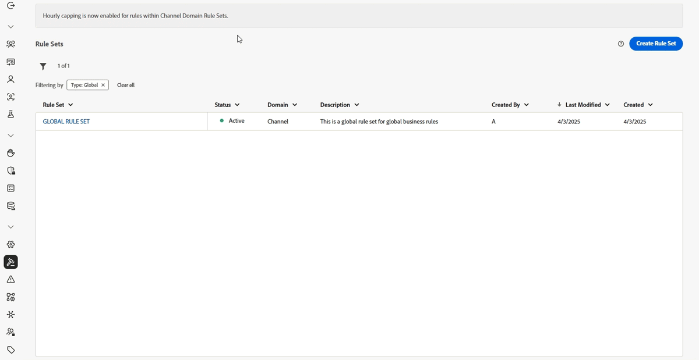

# 2026년 릴리스 정보 {#release-notes-2026}

이 페이지에는 2026년에 릴리스된 [!DNL Journey Optimizer]의 모든 기능과 개선 사항이 나와 있습니다.

## 2026년 3월 릴리스 정보 {#march-26-rn}

[새 기능](#march-26-features) 및 [개선 사항](#march-26-improv) 섹션에서는 이미 사용 가능한 기능을 다룹니다. <!--The [Coming soon](#coming-soon) section lists features and improvements scheduled for release later in March.-->

<!--
**The pre-release notes below are subject to change without prior notice until the release availability date**. Links, screens and updated documentation are published in the release notes, at the release date.

See also [Adobe Experience Platform pre-release notes](https://experienceleague.adobe.com/ko/docs/experience-platform/release-notes/pre-release-notes){target="_blank"}.
-->

**릴리스 날짜**: 2026년 3월 24~25일

### 새로운 기능 {#march-26-features}

<table>
<thead>
<tr>
<th><strong>URL 매개 변수 암호화</strong> </th>
</tr>
</thead>
<tbody>
<tr>
<td>

이제 이메일 메시지에 추가된 추적 및 랜딩 페이지 링크의 URL 매개 변수를 암호화할 수 있으므로, 중요한 매개 변수 데이터에 대한 추가 보안 계층을 제공합니다.

<ul>
<li>전용 <strong>관리</strong> 레지스트리에서 암호화 키를 등록 및 관리합니다.</li>
<li>표현식에 새로운 'Encrypt' 도우미 함수를 사용하여 렌더링 시 보호하려는 쿼리 매개변수에 대한 URL의 중요 데이터를 암호화합니다.</li>
</ul>

이 기능은 일부 조직에서만 사용할 수 있습니다(제한된 가용성). 액세스 권한을 받으려면 Adobe 담당자에게 문의하십시오.

자세한 내용은 <a href="../personalization/url-parameter-encryption.md">세부 설명서</a>를 참조하십시오.

사용 가능한 날짜: 2026년 3월 31일

</td>
</tr>
</tbody>
</table>

<table>
<thead>
<tr>
<th><strong>이미지를 이메일 콘텐츠 템플릿으로 변환</strong> </th>
</tr>
</thead>
<tbody>
<tr>
<td>

이제 Journey Optimizer에서 직접 이미지를 이메일 콘텐츠 템플릿으로 변환할 수 있습니다. AI 기반 분석을 사용하여 시각적 참조에서 구조화된 HTML 템플릿을 자동으로 생성하여 이메일 디자인 시간을 크게 단축할 수 있습니다.

이전에 제한된 가용성으로 릴리스된 이 기능은 이제 모든 환경에서 사용할 수 있습니다(일반 가용성).

자세한 내용은 <a href="../content-management/image-to-html.md">세부 설명서</a>를 참조하십시오.

사용 가능한 날짜: 2026년 3월 31일

</td>
</tr>
</tbody>
</table>

<table>
<thead>
<tr>
<th><strong>랜딩 페이지 사용자 정의 양식</strong> </th>
</tr>
</thead>
<tbody>
<tr>
<td>

[!DNL Journey Optimizer]을(를) 사용하면 랜딩 페이지를 통해 프로필 특성을 캡처할 수 있습니다.

특정 데이터 세트를 기반으로 필요에 맞는 사용자 정의 양식을 만들고 디자인하고 관리합니다. 그런 다음 랜딩 페이지에서 이 양식을 활용하여 선택한 프로필 속성을 각 양식별로 정의한 데이터 세트에 추가할 수 있습니다.

이전에 미국 및 오스트레일리아의 고객을 위한 제한된 가용성에 릴리스된 이 기능은 이제 모든 환경에서 사용할 수 있습니다(일반 가용성).

자세한 내용은 <a href="../landing-pages/lp-forms.md">세부 설명서</a>를 참조하십시오.

사용 가능한 날짜: 2026년 3월 26일

</td>
</tr>
</tbody>
</table>

<table>
<thead>
<tr>
<th><strong>오케스트레이션된 캠페인에서 활동 테스트</strong> </th>
</tr>
</thead>
<tbody>
<tr>
<td>

이제 오케스트레이션된 캠페인에서 새 <strong>Test</strong> 활동을 사용할 수 있습니다. 이 활동은 정의된 조건에 따라 워크플로우 실행을 다른 분기로 라우팅하므로 라이브 게재를 활성화하기 전에 캠페인 논리 및 구성을 확인할 수 있습니다.

자세한 내용은 <a href="../orchestrated/activities/test.md">세부 설명서</a>를 참조하십시오.

</td>
</tr>
</tbody>
</table>

<table>
<thead>
<tr>
<th><strong>여정의 데이터 세트 조회 지원</strong> </th>
</tr>
</thead>
<tbody>
<tr>
<td>

여정의 새 <strong>데이터 세트 조회</strong> 활동을 사용하면 런타임 시 Adobe Experience Platform 레코드 데이터 세트에서 데이터를 동적으로 검색할 수 있으므로 프로필 또는 이벤트 페이로드의 일부가 아닌 정보에 액세스할 수 있으므로 고객 상호 작용이 적절하고 적시에 유지됩니다.

이전에는 제한된 조직 집합에 대해 제한된 가용성으로 릴리스되었지만 이제 제한된 가용성으로 남아 있으면서 [데이터 집합 조회](../data/lookup-aep-data.md)를 사용할 수 있는 모든 고객이 여정의 데이터 집합 조회 활동을 사용할 수 있습니다.

자세한 내용은 <a href="../building-journeys/dataset-lookup.md">세부 설명서</a>를 참조하십시오.

</td>
</tr>
</tbody>
</table>

<table>
<thead>
<tr>
<th><strong>작업 활동은 채널별 여정 활동을 대체합니다</strong> </th>
</tr>
</thead>
<tbody>
<tr>
<td>

2026년 2월에 <strong>작업 활동</strong>이 일반 지원됨에 따라 여정 캔버스에서 레거시 기본 채널 활동(전자 메일, 푸시, SMS, 인앱, 웹, 코드 기반 경험 및 콘텐츠 카드)이 이제 더 이상 사용되지 않습니다.

이제 별도의 채널별 노드가 필요하므로 단일 작업 활동을 사용하여 모든 채널 작업을 구성해야 합니다.

기존 채널 활동을 사용하는 기존 여정은 변경 사항이나 마이그레이션이 필요 없이 계속 작동합니다.

자세한 내용은 <a href="../building-journeys/journey-action.md">세부 설명서</a>를 참조하십시오.

</td>
</tr>
</tbody>
</table>

<table>
<thead>
<tr>
<th><strong>이메일 템플릿용 고급 HTML 편집기</strong> </th>
</tr>
</thead>
<tbody>
<tr>
<td>

이메일 콘텐츠 템플릿에 대한 고급 HTML 모드를 사용하면 이메일 Designer에서 콘텐츠의 HTML 소스를 편집하고, 소스에 고급 표현식(예: 조건)을 추가하고, 변경 내용을 유지한 채 HTML 보기와 데스크탑 보기 간에 전환할 수 있습니다.

이 기능은 이메일 채널의 콘텐츠 템플릿에서만 사용할 수 있습니다. 현재 제한된 가용성 상태입니다. Adobe 담당자에게 문의하여 액세스 권한을 받으십시오.

자세한 내용은 <a href="../email/email-expert-mode.md">세부 설명서</a>를 참조하십시오.

사용 가능한 날짜: 2026년 3월 10일

</td>
</tr>
</tbody>
</table>

<table>
<thead>
<tr>
<th><strong>사용자 정의 Firefly 모델과 서드파티 이미지 생성 모델의 통합</strong> </th>
</tr>
</thead>
<tbody>
<tr>
<td>

승인된 서드파티 이미지 모델과 함께 표준 및 사용자 정의 Firefly 모델의 원활한 통합을 활성화하여 이미지 생성 시 더 큰 유연성, 컨트롤 및 브랜드 정렬을 제공합니다.

요구 사항에 맞는 모델을 선택하십시오.

<ul><li> 별도의 설정 없이 즉시 이미지 생성을 위한 <strong>Adobe 모델</strong>(Firefly Image Model 4 기반)</li><li> 특수 기능을 위한 <strong>파트너 모델</strong>(Gemini 2.5 Flash 기반)</li><li>브랜드 정체성, 스타일 및 시각적 가이드라인에 정확히 일치하는 브랜드 콘텐츠 생성을 위한 <strong>사용자 정의 모델</strong>(사용자 고유의 자산에 대해 학습된 브랜드 전용 모델)</li></ul>

자세한 내용은 <a href="../content-management/generative-models.md">세부 설명서</a>를 참조하십시오.

사용 가능한 날짜: 2026년 3월 2일

</td>
</tr>
</tbody>
</table>

<table>
<thead>
<tr>
<th><strong>iOS에 대한 라이브 활동</strong> </th>
</tr>
</thead>
<tbody>
<tr>
<td>

Adobe Journey Optimizer에서 <strong>iOS 라이브 활동</strong>을 통해 고객의 Screens 및 Dynamic Island 잠금에 직접 실시간 경험을 제공할 수 있습니다. 사용자가 앱을 열지 않고도 주문 추적 및 비행 상태부터 이벤트 처리, 라이브 점수 및 게재 진행률에 이르기까지 라이브 업데이트를 제공할 수 있습니다. 대상자가 있는 바로 그 순간에 정보를 얻고 참여하도록 하십시오.

이전에 베타 버전으로 출시된 이 기능은 이제 모든 환경에서 사용할 수 있습니다(일반 공급).

자세한 내용은 <a href="../mobile-live/get-started-mobile-live.md">세부 설명서</a>를 참조하십시오.

사용 가능한 날짜: 2026년 3월 3일

</td>
</tr>
</tbody>
</table>

<table>
<thead>
<tr>
<th><strong>Journey Agent: 채널 컨텐츠 만들기</strong> </th>
</tr>
</thead>
<tbody>
<tr>
<td>

<strong>Adobe Experience Platform Agent Orchestrator</strong>에서 제공하는 <strong>Journey Agent</strong>은(는) Journey Optimizer에서 사용할 수 있으며 자연어 인터페이스를 통해 여정을 분석할 수 있도록 해줍니다. 이제 Journey Agent에서 직접 채널별 콘텐츠를 생성하고 관리할 수도 있습니다. 또한 이메일 및 푸시와 같은 채널용 콘텐츠를 만들고, 템플릿을 적용하고 미리 보고, 프롬프트를 통해 색조와 스타일을 개선하고, <strong>콘텐츠 Designer</strong>에서 콘텐츠를 열어 상황에 맞게 편집할 수 있습니다.

이 기능은 일부 조직에서만 사용할 수 있습니다(제한된 가용성). 액세스 권한을 받으려면 Adobe 담당자에게 문의하십시오.

자세한 내용은 <a href="https://experienceleague.adobe.com/docs/experience-cloud-ai/experience-cloud-ai/agents/ajo-agent.html?lang=ko" target="_blank">세부 설명서</a>를 참조하십시오.

사용 가능한 날짜: 2026년 3월 4일

</td>
</tr>
</tbody>
</table>

<table>
<thead>
<tr>
<th><strong>AI 모델 모니터링</strong> </th>
</tr>
</thead>
<tbody>
<tr>
<td>

이제 Journey Optimizer을 통해 Decisioning AI 모델의 상태, 교육 상태 및 성능을 모니터링할 수 있습니다. 이를 통해 교육 성공을 확인하고, 실패를 해결하며, 결과에 미치는 영향을 파악하여 AI를 사용하는 각 고객을 위한 최상의 오퍼를 선택할 수 있습니다. 이 기능은 <strong>Decisioning</strong>에만 사용할 수 있습니다(이전 의사 결정 관리 모델에는 사용할 수 없음).

이 기능은 현재 <strong>개인화된 최적화</strong> 모델에만 사용할 수 있습니다(자동 최적화는 아님).

자세한 내용은 <a href="../experience-decisioning/ranking/ai-model-observability.md">세부 설명서</a>를 참조하십시오.

사용 가능한 날짜: 2026년 3월 9일

</td>
</tr>
</tbody>
</table>

<table>
<thead>
<tr>
<th><strong>신호를 사용하여 오케스트레이션된 캠페인 트리거</strong> </th>
</tr>
</thead>
<tbody>
<tr>
<td>

이제 오케스트레이션된 캠페인을 <strong>API 신호</strong>를 통해 트리거할 수 있습니다. 이를 설정하려면 Target 캠페인을 <strong>신호에 의해 트리거됨</strong>(으)로 구성하고 게시한 다음 API 호출을 사용하여 실행합니다. API 호출에 포함된 모든 매개 변수는 실행 중인 캠페인 내에서 변수로 사용할 수 있습니다. 신호 트리거 오케스트레이션된 캠페인은 <strong>일괄</strong> 캠페인으로 유지되며 API 트리거 캠페인과 다릅니다.

자세한 내용은 <a href="../orchestrated/trigger-orchestrated-campaign.md">세부 설명서</a>를 참조하십시오.

</td>
</tr>
</tbody>
</table>

<table>
<thead>
<tr>
<th><strong>오케스트레이션된 캠페인의 트랜잭션 범주</strong> </th>
</tr>
</thead>
<tbody>
<tr>
<td>

오케스트레이션된 캠페인에서는 이제 채널 활동을 <strong>트랜잭션</strong> 범주로 설정할 수 있습니다. 이렇게 하면 해당 활동에 트랜잭션 채널 구성이 적용되며, 비즈니스 규칙이 적용되지 않거나 고객의 옵트인이 필요하지 않은 경우에 유용합니다.

자세한 내용은 <a href="../orchestrated/activities/channels.md#add">세부 설명서</a>를 참조하십시오.

이 기능은 앞으로 며칠 동안 모든 지역으로 점진적으로 배포될 예정입니다.

</td>
</tr>
</tbody>
</table>

### 개선 사항 {#march-26-improv}

다음은 이번 릴리스의 개선 사항 목록입니다.

#### 개인화

* **전체/기본 URL 개인화** - 프로필 특성(예: 도메인 또는 경로)을 사용하여 대상 URL을 개인화할 수 있습니다. 이 기능을 활성화하려면 Adobe에 허용된 도메인 목록을 제공하십시오. [자세히 보기](../personalization/personalization-build-expressions.md#where)

  이전에 여정에서 사용할 수 있도록 제한된 가용성으로 릴리스된 이 기능은 이제 모든 환경에서 사용할 수 있습니다(일반 가용성).

  사용 가능한 날짜: 2026년 4월 1일

#### 보고

* **전송 시간 최적화: 컨트롤 위치 및 새 리프트 보고서를 업데이트했습니다** - STO(전송 시간 최적화) 컨트롤이 작업 구성 메뉴로 재배치되었습니다. 또한 이제 여정 보고서에서 STO가 캠페인 성과 지표에 미치는 영향을 측정하는 새로운 상승도 보고서를 사용할 수 있습니다. [자세히 보기](../reports/channel-report-cja.md#optimization-models)

  사용 가능한 날짜: 2026년 3월 27일

<!--
* **Exclude bot clicks for email and SMS reporting** - Email and SMS reporting now automatically filters out bot clicks from click metrics, providing more accurate engagement data and preventing automated traffic from inflating your performance figures.

#### Email Designer

* **Email Designer displayed in Unified Shell** - The Email Designer is now displayed within the Unified Shell experience, providing a consistent navigation and header experience that aligns with other Adobe applications.

* **Text mode support in fragments** - To support text-based email workflows, you can now create and manage text versions of your visual fragments for optimal use in the plain text version of emails that include that fragment.

  **Caution:** When using a fragment that was created before the current release, the fragment text version may be incorrectly rendered—both in the Email Designer and in the final email delivered to your recipients. For best results with older fragments, edit, save and republish each fragment.
-->

#### 구성

<!--* **Folders for journeys and campaigns** - You can now organize your journeys and campaigns into folders, enabling structured navigation and easier management for teams working with large volumes of content. This capability is only available for a set of organizations (Limited Availability). To gain access, contact your Adobe representative.-->

* **AJO 도메인 인증서 갱신 실패** - 이제 전자 메일 게재에 사용되는 도메인 인증서가 곧 만료되거나 이미 만료된 경우 전자 메일 또는 Journey Optimizer 알림 센터에서 시스템 경고를 수신하도록 구독할 수 있습니다. [자세히 보기](../reports/alerts.md#alert-certificates-renewal-unsuccessful)

  사용 가능한 날짜: 2026년 3월 26일

* **AJO 보조 받는 사람 피드백 이벤트 데이터 세트 이름 바꾸기** - `AJO Email BCC Feedback Event` 데이터 세트의 이름이 `AJO Secondary Recipient Feedback Event` 데이터 세트로 바뀌었습니다. 영향은 상황에 따라 다릅니다.

   * **기존 사용자**: 표시 이름만 업데이트됩니다. 기본 테이블 이름은 변경되지 않습니다.
   * **새 사용자 및 샌드박스**: 표시 이름과 테이블 이름이 모두 새 이름을 반영합니다.
   * **새 샌드박스를 가진 기존 사용자**: 표시 이름과 테이블 이름이 모두 새 이름으로 업데이트됩니다.

  >[!NOTE]
  >
  >새 데이터 세트에는 새 이름이 즉시 표시됩니다. 이전 데이터 세트 이름의 경우 채우기 및 조정은 점진적으로 진행되며 완료하는 데 몇 주가 걸릴 수 있습니다.

  사용 가능한 날짜: 2026년 3월 2일

#### 여정

* **프로필 업데이트 작업: 여러 프로필 특성 지원** - **프로필 업데이트** 작업 활동은 이제 단일 노드에서 최대 5개의 프로필 특성 업데이트를 지원합니다. 이전에는 각 작업이 한 번에 하나의 속성만 업데이트할 수 있으므로 여러 노드가 여러 속성을 업데이트해야 했습니다. 새 **다른 필드 업데이트** 단추를 사용하여 필드/값 쌍을 추가하여 캔버스 복잡성을 줄이고 성능을 개선합니다. [자세히 알아보기](../building-journeys/update-profiles.md)

* **여정에서 아웃바운드 메시지의 웨이브 전송** - 이제 Journey Optimizer 여정의 메시지를 시간에 따라 제어된 배치로 전달하도록 예약할 수 있습니다. [자세히 알아보기](../building-journeys/send-using-waves.md)

  이전에 여정에서 사용할 수 있도록 제한된 가용성으로 릴리스된 이 기능은 이제 모든 환경에서 사용할 수 있습니다(일반 가용성).

  사용 가능한 날짜: 2026년 3월 16일

* **여정 기술 세부 정보의 일시 중지 및 다시 시작 세부 정보** - 이제 **기술 세부 정보** 여정에 마지막 일시 중지 및 다시 시작 날짜 및 시간, 각 작업을 수행한 사용자의 표시 이름 및 내부 식별자, 일시 중지 동작, 최대 일시 중지 기간 및 자동 다시 시작 상태와 같은 일시 중지된 여정 설정의 전체 집합과 같은 추가 일시 중지 및 다시 시작 정보가 포함됩니다. [자세히 알아보기](../building-journeys/journey-properties.md)

  사용 가능한 날짜: 2026년 3월 2일

#### 결정

* **Decisioning 마이그레이션 — 오퍼 및 컨텍스트 특성** - 이제 마이그레이션 API 엔터티 매핑에 **오퍼 특성**(`migratedofferattributes`은(는) 개인화된 오퍼 항목 스키마에 있음) 및 **컨텍스트 특성**(`migratedcontextattributes`은(는) 마이그레이션 데이터 세트 스키마에 있음)이 나열됩니다. [자세히 보기](../experience-decisioning/decisioning-migration-api.md#entity-mapping)

  사용 가능한 날짜: 2026년 3월 31일

<!--
## Coming soon {#coming-soon}

The features and improvements below are planned for release later in March/early April. Release dates and scope are **subject to change without prior notice**.

WAITING RELEASE DATE CONFIRMATION * **Target dimension simplification in Orchestrated Campaigns** - The active targeting dimension is now shown on the workflow canvas, so you can see which dimension is used by a channel activity. The multi-entity segmentation flow is simpler as you no longer need a separate "Change dimension" activity. Moreover, you can now choose explicitly whether messages are sent at the profile level or at a secondary dimension level.

WAITING RELEASE DATE CONFIRMATION
* **Target dimension simplification in Orchestrated Campaigns** - The active targeting dimension is now shown on the workflow canvas, so you can see which dimension is used by a channel activity. The multi-entity segmentation flow is simpler as you no longer need a separate "Change dimension" activity. Moreover, you can now choose explicitly whether messages are sent at the profile level or at a secondary dimension level.
-->

## 2026년 2월 릴리스 정보 {#feb-26-01-rn}

### 새로운 기능 {#feb-26-01-features}

<table>
<thead>
<tr>
<th><strong>여정 중재</strong> </th>
</tr>
</thead>
<tbody>
<tr>
<td>

이제 <strong>등급 수식</strong>을 사용하여 고객 프로필 특성 및 컨텍스트 요인에 따라 여정 우선 순위 점수를 자동으로 높여 고객이 가장 관련성이 높은 여정을 입력하도록 할 수 있습니다.

이 기능은 일부 조직에서만 사용할 수 있습니다(제한된 가용성). 액세스 권한을 받으려면 Adobe 담당자에게 문의하십시오.

자세한 내용은 <a href="../conflict-prioritization/journey-ranking-formulas.md">세부 설명서</a>를 참조하십시오.

사용 가능한 날짜: 2026년 2월 24일

</td>
</tr>
</tbody>
</table>

<table>
<thead>
<tr>
<th><strong>여정의 액션 활동</strong> </th>
</tr>
</thead>
<tbody>
<tr>
<td>

Journey Optimizer은 단일 작업과 다중 작업 인바운드 작업 그룹을 모두 구성할 수 있는 새로운 일반 <strong>작업 활동</strong>을 지원하므로 여정 캔버스 내에서 간소화된 작업 구성을 사용할 수 있습니다. 특히 이 새로운 기능에는 다음과 같은 이점이 있습니다.

<ul>
<li>여정 캔버스 내 기본 액션 구성 간소화.</li>
<li>다중 액션 인바운드 액션 그룹을 만들 수 있는 용량.</li>
<li>모든 기본 제공 채널 액션에 최적화를 더하는 기능.</li>
<li>모든 작업에 실험과 다국어 옵션을 모두 추가하는 기능.</li>
</ul>

이전에 제한된 가용성으로 릴리스된 이 기능은 이제 모든 환경에서 사용할 수 있습니다(일반 가용성).

자세한 내용은 <a href="../building-journeys/journey-action.md">세부 설명서</a>를 참조하십시오.

사용 가능한 날짜: 2026년 2월 20일

<strong>참고:</strong> 이제 작업 여정 활동을 통해 모든 기본 채널에 액세스할 수 있습니다. 레거시 기본 채널 활동은 3월 릴리스에서 더 이상 사용되지 않습니다. 기존 작업을 포함하는 기존 여정은 마이그레이션이 필요하지 않으므로 그대로 작동합니다.

</td>
</tr>
</tbody>
</table>

<table>
<thead>
<tr>
<th><strong>아웃바운드 메시지의 웨이브 전송</strong> </th>
</tr>
</thead>
<tbody>
<tr>
<td>

이제 Journey Optimizer 캠페인 또는 여정의 메시지가 시간에 따라 제어된 배치로 전달되도록 예약할 수 있습니다.

웨이브 전송은 다음과 같은 이점을 제공합니다.

<ul>
<li>전달성 향상 - Spread는 시간이 지남에 따라 전송을 수행하여 강력한 발신자 평판을 유지하고 스팸으로 플래그가 지정될 위험을 줄이는 데 도움이 됩니다.</li>
<li>로드 제어 - 한 번에 전송되는 메시지 수를 제한하여 압도적인 다운스트림 시스템(예: 콜 센터, 랜딩 페이지)을 방지합니다.</li>
<li>대량의 시간에 민감한 사용 사례 - 대규모 대상자에 적합하거나 시간 조절(예: 콜 센터 용량, 램프 업 또는 시간 제한 제안)이 필요한 경우.</li>
</ul>

<strong>캠페인</strong>에서 이 기능은 모든 환경에서 사용할 수 있습니다(일반 가용성). 자세한 내용은 <a href="../campaigns/send-using-waves.md">세부 설명서</a>를 참조하십시오.

<strong>여정</strong>에서 이 기능은 조직 집합(제한된 가용성)에만 사용할 수 있습니다. 액세스 권한을 얻으려면 Adobe 담당자에게 문의하십시오. 자세한 내용은 <a href="../building-journeys/send-using-waves.md">세부 설명서</a>를 참조하십시오.

사용 가능한 날짜: 2026년 2월 19일

</td>
</tr>
</tbody>
</table>

<table>
<thead>
<tr>
<th><strong>하위 도메인을 사용자 정의 위임으로 마이그레이션</strong> </th>
</tr>
</thead>
<tbody>
<tr>
<td>

이제 CNAME 위임 모드를 사용하여 하위 도메인을 인터페이스에서 직접 사용자 정의 위임으로 마이그레이션할 수 있으므로 채널 구성을 다시 작성하지 않고도 회사의 지침에 따라 더 엄격한 보안 정책을 충족할 수 있습니다.

이 기능은 일부 조직에서만 사용할 수 있습니다(제한된 가용성). 액세스 권한을 받으려면 Adobe 담당자에게 문의하십시오.

자세한 내용은 <a href="../configuration/custom-subdomain-migration.md">세부 설명서</a>를 참조하십시오.

사용 가능한 날짜: 2026년 2월 19일

</td>
</tr>
</tbody>
</table>

<table>
<thead>
<tr>
<th><strong>웹 푸시 알림 채널</strong> </th>
</tr>
</thead>
<tbody>
<tr>
<td>

Adobe Journey Optimizer은 이제 <strong>웹 푸시 알림</strong>을 지원하므로 푸시 채널을 모바일 이상으로 확장합니다. <strong>모바일 브라우저와 데스크탑 브라우저</strong> 모두에 알림을 원활하게 전달할 수 있으므로 앱 설치를 요청할 필요 없이 고객의 디바이스에서 직접 고객에게 연락할 수 있습니다. 이 향상된 기능을 통해 이미 모바일 푸시에서 사용 가능한 것과 동일한 작성 워크플로 및 타기팅 기능을 활용하여 사용자에게 적시에 개인화된 메시지를 실시간으로 보낼 수 있습니다.

이전에 Beta에서 릴리스된 이 기능은 모든 환경에서 사용할 수 있습니다(일반 가용성).

자세한 내용은 <a href="../push/push-configuration-web.md">세부 설명서</a>를 참조하십시오.

사용 가능한 날짜: 2026년 2월 13일

</td>
</tr>
</tbody>
</table>

<table>
<thead>
<tr>
<th><strong>콘텐츠 결정 활동</strong> </th>
</tr>
</thead>
<tbody>
<tr>
<td>

이제 개인 맞춤화된 오퍼를 고객 여정에 직접 통합하기 위해 여정 캔버스에서 새로운 <strong>콘텐츠 결정 활동</strong>을 사용할 수 있습니다. 이 활동을 사용하면 의사 결정 기반 콘텐츠를 제공하고 자격 기반 분기를 만들기 위한 조건, 외부 시스템에 오퍼 데이터를 전달하기 위한 사용자 지정 작업 및 완전히 개인화된 고객 경험을 구축하기 위한 기타 활동에서 여정 전체에서 이러한 오퍼를 참조할 수 있습니다.

이전에 제한된 가용성으로 릴리스된 이 기능은 이제 모든 환경에서 사용할 수 있습니다(일반 가용성).

자세한 내용은 <a href="../building-journeys/content-decision.md">세부 설명서</a>를 참조하십시오.

사용 가능한 날짜: 2026년 2월 10일

</td>
</tr>
</tbody>
</table>

<table>
<thead>
<tr>
<th><strong>셀프서비스 마이그레이션 도구 API</strong> </th>
</tr>
</thead>
<tbody>
<tr>
<td>

이제 마이그레이션 도구 API를 사용하여 <strong>의사 결정 관리</strong> 엔터티를 <strong>의사 결정</strong>(으)로 프로그래밍 방식으로 마이그레이션할 수 있습니다.

<ul>
<li>유연한 마이그레이션 범위(샌드박스, 오퍼 또는 의사 결정 수준)</li>
<li>자동화된 종속성 분석 및 유효성 검사</li>
<li>완료된 마이그레이션에 대한 롤백 지원</li>
<li>오브젝트 매핑이 포함된 자세한 마이그레이션 보고서</li>
</ul>

자세한 내용은 <a href="../experience-decisioning/decisioning-migration-api.md">세부 설명서</a>를 참조하십시오.

사용 가능한 날짜: 2026년 2월 3일

</td>
</tr>
</tbody>
</table>

<table>
<thead>
<tr>
<th><strong>사용자 정의 액션 모니터링</strong> </th>
</tr>
</thead>
<tbody>
<tr>
<td>

새로운 모니터링 대시보드와 보강된 여정 단계 이벤트 데이터를 사용하여 insight에서 사용자 지정 작업 엔드포인트의 상태 및 성능에 대해 자세히 알아보십시오. 성공한 호출, 오류, 처리량, 응답 시간, 대기열 대기 시간을 추적하여 예외 항목이 발생하는 시점, 위치, 이유를 신속하게 파악합니다.

이전에 제한된 가용성으로 릴리스된 이 기능은 이제 모든 환경에서 사용할 수 있습니다(일반 가용성).

자세한 내용은 <a href="../action/reporting.md">세부 설명서</a>를 참조하십시오.

사용 가능한 날짜: 2026년 2월 3일

</td>
</tr>
</tbody>
</table>

<table>
<thead>
<tr>
<th><strong>SMS 채널에서 의사 결정 지원</strong> </th>
</tr>
</thead>
<tbody>
<tr>
<td>

이제 Decisioning을 통해 SMS 메시지의 콘텐츠를 개인화하고 최적화할 수 있습니다. 우선순위 점수, 공식 또는 AI 모델을 사용하여 고객에게 최상의 콘텐츠를 표시합니다.

자세한 내용은 <a href="../experience-decisioning/create-decision.md">세부 설명서</a>를 참조하십시오.

사용 가능한 날짜: 2026년 2월 2일

</td>
</tr>
</tbody>
</table>

### 개선 사항 {#feb-26-01-improv}

다음은 이번 릴리스의 개선 사항 목록입니다.

#### 구성

* **여정 식의 경험 이벤트 사용** - 2026년 4월 1일부터 지난 90일 동안 이 기능을 사용하지 않은 조직에 대해 여정 식의 경험 이벤트 특성 사용이 더 이상 지원되지 않습니다. 이 기능은 2025년 7월 8일 이후 신규 고객 조직에서 이미 사용할 수 없습니다. 대안은 [여정의 경험 이벤트 조회](../building-journeys/exp-event-lookup.md)를 참조하십시오.

#### 콘텐츠 관리

<!--
* **Update brands with new color tab** - Brand guidelines help ensure your brand is presented consistently across all touchpoints. The new <strong>Colors</strong> section defines the standards for your brand's color system, outlining how colors are selected, organized, and applied across experiences. It ensures consistent use of primary, secondary, accent, and neutral colors to support a cohesive, accessible, and recognizable brand identity. [Read more](../content-management/brands.md)
-->

* **테마를 사용하여 이미지를 전자 메일 서식 파일로 변환** - Journey Optimizer에서 이미지를 전자 메일 서식 파일로 변환할 때 이제 테마를 입력으로 사용하여 생성된 HTML이 브랜드 매개 변수를 따르도록 할 수 있습니다. 배경색, 단추 색상, 글꼴, 줄 간격, 여백 및 패딩과 같은 스타일이 자동으로 적용되어 수동 디자인 작업이 줄어들고 최소한의 편집으로 사용할 준비가 된 템플릿을 제공합니다. [자세히 보기](../content-management/image-to-html.md)

  사용 가능한 날짜: 2026년 2월 17일

<!--* **Text mode for fragments** - You can now create and manage text versions of your fragments, supporting workflows that rely on plain text content and providing the same flexibility as in email content. [Read more](../content-management/create-fragments.md)-->

#### 이메일 디자이너

* **텍스트 들여쓰기** - 이제 속성 패널에서 바로 텍스트 구성 요소의 단락 첫 줄에 사용자 지정 가능한 왼쪽 들여쓰기를 적용할 수 있습니다. <!--The new **Indentation** control lets you define indentation in pixels or percentage via a numeric input or slider, with live preview on the canvas. -->따라서 사설 및 기사 등 긴 형식의 콘텐츠에 대한 가독성이 향상됩니다. [자세히 보기](../email/get-started-email-style.md)

  사용 가능한 날짜: 2026년 2월 18일

#### 결정

* **Decisioning에서 Adobe Experience Platform 데이터 사용에 대한 Edge 인바운드 지원** - Decisioning에서 Adobe Experience Platform 데이터 사용은 이제 여정의 이메일 및 사용자 지정 작업 외에도 에지 인바운드 사용 사례를 지원합니다. [자세히 보기](../experience-decisioning/aep-data-exd.md)

  이 기능은 일부 조직에서만 사용할 수 있습니다(제한된 가용성). 액세스 권한을 받으려면 Adobe 담당자에게 문의하십시오.

* **코드 기반 경험 채널에서 의사 결정 미리 보기** - 이제 코드 기반 경험 채널에서 의사 결정을 구성할 때 의사 결정 항목을 미리 볼 수 있습니다. 미리보기는 라이브로 전환되기 전에 작성 인터페이스에서 직접 사용할 수 있습니다. [자세히 보기](../code-based/test-code-based.md#preview-code-based)

  사용 가능한 날짜: 2026년 2월 18일

<!--
THIS WAS FINALLY NOT RELEASED IN FEBRUARY

* **Attach fragments to decision items** - Journey Optimizer now provides the ability to attach fragments to decision items which can be leveraged in code-based experience campaigns through decision policies. [Read more](../experience-decisioning/fragments-decision-policies.md)

  Previously released in Limited Availability, this capability is now available to all environments (General Availability).

  Availability date: February 12, 2026.
-->

#### 개인화

* **실행 메타데이터 도우미** - 이제 `executionMetadata` 도우미 함수를 모든 Journey Optimizer 고객이 사용할 수 있습니다. 컨텍스트 정보를 기본 작업에 동적으로 추가하고, 외부 시스템으로 내보내기 위해 데이터 세트에 캡처할 수 있습니다. [자세히 보기](../personalization/functions/helpers.md#execution-metadata)

  이전에 제한된 가용성으로 릴리스된 이 기능은 이제 모든 환경에서 사용할 수 있습니다(일반 가용성).

  사용 가능한 날짜: 2026년 2월 20일

#### SMS

* **SMS Webhooks** - 이제 모든 SMS 공급자에서 Webhooks가 지원됩니다. 각각의 목적을 기반으로 각 웹후크를 구성할 수 있습니다. 수신 메시지를 캡처하는 인바운드 웹후크와 게재 확인, 상태 업데이트 및 기타 메시지 관련 이벤트를 수신하는 피드백 웹후크. [자세히 보기](../sms/sms-webhook.md)

  사용 가능한 날짜: 2026년 2월 2일

## 26년 1월 릴리스 정보 {#jan-26-rn}

<!--**Release date**: January 27-28, 2026-->

### 새로운 기능 {#jan-26-01-features}

<table>
<thead>
<tr>
<th><strong>푸시 채널에서 의사 결정 지원</strong> </th>
</tr>
</thead>
<tbody>
<tr>
<td>

이제 <strong>Decisioning</strong>을 통해 <strong>푸시 알림</strong>의 콘텐츠를 개인화하고 최적화할 수 있습니다. 우선순위 점수, 공식 또는 AI 모델을 사용하여 고객에게 최상의 콘텐츠를 표시합니다.

푸시 알림을 사용하는 Experience Decisioning에는 모바일 SDK의 특정 버전이 필요합니다. 이 기능을 구현하기 전에 <a href="https://developer.adobe.com/client-sdks/home/release-notes" target="_blank">릴리스 정보</a>를 확인하여 필요한 버전을 식별하고 그에 따라 업그레이드했는지 확인하십시오. <a href="https://developer.adobe.com/client-sdks/home/current-sdk-versions" target="_blank">이 섹션</a>에서 사용 가능한 플랫폼에 대한 모든 SDK 버전을 볼 수도 있습니다.

자세한 내용은 <a href="../experience-decisioning/create-decision.md">세부 설명서</a>를 참조하십시오.

가용성 일자: 2026년 1월 30일

</td>
</tr>
</tbody>
</table>

<table>
<thead>
<tr>
<th><strong>여정의 다이렉트 메일 채널</strong> </th>
</tr>
</thead>
<tbody>
<tr>
<td>

전에는 캠페인에서만 사용할 수 있던 <strong>다이렉트 메일</strong> 채널을 이제 여정 캔버스에서 사용하여 DM을 여정에 통합할 수 있습니다. 이제 파일 추출 구성 및 시간 기반 빈도 설정 지원이 추가되어 DM을 <strong>배치 및 1:1 여정 시나리오</strong> 모두에서 사용할 수 있습니다.

이전에 제한된 가용성으로 릴리스된 이 기능은 이제 모든 환경에서 사용할 수 있습니다(일반 가용성).

자세한 내용은 <a href="../direct-mail/get-started-direct-mail.md">세부 설명서</a>를 참조하십시오.

사용 가능한 날짜: 2026년 1월 29일 금요일

</td>
</tr>
</tbody>
</table>

<table>
<thead>
<tr>
<th><strong>방해 금지 시간(시간 기반 제외)</strong> </th>
</tr>
</thead>
<tbody>
<tr>
<td>

<strong>방해 금지 시간</strong> 기능으로 이메일, SMS, 푸시, WhatsApp 채널에 대한 시간 기반 제외를 정의할 수 있습니다. 특정 시간 동안 메시지가 전송되지 않도록 하여 고객 환경 설정과 및 규정 요건을 준수할 수 있습니다. <strong>규칙 세트</strong>를 통해 방해 금지 시간을 적용할 수 있으며, 정확한 제어를 위해 이 규칙 세트를 캠페인이나 여정의 개별 액션에 할당할 수 있습니다.

이전에 제한된 가용성으로 릴리스된 이 기능은 이제 모든 환경에서 사용할 수 있습니다. 이번 일반 가용성 릴리스에서는 고객이 방해 금지 시간이 끝날 때까지 캠페인 액션을 대기열에 추가할 수 있는 기능과 활성화된 방해 금지 시간 규칙을 미리 볼 수 있는 기능이 제공됩니다.

자세한 내용은 <a href="../conflict-prioritization/quiet-hours.md">세부 설명서</a>를 참조하십시오.

사용 가능한 날짜: 2026년 1월 29일 금요일

</td>
</tr>
</tbody>
</table>

<table>
<thead>
<tr>
<th><strong>메시지 내보내기</strong> </th>
</tr>
</thead>
<tbody>
<tr>
<td>

이제 이메일 및 SMS 채널에서 새로운 <strong>메시지 내보내기</strong> 기능을 사용할 수 있습니다. 이 기능을 사용하면 보낸 메시지 콘텐츠를 전용 Experience Platform 데이터 세트로 자동으로 내보내 다음과 같은 작업을 수행할 수 있습니다.

<ul>
<li>규정 준수 요건 충족(예: HIPAA)</li>
<li>법률 소송 및 고객 지원 센터 문의 메시지 보관</li>
<li>개인에게 전송된 개인화된 콘텐츠의 사본 유지</li>
</ul>

레코드는 수집 후 7일 동안 AJO 메시지 내보내기 데이터 세트에 보존됩니다. 이 보존 기간 동안 Experience Platform 대상을 통해 자체 스토리지로 내보낼 수 있습니다. 이 기능은 채널 구성 수준에서 활성화되므로 내보낼 메시지를 <strong>세밀하게 제어</strong>할 수 있습니다.

이 기능은 메시지 내보내기 추가 기능 서비스를 구입한 조직의 이메일 및 SMS 채널에서만 사용할 수 있습니다. 자세한 내용은 Adobe 담당자에게 문의하십시오.

자세한 내용은 <a href="../configuration/message-export.md#message-export">세부 설명서</a>를 참조하십시오.

사용 가능한 날짜: 2026년 1월 28일

</td>
</tr>
</tbody>
</table>

<table>
<thead>
<tr>
<th><strong>오케스트레이션된 캠페인의 다이렉트 메일 채널</strong> </th>
</tr>
</thead>
<tbody>
<tr>
<td>

이제 오케스트레이션 캠페인에서 다이렉트 메일 채널을 사용할 수 있습니다. <strong>다이렉트 메일 활동</strong>은 오케스트레이션된 캠페인 내에서 다이렉트 메일 전송 과정을 원활하게 하며 일회성 메시지와 되풀이 메시지에 모두 적용됩니다. 이는 다이렉트 메일 제공업체에 필요한 <strong>추출 파일</strong> 생성 프로세스를 자동화하는 역할을 합니다. 채널 활동을 오케스트레이션된 캠페인 캔버스에 결합하여 고객 행동 및 데이터에 따라 액션을 트리거할 수 있는 크로스 채널 캠페인을 만들 수 있습니다.

자세한 내용은 <a href="../orchestrated/activities/channels.md#channel">세부 설명서</a>를 참조하십시오.

사용 가능한 날짜: 2026년 1월 28일

</td>
</tr>
</tbody>
</table>

<table>
<thead>
<tr>
<th><strong>Journey 에이전트 - 여정 만들기</strong> </th>
</tr>
</thead>
<tbody>
<tr>
<td>

이제 Journey 에이전트가 생성 기능을 제공하므로 Journey Optimizer 사용자는 <strong>자연어 인터페이스</strong>를 통해 마케팅 여정을 작성하고 구성할 수 있습니다. 이 새로운 기술 덕분에 실무자가 <strong>대화 프롬프트</strong>로 요구 사항을 설명하기만 하면 여정을 빠르게 만들 수 있습니다. 이러한 혁신은 여정을 만드는 프로세스를 간소화하여 마케터가 기술 구성보다 전략에 집중할 수 있도록 지원합니다.

자세한 내용은 <a href="../start/ai-features.md#journey-agent">세부 설명서</a>를 참조하십시오.

사용 가능한 날짜: 2026년 1월 12일

</td>
</tr>
</tbody>
</table>

<table>
<thead>
<tr>
<th><strong>액션 캠페인 검색 API</strong> </th>
</tr>
</thead>
<tbody>
<tr>
<td>

이제 새로운 Journey Optimizer API를 사용하여 캠페인의 세부 정보, 버전, 구성 등 <strong>캠페인 관련 데이터</strong>를 프로그램 방식으로 검색하고 확인할 수 있습니다.

자세한 내용은 <a href="https://developer.adobe.com/journey-optimizer-apis/references/campaigns-retrieve" target="_blank">세부 설명서</a>를 참조하십시오.

사용 가능한 날짜: 2025년 11월 24일

</td>
</tr>
</tbody>
</table>

<table>
<thead>
<tr>
<th><strong>이메일 디자이너 테마</strong> </th>
</tr>
</thead>
<tbody>
<tr>
<td>

이제 <strong>사전 승인된 테마</strong>를 빠르게 적용하여 모든 이메일에 대한 <strong>브랜드 일관성</strong>을 보장하고, 캠페인을 만드는 프로세스의 속도를 높이고, 디자인 팀에 대한 의존도를 줄이면서 고품질 이메일을 독립적으로 만들 수 있습니다.

이전에 Beta 버전으로 릴리스된 이 기능을 이제 일부 조직에서 사용할 수 있습니다(제한된 가용성). 액세스 권한을 받으려면 Adobe 담당자에게 문의하십시오.

자세한 내용은 <a href="../email/apply-email-themes.md">세부 설명서</a>를 참조하십시오.

사용 가능한 날짜: 2025년 11월 5일

</td>
</tr>
</tbody>
</table>

### 개선 사항 {#jan-26-01-improv}

#### AI

* **AI 어시스턴트 콘텐츠 품질 검사** - 이제 브랜드 일관성 외에도 전체 <strong>콘텐츠 품질</strong>을 평가하여 브랜드 가이드라인과 별개로 <strong>가독성</strong>, 일치도, 효과성 관련 잠재적인 문제를 찾을 수 있습니다. 이 자동화된 검사는 명확하지 않은 메시지, 일관되지 않은 톤 또는 구조적으로 빠진 부분을 식별하는 데 도움이 됩니다. [자세히 보기](../content-management/brands-score.md#validate-quality).

  [비디오에서 이 기능을 살펴보십시오](https://video.tv.adobe.com/v/3470553/?captions=kor&learn=on).

#### 여정

* **기본 및 Adobe Campaign 메시지 액션 결합** - 이제 Journey Optimizer에서 <strong>Adobe Campaign v7/v8</strong> 메시지 액션을 <strong>기본 채널 액션</strong>과 같은 여정에서 결합할 수 있습니다. [자세히 보기](../building-journeys/using-adobe-campaign-v7-v8.md)

  사용 가능한 날짜: 2026년 1월 27일 수요일.

* **사용자 정의 액션 오류 응답 페이로드** - 이제 사용자 정의 액션에 대해 선택적으로 <strong>오류 응답 페이로드</strong>를 정의할 수 있습니다. 호출이 실패하면 오류 페이로드가 여정 컨텍스트(액션의 errorResponse 노드 아래)에 노출되며 <strong>시간 초과/오류 분기</strong>에서 `jo_status_code`와(과) 함께 사용할 수 있어 보다 풍부한 대체 논리 및 디버깅을 지원합니다. [자세히 보기](../action/about-custom-action-configuration.md#define-the-message-parameters)

  사용 가능한 날짜: 2026년 1월 27일 수요일.

* **여정의 여정 페이로드 크기 유효성 검사** - 이제 Journey Optimizer에서 최적의 성능과 시스템 안정성을 보장하기 위해 <strong>페이로드 크기</strong>에 대해 유효성 검사를 수행합니다. 여정을 작성하거나 게시할 때 페이로드 크기가 권장 한도에 근접하거나 이를 초과하는 경우 명확한 <strong>경고 및 오류</strong>가 표시되고, 실행 가능한 여정 구성 최적화 지침이 제공됩니다. 이 사전 유효성 검사는 잠재적 문제를 조기에 식별하고 여정 성능을 유지하는 데 도움이 됩니다. [자세히 보기](../start/guardrails.md#journey-payload-size)

  사용 가능한 날짜: 2026년 1월 27일 수요일.

* **여정 경고** - 여정에 대해 새로운 <strong>사전 구성 경고</strong>를 사용할 수 있습니다.
   * <strong>프로필 삭제율 초과</strong> - 지난 5분 동안 입장한 프로필에 대한 프로필 삭제율이 임계값 초과
   * <strong>사용자 정의 액션 오류율 초과</strong> - 지난 5분 동안 성공적인 HTTP 호출에 대한 사용자 정의 액션 오류율이 임계값 초과
   * <strong>프로필 오류율 초과</strong> -지난 5분 동안 입장한 프로필 대비 오류가 발생한 프로필 비율이 임계값 초과

  자세한 내용은 [세부 설명서](../reports/alerts.md)를 참조하십시오.

  사용 가능한 날짜: 2025년 10월 14일.

#### 오케스트레이션된 캠페인

* **대상자에 대한 데이터 사용 레이블 상속** - 이제 오케스트레이션된 캠페인에 <strong>대상자</strong>를 저장할 때 Adobe Experience Platform에 적용된 레이블이 자동으로 이전되어 수동 <strong>DULE 태그 지정</strong> 작업이 줄어듭니다. [자세히 보기](../orchestrated/activities/save-audience.md)

* **매개 변수가 있는 미리 정의된 필터** - 이제 오케스트레이션된 캠페인에서 재사용과 편집이 가능한 규칙에 대해 <strong>매개 변수</strong>가 있는 <strong>미리 정의된 필터</strong>를 만들 수 있습니다. [자세히 보기](../orchestrated/predefined-filters.md)

* **속성 선택 및 분포 값 복사** - 이제 오케스트레이션 캠페인의 <strong>값 분포</strong> 보기에서 직접 <strong>값을 선택하거나 복사</strong>할 수 있습니다. [자세히 보기](../orchestrated/build-query.md)

* **보내기 전 메시지 확인** - 이제 실수로 오케스트레이션된 캠페인을 잘못 보내는 상황을 줄이기 위해 보내기 전에 <strong>확인 단계</strong>가 기본적으로 활성화됩니다. [자세히 보기](../orchestrated/activities/channels.md#confirm-message-sending)

* **사전 정의된 리타기팅 필터** - 오케스트레이션된 캠페인 사용 사례에 대해 더 쉬운 리타기팅을 지원하기 위해 이번 릴리스에서는 새로운 <strong>캠페인 피드백 필터</strong>를 도입했습니다. 이 필터를 사용하면 보냄, 열림만, 열림 또는 클릭됨, 열림 및 클릭됨 등 <strong>메시지 참여</strong>를 기반으로 대상자를 직접 타기팅하고 리타기팅할 특정 캠페인 또는 전환 중 캠페인을 선택할 수 있습니다. [자세히 보기](../orchestrated/retarget.md)

* **속도 제어 지원** - 이제 오케스트레이션된 캠페인이 <strong>속도 제어</strong>를 지원하여 게재 속도를 조정하고 <strong>볼륨 제한</strong>에 맞추는 데 도움이 됩니다. [자세히 보기](../orchestrated/activities/channels.md#rate-control)

* **다시 시작 버튼** - 오케스트레이션된 캠페인에 이제 <strong>다시 시작 버튼</strong>이 포함되어 있으므로 캠페인을 게시하기 전에 필요한 경우 <strong>실행을 빠르게 다시 시작</strong>할 수 있습니다. [자세히 보기](../orchestrated/start-monitor-campaigns.md)

* **사용자 생성 메타데이터 지원** - 이제 오케스트레이션된 캠페인용 개인화 편집기에서 <strong>executionMetadata 도우미 함수</strong>가 제공되어 모든 기본 액션에 상황별 정보를 첨부하고 데이터 세트에 저장하여 외부 시스템으로 내보낼 수 있습니다. [자세히 보기](../personalization/functions/helpers.md#execution-metadata)

  사용 가능한 날짜: 2026년 1월 27일 수요일.

* **실시간 캠페인을 초안 상태로 되돌리기** - 이제 실행 오류가 발생하거나 실행을 시작하기 전에 예약된 캠페인을 수정해야 하는 경우 실시간 오케스트레이션된 캠페인을 초안 상태로 되돌릴 수 있습니다. 이 옵션은 첫 번째 메시지가 전송될 때까지 사용할 수 있습니다. [자세히 보기](../orchestrated/start-monitor-campaigns.md#back-to-draft)

#### 캠페인

* **프로필 시간대를 사용한 캠페인 예약** - 이제 Campaign 예약 시 각 프로필의 <strong>시간대</strong>를 사용하여 의도한 현지 시간에 메시지를 게재할 수 있습니다. [자세히 보기](../campaigns/campaign-schedule.md)

  **참고**: 이 개선 사항은 조직 집합(제한된 가용성)에서만 사용할 수 있습니다.

  사용 가능한 날짜: 2026년 1월 27일 수요일.

#### 권한

* **여정 및 캠페인에 대한 자체 승인 방지** - <strong>승인 정책</strong>을 만들거나 설정할 때 여정 또는 캠페인 작성자가 <strong>자신의 오브젝트를 직접 승인</strong>하지 못하도록 하는 옵션을 추가했습니다. [자세히 보기](../test-approve/approval-policies.md)

  사용 가능한 날짜: 2026년 1월 27일 수요일.
