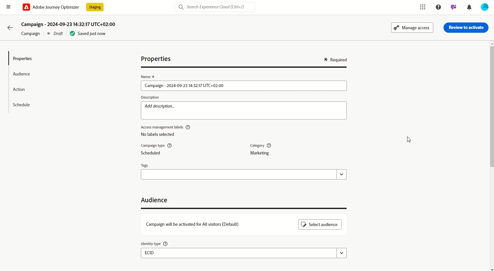
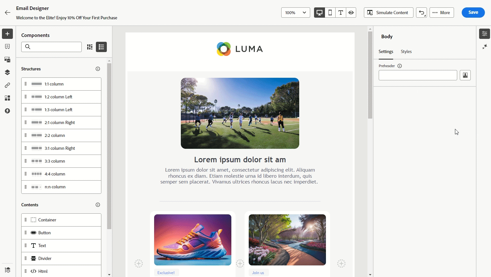

# 릴리스 정보 {#release-notes}

>[!CONTEXTUALHELP]
>id="ajo_homepage_card1"
>title="새로운 기능"
>abstract="**Adobe Journey Optimizer**&#x200B;는 지속적으로 새로운 기능, 기존 기능 개선, 버그 수정을 제공합니다. 모든 변경 사항은 매달 마지막 주에 여기 있는 릴리스 정보에 통합됩니다."

[!DNL Adobe Journey Optimizer]는 지속적으로 새로운 기능, 기존 기능 개선, 버그 해결을 제공합니다. 모든 변경 사항은 이 릴리스 정보에서 매월 마지막 주에 통합됩니다. [!DNL Adobe Journey Optimizer]은(는) 기본적으로 [!DNL Adobe Experience Platform] 기반으로 구축되었으며 최신 혁신 및 향상된 기능을 활용할 수 있습니다. 변경 사항에 대한 자세한 내용은 [Adobe Experience Platform 릴리스 노트](https://experienceleague.adobe.com/docs/experience-platform/release-notes/latest.html?lang=ko-KR){target="_blank"}를 참조하세요.

## 2024년 10월 초기 릴리스 정보 {#24-10-rn}

>[!CAUTION]
>
>**아래 초기 릴리스 정보는 릴리스 공개 당일까지 사전 통지 없이 변경될 수 있습니다**. 링크, 화면 및 업데이트된 설명서는 릴리스 일자에 게시됩니다.

**릴리스 날짜**: 2024년 10월 29~30일

### 새로운 기능 {#24-10-features}

이번 릴리스에는 아래에 있는 새로운 기능이 제공됩니다.

<table>
<thead>
<tr>
<th><strong>이메일 콘텐츠 잠그기</strong> </th>
</tr>
</thead>
<tbody>
<tr>
<td>

이제 Journey Optimizer에서 이메일 템플릿의 콘텐츠를 잠글 수 있습니다. 템플릿 전체를 잠그거나 특정 구조 및 구성 요소를 잠그는 것이 가능합니다. 이를 통해 의도하지 않은 편집 또는 삭제를 방지할 수 있으므로 템플릿의 사용자 정의 기능을 더욱 강력하게 제어하고 이메일 캠페인의 효율성과 안정성을 향상시킬 수 있습니다.

자세한 내용은 <a href="../content-management/content-locking.md">세부 설명서</a>를 참조하십시오.

</td>
</tr>
</tbody>
</table>

<table>
<thead>
<tr>
<th><strong>이메일 구성 개인화(일반 가용성) </strong> </th>
</tr>
</thead>
<tbody>
<tr>
<td>

이메일 설정을 보다 유연하게 제어하고, 이메일 채널 구성을 만들 때 동적 하위 도메인 및 개인화된 헤더 매개 변수를 정의할 수 있습니다.

이전에는 조직 집합(LA)에서 사용할 수 있었으나, 이제 모든 사용자(GA)가 이메일 구성 개인화를 사용할 수 있습니다.

자세한 내용은 <a href="../email/surface-personalization.md">세부 설명서</a>를 참조하십시오.

사용 가능한 날짜: 2024년 10월 23일

</tr>
</tbody>
</table>

<table>
<thead>
<tr>
<th><strong>여정 및 캠페인에서의 승인(일반 가용성)</strong> </th>
</tr>
</thead>
<tbody>
<tr>
<td>

이제 승인 정책을 사용하여 Journey Optimizer 내 승인 프로세스를 설정할 수 있습니다. 이를 통해 마케팅 팀에서 캠페인 및 여정을 라이브로 전환하기 전에 적절한 이해 관계자의 검토 및 승인을 놓치지 않을 수 있습니다.

이전에는 조직 집합(LA)에서 사용할 수 있었으나, 이제 모든 사용자(GA)가 승인 정책을 사용할 수 있습니다.

자세한 내용은 <a href="../test-approve/gs-approval.md">세부 설명서</a>를 참조하십시오.

</td>
</tr>
</tbody>
</table>

<table>
<thead>
<tr>
<th><strong>이메일 구성 개인화(일반 가용성)</strong> </th>
</tr>
</thead>
<tbody>
<tr>
<td>

이제 이메일 채널 구성을 만들 때 동적 하위 도메인과 개인화된 헤더 매개 변수를 정의하여 이메일 설정을 더욱 유연하게 제어할 수 있습니다.

캠페인 또는 여정에서 개인화된 구성을 사용하면 이메일 콘텐츠를 미리 보고 정의한 동적 설정으로 잠재적인 오류가 있는지 확인할 수 있습니다.

이전에는 조직 집합(LA)에서 사용할 수 있었으나, 이제 모든 사용자(GA)가 이메일 구성 개인화를 사용할 수 있습니다.

자세한 내용은 <a href="../email/surface-personalization.md">세부 설명서</a>를 참조하십시오.

</td>
</tr>
</tbody>
</table>

<table>
<thead>
<tr>
<th><strong>샘플 입력 데이터를 사용하여 콘텐츠 테스트(Beta)</strong> </th>
</tr>
</thead>
<tbody>
<tr>
<td>

이제 여정 최적기를 사용하여 미리 보고 파일에서 업로드하거나 수동으로 추가한 샘플 입력 데이터를 사용하여 증명을 전송하여 이메일 콘텐츠의 다양한 변형을 테스트할 수 있습니다. 개인화를 위한 콘텐츠에 사용되는 모든 프로필 속성은 시스템에서 자동으로 감지되며 테스트에 사용하여 여러 변형을 만들 수 있습니다.

이 기능은 현재 모든 고객이 공개 베타로 사용할 수 있습니다.

<!--
For more information, refer to the <a href="../email/surface-personalization.md">detailed documentation</a>.
-->
</td>
</tr>
</tbody>
</table>

<table>
<thead>
<tr>
<th><strong>충돌 및 우선 순위 관리(제한된 가용성)</strong> </th>
</tr>
</thead>
<tbody>
<tr>
<td>

Journey Optimizer에서 너무 많은 상호 작용으로 압도적인 고객을 피하려면 캠페인 및 여정의 양과 타이밍을 관리하는 것이 필수적입니다. 이제 Journey Optimizer은 충돌 관리 및 우선 순위를 위한 몇 가지 도구를 제공합니다.

<ul><li><b>여정 빈도 제한</b>: 이제 여정에 적용할 규칙 집합을 만들어 프로필의 여정 수를 일, 주 또는 월로 제한하고 동시에 실행되는 동시 여정 수를 제어할 수 있습니다.</li>
<li><b>우선 순위 점수</b>: 이제 0에서 100 사이의 우선 순위 점수를 캠페인이나 여정에 할당할 수 있습니다. 숫자가 높을수록 우선 순위가 높다는 뜻입니다. 두 캠페인 또는 여정 작업이 동일한 채널 구성을 사용하는 경우 Journey Optimizer에서 우선 순위 점수가 가장 높은 캠페인을 선택합니다. 캠페인의 점수가 동일한 경우, 가장 최근에 수정되지 않은 캠페인이 선택됩니다.</li>
<li><b>잠재적 충돌 보기</b>: 이제 여정 및 캠페인의 새로운 "잠재적 충돌 보기" 단추를 사용하여 시작 날짜, 대상 또는 선택한 여정 구성과 같은 다른 채널 또는 캠페인과 겹치는 부분을 식별할 수 있습니다.</li>
<li><b>여정 중재</b>: 이 새로운 기능을 사용하면 고객에게 가장 중요한 여정의 우선 순위를 지정할 수 있습니다. 고객이 더 높은 우선순위의 예정된 여정에 대한 자격이 있을 때 더 낮은 우선순위의 여정에 들어가지 않도록 규칙을 만들 수 있습니다.</li>
<li><b>통신 유형별 빈도 제한: </b>이제 규칙 집합을 사용하여 통신 유형별로 세분화된 규칙(예: 판매, 프로모션)을 설정하여 유사한 메시지가 있는 고객을 오버로드할 수 있습니다. 여러 채널에서 빈도를 제어할 수 있으며, 과도하게 요청된 프로필을 자동으로 제외하여 고객 경험을 개선할 수 있습니다.</li></ul>
<!--
For more information, refer to the <a href="../email/surface-personalization.md">detailed documentation</a>.
-->

충돌 및 우선 순위 관리 기능은 일부 고객이 제한된 가용성으로 사용할 수 있습니다. 이러한 기능은 향후 더 많은 사용자에게 점진적으로 배포될 예정입니다. 이러한 기능에 대한 대기자 명단에 추가하려는 경우 계정 팀에 문의하십시오.

</td>
</tr>
</tbody>
</table>

<table>
<thead>
<tr>
<th><strong>웹 디자이너의 비시각적 편집 모드</strong> </th>
</tr>
</thead>
<tbody>
<tr>
<td>

이제 Journey Optimizer 웹 디자이너의 대체 요소로서 시각적이지 않은 편집기를 사용하여 웹 사이트에 수정 사항을 추가할 수 있습니다. 이 옵션을 사용하면 시각적 편집기에서 페이지를 열지 않고도 변경 사항을 수동으로 입력할 수 있습니다.
이 비시각적 편집 모드는 웹 디자이너에서 페이지를 로드하는 데 필요한 Adobe Experience Cloud Visual Helper와 같은 브라우저 확장 기능을 설치할 수 없는 경우에 유용합니다.

<!--p>For more information, refer to the <a href="../email/surface-personalization.md">detailed documentation</a>.</p-->
</td>
</tr>
</tbody>
</table>

<table>
<thead>
<tr>
<th><strong>여정에서의 콘텐츠 실험(일반 가용성)</strong> </th>
</tr>
</thead>
<tbody>
<tr>
<td>

Adobe Journey Optimizer가 이제 여정에서도 실험을 지원합니다. 캠페인에서는 이미 실험을 사용할 수 있습니다. 실험은 무작위화한 시험 회기 여러 개를 모아 놓은 것입니다. 온라인 테스팅 맥락에서는 무작위로 선택한 사용자 일부를 특정한 버전의 메시지에 노출하고, 무작위로 선택한 다른 사용자들을 다른 처리 버전에 노출하는 것을 말합니다. 노출 후에는 이메일 열람, 구독 또는 구매 등 궁금한 결과 지표를 측정할 수 있습니다.

이전에는 조직 집합(LA)에서 사용할 수 있었지만, 이제 모든 사용자(GA)가 여정에서 실험을 사용할 수 있습니다.

</td>
</tr>
</tbody>
</table>

<table>
<thead>
<tr>
<th><strong>의사 결정(일반 가용성)</strong> </th>
</tr>
</thead>
<tbody>
<tr>
<td>

이전에 LA(조직)에서 사용할 수 있고 Experience Decisioning이라고 했던 Decisioning은 이제 Healthcare Shield 또는 Privacy and Security Shield 추가 기능 서비스를 구입한 조직을 포함한 모든 Adobe(GA)가 사용할 수 있습니다.

Decisioning은 '의사 결정 항목'이라고 하는 마케팅 오퍼의 중앙 집중식 카탈로그와 정교한 의사 결정 엔진을 제공하여 개인화를 간소화합니다. 이 엔진은 규칙과 등급 기준을 활용하여 각 개인에게 가장 관련성이 높은 결정 항목을 선택하고 제공합니다. 이러한 의사 결정 항목은 코드 기반 경험 채널을 통해 광범위한 인바운드 표면에 원활하게 통합됩니다.

자세한 내용은 <a href="../experience-decisioning/gs-experience-decisioning.md">세부 설명서</a>를 참조하십시오.

</td>
</tr>
</tbody>
</table>

<table>
<thead>
<tr>
<th><strong>여정 및 캠페인의 다국어 메시지(일반 가용성)</strong> </th>
</tr>
</thead>
<tbody>
<tr>
<td>

이제 단일 캠페인 또는 여정 내에서 간편하게 여러 언어로 콘텐츠를 만들 수 있습니다. 이 기능을 사용하면 캠페인이나 여정을 편집할 때 언어를 전환할 수 있으므로 전체 편집 프로세스를 간소화하고 다국어 콘텐츠를 더욱 효율적으로 관리할 수 있습니다.

이전에는 조직 집합(LA)에서 사용할 수 있었지만, 이제 모든 사용자(GA)가 다국어 메시지를 사용할 수 있습니다.

<!--p>For more information, refer to the <a href="../configuration/business-rules.md">detailed documentation</a>.</p-->
</td>
</tr>
</tbody>
</table>

<table>
<thead>
<tr>
<th><strong>Movable Ink 및 Adobe Journey Optimizer 통합</strong> </th>
</tr>
</thead>
<tbody>
<tr>
<td>

이제 Movable Ink Da Vinci와 Adobe Journey Optimizer을 통합할 수 있습니다. 이 새로운 통합을 통해 다음과 같은 작업을 수행할 수 있습니다. 

<ul><li>Movable Ink의 Da Vinci 제품에 포함된 강력한 기능을 활용하여 일괄 캠페인을 위한 이메일 변형을 취합하고 개인화합니다</li>
<li>작성을 위해 Da Vinci를 사용하고 최적화 및 전달을 위해 AJO을 사용하는 Journey Optimizer 고객을 위한 실용적인 워크플로 가속화</li>
<li>Adobe 데이터로 다빈치 모델 최적화.</li></ul>

<!--p>For more information, refer to the <a href="../code-based/get-started-code-based.md">detailed documentation</a>.</p-->
</tr>
</tbody>
</table>

<table>
<thead>
<tr>
<th><strong>업데이트된 보고 환경(일반 공급)</strong> </th>
</tr>
</thead>
<tbody>
<tr>
<td>

2024년 10월 16일 이후 사용 가능

이제 Journey Optimizer 보고가 GA(General Availability)되었으며 Customer Journey Analytics 기능과의 상호 운용성이 개선되어 두 플랫폼 간에 보고를 표준화하고 데이터 일관성과 안정성을 향상시킵니다. 이렇게 Journey Optimizer와 Customer Journey Analytics가 원활하게 통합됨으로써 사용자가 성과 지표를 보다 명확하게 확인하여 확실한 정보에 근거한 결정을 내릴 수 있습니다.

일반 공급 기능에는 간단한 지표 만들기, 대상자 만들기 및 게시, Insight Builder를 사용하여 임시 질문하기, 주요 수신자에게 자동으로 이메일로 전송할 보고서 예약 등의 네 가지 새로운 기능이 도입되었습니다.

자세한 내용은 <a href="../reports/report-cja-manage.md">세부 설명서</a>를 참조하십시오.

중요: 현재 보고 경험은 2025년 1월부터 종료됩니다. 이 날짜 이후에는 새로운 보고 경험이 표준이 됩니다. 원활한 전환을 위해 새로운 기능을 숙지하는 것이 좋습니다. <a href="../reports/report-gs-cja.md">Journey Optimizer의 새로운 보고 인터페이스를 시작하는 방법 알아보기</a>

</tr>
</tbody>
</table>

<table>
<thead>
<tr>
<th><strong>여정의 코드 기반 경험</strong> </th>
</tr>
</thead>
<tbody>
<tr>
<td>

2024년 10월 1일 이후 사용 가능

코드 기반 경험 채널에서는 Adobe Journey Optimizer에서 원하는 인바운드 속성에 대해 고급 개인화 및 테스트를 수행할 수 있으므로 웹 앱, 모바일 앱, 데스크탑 앱, 비디오 콘솔, TV에 연결된 디바이스, 스마트 TV, 키오스크, ATM, IoT 디바이스 등과 같은 다양한 접점에서 맞춤형 경험을 원활하게 전달할 수 있습니다. 이제 여정 캔버스에서 코드 기반 경험 채널을 사용할 수 있습니다.

자세한 내용은 <a href="../code-based/create-code-based.md">세부 설명서</a>를 참조하십시오.

</tr>
</tbody>
</table>

<table>
<thead>
<tr>
<th><strong>여정의 웹 경험</strong> </th>
</tr>
</thead>
<tbody>
<tr>
<td>

2024년 10월 1일 이후 사용 가능

웹 채널을 사용하면 Adobe Journey Optimizer에서 인바운드 웹 채널을 통해 고객에게 제공하는 웹 경험을 개인화할 수 있습니다. 이제 여정 캔버스에서 웹 채널을 사용할 수 있습니다.

자세한 내용은 <a href="../web/create-web.md">세부 설명서</a>를 참조하십시오.

</tr>
</tbody>
</table>

### 개선 사항 {#24-10-improvements}

이 릴리스는 아래 목록에 있는 개선 사항과 함께 제공됩니다.

**SMS 채널**

메시징 기능을 개선하기 위해 SMS 개선 사항이 도입되었습니다.

* SMS 캠페인 및 여정에 대한 고유 키워드를 정의하고 관리하여 보다 개인화되고 효율적인 커뮤니케이션을 가능하게 할 수 있습니다.

* 키워드가 인식되지 않을 때 기본 SMS 메시지를 만들고 전달할 수 있습니다.

* 이제 SMS API 채널 구성을 편집하거나 삭제할 수 있습니다.

<!--**Journeys**-->

<!--* **Path experiment in journeys** - With the journey path experiment, you can now define and track key metrics for your journey paths, allowing you to measure the impact of your activities and to provide clearer insights into your performance. -->

&lt;!—* **최대 라이브 여정 수** - 이제 Journey Optimizer에는 프로덕션 샌드박스에서 100개가 아닌 500개의 라이브 여정이 있습니다. 라이브 여정 수는 여정 캔버스에 표시됩니다. <!-- DOCAC-10977-->

**데이터 세트**

* **이벤트 전송 및 열기** - 2024년 11월 1일부터 스트리밍 세분화는 더 이상 Journey Optimizer 추적 및 피드백 데이터 세트에서 전송 및 열기 이벤트를 사용할 수 없습니다. 이 변경 사항은 모든 고객 샌드박스 및 조직에 적용됩니다. [자세히 알아보기](../data/datasets-ttl.md#segmentation-update)

* **TTL(Time-to-Live)** - 2025년 2월부터 TTL(Time-to-Live) 가드레일이 다음과 같이 새 샌드박스 및 새 조직의 Journey Optimizer 시스템 생성 데이터 세트로 롤아웃됩니다.

   * 프로필 스토어의 데이터에 대해 90일
   * 데이터 레이크의 데이터에 대해 13개월

  이 변경 사항은 후속 단계에서 기존 고객 샌드박스로 롤아웃됩니다. [자세히 알아보기](../data/datasets-ttl.md#ttl)

* **사용자 지정 작업의 매개 변수**(사용 가능한 날짜: 2024년 10월 3일) - 이제 사용자 지정 작업에서 NULL 및 선택적 매개 변수가 지원됩니다. [자세히 알아보기](../action/about-custom-action-configuration.md#define-the-message-parameters)

**보고**

* 이제 **Experience Decisioning 보고**&#x200B;를 사용할 수 있으므로 방문자가 경험과 상호 작용하는 방식에 대한 필수 통찰력을 제공합니다.

**데이터 거버넌스 및 동의 정책** - 사용 가능한 날짜: 2024년 10월 7일

* **데이터 거버넌스 정책** 시행이 이제 Journey Optimizer의 모든 채널에 적용됩니다. Adobe Experience Platform에서 정책을 만든 고객의 경우 이 정책은 채널 구성 설정의 일부로 마케팅 액션에 적용됩니다. 구성을 사용하여 콘텐츠를 만들 때 시스템은 모든 개인화 필드를 확인하여 데이터 거버넌스 위반 여부를 찾습니다. 위반이 발견되면 여정 또는 캠페인을 게시할 수 없습니다. [자세히 알아보기](../action/action-privacy.md)

* 이제 **사용자 정의 동의 정책**&#x200B;이 모든 Journey Optimizer 채널에 적용됩니다. 메시지가 전송되거나 인바운드 경험이 게재되기 전에 적용 시 시스템은 사용자가 수신할 콘텐츠의 개인화 필드 사용에 동의했는지 확인합니다. 동의를 하지 않은 경우 해당 경험이 표시되지 않습니다. [자세히 알아보기](../action/consent.md)

  >[!NOTE]
  >
  >동의 정책 기능은 현재 Adobe **Healthcare Shield** 또는 **Privacy and Security Shield** 추가 기능 서비스를 구매한 조직에만 제공됩니다.

**대상자** - 사용 가능한 날짜: 2024년 10월 8일

* 이제 CSV 파일 대상자를 타기팅할 때 개인화 편집기와 여정 및 캠페인 규칙 빌더에서 파일의 속성을 사용할 수 있습니다. [자세히 알아보기](../audience/about-audiences.md)

* 이제 사용자 정의 업로드(CSV 파일)의 대상자 및 속성을 Healthcare Shield 또는 Privacy and Security Shield에서도 사용할 수 있습니다.

**구성** - 사용 가능한 날짜: 2024년 10월 23일

* 이제 캠페인 또는 여정에서 개인화된 구성을 사용할 때 이메일 콘텐츠를 미리 보고 정의한 동적 설정으로 잠재적인 오류가 있는지 확인할 수 있습니다. [자세히 알아보기](../email/surface-personalization.md#check-configuration)

**코드 기반 채널**

* 이제 콘텐츠 템플릿을 사용할 수 있습니다. 개발자가 작성한 콘텐츠 템플릿에서 시작하여 코드 기반 경험을 빠르게 작성할 수 있습니다. 마케터는 컨텐츠 템플릿을 사용하면 전체 HTML 또는 JSON 컨텐츠 페이로드를 작성하는 대신 일부 값 또는 필드를 수정할 수 있습니다.

**의사 결정**

* [Adobe Customer Journey Analytics](https://experienceleague.adobe.com/docs/analytics-platform/using/cja-overview/cja-overview.html?lang=ko) 사용자는 이제 의사 결정(이전 Experience Decisioning)에서 AI 모델을 설정할 때 최적화할 사용자 지정 모델을 선택할 수 있습니다. 예를 들어 클릭스루 비율과 같은 정의된 제한 대신 사용자 정의 &quot;구매&quot; 테이블에서 최적화할 수 있습니다.&quot;

* 이제 의사 결정을 사용하여 코드 기반 캠페인(이전의 경험 의사 결정)에 의사 결정 정책을 추가할 때 선택 전략 외에 단일 의사 결정 항목을 수동으로 선택할 수 있습니다. 또한 이제 두 개 이상의 대체 오퍼를 선택할 수 있습니다. 이렇게 하면 일정 수의 결정 항목이 반환되는 것을 보장할 수 있습니다. [자세히 알아보기](../experience-decisioning/create-decision.md)

## 24년 9월 릴리스 {#24-9-rn}

<!--
>[!CAUTION]
>
>**Early release notes below are subject to change without prior notice until the release date**. Links, screens and updated documentation are published at the release date.
>
-->

**릴리스 일자**: 2024년 9월 24~25일

### 새로운 기능 {#24-9-features}

이번 릴리스에는 아래에 있는 새로운 기능이 제공됩니다.

<table>
<thead>
<tr>
<th><strong>모바일 앱 및 웹 사이트용 콘텐츠 카드</strong> </th>
</tr>
</thead>
<tbody>
<tr>
<td>

콘텐츠 카드는 모바일 앱 및 웹 사이트에서 직접 개인화되고 흥미로운 콘텐츠를 제공하는 Adobe Journey Optimizer의 새로운 디지털 메시징 기능입니다. 기존 푸시 알림과 달리 콘텐츠 카드는 사용자 인터페이스에 원활하게 통합되어 사용자 상호 작용과 경험을 향상시키고 방해하지 않는 지속적인 업데이트를 제공합니다.

이 기능을 통해 마케터는 사용자에게 관련성이 높은 리치 미디어 콘텐츠를 제공할 수 있으므로 참여도가 높아지고 사용자 여정을 중단하지 않고도 중요한 메시지를 볼 수 있습니다.

자세한 내용은 <a href="../content-card/get-started-content-card.md">세부 설명서</a>를 참조하십시오.

</td>
</tr>
</tbody>
</table>

<table>
<thead>
<tr>
<th><strong>여정 및 캠페인의 승인(LA)</strong> </th>
</tr>
</thead>
<tbody>
<tr>
<td>

이제 승인 정책을 사용하여 Journey Optimizer 내 승인 프로세스를 설정할 수 있습니다. 이를 통해 마케팅 팀에서 캠페인 및 여정을 라이브로 전환하기 전에 적절한 이해 관계자의 검토 및 승인을 놓치지 않을 수 있습니다.

승인 정책은 현재 일부 조직에서만 사용할 수 있습니다(제한된 가용성). 액세스 권한을 받으려면 Adobe 담당자에게 문의하십시오.

자세한 내용은 <a href="../test-approve/gs-approval.md">세부 설명서</a>를 참조하십시오.

</td>
</tr>
</tbody>
</table>

<!--<table>
<thead>
<tr>
<th><strong>Email Content Locking</strong> </th>
</tr>
</thead>
<tbody>
<tr>
<td>

Journey Optimizer now allows you to lock content in email templates, either by locking the entire template or specific structures and component. This allows you to prevent unintentional edits or deletions, giving you greater control over template customization, and improving the efficiency and reliability of your email campaigns.

For more information, refer to the <a href="../content-management/gs-generative.md">detailed documentation</a>.

</td>
</tr>
</tbody>
</table>-->

<table>
<thead>
<tr>
<th><strong>여정의 전역 종료 기준</strong> </th>
</tr>
</thead>
<tbody>
<tr>
<td>

이제 여정 수준에서 종료 기준을 정의합니다. 종료 기준을 추가하면 이벤트가 발생(예: 구매)하거나 프로필이 대상자 자격에 해당하는 즉시 해당 프로필의 여정을 종료합니다. 그러면 해당 사용자가 더 이상 해당 여정의 커뮤니케이션을 받지 않게 됩니다.

자세한 내용은 <a href="../building-journeys/journey-properties.md#exit-criteria">세부 설명서</a>를 참조하십시오.

</td>
</tr>
</tbody>
</table>

<table>
<thead>
<tr>
<th><strong>AI 어시스턴트 콘텐츠 가속기 </strong> </th>
</tr>
</thead>
<tbody>
<tr>
<td>

메시지를 만들고 개인화한 후에는 Journey Optimizer의 AI Assistant Content Accelerator를 사용하여 콘텐츠를 한 차원 높입니다. 이제 AI Assistant를 사용하여 다양한 주요 제목 및 이미지를 실험하여 메시지의 영향을 최적화할 수 있습니다. 각 변형 버전이 고유한 처리 항목으로 관리되어 어떤 제목이 더 많은 클릭으로 이어지는지 측정하고 비교할 수 있습니다.

기능을 직접 탐색하고 기능을 완전히 이해할 수 있도록 설계된 <a href="https://experienceleague.adobe.com/ko/apps/journey-optimizer/ai-assistant-content-accelerator">라이브 기능 미리 보기</a>를 통해 실습 경험에 몰입하세요.</a>.

자세한 내용은 <a href="../content-management/gs-generative.md">세부 설명서</a>를 참조하십시오.

사용 가능한 날짜: 2024년 9월 12일

</td>
</tr>
</tbody>
</table>

<table>
<thead>
<tr>
<th><strong>안내식 채널 설정</strong> </th>
</tr>
</thead>
<tbody>
<tr>
<td>

[안내식 채널 설정]을 사용하면 통합 환경에서 채널 설정을 자동화하고 유효성을 검사하여 Journey Optimizer를 보다 빠르게 시작할 수 있습니다. 이 새로운 안내식 설정으로 빠른 채널 구성을 간소화하여 필요한 리소스를 모두 손쉽게 설치하고 Experience Platform, Journey Optimizer, 데이터 수집 내에서 사용할 수 있습니다. 이를 통해 마케팅, 제품, 데이터 엔지니어링 팀이 캠페인 및 여정 만들기를 신속하게 시작할 수 있습니다.

자세한 내용은 <a href="../configuration/set-mobile-config.md">세부 설명서</a>를 참조하십시오.

사용 가능한 날짜: 2024년 9월 3일

 
</td>
</tr>
</tbody>
</table>

### 개선 사항 {#24-9-improvements}

이 릴리스는 아래 목록에 있는 개선 사항과 함께 제공됩니다.

**대상저** - 사용 가능한 날짜: 2024년 9월 17일

**라이선스 사용** - 이제 라이선스 사용 대시보드에 참여 가능한 대상자 대신 참여 가능한 프로필이 표시됩니다. [자세히 알아보기](../audience/license-usage.md)

**콘텐츠 관리**

이제 샌드박스 간에 콘텐츠 템플릿과 조각을 내보낼 수 있습니다. [자세히 보기](../configuration/copy-objects-to-sandbox.md)

**여정**

* **실시간 보고 개선** - 실시간 보고에서는 지난 24시간 동안의 여정 성과에 대한 인사이트를 제공합니다. 새로운 지표(입장함, 퇴장함, 삭제 프로필, 오류 프로필)를 추가하여 여정 캔버스에서 직접 사용자 동작 및 성과를 더 깊이 있게 이해할 수 있도록 개선했습니다. [자세히 알아보기](../building-journeys/report-journey.md)

* (사용 가능한 날짜: 9월 10일) **대상자 읽기 자동 재시도** -이제 내보내기 작업을 검색하는 동안 대상자에 의해 트리거되는 여정(**대상자 읽기** 또는 **비즈니스 이벤트**&#x200B;로 시작)에 대해 기본적으로 재시도를 적용합니다. 내보내기 작업 생성 중 오류가 발생하면 최대 1시간 동안 10분마다 다시 시도됩니다. 그 후에는 실패로 간주합니다. 따라서 이러한 유형의 여정은 예정된 시간보다 최대 1시간 후에 실행될 수 있습니다. [자세히 알아보기](../building-journeys/read-audience.md#retries)

**이메일 채널**

* **보낸 이메일 및 BCC 사본의 메시지 헤더** - 모든 이메일 메시지에 새 헤더가 추가되었습니다. 이 헤더는 보낸 각 이메일과 해당 BCC 이메일 사본에 대해 고유한 값을 가집니다. 이 헤더는 메시지 및 BCC 피드백 데이터 세트에도 저장되며, 이를 통해 BCC 사본과 이에 해당하는 전송된 이메일 정보를 조정할 수 있습니다. [자세히 보기](../configuration/archiving-support.md#bcc-header)

* **스팸 점수**(GA) - 이제 전용 **스팸 보고서**&#x200B;를 통해 콘텐츠 스팸 점수를 확인할 수 있습니다. 이제 Adobe Journey Optimizer에서 SpamAssassin을 사용하여 이메일 콘텐츠를 테스트하고 ISP 또는 사서함 공급자가 이를 스팸으로 간주할지 여부를 나타내는 점수를 매길 수 있습니다. [자세히 보기](../content-management/spam-report.md)

**SMS 채널**

* **API 자격 증명 편집** - 이제 SMS API 자격 증명의 옵트인/옵트아웃 키워드 업데이트 및 답장 등 설정을 편집할 수 있습니다.

**API**

* **캠페인 시뮬레이션 API** - 이 API를 사용하여 캠페인의 증명 작업을 트리거합니다. 캠페인 증명 보내기가 비동기 프로세스인 경우 이 API는 증명 상태를 확인하는 데 사용할 수 있는 proofJobId를 반환합니다. [자세히 알아보기](https://developer.adobe.com/journey-optimizer-apis/references/simulations/){target="_blank"}

* (사용 가능한 날짜: 9월 10일) [Adobe Journey Optimizer API 설명서](https://developer.adobe.com/journey-optimizer-apis/references/simulations/){target="_blank"}가 대화형으로 변경되었습니다. 설명서 페이지에서 직접 API 엔드포인트를 탐색하여 즉각적인 피드백을 얻고 기술 구현 속도를 높일 수 있습니다. 

  이제 모든 API 참조 페이지에는 설명서 웹 사이트 페이지에서 직접 API 호출을 테스트하는 데 사용할 수 있는 **사용해 보기** 기능이 있습니다. [필요한 인증 자격 증명을 획득](https://developer.adobe.com/journey-optimizer-apis/references/authentication/){target="_blank"}하면 이 기능을 사용하여 API 엔드포인트 탐색을 시작할 수 있습니다.

  이 새로운 기능을 사용하여 API 엔드포인트에 대한 요청과 응답을 살펴보고 즉각적인 피드백을 받고 기술 구현 속도를 높일 수 있습니다.

  >[!CAUTION]
  >
  >설명서 페이지의 대화형 API 기능을 사용하면 엔드포인트에 실제 API 호출을 할 수 있다는 점에 유의하십시오. 프로덕션 샌드박스를 실험할 때는 이 점을 명심하십시오.

**구성**

* **IP 워밍업 플랜** - 이제 Adobe **Healthcare Shield** 또는 **Privacy and Security Shield** 추가 기능 서비스를 구입한 조직을 포함하여 모든 고객이 이 기능을 사용할 수 있습니다. [자세히 알아보기](../configuration/ip-warmup-gs.md)

 오늘 [Adobe Journey Optimizer 분기별 뉴스레터](https://www.adobe.com/subscription/Adobe_Journey_Optimizer_NL.html){target="_blank"}에 등록하여 분기마다 최신 제품 업데이트, 재미있는 이야기, 사용 사례, 팁 등을 메일로 직접 받아 보세요.