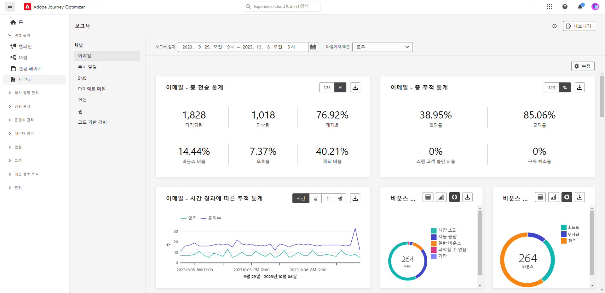
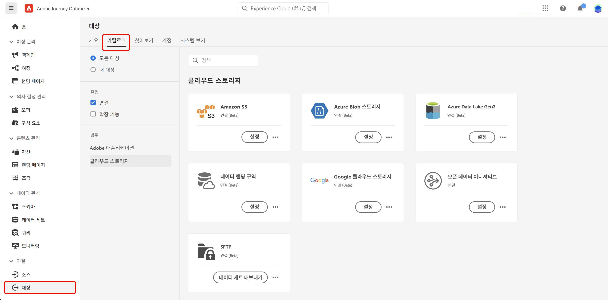
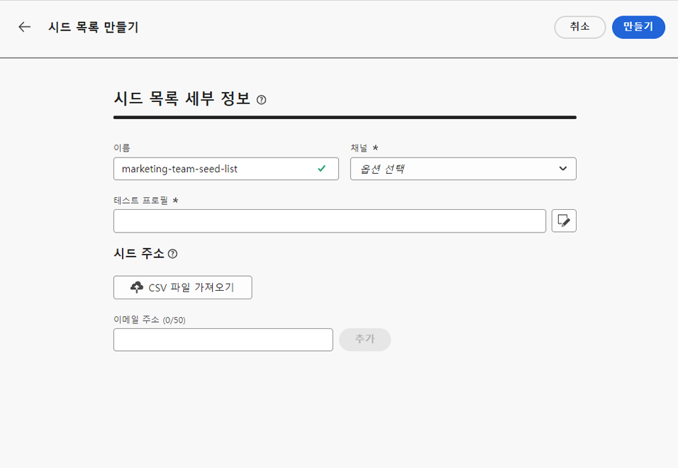
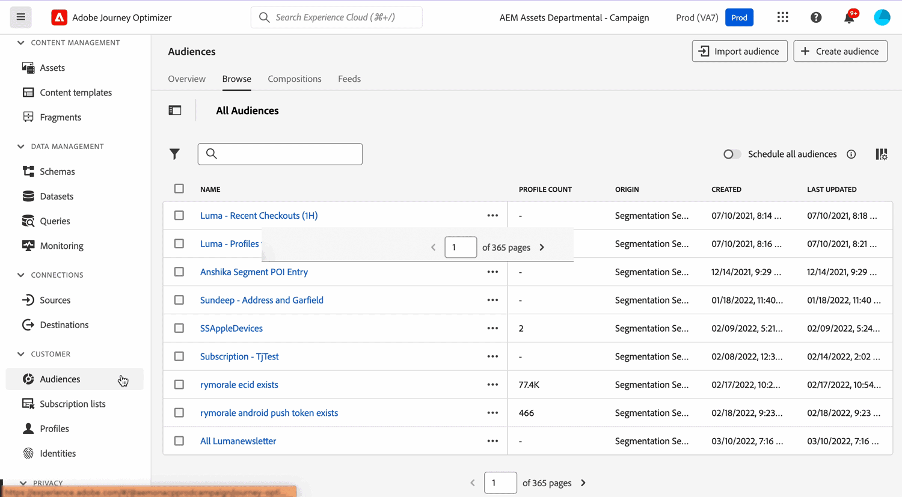
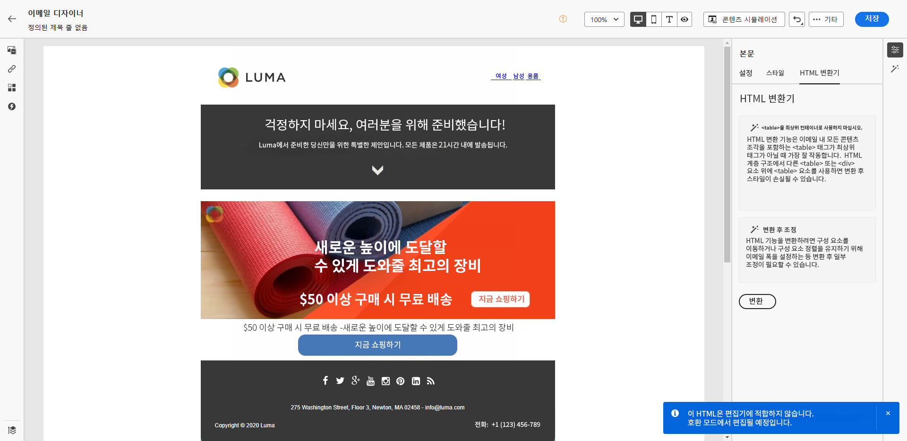
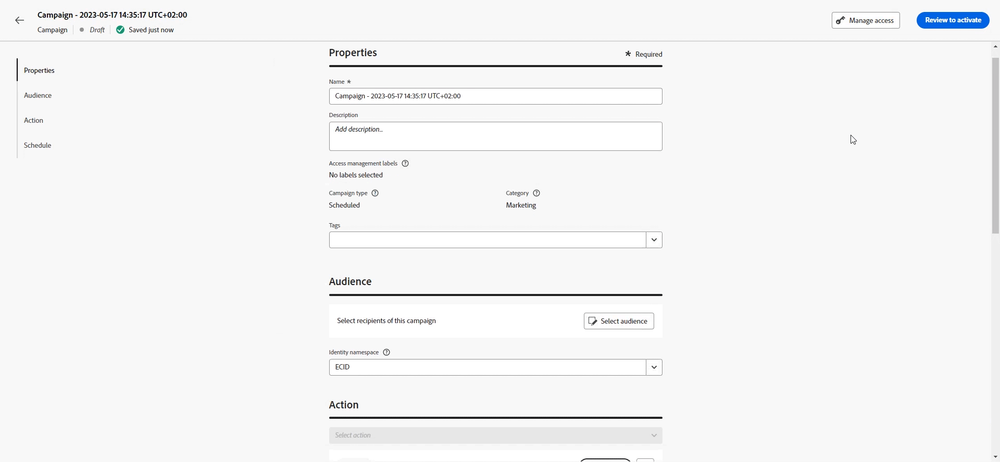

# 릴리스 정보 {#release-notes}

[!DNL Adobe Journey Optimizer]는 지속적으로 새로운 기능, 기존 기능 개선, 버그 해결을 제공합니다. 모든 변경 사항은 매달 마지막 주에 여기 있는 릴리스 노트에 통합됩니다.

이전 릴리스 노트는 [이 페이지](release-notes-2022.md)에서 확인하실 수 있습니다. 또한 자세한 변경 사항은 [최신 설명서 업데이트](documentation-updates.md) 페이지를 참조하십시오.

[!DNL Adobe Journey Optimizer]은(는) 기본적으로 [!DNL Adobe Experience Platform] 기반으로 구축되었으며 최신 혁신 및 향상된 기능을 활용할 수 있습니다. 변경 사항에 대한 자세한 내용은 [Adobe Experience Platform 릴리스 노트](https://experienceleague.adobe.com/docs/experience-platform/release-notes/latest.html?lang=ko-KR){target="_blank"}를 참조하세요.

 오늘 [Adobe Journey Optimizer 분기별 뉴스레터](https://www.adobe.com/subscription/Adobe_Journey_Optimizer_NL.html){target="_blank"}에 등록하여 분기마다 최신 제품 업데이트, 재미있는 이야기, 사용 사례, 팁 등을 메일로 직접 받아 보세요.

## 2023년 9월 릴리스 정보 {#sept-rn-2023}

### 새로운 기능{#sept-2023-features}

이번 릴리스에는 아래 목록에 있는 새로운 기능이 제공됩니다.

<table>
<thead>
<tr>
<th><strong>계산된 속성</strong> </th>
</tr>
</thead>
<tbody>
<tr>
<td>

계산된 속성을 사용하면 향상된 동작 기반 세분화, 개인화 및 활성화를 위해 직관적인 사용자 인터페이스를 통해 이벤트 데이터를 프로필 속성으로 쉽게 요약할 수 있습니다. 이 기능을 사용하면 셀프서비스 방식으로 계산된 속성을 만들고 관리하여 세그멘테이션, 실시간 고객 프로필 대상 또는 Journey Optimizer에서 사용할 수 있습니다.  
또한 계산된 속성은 세분화 및 여정 워크플로를 단순화하여 관련 경험을 원활하게 전달할 수 있습니다. 다음에서 자세히 알아보기 <a href="../audience/computed-attributes.md">자세한 설명서</a>.

</tr>
</tbody>
</table>

<table>
<thead>
<tr>
<th><strong>통합 채널 보고서</strong> </th>
</tr>
</thead>
<tbody>
<tr>
<td>

채널 보고서 기능은 분석가와 마케터에게 채널 수준의 트래픽 및 참여 지표에 대한 포괄적인 개요를 제공합니다.

에 액세스하려면 <b>보고서</b> 메뉴, 다음 항목이 있어야 합니다. <b>채널 보고서 보기</b> 권한.

자세한 내용은 <a href="../reports/channel-report.md">자세한 설명서</a>, 및 <a href="../reports/channel-report.md#how-to-video-channel-report-video">방법 비디오</a>.

</tr>
</tbody>
</table>

<table>
<thead>
<tr>
<th><strong>데이터 세트 내보내기 대상(GA)</strong> </th>
</tr>
</thead>
<tbody>
<tr>
<td>

이제 클라우드 스토리지 대상으로 Journey Optimizer 데이터 세트 내보내기를 일반적으로 사용할 수 있습니다. 이제 클라우드 스토리지 위치와 실시간 연결을 설정하여 데이터 세트의 콘텐츠를 내보낼 수 있습니다.

자세한 내용은 <a href="../data/export-datasets.md">세부 설명서</a>를 참고하세요.

</td>
</tr>
</tbody>
</table>

<table>
<thead>
<tr>
<th><strong>샌드박스당 모바일 애플리케이션 자격 증명 저장소</strong> </th>
</tr>
</thead>
<tbody>
<tr>
<td>

이 새로운 기능을 사용하면 푸시 자격 증명을 앱 표면의 전용 샌드박스와 쉽게 관리하고 연결할 수 있습니다.

자세한 내용은 <a href="../in-app/inapp-configuration.md">자세한 설명서</a>를 참조하세요.

</tr>
</tbody>
</table>

### 개선 사항 {#sept-2023-improvements}

이 릴리스는 아래 목록에 있는 개선 사항과 함께 제공됩니다.

<!--**Personalization**

* In addition to visual fragments, it is now possible to create, save and reuse expression fragments from the Journey Optimizer interface through the Expression Editor. Expression fragments replace the previously saved expressions.-->

<!--
**Alerting**

* A new type of system alert has been introduced. You can now get notified when a read audience fails.    -->

**웹 채널**

* 이제 웹 시각적 편집기에서 단일 페이지 애플리케이션(SPA)을 작성할 수 있으며, 이를 통해 웹 페이지 수정 사항을 적용할 특정 보기를 선택할 수 있습니다. 보기는 전체 사이트 또는 홈 페이지, 전체 제품 사이트 또는 모든 체크아웃 페이지의 게재 환경 설정 프레임과 같은 사이트의 시각적 요소 그룹으로 정의할 수 있습니다. Adobe Experience Platform Web SDK 구현에서 보기를 정의하려면 일회용 개발자 설정이 필요합니다. 이렇게 하면 마케터는 SPA에서 Adobe Journey Optimizer 웹 캠페인을 만들고 실행할 수 있습니다. [자세히 알아보기](../web/web-spa.md)

* 이제 웹 디자이너를 사용하여 페이지를 편집할 때 구성 요소를 선택하고 디자이너 인터페이스에서 편집할 필요 없이 수정 창에서 직접 콘텐츠에 새 변경 사항을 추가할 수 있습니다. [자세히 알아보기](../web/manage-web-modifications.md#add-modifications)

* 이제 웹 하위 도메인을 설정할 때 Adobe으로 이미 위임된 하위 도메인을 사용할 수 있을 뿐만 아니라 고유한 하위 도메인을 추가할 수 있는 옵션이 제공됩니다. [자세히 보기](../web/web-delegated-subdomains.md#web-configure-new-subdomain)

**여정**

이제 여정을 복제할 때 여정 사본의 이름을 정의할 수 있습니다. [자세히 알아보기](../building-journeys/journey-gs.md#uplicate-a-journey)

<!--
* Support of custom action responses is now GA. This allows you to leverage API call responses in custom actions and orchestrate your journey based on these responses. In addition, a new guardrail has been added to limit all customs actions to 5000 calls/s per endpoint.
* The maximum duration that you can define in the Wait activity is now 29 days instead of 30.
-->

**이메일 채널**

이메일 표면 구성의 새 옵션을 사용하면 이메일 주소가 Adobe에 있는 경우에도 프로필에 트랜잭션 메시지를 보내도록 선택할 수 있습니다 [!DNL Journey Optimizer] 비표시 목록. [자세히 알아보기](../email/email-settings.md#send-to-suppressed-email-addresses)

**SMS 채널**

두 개의 새 필드, **옵트인 메시지** 및 **도움말 메시지**&#x200B;가 API 구성 화면에 추가되어 사용자가 인바운드 키워드에 대한 응답을 사용자 지정할 수 있습니다. Sinch SMS 공급자만 사용할 수 있습니다. [자세히 알아보기](../sms/sms-configuration.md)

**DM 채널**

이제 DM 공급자가 서버로 전송할 때 DM 공급자의 파일을 암호화할 수 있습니다. 이렇게 하려면 파일 라우팅 구성 화면에서 새 필드를 사용하여 암호화 키를 복사하여 붙여넣을 수 있습니다. [자세히 알아보기](../direct-mail/direct-mail-configuration.md)

**보고**

이제 Journey Optimizer 보고서를 CSV 파일로 내보낼 수 있습니다. [자세히 알아보기](../reports/global-report.md#export-reports)

**자산**

에셋에 대한 새 옵션을 사용하면 Journey Optimizer에서 에셋에 대한 저장소를 선택할 수 있습니다. 이 솔루션을 소유하고 있는 경우 Assets Essentials 저장소 또는 에셋 as a Cloud Service 저장소를 선택할 수 있습니다. [자세히 알아보기](../content-management/assets-essentials.md)

<!--**Decision management**

Enhancements have been made to the audience picker in journeys or campaigns, with the addition of new columns displaying the origin and update frequency of audiences.    -->

## 2023년 8월 릴리스 정보 {#aug-rn-2023}

### 새로운 기능{#aug-2023-features}

이번 릴리스에는 아래 목록에 있는 새로운 기능이 제공됩니다.

<table>
<thead>
<tr>
<th><strong>여정에서 인앱 메시지 보내기</strong> </th>
</tr>
</thead>
<tbody>
<tr>
<td>

이제 여정 내에서 앱 사용자에게 개인화된 인앱 메시지를 보낼 수 있습니다. Journey Optimizer를 사용하여 알림을 디자인하고 메시지 레이아웃, 디스플레이, 텍스트, 버튼을 사용자 정의하여 원활한 경험을 만들 수 있습니다.

자세한 내용은 <a href="../in-app/create-in-app.md">세부 설명서</a>를 참조하십시오.

</tr>
</tbody>
</table>

<table>
<thead>
<tr>
<th><strong>시드 목록을 사용한 이메일 유효성 검사</strong> </th>
</tr>
</thead>
<tbody>
<tr>
<td>

이제 Journey Optimizer에서 시드 목록을 만들고 관리할 수 있습니다. 시드 목록은 실제 대상자에 추가할 수 있는 내부 주소로 구성되며, 게재 실행 시 해당 목록의 주소는 타겟팅한 프로필과 정확히 동일한 메시지를 수신합니다. 이 기능을 사용하면 보내는 커뮤니케이션을 모니터링하여 모든 표시 형식, URL, 이미지, 링크가 올바른지 확인할 수 있습니다.

자세한 내용은 <a href="../configuration/seed-lists.md">자세한 설명서</a>를 참조하세요.

</td>
</tr>
</tbody>
</table>

<!--table>
<thead>
<tr>
<th><strong>Generate text and images with the Content assistant</strong> </th>
</tr>
</thead>
<tbody>
<tr>
<td>

Once you have created and personalized your message, take your content to the next level with the Content assistant. You can now use the Content assistant to optimize your message's impact by experimenting with different main titles, and images. Each variant is managed as a unique Treatment, to measure and compare which title effectively generates more clicks.

This capability is currently available as a private beta.

For more information, refer to the <a href="../start/search-filter-categorize.md#tags">detailed documentation</a>.

</td>
</tr>
</tbody>
</table-->

### 개선 사항 {#aug-2023-improvements}

이 릴리스는 아래 목록에 있는 개선 사항과 함께 제공됩니다.

<!--
**APIs**

A new API to create and manage Content Fragments is now available. [Learn more](https://developer.adobe.com/journey-optimizer-apis/references/content-templates/#tag/Content-fragment-API){target="_blank"}.-->

<!--**Email channel**

A new option is available in the email surface settings to include email addresses suppressed due to spam complaint in your transactional messages audiences. Even if they marked marketing messages as spam, these profiles can then receive transactional messages, such as password reset or account statements. This option is disabled by default.-->

**여정**

* 이제 사용자 정의 작업에 API 호출 응답을 활용하고, 이 응답을 기반으로 여정을 오케스트레이션할 수 있습니다. 이 기능은 현재 Private Beta로 사용할 수 있습니다. [자세히 알아보기](../action/action-response.md).
* 새로운 유형의 시스템 경고가 도입되었습니다. 이제 사용자 정의 작업이 실패하면 알림을 받을 수 있습니다. [자세히 알아보기](../reports/alerts.md).
  <!--* When duplicating a journey, you can now define the name of the journey copy.-->

**다이렉트 메일**

* 이제 파일 라우팅 구성에서 서버 유형으로 Azure를 선택할 수 있습니다. [자세히 알아보기](../direct-mail/direct-mail-configuration.md#file-routing-configuration)
* 이제 DM 표면 설정의 열 구분 기호 필드로 앰퍼샌드를 사용할 수 있습니다. [자세히 알아보기](../direct-mail/direct-mail-configuration.md#direct-mail-surface)

## 2023년 7월 릴리스 정보 {#july-rn-2023}

### 새로운 기능{#july-2023-features}

<table>
<thead>
<tr>
<th><strong>대상자 구성</strong> </th>
</tr>
</thead>
<tbody>
<tr>
<td>

이제 구성 워크플로우를 만들어 기존 Adobe Experience Platform 대상자를 시각적 캔버스에 모으고 다양한 활동(분할, 강화...)을 활용하여 새 대상자를 만들 수 있습니다. 새로 만든 대상자는 기존 대상자와 함께 다시 Adobe Experience Platform에 저장되며, 이를 Journey Optimizer 캠페인에서 활용하여 고객을 타겟팅할 수 있습니다.

자세한 내용은 <a href="../audience/get-started-audience-orchestration.md">세부 설명서</a>를 참조하세요.

대상자 구성은 대상자에게 중앙 포털 역할을 하는 새 Adobe Experience Platform "대상자" 메뉴와 완전히 통합됩니다. 이제 브라우저 페이지에서 새 대시보드를 사용할 수 있습니다. 새 대시보드에는 세그먼트 트렌드와 중복 사항이 표시되어 새로운 인사이트를 얻을 수 있고 폴더링과 태깅을 통해 조직 툴을 탐색할 수 있습니다. 여기에는 워크플로우를 관리하기 위한 대상 라이프사이클 관리 기능과 표준화된 대상 레이블 지정을 위한 거버넌스 컨트롤이 포함되어 있습니다. 이 같은 새로운 관리 경험을 통해 한 곳에서 대상을 쉽고 안전하게 관리할 수 있습니다. 자세한 내용은 <a href="https://experienceleague.adobe.com/docs/experience-platform/segmentation/ui/overview.html?lang=ko" target="_blank">Adobe Experience Platform 설명서</a>를 참고하세요.

</td>
</tr>
</tbody>
</table>

<table>
<thead>
<tr>
<th><strong>DM 채널</strong> </th>
</tr>
</thead>
<tbody>
<tr>
<td>

이제 캠페인에 DM 메시지를 추가할 수 있습니다. DM은 DM 공급자가 고객에게 메일을 보내는 데 필요한 파일을 개인화하고 생성할 수 있는 오프라인 채널입니다.

Journey Optimizer는 DM 게재 준비 시 타겟팅 프로필과 선택한 연락처 정보(예를 들면 우편 주소)가 있는 파일을 생성합니다. 그러면 이 파일을 DM 공급자에게 보내어 실제 전송을 처리하도록 할 수 있습니다.

현재 Adobe Healthcare Shield 추가 기능 서비스를 구입한 조직에서는 다이렉트 메일 채널을 사용할 수 없습니다.

자세한 내용은 <a href="../direct-mail/get-started-direct-mail.md">세부 설명서</a>를 참고하세요.

</tr>
</tbody>
</table>

<table>
<thead>
<tr>
<th><strong>이메일 디자이너를 위한 HTML 콘텐츠 변환</strong> </th>
</tr>
</thead>
<tbody>
<tr>
<td>

이제 Journey Optimizer 이메일 편집기에서 HTML 콘텐츠를 가져오고 변환할 수 있습니다. 콘텐츠 블록은 자동으로 식별되며 이메일 디자이너에서 사용할 수 있습니다. 강력한 디자인 기능을 사용하여 업데이트하고 개인화해 보세요.

자세한 내용은 <a href="../email/existing-content.md">세부 설명서</a>를 참고하세요.

</td>
</tr>
</tbody>
</table>

<table>
<thead>
<tr>
<th><strong>Journey Optimizer에서 태그 사용</strong> </th>
</tr>
</thead>
<tbody>
<tr>
<td>

이제 캠페인과 여정 외에도 Adobe Experience Platform 통합 태그를 랜딩 페이지, 콘텐츠 템플릿, 조각 및 구독 목록에 할당할 수 있습니다. 이렇게 하면 해당 항목을 쉽게 분류하고, 모든 목록에서 검색과 탐색을 개선할 수 있습니다. 

자세한 내용은 <a href="../start/search-filter-categorize.md#tags">세부 설명서</a>를 참고하십시오.

</td>
</tr>
</tbody>
</table>

<table>
<thead>
<tr>
<th><strong>콘텐츠 템플릿 API</strong> </th>
</tr>
</thead>
<tbody>
<tr>
<td>

이제 전용 API를 사용하여 Adobe Journey Optimizer 콘텐츠 템플릿을 만들고 관리하여 기존 콘텐츠 시스템과 원활하게 통합할 수 있습니다.

자세한 내용은 <a href="https://developer.adobe.com/journey-optimizer-apis/references/content/">자세한 설명서</a>를 참조하세요.

</td>
</tr>
</tbody>
</table>

### 개선 사항 {#july-2023-improvements}

이 릴리스는 아래 목록에 있는 개선 사항과 함께 제공됩니다.

**캠페인**

이제 캠페인 관련 상황별 이벤트를 개인화 편집기 &quot;상황별 속성&quot; 메뉴에서 사용할 수 있습니다.

**대상자**

대상의 원본 및 업데이트 빈도를 표시하는 새 열을 추가하여 여정 또는 캠페인의 대상 선택기가 개선되었습니다. 대상자 구성 포털이 릴리스됨에 따라 Adobe Experience Platform 및 Adobe Journey Optimizer는 시스템 및 설명서 내에서 &quot;대상자&quot; 및 &quot;세그먼트&quot; 사용을 업데이트했습니다.

* 대상자: 사람이나 계정, 가구 또는 기타 공통된 특성과 행동을 공유하는 엔티티의 집합입니다.
* 세그먼트 정의: Adobe Experience Platform에서 타겟 대상자의 주요 특성 또는 행동을 설명하는 데 사용되는 규칙입니다. 전에는 이 용어를 그냥 “세그먼트”라고만 지칭했습니다.

따라서 이렇게 대상자를 만들고 관리하는 새로운 경로를 반영하기 위해 Adobe Journey Optimizer와 Adobe Experience Platform UI 내 “세그먼트”라는 단어가 “대상자”로 바뀌었습니다.

**API**

Adobe Journey Optimizer APIsauthentication용 액세스 토큰을 생성하는 JWT 메서드가 더 이상 사용되지 않습니다. 모든 새 통합은 OAuth 서버 간 인증 방법을 사용하여 생성해야 합니다. 또한 Adobe 기존 통합을 OAuth 메서드로 마이그레이션할 것을 권장합니다. [자세히 알아보기](https://developer.adobe.com/journey-optimizer-apis/references/authentication/){target="_blank"}.

**기타 변경 사항**

이제 모든 고객이 클라우드 스토리지 대상에 Journey Optimizer 데이터 세트를 공개 베타로 내보낼 수 있습니다. 이제 클라우드 스토리지 위치와 실시간 연결을 설정하여 데이터 세트의 콘텐츠를 내보낼 수 있습니다. [자세히 알아보기](../data/export-datasets.md)

## 2023년 6월 릴리스 정보 {#june-rn-2023}

<table>
<thead>
<tr>
<th><strong>마케팅 사용 사례를 위한 API 트리거 캠페인</strong> </th>
</tr>
</thead>
<tbody>
<tr>
<td>

이제 API를 사용하여 외부 시스템에서 Adobe Journey Optimizer의 마케팅 캠페인을 트리거할 수 있습니다.

이번 릴리스까지 API 트리거 캠페인 기능으로 암호 재설정이나 OTP 토큰 등 다양한 운영 및 트랜잭션 메시지 관련 필요를 충족할 수 있었지만, 마케팅 캠페인을 만드는 데는 사용할 수 없었습니다. API 트리거 캠페인에 사용할 수 있는 채널은 이메일, SMS, 푸시 메시지입니다.

자세한 내용은 <a href="../campaigns/api-triggered-campaigns.md">세부 설명서</a>를 참조하십시오.
</td>
</tr>
</tbody>
</table>

<!--
### Improvements {#june-2023-improvements}

**Audiences**

Enhancements have been made to the audience picker in journeys or campaigns, with the addition of new columns displaying the origin and update frequency of audiences.

**Journeys**

You can now leverage API call responses in custom actions and orchestrate your journey based on these responses.
-->

<!--
## June 2023 early release notes {#june-rn-2023}

Information below is subject to change without prior notice until the release availability date. Updated documentation will be published at the release date, and direct links will be added in this page.

**Audiences**

Enhancements have been made to the audience picker in journeys or campaigns, with the addition of new columns displaying the origin and update frequency of audiences.    

**Journeys**

* You can now leverage API call responses in custom actions and orchestrate your journey based on these responses.     

* A new type of system alert has been introduced. You can now get notified when a custom action fails.
-->

## 2023년 5월 릴리스 정보 {#may-rn-2023}

### 새로운 기능{#may-2023-features}

<table>
<thead>
<tr>
<th><strong>캠페인 내 콘텐츠 실험</strong> </th>
</tr>
</thead>
<tbody>
<tr>
<td>

이제 Adobe Journey Optimizer에서 캠페인 내 실험을 지원합니다. 실험은 무작위화한 시험 회기 여러 개를 모아 놓은 것입니다. 온라인 테스팅 맥락에서는 무작위로 선택한 사용자 일부를 특정한 버전의 메시지에 노출하고, 무작위로 선택한 다른 사용자들을 다른 처리 버전에 노출하는 것을 말합니다. 노출 후에는 이메일 열람, 구독 또는 구매 등 궁금한 결과 지표를 측정할 수 있습니다.

자세한 내용은 <a href="../campaigns/content-experiment.md">세부 설명서</a>를 참조하십시오.

</td>
</tr>
</tbody>
</table>

<!--
<table>
<thead>
<tr>
<th><strong>Objective reporting and performance measurement in campaigns</strong> </th>
</tr>
</thead>
<tbody>
<tr>
<td>

You can now measure the performance of your campaigns across inbound and outbound through dedicated reports. Adobe Journey Optimizer reports can retrieve additional metrics to use in the Objectives tab of your campaign reports.

For more information, refer to the <a href="../reports/campaign-global-report.md">detailed documentation</a>.

</td>
</tr>
</tbody>
</table>
-->

<table>
<thead>
<tr>
<th><strong>조각을 만들고 이메일 콘텐츠에서 사용</strong> </th>
</tr>
</thead>
<tbody>
<tr>
<td>

이제 조각을 작성, 사용, 관리하여 이메일과 콘텐츠 템플릿을 신속하게 취합할 수 있습니다. 조각은 기존에 작성했으며 재사용이 가능한 구성 요소로, Journey Optimizer 캠페인과 여정의 여러 이메일에 참조하여 디자인 프로세스를 개선하고 속도를 높일 수 있습니다.

자세한 내용은 <a href="../email/fragments.md">세부 설명서</a>를 참조하십시오.

</td>
</tr>
</tbody>
</table>

<table>
<thead>
<tr>
<th><strong>여정에서 태그 사용(Beta)</strong> </th>
</tr>
</thead>
<tbody>
<tr>
<td>

이제 캠페인에 Adobe Experience Platform [통합 태그]를 할당할 수 있습니다. 태그를 할당하면 캠페인을 간단히 분류하고 캠페인 목록에서 편하게 검색할 수 있습니다. [통합 태그] 기능은 현재 Beta 버전입니다.

자세한 내용은 <a href="../start/search-filter-categorize.md#tags">세부 설명서</a>를 참조하십시오.

</td>
</tr>
</tbody>
</table>

<table>
<thead>
<tr>
<th><strong>개인화된 최적화 AI 등급 모델(정식 출시)</strong> </th>
</tr>
</thead>
<tbody>
<tr>
<td>

이제 의사 결정 관리에서 개인화된 최적화 AI 등급 모델을 정식으로 사용할 수 있습니다. 이 새로운 유형의 모델을 사용하면 대상자와 오퍼의 성과를 기반으로 오퍼를 최적화하고 개인화할 수 있습니다.

자세한 내용은 <a href="../offers/ranking/personalized-optimization-model.md">자세한 설명서</a>를 참조하세요.

</td>
</tr>
</tbody>
</table>

### 개선 사항 {#may-2023-improvements}

**대상자**

* 대상자 포털 기능의 정식 출시를 대비하여 Adobe Experience Platform 시스템과 설명서에서 “대상자”와 “세그먼트”라는 단어의 사용 방식을 업데이트합니다.

   * 대상자: 사람이나 계정, 가구 또는 기타 공통된 특성과 행동을 공유하는 엔티티의 집합입니다.
   * 세그먼트 정의: Adobe Experience Platform에서 타겟 대상자의 주요 특성 또는 행동을 설명하는 데 사용되는 규칙입니다. 전에는 이 용어를 그냥 “세그먼트”라고만 지칭했습니다.

  따라서 이렇게 대상자를 만들고 관리하는 새로운 경로를 반영하기 위해 Adobe Journey Optimizer와 Adobe Experience Platform UI 내 “세그먼트”라는 단어가 “대상자”로 바뀐 것을 확인하실 수 있습니다.

  일부 언어에서 “audience(대상자)”라는 단어가 메시지를 받을 타겟 프로필 그룹을 지칭하는 경우에 대한 번역을 전체 Digital Experience 제품에 대해 다음과 같이 통일했습니다.

   * 독일어: Zielgruppe
   * 포르투갈어(브라질): público-alvo
   * 스페인어: público destinatario

<!--* Enhancements have been made to the audience picker in journeys or campaigns, with the addition of new columns displaying the origin and update frequency of audiences.-->

**SMS 채널**

* SMS 채널 표면을 구성할 때 공급업체 목록에 Infobip을 추가했습니다. [자세히 보기](../sms/sms-configuration.md)
* Twillio - 이제 API 자격 증명 설정에 Twillio 계정과의 원활한 통합을 위해 메시징 서비스 SID를 추가하는 기능이 포함됩니다. [자세히 보기](../sms/sms-configuration.md)

**인앱 채널**

* Adobe Places Service에 새 메시지 트리거 규칙을 추가했습니다. [자세히 보기](../in-app/inapp-configuration.md)
* Adobe Experience Platform Assurance에 디바이스 이벤트를 캡처해 트리거 규칙으로 추가하는 새 기능을 추가했습니다.

<!--
**Journeys**

* You can now leverage API call responses in custom actions and orchestrate your journey based on these responses.
-->

**캠페인**

* 이제 인벤토리 화면에서 줄임표 작업 메뉴를 사용하여 캠페인을 복제할 수 있습니다. [자세히 보기](../campaigns/modify-stop-campaign.md#duplicate)
* 이제 라이브 캠페인의 수정본 초안을 삭제할 수 있습니다.
* 캠페인을 활성화하는 단계를 간소화했습니다. [자세히 보기](../campaigns/modify-stop-campaign.md)

**의사 결정 관리**

* 이제 오퍼가 **[!UICONTROL 초안]** 상태이고 빈도 설정을 활성화한 상태로 게시한 적이 없는 경우 빈도 설정을 편집할 수 있습니다. [자세히 보기](../offers/offer-library/add-constraints.md#frequency-capping)

**개인화**

* 이제 HTML 콘텐츠에서 작업할 때 개인화 편집기에서 직접 에셋 참조를 선택하고 삽입할 수 있습니다.

### 문제 해결{#may-2023-fixes}

* 인앱 메시지 - 캠페인 일정 예약이 메시지 빈도 설정과 충돌하는 문제를 해결했습니다.

## 2023년 4월 릴리스 정보 {#apr-rn-2023}

<!--Information below is subject to change without prior notice until the release availability date. Updated documentation will be published at the release date, and direct links will be added in this page.

**Release date**: April 27, 2023-->

### 새로운 기능{#apr-2023-features}

<table>
<thead>
<tr>
<th><strong>웹 채널(일반 가용성)</strong> </th>
</tr>
</thead>
<tbody>
<tr>
<td>

Adobe Journey Optimizer의 크로스 채널 기능을 확장하고자 웹 채널 지원을 추가합니다. 이제 다른 채널과 마찬가지로 웹 경험도 스마트하고 직관적인 시각적 인터페이스를 통해 작성하고 변경하고 미리 보며 최종 사용자 경험을 개인화할 수 있습니다. 현재 Journey Optimizer에서는 캠페인의 웹 경험만 만들 수 있습니다.

자세한 내용은 <a href="../web/get-started-web.md">세부 설명서</a>를 참조하십시오.

</tr>
</tbody>
</table>

<table>
<thead>
<tr>
<th><strong>모바일 온보딩 빠른 시작 워크플로우(Beta)</strong> </th>
</tr>
</thead>
<tbody>
<tr>
<td>

이제 새로운 모바일 온보딩 빠른 시작 워크플로우를 사용할 수 있습니다. 이 새로운 제품 기능으로 Mobile SDK를 빠르게 구성하여 모바일 이벤트 데이터를 수집, 확인하고 Adobe Journey Optimizer에서 모바일 푸시 알림을 보낼 수 있습니다. 이 기능은 공개 Beta 중이며 [데이터 수집] 홈 페이지를 통해 액세스할 수 있습니다.

자세한 내용은 <a href="../push/mobile-onboarding-wf.md">세부 설명서</a>를 참조하십시오.

</td>
</tr>
</tbody>
</table>

<table>
<thead>
<tr>
<th><strong>새로운 여정 대시보드(Beta)</strong> </th>
</tr>
</thead>
<tbody>
<tr>
<td>

 이제 여정 대시보드가 다음 두 탭으로 분할됩니다.

<ul><li><strong>개요</strong> 탭을 사용하면 여정과 관련된 주요 지표를 표시하는 새 대시보드에 액세스합니다.</li>
<li><strong>찾아보기</strong> 탭을 사용하면 모든 여정 목록에 액세스합니다.</li></ul>

이 기능은 모든 여정에서 공개 Beta로 액세스할 수 있습니다.

자세한 내용은 <a href="../building-journeys/journey-gs.md#journey-access">자세한 설명서</a>를 참조하세요.

</td>
</tr>
</tbody>
</table>

### 개선 사항 {#april-2023-improvements}

**여정**

* 이제 여정 캔버스에서 메시지 활동 및 종료 태그에 활동 ID가 표시됩니다. 보고와 재타겟팅에 도움이 됩니다.
* 작업과 데이터 소스, 이벤트 및 여정에 표시되는 구성 창의 레이아웃을 개선했습니다.
* 캔버스의 여러 노드에 성장에 도움이 되는 새로운 인사이트와 보로 장치를 추가했습니다. 여정의 가독성을 유지하고 QA와 문제 해결을 간편하게 만들기 위해 한 여정의 노드 수를 최대 50개로 제한했습니다. [자세히 보기](../start/guardrails.md#journeys-guardrails-journeys)
* 여정에 [이메일](../email/create-email.md), [SMS](../sms/create-sms.md) 또는 [푸시](../push/create-push.md) 작업을 추가하면 이제 표면을 미리 입력합니다. 현재 여정에서 해당 채널에 대해 최근에 사용한 표면을 기본적으로 사용합니다.
* 이제 사용자 정의 작업에서 정적 또는 동적 쿼리 매개 변수를 정의할 수 있습니다. [자세히 알아보기](../action/about-custom-action-configuration.md#url-configuration)

**보고**

* 이제 Journey Optimizer 보고서를 PDF로 내보낼 수 있습니다. [자세히 알아보기](../reports/global-report.md#export-reports)

**콘텐츠 디자이너**

* Adobe Journey Optimizer [콘텐츠 디자이너]를 업데이트했으며, 이제 디자인 스타일과 구성 요소에 보다 쉽게 액세스할 수 있습니다. 이 새 버전에서는 사용자 경험과 성능을 개선하고, 다크 모드 일부 호환과 새로운 접근성 표준 지원 등을 제공합니다.

## 2023년 3월 릴리스 정보 {#mar-2023}

### 새로운 기능{#mar-2023-features}

<table>
<thead>
<tr>
<th><strong>인앱 채널(일반 가용성)</strong> </th>
</tr>
</thead>
<tbody>
<tr>
<td>

이제 캠페인 내에서 앱 사용자에게 개인화된 인앱 메시지를 보낼 수 있습니다. Journey Optimizer를 사용하여 알림을 디자인하고 메시지 레이아웃, 디스플레이, 텍스트, 버튼을 사용자 정의하여 원활한 경험을 만들 수 있습니다.

자세한 내용은 <a href="../in-app/get-started-in-app.md">세부 설명서</a>를 참조하십시오.

</tr>
</tbody>
</table>

<table>
<thead>
<tr>
<th><strong>SMS 클릭 추적</strong> </th>
</tr>
</thead>
<tbody>
<tr>
<td>

SMS 클릭 추적을 사용하면 단축 URL의 성능을 모니터링하고, 클릭한 사람이 누구인지 확인하고, 이 데이터를 사용하여 후속 캠페인에서 해당 고객을 재타겟팅할 수 있습니다.

자세한 내용은 <a href="../sms/create-sms.md#sms-content">세부 설명서</a>를 참조하십시오.

</td>
</tr>
</tbody>
</table>

<table>
<thead>
<tr>
<th><strong>여정에서 태그 사용하기(Beta)</strong> </th>
</tr>
</thead>
<tbody>
<tr>
<td>

Journey Optimizer 사용자는 이제 태그를 사용하여 비즈니스 개체를 정리할 수 있습니다. 태그를 사용하면 개체를 빠르고 간단하게 분류하여 검색을 개선할 수 있습니다. 이 기능은 현재 beta 버전이며 여정에 대해서만 사용할 수 있습니다.

자세한 내용은 <a href="../start/search-filter-categorize.md#tags">자세한 설명서</a>를 참조하세요.

</td>
</tr>
</tbody>
</table>

### 개선 사항 {#mar-2023-improvements}

**여정**

* 새로운 **Throttling API**&#x200B;를 통해 초당 전송 이벤트 수에 제한을 설정하여 외부 시스템 또는 API에서 급격한 트래픽 스파이크가 발생하는 것을 방지할 수 있습니다. 설정한 제한에 도달하면 그 뒤의 API 호출은 수신되는 순서로 모두 큐에 올려 가능한 한 빨리 처리합니다. 이 기능은 모든 샌드박스를 통틀어 하나의 스로틀링 구성만 지원합니다. [자세히 알아보기](../configuration/external-systems.md)
* 여정 캔버스가 보다 간단하고 개선된 사용자 경험을 제공하도록 향상되었습니다. 캔버스에서 각 경로의 끝에 있던 빈 자리 표시자를 제거했습니다. 이제 활동을 추가하려면 간단히 경로 끝에 끌어다 놓기만 하면 됩니다.
* 이제 여정 캔버스의 **종료** 태그가 자동으로 이전 활동의 이름으로 설정되지 않습니다. 필요한 경우 사용자가 수동으로 사용자 정의 레이블을 추가할 수 있습니다.
* 여정 속성의 기본 시간 제한 및 오류 지속 시간을 5초에서 30초로 변경했습니다. [자세히 알아보기](../configuration/external-systems.md#timeout)
* 대상자 읽기 활동의 기본 스로틀링 수를 초당 메시지 20,000개에서 5,000개로 변경했습니다. [자세히 알아보기](../building-journeys/read-audience.md#configuring-segment-trigger-activity)
* 테스트 모드에 인터페이스를 통해 보낸 이벤트만 수신하도록 하는 가드레일을 추가했습니다. 외부 도구를 통해 보낸 이벤트는 고려하지 않습니다. [자세히 알아보기](../building-journeys/testing-the-journey.md)

<!-- 
* When adding an Email, SMS or Push action in a journey, the surface is now pre-filled, by default, with the last used surface for that channel.
* A new type of system alert has been introduced. You can now get notified when a custom action fails. [Learn more](../reports/alerts.md)
* Timeout and error management has been improved in journeys. Timeout and error paths are now always added on the canvas. A new toolbar button is available to show/hide these paths. [Learn more](../building-journeys/journey-gs.md#timeout_and_error)
* The Journey dashboard is now split in two tabs:
    * Use the **Overview** tab to access a new dashboard which displays key metrics related to your journeys.
    * Use the **Browse** tab to access list of all journeys.
-->

**의사 결정 관리**

* 최근 Adobe Experience Platform 전체에 걸친 태그 기능 릴리스와 관련하여 발생할 수 있는 혼란을 방지하기 위해 의사 결정 관리 태그의 이름을 “컬렉션 수식어”로 변경했습니다.

  의사 결정 관리 사용자 인터페이스에서는 “태그”라는 단어를 더 이상 사용하지 않지만 API와 데이터 세트 등 백엔드 서비스에서는 계속 사용한다는 점에 유의해 주시기 바랍니다.

* 이제 일별, 주별 또는 월별 기준으로 오퍼 한도 카운터를 재설정할 수 있습니다. [자세히 알아보기](../offers/offer-library/add-constraints.md#capping)

* Offer Decisioning 한도 적용 시 확인할 Adobe Experience Platform 이벤트를 선택할 수도 있습니다. [자세히 알아보기](../offers/offer-library/add-constraints.md#capping)

* 배치 만들기 화면에 매개 변수를 새로 추가했습니다. 새 매개 변수로 여러 배치에 걸쳐 오퍼를 복제할 수 있는지 여부와, 오퍼의 콘텐츠와 메타데이터를 API 응답에 포함해야 하는지 여부를 정할 수 있습니다. [자세히 알아보기](../offers/offer-library/creating-placements.md)

**개인화**

* 이제 표현식 편집기에서 문자열 기반 프로필 속성의 기본 대체 텍스트를 포함할 수 있습니다. 선택한 속성이 결과를 반환하지 않을 경우 해당 값이 표시됩니다. [자세히 알아보기](../personalization/personalization-build-expressions.md#add)

**보고**

* 보고 위젯 기능을 개선했습니다. 이제 사용자가 데이터를 보는 방식을 사용자 정의할 수 있습니다. 이 개선으로 이제 사용자가 그래프, 테이블, 도넛 차트 등 여러 시각화 옵션 중 원하는 것을 선택할 수 있습니다.

  최신 위젯에 액세스하려면 다른 보고 대시보드를 재설정해야 합니다. 대시보드 사용자 정의에 대한 자세한 내용은 [자세한 설명서](../reports/global-report.md#modify-dashboard)를 참조하십시오.

## 2023년 2월 릴리스 정보 {#feb-2023}

### 새로운 기능{#feb-2023-features}

<table>
<thead>
<tr>
<th><strong>인앱 채널(Beta)</strong> </th>
</tr>
</thead>
<tbody>
<tr>
<td>

이제 캠페인 내에서 앱 사용자에게 개인화된 인앱 메시지를 보낼 수 있습니다. Journey Optimizer를 사용하여 알림을 디자인하고 메시지 레이아웃, 디스플레이, 텍스트, 버튼을 사용자 정의하여 원활한 경험을 만들 수 있습니다.

<strong>주의</strong> - 이 기능은 현재 beta 버전으로 beta 고객에게만 제공됩니다. beta 프로그램에 참여하려면 Adobe 고객 지원 센터에 문의해 주세요.

자세한 내용은 <a href="../in-app/get-started-in-app.md">자세한 설명서</a>를 참조하세요.

</td>
</tr>
</tbody>
</table>

<table>
<thead>
<tr>
<th><strong>Journey Optimizer 데이터 세트를 클라우드 스토리지 대상으로 내보내기(Beta)</strong> </th>
</tr>
</thead>
<tbody>
<tr>
<td>

이제 클라우드 스토리지 위치와 실시간 연결을 설정하여 데이터 세트의 콘텐츠를 내보낼 수 있습니다. 사용 가능한 대상은 Amazon S3 Cloud Storage, Azure Blob, Azure Data Lake Gen 2, Data Landing Zone, Google Cloud Storage, SFTP가 있습니다.

<strong>주의</strong> - 이 기능은 현재 beta 버전으로 모든 Adobe Journey Optimizer 사용자가 사용할 수 있습니다. 아직 액세스 권한이 없는 경우 Adobe 담당자에게 대상 액세스 권한 부여를 요청하십시오.

자세한 내용은 <a href="../data/export-datasets.md">자세한 설명서</a>를 참조하세요.

</td>
</tr>
</tbody>
</table>

<!--

<table>
<thead>
<tr>
<th><strong>Performance Measurement in campaigns</strong> </th>
</tr>
</thead>
<tbody>
<tr>
<td>

You can now measure the performance of your campaigns across inbound and outbound through dedicated reports. Adobe Journey Optimizer reports can retrieve additional metrics to use in the <strong>Objective</strong> tab of your campaign reports. 

For more information, refer to the <a href="../privacy/data-hygiene.md">detailed documentation</a>.

</td>
</tr>
</tbody>
</table>

+++ Learn more about Performance Measurement

The **[!UICONTROL Objective]** tab of your Campaign report allows you to better fine-tune your deliveries' reports by targeting one specific metric. With this feature, you can effectively track and analyze your campaign's performance and make informed decisions to improve your results.

The **[!UICONTROL Objectives]** listed are linked to **[!UICONTROL Datasets]** that define a connection to a system in order to retrieve additional information. A list of pre-configured **[!UICONTROL Objectives]** is available, but you can also customize your report by adding new **[!UICONTROL Datasets]** and defining your own objectives. 

By selecting the desired Objectives, the **[!UICONTROL Performance overview]** and **[!UICONTROL Campaign objective]** widgets provide a comprehensive and insightful summary of your delivery performance, allowing you to closely monitor and evaluate the success of your campaign.

With the **[!UICONTROL Campaign objective]** widget, you can also choose to compare your primary objective against another performance metric.

Note that each widget can be resized and deleted as needed.
+++

<table>
<thead>
<tr>
<th><strong>Use Tags in your Journeys</strong> </th>
</tr>
</thead>
<tbody>
<tr>
<td>

As a Journey Optimizer practitioner, you can now organize your business objects using tags. Tags are a quick and easy way of classifying objects to improve search. Tags are currently only available for Journeys.

</td>
</tr>
</tbody>
</table>

-->

### 개선 사항 {#feb-2023-improvements}

**여정**

* 여정 속성에 **재입장 대기 시간** 필드가 추가되었습니다. 이 필드에서는 단일 여정(이벤트 또는 대상자 자격 조건으로 시작)에서 프로필이 다시 여정에 들어오려면 기다려야 하는 시간을 정의할 수 있습니다. 이를 통해 동일한 이벤트에 대해 여정을 여러 번 트리거하는 오류를 방지할 수 있습니다. 이 필드는 기본적으로 5분으로 설정되어 있습니다. [자세히 알아보기](../building-journeys/journey-gs.md#entrance)

* **여정 시작 및 종료 일자**&#x200B;를 개선했습니다. 이제 시작 일자를 지정하지 않은 경우 게시할 때 자동으로 추가됩니다. 이제 **대상자 읽기** 여정에 종료 일자를 추가할 수 있습니다. 이렇게 하면 해당 일자가 되었을 때 프로필이 자동으로 종료됩니다. [자세히 알아보기](../building-journeys/journey-gs.md#dates)

<!--

* The Journey canvas has been enhanced for a simpler and improved user experience. At the end of each path in the canvas, the empty placeholders have been removed. You can now simply add your activities by dragging them anywhere between nodes. [Learn more](../building-journeys/using-the-journey-designer.md)

* Timeout and error management has been improved in journeys. Timeout and error paths are now always added on the canvas. A new toolbar button is available to show/hide these paths. [Learn more](../building-journeys/journey-gs.md#timeout_and_error)

* A new type of system alert has been introduced. You can now get notified when a custom action fails. [Learn more](../reports/alerts.md)

* The Journey dashboard is now split in two tabs:
    * Use the **Overview** tab to access a new dashboard which displays key metrics related to your journeys.
    * Use the **Browse** tab to access list of all journeys.
-->

**관리**

* **허용 목록** - 이제 허용 목록을 .csv 파일로 다운로드할 수 있습니다. [자세히 알아보기](../configuration/allow-list.md#download-allowed-list)

* **이메일 표면** - 이메일 표면 설정에 확인을 하나 더 추가했습니다. 이제 **답장 대상(이메일) 주소** 또는 **숨은 참조 이메일 주소**&#x200B;에서 사용하는 하위 도메인에 대한 MX 레코드가 제대로 구성되지 않은 경우 이메일 표면을 만들 수 없습니다. 해당 MX 레코드를 구성하거나 다른 MX 레코드를 사용해야 합니다. [자세히 알아보기](../email/email-settings.md#reply-to-email)

* **이메일 표면** - Adobe Analytics 추적과의 호환을 위해 이메일 표면 설정의 **URL 추적 매개 변수** 섹션에서 각 **값** 필드의 제한을 255자에서 5KB로 업데이트했습니다. [자세히 알아보기](../email/email-settings.md#url-tracking)

**의사 결정 관리**

* **배치** - 배치 만들기 화면에 매개 변수를 새로 추가했습니다. 새 매개 변수로 여러 배치에 걸쳐 오퍼를 복제할 수 있는지 여부와, 오퍼의 콘텐츠와 메타데이터를 API 응답에 포함해야 하는지 여부를 정할 수 있습니다. [자세히 알아보기](../offers/offer-library/creating-placements.md)

* **URL 개인화** - 이제 URL을 오퍼 표시의 콘텐츠로 추가할 때 표현식 편집기를 사용하여 해당 URL을 개인화할 수 있습니다. [자세히 알아보기](../offers/offer-library/add-representations.md)

## 2023년 1월 릴리스 정보{#jan-2023-release}

### 새로운 기능{#jan-2023-features}

<table>
<thead>
<tr>
<th><strong>데이터 위생</strong> </th>
</tr>
</thead>
<tbody>
<tr>
<td>

Adobe Experience Platform은 프로그램 수준에서 소비자 기록 및 데이터 세트를 삭제함으로써 저장 데이터를 관리할 수 있도록 해 주는 데이터 위생 기능 세트를 제공합니다. 이제 Adobe Journey Optimizer에서 이 기능을 사용할 수 있습니다. 

데이터 저장소를 관리하여 정보를 의도대로 사용하고 정확하지 않은 데이터를 수정해야 할 때 업데이트하며 조직 정책에 따라 필요한 경우 삭제할 수 있습니다.

<strong>주의</strong> - 데이터 위생 기능은 현재 <strong>Healthcare Shield</strong>와 <strong>Privacy and Security Shield</strong> 추가 기능 서비스를 구매한 조직에만 제공됩니다.

자세한 내용은 <a href="../privacy/data-hygiene.md">세부 설명서</a>를 참조하십시오.
</td>
</tr>
</tbody>
</table>

<table>
<thead>
<tr>
<th><strong>이메일 콘텐츠 템플릿</strong> </th>
</tr>
</thead>
<tbody>
<tr>
<td>

이제 빠른 재사용을 위해 여정과 캠페인에서 활용할 수 있는 독립 실행형 콘텐츠 템플릿을 만들 수 있습니다.
 

<a href="https://experienceleague.adobe.com/docs/journey-optimizer-learn/tutorials/email-channel/content-templates.html?lang=ko">이 비디오</a>에서 콘텐츠 템플릿을 작성, 편집, 사용하는 방법을 알아보십시오. 자세한 내용은 <a href="../email/content-templates.md">자세한 설명서</a>를 참조하세요.

</td>
</tr>
</tbody>
</table>

### 개선 사항 {#jan-2023-improvements}

**여정**

* 이제 여정에 **대상자 자격 조건**&#x200B;이나 **대상자 읽기**&#x200B;를 추가할 때 마지막으로 사용한 네임스페이스를 사용하여 네임스페이스를 미리 채웁니다. [대상자 자격 조건](../building-journeys/audience-qualification-events.md#about-segment-qualification) 및 [대상자 읽기](../building-journeys/read-audience.md#configuring-segment-trigger-activity) 섹션을 참조하세요.

* 여정 캔버스에서 도구 모음의 새 버튼을 통해 여정의 스크린샷을 다운로드할 수 있습니다.

**이메일 디자이너**

* 이제 **HTML 내보내기** 메뉴에서 이메일 콘텐츠를 내보낼 수 있습니다. 내보낸 파일은 압축(.ZIP) 파일 형태로 사용할 수 있습니다.

**관리**

* 새로운 하위 섹션에서 **답장 대상(이메일)** 주소를 작성하고 적절한 답장 관리를 보장하기 위한 추천 사항을 설명합니다. [자세히 알아보기](../email/email-settings.md#reply-to-email)

* **IP 풀**&#x200B;을 만들거나 편집할 때 이제 연결된 PTR 레코드가 IP 목록에 표시되며 선택한 IP 주소 위에 커서를 올렸을 때도 표시됩니다. [자세히 알아보기](../configuration/ip-pools.md#create-ip-pool)

* 이제 채널 표면에서 IP 풀을 선택한 후 IP 주소 위에 커서를 올리면 PTR 레코드 정보가 표시됩니다. [자세히 알아보기](../email/email-settings.md#subdomains-and-ip-pools)

* [PTR 레코드](../configuration/ptr-records.md#edit-ptr-record) 및 [실행 필드](../configuration/primary-email-addresses.md) 편집 사용자 인터페이스를 업데이트했습니다.

* 하위 도메인을 만들고 편집하는 사용자 인터페이스를 개선했습니다. [자세히 알아보기](../configuration/delegate-subdomain.md)

* 금지 목록 **최근 업로드** 화면을 업데이트했습니다. [자세히 알아보기](../configuration/manage-suppression-list.md#recent-uploads)

**캠페인**

* 이제 API에서 트리거하는 캠페인을 실행할 수 있도록 하는 샘플 cURL 요청이 자동으로 생성되어 캠페인 화면에서 사용할 수 있습니다. [자세히 알아보기](../campaigns/api-triggered-campaigns.md)

**개인화**

* 새로운 도우미 함수 formatCurrency, charCodeAt, stringToDate, toString, formatNumber, toHexString을 사용할 수 있습니다. 또한 이제 toDateTimeOnly 함수에 문자열, 날짜, 긴 필드, int 필드 유형을 사용할 수 있습니다. [자세히 알아보기](../personalization/functions/functions.md)
