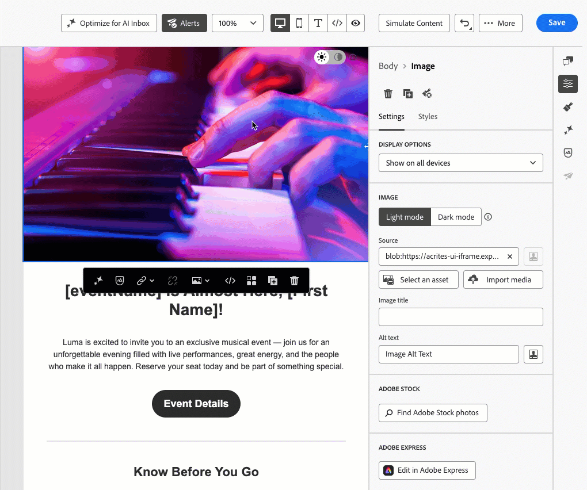

# 릴리스 정보 {#release-notes}

>[!CONTEXTUALHELP]
>id="ajo_homepage_card1"
>title="새로운 기능"
>abstract="**Adobe Journey Optimizer**&#x200B;는 지속적으로 새로운 기능, 기존 기능 개선 및 버그 해결을 지원합니다. 모든 변경 사항은 매달 마지막 주에 여기 있는 릴리스 정보에 통합됩니다."

[!DNL Adobe Journey Optimizer]은(는) 지속적 제공 모델을 따르므로 Adobe에서 새로운 기능, 개선 사항, 버그 해결 업데이트를 지속적으로 제공할 수 있습니다. 이 접근 방식을 사용하면 확장 가능한 단계별 기능 롤아웃을 통해 모든 환경에서 성능과 안정성을 보장할 수 있습니다.

이 모델로 인해 월별 릴리스 사이에 릴리스 정보가 업데이트됩니다. 릴리스 주기 및 가용성 단계에 대한 자세한 내용은 [Journey Optimizer 릴리스 주기](releases.md)를 참조하십시오.

[!DNL Adobe Journey Optimizer]은 기본적으로 [!DNL Adobe Experience Platform] 기반으로 빌드되었으며 최신 혁신 및 향상된 기능을 활용할 수 있습니다. 변경 사항에 대한 자세한 내용은 [Adobe Experience Platform 릴리스 정보](https://experienceleague.adobe.com/docs/experience-platform/release-notes/latest.html?lang=ko){target="_blank"}를 참조하십시오.

>[!NOTE]
>
>이 릴리스 정보에 나열된 기능에는 사용자의 환경에서 각 변경 사항에 액세스할 수 있는 시기를 나타내는 **사용 가능 날짜**&#x200B;가 포함됩니다. 이 페이지 하단에 있는 **곧 출시** 섹션에는 며칠 후에 릴리스될 예정인 기능 및 개선 사항이 나와 있습니다. 정보는 변경될 수 있습니다.

## 2026년 5월 릴리스 정보 {#may-26-rn}

### 새로운 기능 {#may-26-features}

다음 기능은 2026년 5월에 출시되었습니다.

<table>
<thead>
<tr>
<th><strong>콘텐츠 관리자 선택기</strong> </th>
</tr>
</thead>
<tbody>
<tr>
<td>

이제 Journey Optimizer에서는 Experience Manager Assets 및 콘텐츠 조각을 모두 선택하는 데 통합 모달인 <strong>콘텐츠 관리자 선택기</strong>를 사용합니다. 새 선택기는 모든 에셋에서 탐색, 검색 및 필터링을 지원하고, Dynamic Media 렌디션을 포함하며, 동적 에셋 사용 시 이미지 렌디션을 쉽게 추가할 수 있는 향상된 사용자 인터페이스 기능을 통합합니다.

이전에는 제한된 가용성으로 제공되었지만 이제 모든 환경에서 이 기능을 사용할 수 있습니다(일반 가용성).

자세한 내용은 <a href="../integrations/aem-content-advisor.md">세부 설명서</a>를 참조하십시오.

사용 가능한 날짜: 2026년 5월 19일

</td>
</tr>
</tbody>
</table>

<table>
<thead>
<tr>
<th><strong>여정 조각</strong> </th>
</tr>
</thead>
<tbody>
<tr>
<td>

이제 Adobe Journey Optimizer에서 <strong>여정 조각</strong>을 만들 수 있습니다. 여정 조각 은 한 번 빌드하고 샌드박스 전체의 여정에 드롭할 수 있는 재사용 가능한 여정 노드 세트입니다. 자격 확인, 기본 채널 라우팅 논리 또는 환영 시퀀스 중 어느 것이든 조각은 팀이 더 빨리 이동하고 일관성을 유지하는 데 도움이 됩니다. 매번 처음부터 동일한 논리를 다시 작성하지 않아도 됩니다.

조각이 만들어지면 전용 <strong>조각 인벤토리</strong>에 저장되고 <strong>여정 조각</strong> 활동을 사용하여 모든 여정에 삽입할 수 있습니다.

<!--

-->

이 기능은 일부 조직에서만 사용할 수 있습니다(제한된 가용성). 액세스 권한을 받으려면 Adobe 담당자에게 문의하십시오.

자세한 내용은 <a href="../building-journeys/journey-fragments.md">세부 설명서</a>를 참조하십시오.

사용 가능한 날짜: 2026년 5월 13일

</td>
</tr>
</tbody>
</table>

<table>
<thead>
<tr>
<th><strong>이메일 디자이너의 딥링크</strong> </th>
</tr>
</thead>
<tbody>
<tr>
<td>

이제 이메일 디자이너의 전용 옵션을 통해 이메일 콘텐츠에 딥링크를 추가할 수 있습니다.

이렇게 하면 사용자가 브라우저나 앱스토어로 리디렉션되지 않고 올바른 인앱 콘텐츠로 바로 이동하도록 하여 컨텍스트와 참여도를 유지할 수 있습니다.

자세한 내용은 <a href="../email/deeplinks.md">세부 설명서</a>를 참조하십시오.

사용 가능한 날짜: 2026년 5월 12일

</td>
</tr>
</tbody>
</table>

<table>
<thead>
<tr>
<th><strong>여정 시뮬레이션</strong> </th>
</tr>
</thead>
<tbody>
<tr>
<td>

이제 여정을 <strong>시뮬레이션</strong>으로 설정할 수 있습니다. 이 모드를 사용하면 <strong>시뮬레이션된 사용자</strong>를 사용하여 논리의 유효성을 검사할 수 있습니다. 시뮬레이션된 사용자는 시뮬레이션을 위해 특별히 생성된 임시 프로필로, Adobe Experience Platform에서 영구 테스트 프로필을 관리할 필요 없이 자유롭게 테스트할 수 있습니다.

이 기능은 기본 기능에만 제한된 가용성으로 모든 고객에게 제공됩니다.

자세한 내용은 <a href="../building-journeys/simulate-journey.md">세부 설명서</a>를 참조하십시오.

사용 가능한 날짜: 2026년 5월 5일

</td>
</tr>
</tbody>
</table>

<table>
<thead>
<tr>
<th><strong>의사 결정 규칙 및 등급 수식 AI 최적화</strong> </th>
</tr>
</thead>
<tbody>
<tr>
<td>

[!DNL Adobe Journey Optimizer] 이제 는 AI를 사용하여 의사 결정 규칙 및 간소화할 수 있는 등급 공식을 감지합니다. 인벤토리에서 AI가 최적화 기회를 식별한 모든 규칙에 빨간색 표시기가 나타납니다. 표시기를 클릭하면 AI가 제안하는 버전과 함께 원래 표현식이 표시됩니다. 여기에서 파일을 다운로드하여 시뮬레이트된 프로필이 각 버전별로 평가되는 방법을 검토하고 동일하게 동작하는지 확인한 다음 표현식을 최적화된 표현식으로 바꿀 수 있습니다.

자세한 내용은 <a href="../start/ai-features.md#decisioning-optimization">세부 설명서</a>를 참조하십시오.

사용 가능한 날짜: 2026년 5월 5일

</td>
</tr>
</tbody>
</table>

<table>
<thead>
<tr>
<th><strong>통합</strong> </th>
</tr>
</thead>
<tbody>
<tr>
<td>

<b>통합</b> 기능을 사용하면 타사 데이터 소스를 Adobe Journey Optimizer에 직접 연결할 수 있습니다. 외부 데이터 및 <b>구성 가능한 콘텐츠</b>를 가져오는 방법을 간소화하는 이 기능을 사용하면 모든 채널에서 개인화된 동적 메시지를 보다 쉽게 전달할 수 있습니다.

이전에 Beta로 릴리스된 이 기능은 이제 모든 환경에서 사용할 수 있습니다(일반 가용성).

자세한 내용은 <a href="../integrations/integrations.md">세부 설명서</a>를 참조하십시오.

사용 가능한 날짜: 2026년 5월 4일

</td>
</tr>
</tbody>
</table>

### 개선 사항 {#may-26-improv}

2026년 5월에도 다음과 같은 개선 사항이 릴리스되었습니다.

#### 결정

* **마이그레이션 워크플로 API 결정** - 종속성 분석 및 마이그레이션 워크플로를 만들기 위한 API 계약이 업데이트되었습니다. 요청 URL(`sandbox`, `offer` 또는 `decision`)에서 **`request-level`**&#x200B;을(를) **쿼리 매개 변수**(으)로 전달하십시오. 요청 수준은 더 이상 JSON 본문에 전송되지 않아야 합니다. [자세히 보기](../experience-decisioning/decisioning-migration-api.md)

  사용 가능한 날짜: 2026년 5월 6일

#### SMS

<!--
* **Opt-out and consent at phone number and sender** - For SMS, Journey Optimizer now records marketing consent and opt-out at the level of both the profile's phone number and short code. 

  This capability is currently only available for Sinch SMS configurations. [Read more](../sms/sms-configuration-sinch.md)
-->

* **문자 수** - Adobe Journey Optimizer에서 이제 문자 수 기능을 사용하여 SMS 메시지의 길이를 실시간으로 모니터링할 수 있습니다. 메시지가 여러 부분으로 나뉘는 시점을 파악하여 서식을 더 잘 관리하고 예상치 못한 전송 비용 증가를 방지하는 데 도움이 됩니다. [자세히 보기](../sms/create-sms.md)

* **사용자 정의 데이터 세트로의 SMS 인바운드** - **SMS API 자격 증명**&#x200B;에서 기본 추적 데이터 세트만 아니라, 선택한 **맞춤형 프로필 활성화 경험 이벤트 데이터 세트**&#x200B;로 **인바운드 SMS**&#x200B;를 라우팅합니다. [자세히 보기](../sms/sms-webhook.md)

* **Webhook 인터페이스 개선** - SMS Webhook을 구성할 때 사용자 인터페이스에 실용적인 예시가 포함된 기본 설정 가이드가 제공되어 구성 흐름을 벗어나지 않고도 공급자 페이로드를 정렬하고 문제를 쉽게 해결할 수 있습니다. [자세히 보기](../sms/sms-webhook.md)

#### WhatsApp

* **WhatsApp 단추 지원 및 추적** - WhatsApp 템플릿은 이제 **빠른 회신**, **Call to action - URL** 및 **Call to action - 전화**, **코드 복사**&#x200B;를 지원하지 않습니다. Journey Optimizer은 다른 채널 보고와 함께 지원되는 버튼을 전송하고 상호 작용을 추적합니다.

* **WhatsApp 채널 컨텍스트 데이터** - 이제 Journey Optimizer이 WhatsApp 채널에서 반환된 추가 상호 작용 데이터를 캡처하여 `whatsAppChannelContext` 필드 그룹 아래의 **AJO EmailTrackingExperienceEvent 데이터 세트**&#x200B;에 저장합니다.

  +++ 다음 필드가 캡처되며 대상자를 빌드하고 WhatsApp 참여를 분석하는 데 사용할 수 있습니다.

   * **`messageType`** - WhatsApp 메시지 유형(예: `templateBased`, `response`)
   * **`inboundMessage`** - 인바운드 회신 콘텐츠(예: `stop`, `start`, `subscribe`)
   * **`inboundNumber`** - 인바운드 메시지를 받은 보낸 사람 ID
   * **`channelType`** - 채널 범주(`Utility`, `Marketing` 또는 `Promotional`)
   * **`profileNumber`** - 인바운드 메시지를 받은 전화 번호
   * **`origTimestamp`** - Meta/WhatsApp의 원래 타임스탬프
   * **`status`** - 표준화된 공급자 피드백(`sent`, `delivered`, `bounce`, `error`, `delay`, `duplicate`, `denylist`, `exclude` 또는 `unknown`) 및 원시 공급자 상태 메시지를 포함하는 게재 상태
   * **`reactionEvent`** - 사용자 응답 내용: 반응을 위한 이모지 또는 특정 메시지에 대한 회신을 위한 메시지 텍스트
   * **`reactionMessageID`** - 응답 중인 원본 메시지의 ID
   * **`reactionActionName`** - 응답 작업 유형(`react`, `unreact` 또는 `reply`)
   * **`interactiveSelectedTitle`** - WhatsApp 대화형 메시지에서 사용자가 선택한 제목
   * **`interactiveType`** - 대화형 메시지 유형(`list reply`, `button reply` 또는 `button`)
   * **`interactiveSelectedDescription`** - 선택한 WhatsApp 대화형 옵션에 대한 설명
   * **`interactiveSelectedID`** - WhatsApp에서 선택한 옵션의 ID

  +++

## 곧 출시 예정 {#coming-soon}

다음 기능 및 개선 사항은 5월 말에 릴리스될 예정입니다. **이 정보는 변경될 수 있습니다**. 업데이트된 링크, 화면, 설명서는 업데이트가 프로덕션에서 제공될 때 공유 예정입니다.

### 새로운 기능 {#coming-soon-features}

<table>
<thead>
<tr>
<th><strong>여정 시뮬레이션</strong> </th>
</tr>
</thead>
<tbody>
<tr>
<td>

이제 여정을 <strong>시뮬레이션</strong>으로 설정할 수 있습니다. 이 모드를 사용하면 <strong>시뮬레이션된 사용자</strong>를 사용하여 논리의 유효성을 검사할 수 있습니다. 시뮬레이션된 사용자는 시뮬레이션을 위해 특별히 생성된 임시 프로필로, Adobe Experience Platform에서 영구 테스트 프로필을 관리할 필요 없이 자유롭게 테스트할 수 있습니다.

이전에 제한된 가용성으로 릴리스된 이 기능은 이제 모든 환경에서 사용할 수 있습니다(일반 가용성). 이제 일반 가용성 릴리스를 통해 Journey Agent을 사용하여 시뮬레이션 메뉴에서 직접 시뮬레이션된 사용자 및 이벤트를 생성할 수 있습니다.

사용 가능한 날짜: 2026년 5월 28일

</td>
</tr>
</tbody>
</table>

<table>
<thead>
<tr>
<th><strong>오케스트레이션된 캠페인을 위한 파일 기반 타기팅</strong> </th>
</tr>
</thead>
<tbody>
<tr>
<td>

이제 오케스트레이션된 캠페인은 파일을 Adobe Experience Platform에 먼저 수집하지 않고도 CSV 또는 TXT 파일을 타겟팅 대상자로 캠페인 캔버스에 직접 로드할 수 있습니다. 파일 데이터는 실행 시 사용되며 Adobe Experience Platform 데이터 세트로 지속되지 않습니다. 파일 설정 중에 열 매핑, 데이터 유형, NULL 처리 및 열별 오류 정책을 정의할 수 있습니다. 전체 수집 파이프라인 구축이 실용적이지 않은 임시 전송 또는 파트너 목록 캠페인을 지원합니다. 

이 기능은 일부 조직에서만 사용할 수 있습니다(제한된 가용성). 액세스 권한을 받으려면 Adobe 담당자에게 문의하십시오.

사용 가능한 날짜: 2026년 5월 28일

</td>
</tr>
</tbody>
</table>

### 개선 사항  {#coming-soon-improvements}

#### 내비게이션

* **여정 및 캠페인용 폴더** - 이제 인터페이스 탐색 및 관리를 개선하기 위해 여정 및 캠페인을 폴더로 구성할 수 있습니다.

  사용 가능한 날짜: 2026년 5월 21일

#### 오케스트레이션된 캠페인

* **데이터 보강 활동에 링크 추가** - 이제 데이터 보강 활동에서 오케스트레이션된 캠페인에 링크 추가 기능을 사용할 수 있습니다. 이를 통해 작업 테이블 데이터와 기존 데이터베이스 테이블 간에 직접적인 관계를 만들 수 있습니다.

  사용 가능한 날짜: 2026년 5월 26일

* **관계형 데이터에 대한 루프 기반 개인화** - 이제 개인화 편집기에서 주문, 계정 또는 예약과 같은 관계형 컬렉션을 반복하고 단일 전자 메일 또는 SMS 내에서 레코드당 하나의 콘텐츠 블록을 렌더링하는 루프 블록을 지원합니다. 컬렉션은 표현식 쓰기가 필요하지 않고 개인화 토큰을 사용하여 데이터 선택기를 통해 구성됩니다.

  사용 가능한 날짜: 2026년 5월 28일

#### 이메일

* **받는 사람 및 캠페인별로 전자 메일 보낸 사람 세부 정보 개인화** - 이제 오케스트레이션된 캠페인에서 프로필 특성 또는 관계 데이터를 사용하여 보낸 사람 이름, 보낸 사람 주소 및 회신 주소를 포함한 전자 메일 헤더 필드를 개인화할 수 있습니다. 이를 통해 보낸 사람의 세부 정보가 하나의 회사 주소를 통해 모든 전송을 라우팅하는 대신 각 받는 사람에 대한 관련 조언자, 위치 또는 분기를 반영할 수 있습니다.

  헤더 값은 채널 수준에서 설정할 수 있으며 보다 정밀한 제어를 위해 컨텍스트 데이터를 사용하여 캠페인별로 재정의할 수 있습니다.

  사용 가능한 날짜: 2026년 5월 29일

  &#x200B;#### 구성

* **일괄 처리 수집으로 이동하는 메시지 피드백 이벤트 데이터 집합** - `AJO Message Feedback Event Dataset`이(가) 스트리밍에서 일괄 처리 수집 모드로 전환됩니다. 이 변경 사항은 데이터 수집이 스트리밍 수집 제한을 초과하지 않도록 합니다. Customer Journey Analytics 보고서에서 이 데이터 세트를 사용하거나 이에 대한 쿼리를 실행하는 경우 향후 최대 2시간의 데이터 지연 증가가 예상됩니다.

  사용 가능한 날짜: 2026년 5월 29일
