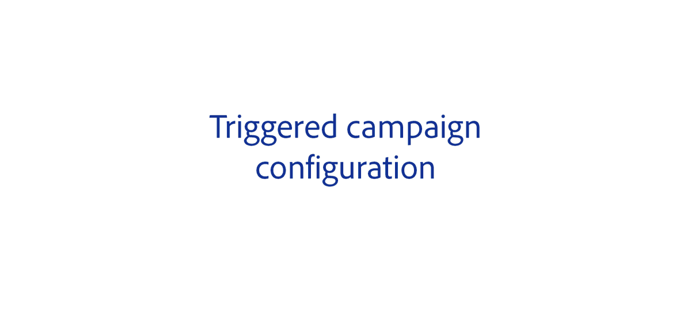
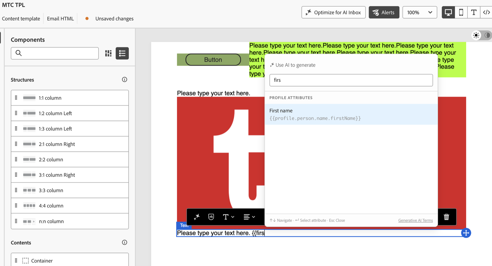

# 릴리스 정보 {#release-notes}

>[!CONTEXTUALHELP]
>id="ajo_homepage_card1"
>title="새로운 기능"
>abstract="**Adobe Journey Optimizer**&#x200B;는 지속적으로 새로운 기능, 기존 기능 개선 및 버그 해결을 지원합니다. 모든 변경 사항은 매달 마지막 주에 여기 있는 릴리스 정보에 통합됩니다."

[!DNL Adobe Journey Optimizer]은(는) 지속적 제공 모델을 따르므로 Adobe에서 새로운 기능, 개선 사항, 버그 해결 업데이트를 지속적으로 제공할 수 있습니다. 이 접근 방식을 사용하면 확장 가능한 단계별 기능 롤아웃을 통해 모든 환경에서 성능과 안정성을 보장할 수 있습니다. 이 모델로 인해 월별 릴리스 사이에 릴리스 정보가 업데이트됩니다. 릴리스 주기 및 가용성 단계에 대한 자세한 내용은 [Journey Optimizer 릴리스 주기](releases.md)를 참조하십시오.

[!DNL Adobe Journey Optimizer]은 기본적으로 [!DNL Adobe Experience Platform] 기반으로 빌드되었으며 최신 혁신 및 향상된 기능을 활용할 수 있습니다. 변경 사항에 대한 자세한 내용은 [Adobe Experience Platform 릴리스 정보](https://experienceleague.adobe.com/docs/experience-platform/release-notes/latest.html?lang=ko){target="_blank"}를 참조하십시오.

>[!NOTE]
>
>이 릴리스 정보에 나열된 기능에는 사용자의 환경에서 각 변경 사항에 액세스할 수 있는 시기를 나타내는 **사용 가능 날짜**&#x200B;가 포함됩니다. **곧 출시** 아코디언의 항목은 향후 며칠 또는 몇 주에 필요합니다. 이 섹션의 정보는 변경될 수 있습니다.

## 2026년 6월 업데이트 {#june-26-updates}

<table>
<thead>
<tr>
<th><strong>여정 시뮬레이션(일반 공급)</strong> </th>
</tr>
</thead>
<tbody>
<tr>
<td>

이제 여정을 시뮬레이션으로 설정할 수 있습니다. 이 모드에서는 시뮬레이션된 사용자를 사용하여 논리의 유효성을 검사할 수 있습니다. 시뮬레이션된 사용자는 시뮬레이션을 위해 특별히 생성된 임시 프로필로, Adobe Experience Platform에서 영구 테스트 프로필을 관리할 필요 없이 자유롭게 테스트할 수 있습니다. 

이전에 제한된 가용성으로 릴리스된 여정 시뮬레이션은 이제 모든 환경에서 사용할 수 있습니다. 이번 일반 가용성 릴리스를 통해 이제 Journey Agent을 사용하여 시뮬레이션 메뉴에서 직접 시뮬레이션된 사용자 및 이벤트를 생성할 수 있습니다.

자세한 내용은 <a href="../building-journeys/simulate-journey-gs.md">세부 설명서</a>를 참조하십시오.

사용 가능한 날짜: 2026년 6월 9일

</td>
</tr>
</tbody>
</table>

<table>
<thead>
<tr>
<th><strong>여정 경로 최적화 - 타깃팅(일반 가용성)</strong> </th>
</tr>
</thead>
<tbody>
<tr>
<td>

<strong>활동 최적화</strong>는 이제 대상 세그먼트 또는 프로필 특성에 따라 고객이 특정 여정 경로에 대해 자격을 부여하기 위해 충족해야 하는 특정 기준을 정의할 수 있는 <strong>타깃팅 규칙</strong>을 지원합니다.

고객을 경로에 무작위로 할당하는 실험과 달리 타깃팅에서는 결정론적 논리를 사용하여 적절한 대상 또는 고객 프로필이 의도한 경로로 라우팅되도록 합니다.

이전에 제한된 가용성으로 릴리스된 이 기능은 이제 모든 환경에서 사용할 수 있습니다(일반 가용성).

자세한 내용은 <a href="../building-journeys/path-targeting.md">세부 설명서</a>를 참조하십시오.

사용 가능한 날짜: 2026년 6월 8일

</td>
</tr>
</tbody>
</table>

<table>
<thead>
<tr>
<th><strong>여정 조각(일반 공급)</strong> </th>
</tr>
</thead>
<tbody>
<tr>
<td>

이제 Adobe Journey Optimizer에서 <strong>여정 조각</strong>을 만들 수 있습니다. 여정 조각 은 한 번 빌드하고 샌드박스 전체의 여정에 드롭할 수 있는 재사용 가능한 여정 노드 세트입니다. 자격 확인, 선호 채널 라우팅 논리 또는 환영 시퀀스 중 어느 것이든 조각은 팀이 매번 처음부터 동일한 논리를 다시 작성하지 않고도 더 빠르게 이동하고 일관성을 유지하는 데 도움이 됩니다.

조각이 만들어지면 전용 <strong>조각 인벤토리</strong>에 저장되고 <strong>여정 조각</strong> 활동을 사용하여 모든 여정에 삽입할 수 있습니다.

이전에는 제한적 가용성으로 제공되었지만, 이제 모든 고객이 이 기능을 일반적으로 사용할 수 있습니다. 여정 조각은 <strong>샌드박스 도구</strong>도 지원하므로 샌드박스 간에 조각을 패키징하고 내보낼 수 있습니다.

자세한 내용은 <a href="../building-journeys/journey-fragments.md">세부 설명서</a>를 참조하십시오.

사용 가능한 날짜: 2026년 6월 9일

</td>
</tr>
</tbody>
</table>

<table>
<thead>
<tr>
<th><strong>콘텐츠 변형 시뮬레이션 — 업데이트된 경험 및 AI 변형 생성</strong> </th>
</tr>
</thead>
<tbody>
<tr>
<td>

이제 <strong>콘텐츠 시뮬레이션</strong> 워크플로에서 두 가지 업데이트를 사용할 수 있습니다.

<ul>
<li><strong>새 기본 경로</strong> — <strong>콘텐츠 시뮬레이션</strong>을 클릭하면 기본적으로 <strong>콘텐츠 변형 시뮬레이션</strong> 경험이 열립니다. 단일 화면에서 수동으로 또는 CSV/JSON 파일에서 샘플 입력을 추가하고, 시뮬레이션된 사용자를 재사용하고, 렌더링을 미리 보고, 증명을 보낼 수 있습니다. Adobe Experience Platform 테스트 프로필로 미리 보거나 테스트 프로필 데이터로 증명을 보내거나 받은 편지함 렌더링 및 스팸 보고서를 확인하려면 <strong>콘텐츠 시뮬레이션</strong>을 클릭한 다음 드롭다운에서 <strong>콘텐츠 시뮬레이션(AEP 프로필)</strong>을 선택합니다.</li>
<li><strong>AI 생성 콘텐츠 변형</strong> — <strong>콘텐츠 변형 시뮬레이션</strong> 경험에서 <strong>생성</strong>을 클릭하여 AI를 사용하여 콘텐츠 변형을 자동으로 만듭니다. 시스템은 메시지를 분석하고, 개인화 필드 및 조건부 분기를 감지하고, 모든 변형을 직접 작성하지 않고도 렌더링의 유효성을 확인할 수 있도록 실제 값을 채웁니다.</li>
</ul>

자세한 내용은 <a href="../test-approve/simulate-sample-input.md">세부 설명서</a>를 참조하십시오.

사용 가능한 날짜: 2026년 6월 9일

</td>
</tr>
</tbody>
</table>

<table>
<thead>
<tr>
<th><strong>DM 채널에서의 의사 결정 지원</strong> </th>
</tr>
</thead>
<tbody>
<tr>
<td>

이제 DM 여정 및 캠페인에 의사 결정 정책을 추가할 수 있습니다. 의사 결정 정책은 의사 결정 엔진을 활용하여 각 대상 구성원에 대해 최상의 콘텐츠를 동적으로 반환하는 오퍼에 대한 컨테이너입니다. 또한 Dm Decisioning은 일괄 의사 결정 사용 사례를 지원하므로 주어진 Adobe Experience Platform 대상의 모든 프로필에 대해 해당 오퍼 항목을 내보낼 수 있습니다. 

자세한 내용은 <a href="../experience-decisioning/use-decision-policy.md">세부 설명서</a>를 참조하십시오.

사용 가능한 날짜: 2026년 6월 3일

</td>
</tr>
</tbody>
</table>

<table>
<thead>
<tr>
<th><strong>여정 표현식을 위한 AI 지원(공개 Beta)</strong> </th>
</tr>
</thead>
<tbody>
<tr>
<td>

이제 AI Assistant가 여정 고급 표현식 편집기에서 작동하여 자연어 프롬프트를 유효한 표현식과 조건부 논리로 변환합니다. 빌드할 표현식을 설명하고 AI Assistant는 즉시 적용하거나 후속 프롬프트를 통해 구체화할 수 있는 사용 준비 코드를 생성합니다.

이 기능은 모든 고객이 공용 Beta으로 사용할 수 있습니다.

자세한 내용은 <a href="../building-journeys/expression/expression-agent.md">세부 설명서</a>를 참조하십시오.

사용 가능한 날짜: 2026년 6월 3일
 
</td>
</tr>
</tbody>
</table>

* [!BADGE 중요]{type=Informative} **AJO 메시지 피드백 이벤트 데이터 세트가 일괄 처리 수집으로 이동** - **AJO 메시지 피드백 이벤트 데이터 세트**&#x200B;가 스트리밍 수집에서 일괄 처리 수집으로 이동하고 있습니다. 따라서 이 데이터 세트에 대해 최대 2시간의 데이터 지연이 예상됩니다. Customer Journey Analytics에서 보고서를 작성했거나 이 데이터 세트를 사용하여 쿼리를 실행하는 경우 앞으로 이러한 추가적인 지연 시간을 고려하십시오. [자세히 보기](../data/datasets-query-examples.md#message-feedback-event-dataset)

  사용 가능한 날짜: 2026년 6월 10일

* **반복되지 않는 대상 읽기 여정에 대한 자동 중지** - 이제 반복되지 않는 **대상 읽기** 여정은 마지막 활성 프로필이 종료되면 **중지됨** 상태로 자동 전환됩니다. 이전에는 프로필이 더 이상 전달되지 않는 경우에도 91일 글로벌 시간 제한이 만료될 때까지 이러한 여정이 **Live** 상태로 유지되었습니다. 이 개선 사항을 통해 여정 상태는 완료되는 즉시 실제 실행 상태를 반영하므로 수동 개입 없이 여정 인벤토리를 정확하게 유지할 수 있습니다.

  대기 노드, 반응 노드 또는 여정 트리거된 전환과 같이 대기 기간을 유발하는 노드를 포함하는 이벤트에는 이 동작이 적용되지 않습니다. 이러한 여정은 표준 91일 글로벌 시간 초과의 적용을 받습니다. [자세히 알아보기](../building-journeys/end-journey.md#auto-stop-non-recurring)

  사용 가능한 날짜: 2026년 6월 9일

* **사용자 지정 작업의 인증서 기반 사용자 지정 인증** - 이제 사용자 지정 작업에서 인증서 기반 사용자 지정 인증을 지원합니다. Journey Optimizer은 사용자 지정 인증 구성에 `subType: "certificateCredential"`을(를) 추가하여 Adobe의 관리 인증서를 사용하여 JWT 클라이언트 어설션에 서명하고 액세스 토큰으로 교환합니다. 클라이언트 암호는 필요하지 않습니다. Microsoft Entra ID와 같이 인증서 기반 ID 확인을 적용하는 엔터프라이즈 API용으로 설계되었습니다. [자세히 알아보기](../datasource/external-data-sources.md#certificate-credential)

  사용 가능한 날짜: 2026년 6월 4일

* **캠페인 라이프사이클 이벤트에 대한 고객 알림** - 이제 새로운 시스템 알림이 작업 및 API 트리거 캠페인에 대한 주요 라이프사이클 이벤트를 알려줍니다. 샌드박스 수준에서 가입합니다. [자세히 보기](../reports/alerts.md)

  사용 가능한 날짜: 2026년 6월 1일

* **URL 매개 변수 암호화** - 이제 전자 메일 메시지에 추가된 추적 및 랜딩 페이지 링크에서 URL 매개 변수를 암호화할 수 있습니다. 이렇게 하면 중요한 매개 변수 데이터에 대한 추가 보안 계층을 제공할 수 있습니다. 이전에 제한된 가용성으로 릴리스된 이 기능은 이제 모든 환경에서 사용할 수 있습니다(일반 가용성). [자세히 보기](../personalization/url-parameter-encryption.md)

  사용 가능한 날짜: 2026년 6월 1일

* **키 레지스트리에 대한 새 권한** - 이제 URL 매개 변수 암호화에 필요한 키에 액세스하고 관리하는 데 두 개의 새 권한이 필요합니다. **키 레지스트리 관리** 및 **키 레지스트리 보기**. [자세히 보기](../administration/high-low-permissions.md#administration-permissions)

  사용 가능한 날짜: 2026년 6월 1일

* **외부 대상에 대한 보조 식별자 지원** - 이제 CSV 파일에서 가져온 대상과 Federated Audience Composition으로 만든 대상을 포함하여 외부 대상에 대해 여정의 보조 식별자가 지원됩니다. 대상자의 모든 비ID 속성 또는 비개인 ID 속성을 보조 ID로 지정할 수 있으며, 스키마 레이블 지정은 필요하지 않습니다. [자세히 보기](../building-journeys/supplemental-identifier.md)

  사용 가능한 날짜: 2026년 6월 11일

<!--
+++ Coming soon — **Information below is subject to change.**

* **Override the default execution field in campaigns** - Previously available at the journey level, you can now override the default execution field set globally for your Email, SMS and WhatsApp deliveries in the campaign parameters.

  Availability date: Early June, 2026

+++
-->

## 2026년 5월 릴리스 정보 {#may-26-rn}

### 여정 {#may-26-journeys}

이 릴리스의 여정에 다음과 같은 기능 및 개선 사항이 추가되었습니다. 향후 며칠 또는 몇 주 이내에 추가 변경 사항이 있을 것으로 예상됩니다.

<table>
<thead>
<tr>
<th><strong>여정 조각(제한된 가용성)</strong> </th>
</tr>
</thead>
<tbody>
<tr>
<td>

이제 Adobe Journey Optimizer에서 <strong>여정 조각</strong>을 만들 수 있습니다. 여정 조각 은 한 번 빌드하고 샌드박스 전체의 여정에 드롭할 수 있는 재사용 가능한 여정 노드 세트입니다. 자격 확인, 선호 채널 라우팅 논리 또는 환영 시퀀스 중 어느 것이든 조각은 팀이 매번 처음부터 동일한 논리를 다시 작성하지 않고도 더 빠르게 이동하고 일관성을 유지하는 데 도움이 됩니다.

조각이 만들어지면 전용 <strong>조각 인벤토리</strong>에 저장되고 <strong>여정 조각</strong> 활동을 사용하여 모든 여정에 삽입할 수 있습니다.

<!--

-->

이 기능은 일부 조직에서만 사용할 수 있습니다(제한된 가용성). 액세스 권한을 받으려면 Adobe 담당자에게 문의하십시오.

자세한 내용은 <a href="../building-journeys/journey-fragments.md">세부 설명서</a>를 참조하십시오.

사용 가능한 날짜: 2026년 5월 13일

</td>
</tr>
</tbody>
</table>

<table>
<thead>
<tr>
<th><strong>여정 시뮬레이션(제한된 가용성)</strong> </th>
</tr>
</thead>
<tbody>
<tr>
<td>

이제 여정을 <strong>시뮬레이션</strong>으로 설정할 수 있습니다. 이 모드를 사용하면 <strong>시뮬레이션된 사용자</strong>를 사용하여 논리의 유효성을 검사할 수 있습니다. 시뮬레이션된 사용자는 시뮬레이션을 위해 특별히 생성된 임시 프로필로, Adobe Experience Platform에서 영구 테스트 프로필을 관리할 필요 없이 자유롭게 테스트할 수 있습니다.

이 기능은 기본 기능에만 제한된 가용성으로 모든 고객에게 제공됩니다.

자세한 내용은 <a href="../building-journeys/simulate-journey.md">세부 설명서</a>를 참조하십시오.

사용 가능한 날짜: 2026년 5월 5일

</td>
</tr>
</tbody>
</table>

<!--
<table>
<thead>
<tr>
<th><strong>Journey path optimization – Targeting (General Availability)</strong> </th>
</tr>
</thead>
<tbody>
<tr>
<td>

Use the new <strong>Optimize</strong> node to target specific audiences to determine the best path to meet your business-centric KPIs.

This tool allows you to develop more effective marketing campaigns that are more likely to resonate at the 1:1 level, improve marketing personalization efforts for customers and enhance critical customer engagement KPIs, such as conversions and revenue.

Previously available in Limited Availability, this capability is now available to all environments.

Availability date: June 1, 2026

</td>
</tr>
</tbody>
</table>

<table>
<thead>
<tr>
<th><strong>Journey Arbitration – ranking formulas (General Availability)</strong> </th>
</tr>
</thead>
<tbody>
<tr>
<td>

You can now use formulas to automatically boost journey priority scores based on customer profile attributes and contextual factors, ensuring customers enter the most relevant journeys.

Previously available in Limited Availability, this capability is now available to all environments.

Availability date: June 1, 2026

</td>
</tr>
</tbody>
</table>
-->

### 오케스트레이션된 캠페인 {#may-26-oc}

이 릴리스의 오케스트레이션된 캠페인에 다음과 같은 기능 및 개선 사항이 추가되었습니다. 향후 며칠 또는 몇 주 이내에 추가 변경 사항이 있을 것으로 예상됩니다.

<table>
<thead>
<tr>
<th><strong>연결된 오케스트레이션된 캠페인</strong> </th>
</tr>
</thead>
<tbody>
<tr>
<td>

이제 오케스트레이션된 다른 캠페인의 <strong>종료 활동</strong>에서 오케스트레이션된 캠페인을 직접 트리거하여 오케스트레이션된 캠페인을 함께 연결할 수 있습니다.

이렇게 하면 복잡한 오케스트레이션 논리를 매번 다시 빌드되지 않고 여러 상위 캠페인에서 호출할 수 있는 더 작고 재사용 가능한 흐름으로 나눌 수 있습니다. 런타임 시 전달된 페이로드는 다운스트림 캠페인의 세분화 및 개인화에 사용할 수 있으므로 연결된 각 캠페인은 받은 컨텍스트를 기반으로 작동할 수 있습니다.

자세한 내용은 <a href="../orchestrated/trigger-orchestrated-campaign.md#signal-end">세부 설명서</a>를 참조하십시오.

사용 가능한 날짜: 2026년 5월 20일

</td>
</tr>
</tbody>
</table>

* **데이터 보강 활동에 링크 추가** - 이제 데이터 보강 활동에서 오케스트레이션된 캠페인에 링크 추가 기능을 사용할 수 있습니다. 이를 통해 작업 테이블 데이터와 기존 데이터베이스 테이블 간에 직접적인 관계를 만들 수 있습니다.

  사용 가능한 날짜: 2026년 5월 20일

<!--
+++ Coming soon — **Information below is subject to change.**

The following orchestrated campaign capability is expected in the upcoming days or weeks.

<table>
<thead>
<tr>
<th><strong>File-based targeting for orchestrated campaigns (Limited Availability)</strong> </th>
</tr>
</thead>
<tbody>
<tr>
<td>

Orchestrated campaigns now support loading a CSV or TXT file directly into the campaign canvas as the targeting audience, without first ingesting the file into Adobe Experience Platform. The file data is consumed at execution time and is not persisted as an Adobe Experience Platform dataset. During file setup, you can define column mappings, data types, NULL handling, and per-column error policies. This supports ad-hoc sends or partner list campaigns where building a full ingestion pipeline is not practical.

This capability is only available for a set of organizations (Limited Availability). To gain access, contact your Adobe representative.

Availability date: June 1, 2026

</td>
</tr>
</tbody>
</table>

* **Loop-based personalization for relational data** - The personalization editor now supports a Loop block that iterates over relational collections, such as orders, accounts, or bookings, and renders one content block per record inside a single email or SMS. Collections are configured through the data picker using personalization tokens, with no expression writing required.

  Availability date: Early June, 2026

* **Personalize email sender details per recipient and campaign** - Orchestrated campaigns now support personalization of email header fields, including From name, From address, and Reply-To, using profile attributes or relational data. This allows sender details to reflect the relevant advisor, location, or branch for each recipient, rather than routing all sends through a single corporate address.

  Header values can be set at the channel level and overridden per campaign using contextual data for more precise control.

  Availability date: Early June, 2026

+++
-->

### 결정 {#may-26-decisioning}

이 릴리스의 Decisioning에 다음과 같은 기능 및 개선 사항이 추가되었습니다. 향후 며칠 또는 몇 주 이내에 추가 변경 사항이 있을 것으로 예상됩니다.

<table>
<thead>
<tr>
<th><strong>의사 결정 규칙 및 등급 수식 AI 최적화</strong> </th>
</tr>
</thead>
<tbody>
<tr>
<td>

[!DNL Adobe Journey Optimizer] 이제 는 AI를 사용하여 의사 결정 규칙 및 간소화할 수 있는 등급 공식을 감지합니다. 인벤토리에서 AI가 최적화 기회를 식별한 모든 규칙에 빨간색 표시기가 나타납니다. 표시기를 클릭하면 AI가 제안하는 버전과 함께 원래 표현식이 표시됩니다. 여기에서 파일을 다운로드하여 시뮬레이트된 프로필이 각 버전별로 평가되는 방법을 검토하고 동일하게 동작하는지 확인한 다음 표현식을 최적화된 표현식으로 바꿀 수 있습니다.

자세한 내용은 <a href="../start/ai-features.md#decisioning-optimization">세부 설명서</a>를 참조하십시오.

사용 가능한 날짜: 2026년 5월 5일

</td>
</tr>
</tbody>
</table>

* **Decisioning의 Adobe Experience Manager 콘텐츠 조각** - 이제 Adobe Experience Manager 콘텐츠 조각을 Decisioning의 의사 결정 항목에 매핑하고 의사 결정 정책 내에서 활용하여 적절한 시기에 적절한 고객에게 적절한 조각을 전달할 수 있습니다. [자세히 보기](../integrations/aem-fragments.md#aem-decisioning)

  이 기능은 일부 조직에서만 사용할 수 있습니다(제한된 가용성). 액세스 권한을 받으려면 Adobe 담당자에게 문의하십시오.

  사용 가능한 날짜: 2026년 5월 20일

* **캠페인 요약의 의사 결정 정책 세부 정보** - 이제 캠페인 요약 페이지에서 캠페인을 복제하거나 편집하지 않고도 각 의사 결정 정책의 전체 구조(선택 전략, 의사 결정 항목 및 대체 오퍼 등)를 검토할 수 있습니다. Adobe 지원 또는 엔지니어링 팀과 함께 문제를 해결하기 위해 JSON 요약을 클립보드에 복사할 수도 있습니다. [자세히 보기](../experience-decisioning/use-decision-policy.md#decision-policy-summary)

  사용 가능한 날짜: 2026년 5월 20일

* **마이그레이션 워크플로 API 결정** - 종속성 분석 및 마이그레이션 워크플로를 만들기 위한 API 계약이 업데이트되었습니다. 요청 URL(`sandbox`, `offer` 또는 `decision`)에서 **`request-level`**&#x200B;을(를) **쿼리 매개 변수**(으)로 전달하십시오. 요청 수준은 더 이상 JSON 본문에 전송되지 않아야 합니다. [자세히 보기](../experience-decisioning/decisioning-migration-api.md)

  사용 가능한 날짜: 2026년 5월 6일

### 이메일 채널 {#may-26-email}

이 릴리스의 이메일 채널에 다음과 같은 기능 및 개선 사항이 추가되었습니다. 향후 며칠 또는 몇 주 이내에 추가 변경 사항이 있을 것으로 예상됩니다.

<table>
<thead>
<tr>
<th><strong>이메일 Designer의 딥링크</strong> </th>
</tr>
</thead>
<tbody>
<tr>
<td>

이제 이메일 Designer의 전용 옵션을 통해 이메일 콘텐츠에 딥 링크를 추가할 수 있습니다. 이렇게 하면 사용자가 브라우저나 앱스토어로 리디렉션되지 않고 올바른 인앱 콘텐츠로 바로 이동하도록 하여 컨텍스트와 참여도를 유지할 수 있습니다.

모든 고객이 딥링크 옵션을 사용할 수 있지만 딥링크는 필수 구성 및 모바일 앱 구현 단계를 완료한 경우에만 작동합니다.

자세한 내용은 <a href="../email/deeplinks.md">세부 설명서</a>를 참조하십시오.

사용 가능한 날짜: 2026년 5월 12일

</td>
</tr>
</tbody>
</table>

* **조각에서 상속 나누기 제한** - 이제 조각을 만들거나 편집할 때 전자 메일에서 사용할 때 수정할 수 있는지 여부를 선택할 수 있습니다. 조각을 잠그면 나타나는 모든 곳에서 동기화를 유지하여 브랜드 표준이나 규정 준수 요구 사항을 위반할 수 있는 로컬 편집을 방지할 수 있습니다. 이 설정은 나중에 업데이트하여 향후 사용에 적용할 수 있습니다. [자세히 보기](../content-management/create-fragments.md#lock-visual-fragment)

  사용 가능한 날짜: 2026년 5월 21일

### 모바일 메시지(SMS, MMS 및 RCS) {#may-26-mobile}

이 릴리스의 모바일 메시지에 다음과 같은 기능 및 개선 사항이 추가되었습니다.

<table>
<thead>
<tr>
<th><strong>새로운 모바일 메시지 채널 및 향상된 RCS 메시지</strong> </th>
</tr>
</thead>
<tbody>
<tr>
<td>

이제 Adobe Journey Optimizer의 단일 <strong>모바일 메시지</strong> 작업에 따라 SMS, MMS 및 RCS가 통합되므로 한 곳에서 모든 모바일 메시지 유형을 보다 쉽게 관리할 수 있습니다. 이 업데이트의 일부로, 이제 새로운 기본 작성 환경을 통해 Journey Optimizer에서 직접 이미지, 회전 메뉴 및 제안 작업 등 리치 미디어 RCS 메시지를 작성할 수 있습니다.

자세한 내용은 <a href="../mobile/get-started-mobile.md">세부 설명서</a>를 참조하십시오.

사용 가능한 날짜: 2026년 5월 20일

</td>
</tr>
</tbody>
</table>

* **문자 수** - Adobe Journey Optimizer에서 이제 문자 수 기능을 사용하여 SMS 메시지의 길이를 실시간으로 모니터링할 수 있습니다. 메시지가 여러 부분으로 나뉘는 시점을 파악하여 서식을 더 잘 관리하고 예상치 못한 전송 비용 증가를 방지하는 데 도움이 됩니다. [자세히 보기](../mobile/create-mobile-message.md)

* **사용자 정의 데이터 세트로의 SMS 인바운드** - **SMS API 자격 증명**&#x200B;에서 기본 추적 데이터 세트만 아니라, 선택한 **맞춤형 프로필 활성화 경험 이벤트 데이터 세트**&#x200B;로 **인바운드 SMS**&#x200B;를 라우팅합니다. [자세히 보기](../mobile/mobile-webhook.md)

* **Webhook 인터페이스 개선** - SMS Webhook을 구성할 때 사용자 인터페이스에 실용적인 예시가 포함된 기본 설정 가이드가 제공되어 구성 흐름을 벗어나지 않고도 공급자 페이로드를 정렬하고 문제를 쉽게 해결할 수 있습니다. [자세히 보기](../mobile/mobile-webhook.md)

* **SMS 콘텐츠의 딥링크** - 이제 URL 도우미 기능을 사용하여 SMS 콘텐츠에 딥링크를 추가할 수 있습니다. 이렇게 하면 필요한 구성 및 모바일 앱 구현 단계를 완료한 경우 수신자가 웹 브라우저나 앱스토어를 통해 라우팅되지 않고 의도한 인앱 컨텐츠로 직접 이동하는지 확인할 수 있습니다. [자세히 보기](../email/deeplinks.md)

### WhatsApp 채널 {#may-26-whatsapp}

이 릴리스의 WhatsApp 채널에 다음과 같은 개선 사항이 추가되었습니다.

* **WhatsApp 단추 지원 및 추적** - WhatsApp 템플릿은 이제 **빠른 회신**, **Call to action - URL** 및 **Call to action - 전화**, **코드 복사**&#x200B;를 지원하지 않습니다. Journey Optimizer은 다른 채널 보고와 함께 지원되는 버튼을 전송하고 상호 작용을 추적합니다.

* **WhatsApp 채널 컨텍스트 데이터** - 이제 Journey Optimizer이 WhatsApp 채널에서 반환된 추가 상호 작용 데이터를 캡처하여 `whatsAppChannelContext` 필드 그룹 아래의 **AJO EmailTrackingExperienceEvent 데이터 세트**&#x200B;에 저장합니다. [자세히 보기](../whatsapp/send-whatsapp.md#whatsapp-channel-context)

  +++ 다음 필드가 캡처되며 대상자를 빌드하고 WhatsApp 참여를 분석하는 데 사용할 수 있습니다.

   * **`messageType`** - WhatsApp 메시지 유형(예: `templateBased`, `response`)
   * **`inboundMessage`** - 인바운드 회신 콘텐츠(예: `stop`, `start`, `subscribe`)
   * **`inboundNumber`** - 인바운드 메시지를 받은 보낸 사람 ID
   * **`channelType`** - 채널 범주(`Utility`, `Marketing` 또는 `Promotional`)
   * **`profileNumber`** - 인바운드 메시지를 받은 전화 번호
   * **`origTimestamp`** - Meta/WhatsApp의 원래 타임스탬프
   * **`status`** - 표준화된 공급자 피드백(`sent`, `delivered`, `bounce`, `error`, `delay`, `duplicate`, `denylist`, `exclude` 또는 `unknown`) 및 원시 공급자 상태 메시지를 포함하는 게재 상태
   * **`reactionEvent`** - 사용자 응답 내용: 반응을 위한 이모지 또는 특정 메시지에 대한 회신을 위한 메시지 텍스트
   * **`reactionMessageID`** - 응답 중인 원본 메시지의 ID
   * **`reactionActionName`** - 응답 작업 유형(`react`, `unreact` 또는 `reply`)
   * **`interactiveSelectedTitle`** - WhatsApp 대화형 메시지에서 사용자가 선택한 제목
   * **`interactiveType`** - 대화형 메시지 유형(`list reply`, `button reply` 또는 `button`)
   * **`interactiveSelectedDescription`** - 선택한 WhatsApp 대화형 옵션에 대한 설명
   * **`interactiveSelectedID`** - WhatsApp에서 선택한 옵션의 ID

  +++

### 컨텐츠 및 통합 {#may-26-content}

이 릴리스의 콘텐츠 관리 및 통합에 다음과 같은 기능 및 개선 사항이 추가되었습니다.

<table>
<thead>
<tr>
<th><strong>콘텐츠 관리자 선택기</strong> </th>
</tr>
</thead>
<tbody>
<tr>
<td>

이제 Journey Optimizer에서는 Experience Manager Assets 및 콘텐츠 조각을 모두 선택하는 데 통합 모달인 <strong>콘텐츠 관리자 선택기</strong>를 사용합니다. 새 선택기에는 다음이 포함됩니다.

<ul>
<li><strong>모든 에셋 및 조각에서 </strong>을(를) 탐색, 검색 및 필터링합니다.</li>
<li><strong>AI 의미 체계 검색</strong>: 텍스트만 일치하는 것이 아니라 의미와 콘텐츠를 기반으로 컨텍스트에 맞는 에셋을 표시하기 위해 필요한 것을 일반 언어로 설명합니다(예: "산에 있는 커피"). 다국어 쿼리도 지원됩니다.</li>
<li><strong>간단한 업로드</strong>: 마케팅 개요를 업로드하여 콘텐츠 및 요구 사항에 따라 캠페인 컨텍스트에 맞는 에셋을 자동으로 표시합니다.</li>
<li><strong>Dynamic Media 렌디션</strong>: 선택기에서 나가지 않고 dynamic assets에 대한 이미지 렌디션을 선택하여 적용합니다.</li>
</ul>

자세한 내용은 <a href="../integrations/aem-content-advisor.md">세부 설명서</a>를 참조하십시오.

사용 가능한 날짜: 2026년 5월 19일

</td>
</tr>
</tbody>
</table>

<table>
<thead>
<tr>
<th><strong>통합</strong> </th>
</tr>
</thead>
<tbody>
<tr>
<td>

<b>통합</b> 기능을 사용하면 타사 데이터 소스를 Adobe Journey Optimizer에 직접 연결할 수 있습니다. 외부 데이터 및 <b>구성 가능한 콘텐츠</b>를 가져오는 방법을 간소화하는 이 기능을 사용하면 모든 채널에서 개인화된 동적 메시지를 보다 쉽게 전달할 수 있습니다.

이전에 Beta로 릴리스된 이 기능은 이제 모든 환경에서 사용할 수 있습니다(일반 가용성).

자세한 내용은 <a href="../integrations/integrations.md">세부 설명서</a>를 참조하십시오.

사용 가능한 날짜: 2026년 5월 4일

</td>
</tr>
</tbody>
</table>

* **Assets 선택기에서 조직 간 저장소 액세스** - 이제 Adobe Experience Manager 자산 선택기 내에서 바로 여러 조직의 저장소에서 자산을 원활하게 선택할 수 있습니다.

<!--
+++ Coming soon — **Information below is subject to change.**

* **Message Feedback Event Dataset moving to batch ingestion** - The `AJO Message Feedback Event Dataset` is transitioning from streaming to batch ingestion mode. This change ensures that data ingestion does not exceed streaming ingestion limits. If you use this dataset in Customer Journey Analytics reports or run queries against it, expect an increase in data latency of up to 2 hours going forward.

  Availability date: June 1, 2026

+++
-->

### 유용성 개선 {#may-26-usability}

다음과 같은 사용성 개선 사항이 2026년 5월에 함께 릴리스되었습니다.

#### 목록

* **일괄 작업** - 이제 **캠페인**, **조각** 및 **템플릿** 목록에서 한 번에 여러 항목을 선택하고, 패키지에 항목 추가, 폴더로 이동, 태그 편집, 액세스 관리 및 보관 또는 삭제를 포함하여 단일 작업 표시줄에서 일괄 작업을 수행할 수 있습니다. [자세히 알아보기](../start/search-filter-categorize.md#bulk-actions)

  

* **정렬 및 열 크기 조정** - **캠페인**, **조각** 및 **템플릿** 목록은 이제 열 머리글을 클릭하여 정렬을 지원합니다. 캠페인 폴더 보기에서 **[!UICONTROL 우선 순위]** 및 **[!UICONTROL 채널 구성]**&#x200B;을 기준으로 정렬 및 필터링할 수도 있습니다. **조각** 및 **템플릿** 목록의 열 너비도 크기 조정할 수 있습니다. 가장 중요한 데이터에 맞게 열 테두리를 끌어서 놓으십시오. [자세히 알아보기](../start/search-filter-categorize.md#filter-lists)

#### 컨텐츠 작성

* **인라인 프로필 특성 편집** - 이메일 Designer의 인라인 프로필 특성 편집은 4월에 처음 릴리스되었습니다. 5월 릴리스의 일부로 이 기능은 AI Assistant에서 분리되고 푸시 채널 편집기로 확장되었습니다. [자세히 알아보기](../personalization/personalize.md#inline-personalization)

  

* **푸시 채널 편집기의 링크 URL 툴팁** - 링크 또는 미디어 필드의 URL이 너무 길어 표시할 수 없는 경우 필드 옆에 툴팁 아이콘이 항상 표시됩니다. 마우스를 필드 위로 가져가면 전체 URL이 표시됩니다. [자세히 알아보기](../push/design-push.md#on-click-behavior)

  

<!--
#### Simulation & Preview

* **Redesigned preview experience** - The content preview screen has been redesigned with a side-by-side layout that lets you compare how your content renders across multiple profiles at a glance, enabling quicker and more confident reviews before sending. [Learn more](../test-approve/simulate-sample-input.md#preview)

  
-->

<!--
+++ Coming soon — **Information below is subject to change.**

* **Folders for journeys and campaigns** - You can now organize your journeys and campaigns into folders to improve navigation and management in the interface.

  Availability date: Early June, 2026

+++
-->

