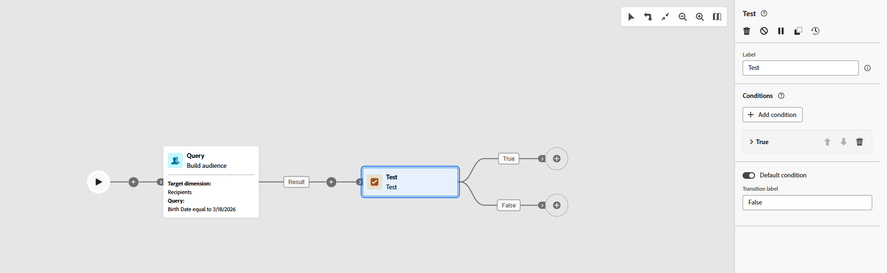

# 릴리스 정보 {#release-notes}

>[!CONTEXTUALHELP]
>id="ajo_homepage_card1"
>title="새로운 기능"
>abstract="**Adobe Journey Optimizer**&#x200B;는 지속적으로 새로운 기능, 기존 기능 개선 및 버그 해결을 지원합니다. 모든 변경 사항은 매달 마지막 주에 여기 있는 릴리스 정보에 통합됩니다."

[!DNL Adobe Journey Optimizer]은(는) 지속적인 게재 모델을 따르므로 Adobe은 새로운 기능, 개선 사항 및 수정 사항을 지속적으로 제공할 수 있습니다. 이 접근 방식을 사용하면 확장 가능한 단계별 기능 롤아웃을 통해 모든 환경에서 성능과 안정성을 보장할 수 있습니다.

이 모델로 인해 월별 릴리스 사이에 릴리스 정보가 업데이트됩니다. 릴리스 주기 및 가용성 단계에 대한 자세한 내용은 [Journey Optimizer 릴리스 주기](releases.md)를 참조하십시오.

[!DNL Adobe Journey Optimizer]은 기본적으로 [!DNL Adobe Experience Platform] 기반으로 빌드되었으며 최신 혁신 및 향상된 기능을 활용할 수 있습니다. 변경 사항에 대한 자세한 내용은 [Adobe Experience Platform 릴리스 정보](https://experienceleague.adobe.com/docs/experience-platform/release-notes/latest.html?lang=ko){target="_blank"}를 참조하십시오.

## 2026년 4월 업데이트 {#april-26-rn}

### 새로운 기능 {#april-26-features}

<table>
<thead>
<tr>
<th><strong>받은 편지함</strong> </th>
</tr>
</thead>
<tbody>
<tr>
<td>

<strong>받은 편지함</strong>은(는) 콘텐츠 카드에서 사용할 수 있는 모바일 기능으로, 이를 통해 고객은 앱 또는 웹 사이트 내에서 중앙 위치를 만들어 사용자에게 보낸 메시지를 표시할 수 있습니다. 따라서 메시지가 종료된 후에도 계속 액세스할 수 있도록 보장함으로써 마케팅 커뮤니케이션의 수명을 연장할 수 있습니다.

자세한 내용은 <a href="../inbox/inbox-gs.md">세부 설명서</a>를 참조하십시오.

가용성 일자: 2026년 4월 7일 수요일

</td>
</tr>
</tbody>
</table>

<table>
<thead>
<tr>
<th><strong>AI 받은 편지함에 대한 이메일 텍스트 최적화</strong> </th>
</tr>
</thead>
<tbody>
<tr>
<td>

이제 Adobe Journey Optimizer에는 Gmail의 Apple Intelligence 및 Google Gemini와 같은 AI 기반 받은 편지함에 대해 이메일이 최적으로 구성되도록 하는 새로운 기능이 포함됩니다.

AI 어시스턴트가 수신자가 이메일을 읽고 행동하는 방법을 점점 더 제어하므로 이 기능은 요약, 분류, 우선 순위 지정 및 의도 추출을 비롯한 다운스트림 AI 작업에서 잘 수행되는 콘텐츠를 작성하는 데 도움이 됩니다.

자세한 내용은 <a href="../content-management/llm-email-optimizer.md">세부 설명서</a>를 참조하십시오.

가용성 일자: 2026년 4월 3일 토요일

</td>
</tr>
</tbody>
</table>

<table>
<thead>
<tr>
<th><strong>이메일 채널에서 의사 결정 지원</strong> </th>
</tr>
</thead>
<tbody>
<tr>
<td>

이제 <strong>의사 결정</strong>을 사용하여 전자 메일 메시지의 콘텐츠를 개인화하고 최적화할 수 있습니다. 우선 순위 점수, 공식 또는 AI 모델을 활용하여 각 수신자에게 가장 관련성이 높은 오퍼와 콘텐츠를 표시합니다.

이전에 제한된 가용성으로 릴리스된 이 기능은 이제 모든 환경에서 사용할 수 있습니다(일반 가용성). 이번 GA 릴리스에서는 미러 페이지가 지원됩니다.

자세한 내용은 <a href="../experience-decisioning/create-decision-policy.md">세부 설명서</a>를 참조하십시오.

가용성 일자: 2026년 4월 6일 화요일

</td>
</tr>
</tbody>
</table>

### 개선 사항 {#april-26-improv}

#### Adobe Experience Manager 통합

<!--* **Adobe Experience Manager Content Fragment context while authoring** - Your Content Fragment selection stays active as you move between text fields and content blocks, so you can add more fragment fields without reopening **Open AEM Content advisor** each time. [Read more](../integrations/aem-fragments.md)

  Availability date: April 1, 2026-->

* **Adobe Experience Manager 콘텐츠 조각 변형 지원** - 로케일 및 다국어 시나리오에 대한 개선된 처리로 Adobe Experience Manager 콘텐츠 조각을 삽입할 때 **콘텐츠 조각 변형**(예: 언어 또는 채널 변형)을 선택할 수 있습니다. [자세히 보기](../integrations/aem-fragments.md#aem-variations)

  가용성 일자: 2026년 4월 3일 토요일

## 2026년 3월 릴리스 정보 {#march-26-rn}

[새 기능](#march-26-features) 및 [개선 사항](#march-26-improv) 섹션에서는 이미 사용 가능한 기능을 다룹니다. [준비 중](#coming-soon) 섹션에는 3월 말에 릴리스될 예정인 기능 및 개선 사항이 나와 있습니다.

<!--
**The pre-release notes below are subject to change without prior notice until the release availability date**. Links, screens and updated documentation are published in the release notes, at the release date.

See also [Adobe Experience Platform pre-release notes](https://experienceleague.adobe.com/ko/docs/experience-platform/release-notes/pre-release-notes){target="_blank"}.-->

**릴리스 날짜**: 2026년 3월 24~25일

### 새로운 기능 {#march-26-features}

<table>
<thead>
<tr>
<th><strong>URL 매개 변수 암호화</strong> </th>
</tr>
</thead>
<tbody>
<tr>
<td>

이제 이메일 메시지에 추가된 추적 및 랜딩 페이지 링크의 URL 매개 변수를 암호화할 수 있으므로, 중요한 매개 변수 데이터에 대한 추가 보안 계층을 제공합니다.

<ul>
<li>전용 <strong>관리</strong> 레지스트리에서 암호화 키를 등록 및 관리합니다.</li>
<li>표현식에 새로운 'Encrypt' 도우미 함수를 사용하여 렌더링 시 보호하려는 쿼리 매개변수에 대한 URL의 중요 데이터를 암호화합니다.</li>
</ul>

이 기능은 일부 조직에서만 사용할 수 있습니다(제한된 가용성). 액세스 권한을 받으려면 Adobe 담당자에게 문의하십시오.

자세한 내용은 <a href="../personalization/url-parameter-encryption.md">세부 설명서</a>를 참조하십시오.

사용 가능한 날짜: 2026년 3월 31일 수요일

</td>
</tr>
</tbody>
</table>

<table>
<thead>
<tr>
<th><strong>이미지를 이메일 콘텐츠 템플릿으로 변환</strong> </th>
</tr>
</thead>
<tbody>
<tr>
<td>

이제 Journey Optimizer에서 직접 이미지를 이메일 콘텐츠 템플릿으로 변환할 수 있습니다. AI 기반 분석을 사용하여 시각적 참조에서 구조화된 HTML 템플릿을 자동으로 생성하여 이메일 디자인 시간을 크게 단축할 수 있습니다.

이전에 제한된 가용성으로 릴리스된 이 기능은 이제 모든 환경에서 사용할 수 있습니다(일반 가용성).

자세한 내용은 <a href="../content-management/image-to-html.md">세부 설명서</a>를 참조하십시오.

사용 가능한 날짜: 2026년 3월 31일 수요일

</td>
</tr>
</tbody>
</table>
<table>
<thead>
<tr>
<th><strong>받은 편지함</strong> </th>
</tr>
</thead>
<tbody>
<tr>
<td>

<strong>받은 편지함</strong>은(는) 콘텐츠 카드에서 사용할 수 있는 모바일 기능으로, 이를 통해 고객은 앱 또는 웹 사이트 내에서 중앙 위치를 만들어 사용자에게 보낸 메시지를 표시할 수 있습니다. 따라서 메시지가 종료된 후에도 계속 액세스할 수 있도록 보장함으로써 마케팅 커뮤니케이션의 수명을 연장할 수 있습니다.

자세한 내용은 <a href="../inbox/inbox-gs.md">세부 설명서</a>를 참조하십시오.

사용 가능한 날짜: 2026년 3월 31일 수요일

</td>
</tr>
</tbody>
</table>

<table>
<thead>
<tr>
<th><strong>랜딩 페이지 사용자 정의 양식</strong> </th>
</tr>
</thead>
<tbody>
<tr>
<td>

[!DNL Journey Optimizer]을(를) 사용하면 랜딩 페이지를 통해 프로필 특성을 캡처할 수 있습니다.

특정 데이터 세트를 기반으로 필요에 맞는 사용자 정의 양식을 만들고 디자인하고 관리합니다. 그런 다음 랜딩 페이지에서 이 양식을 활용하여 선택한 프로필 속성을 각 양식별로 정의한 데이터 세트에 추가할 수 있습니다.

이전에 미국 및 오스트레일리아의 고객을 위한 제한된 가용성에 릴리스된 이 기능은 이제 모든 환경에서 사용할 수 있습니다(일반 가용성).

자세한 내용은 <a href="../landing-pages/lp-forms.md">세부 설명서</a>를 참조하십시오.

사용 가능한 날짜: 2026년 3월 26일

</td>
</tr>
</tbody>
</table>

<table>
<thead>
<tr>
<th><strong>오케스트레이션된 캠페인에서 활동 테스트</strong> </th>
</tr>
</thead>
<tbody>
<tr>
<td>

이제 오케스트레이션된 캠페인에서 새 <strong>Test</strong> 활동을 사용할 수 있습니다. 이 활동은 정의된 조건에 따라 워크플로우 실행을 다른 분기로 라우팅하므로 라이브 게재를 활성화하기 전에 캠페인 논리 및 구성을 확인할 수 있습니다.

자세한 내용은 <a href="../orchestrated/activities/test.md">세부 설명서</a>를 참조하십시오.

</td>
</tr>
</tbody>
</table>

<table>
<thead>
<tr>
<th><strong>여정의 데이터 세트 조회 지원</strong> </th>
</tr>
</thead>
<tbody>
<tr>
<td>

여정의 새 <strong>데이터 세트 조회</strong> 활동을 사용하면 런타임 시 Adobe Experience Platform 레코드 데이터 세트에서 데이터를 동적으로 검색할 수 있으므로 프로필 또는 이벤트 페이로드의 일부가 아닌 정보에 액세스할 수 있으므로 고객 상호 작용이 적절하고 적시에 유지됩니다.

이전에는 제한된 조직 집합에 대해 제한된 가용성으로 릴리스되었지만 이제 제한된 가용성으로 남아 있으면서 [데이터 집합 조회](../data/lookup-aep-data.md)를 사용할 수 있는 모든 고객이 여정의 데이터 집합 조회 활동을 사용할 수 있습니다.

자세한 내용은 <a href="../building-journeys/dataset-lookup.md">세부 설명서</a>를 참조하십시오.

</td>
</tr>
</tbody>
</table>

<table>
<thead>
<tr>
<th><strong>작업 활동은 채널별 여정 활동을 대체합니다</strong> </th>
</tr>
</thead>
<tbody>
<tr>
<td>

2026년 2월에 <strong>작업 활동</strong>이 일반 지원됨에 따라 여정 캔버스에서 레거시 기본 채널 활동(전자 메일, 푸시, SMS, 인앱, 웹, 코드 기반 경험 및 콘텐츠 카드)이 이제 더 이상 사용되지 않습니다.

이제 별도의 채널별 노드가 필요하므로 단일 작업 활동을 사용하여 모든 채널 작업을 구성해야 합니다.

기존 채널 활동을 사용하는 기존 여정은 변경 사항이나 마이그레이션이 필요 없이 계속 작동합니다.

자세한 내용은 <a href="../building-journeys/journey-action.md">세부 설명서</a>를 참조하십시오.

</td>
</tr>
</tbody>
</table>

<table>
<thead>
<tr>
<th><strong>이메일 템플릿용 고급 HTML 편집기</strong> </th>
</tr>
</thead>
<tbody>
<tr>
<td>

이메일 콘텐츠 템플릿에 대한 고급 HTML 모드를 사용하면 이메일 Designer에서 콘텐츠의 HTML 소스를 편집하고, 소스에 고급 표현식(예: 조건)을 추가하고, 변경 내용을 유지한 채 HTML 보기와 데스크탑 보기 간에 전환할 수 있습니다.

이 기능은 이메일 채널의 콘텐츠 템플릿에서만 사용할 수 있습니다. 현재 제한된 가용성 상태입니다. Adobe 담당자에게 문의하여 액세스 권한을 받으십시오.

자세한 내용은 <a href="../content-management/email-template-expert-mode.md">세부 설명서</a>를 참조하십시오.

사용 가능한 날짜: 2026년 3월 10일 수요일

</td>
</tr>
</tbody>
</table>

<table>
<thead>
<tr>
<th><strong>사용자 지정 Firefly 모델 및 타사 이미지 생성 모델 통합</strong> </th>
</tr>
</thead>
<tbody>
<tr>
<td>

승인된 타사 이미지 모델과 함께 표준 및 사용자 지정 Firefly 모델을 매끄럽게 통합하여 이미지 생성 시 더 큰 유연성, 제어 및 브랜드 정렬을 제공합니다.

요구 사항에 맞는 모델을 선택하십시오.

<ul><li> 추가 설정 없이 즉각적인 이미지를 생성할 수 있도록 <strong>Adobe 모델</strong>(Firefly Image Model 4 제공)</li><li> 특수 기능을 위한 <strong>파트너 모델</strong>(Gemini 2.5 Flash 지원)</li><li>브랜드 정체성, 스타일 및 시각적 지침에 따라 정확하게 일치하는 온브랜드 생성을 위한 <strong>사용자 지정 모델</strong>(사용자 고유의 자산에 대해 교육된 브랜드별 모델).</li></ul>

자세한 내용은 <a href="../content-management/generative-models.md">세부 설명서</a>를 참조하십시오.

사용 가능한 날짜: 2026년 3월 2일 화요일

</td>
</tr>
</tbody>
</table>

<table>
<thead>
<tr>
<th><strong>iOS에 대한 라이브 활동</strong> </th>
</tr>
</thead>
<tbody>
<tr>
<td>

Adobe Journey Optimizer에서 <strong>iOS 라이브 활동</strong>을 통해 고객의 Screens 및 Dynamic Island 잠금에 직접 실시간 경험을 제공할 수 있습니다. 사용자가 앱을 열지 않고도 주문 추적 및 비행 상태부터 이벤트 처리, 라이브 점수 및 게재 진행률에 이르기까지 라이브 업데이트를 제공할 수 있습니다. 대상자가 있는 바로 그 순간에 정보를 얻고 참여하도록 하십시오.

이전에 베타 버전으로 출시된 이 기능은 이제 모든 환경에서 사용할 수 있습니다(일반 공급).

자세한 내용은 <a href="../mobile-live/get-started-mobile-live.md">세부 설명서</a>를 참조하십시오.

사용 가능한 날짜: 2026년 3월 3일 수요일

</td>
</tr>
</tbody>
</table>

<table>
<thead>
<tr>
<th><strong>Journey Agent: 채널 컨텐츠 만들기</strong> </th>
</tr>
</thead>
<tbody>
<tr>
<td>

<strong>Adobe Experience Platform Agent Orchestrator</strong>에서 제공하는 <strong>Journey Agent</strong>은(는) Journey Optimizer에서 사용할 수 있으며 자연어 인터페이스를 통해 여정을 분석할 수 있도록 해줍니다. 이제 Journey Agent에서 직접 채널별 콘텐츠를 생성하고 관리할 수도 있습니다. 또한 이메일 및 푸시와 같은 채널용 콘텐츠를 만들고, 템플릿을 적용하고 미리 보고, 프롬프트를 통해 색조와 스타일을 개선하고, <strong>콘텐츠 Designer</strong>에서 콘텐츠를 열어 상황에 맞게 편집할 수 있습니다.

이 기능은 일부 조직에서만 사용할 수 있습니다(제한된 가용성). 액세스 권한을 받으려면 Adobe 담당자에게 문의하십시오.

자세한 내용은 <a href="https://experienceleague.adobe.com/docs/experience-cloud-ai/experience-cloud-ai/agents/ajo-agent.html?lang=ko" target="_blank">세부 설명서</a>를 참조하십시오.

사용 가능한 날짜: 2026년 3월 4일 목요일

</td>
</tr>
</tbody>
</table>

<table>
<thead>
<tr>
<th><strong>AI 모델 모니터링</strong> </th>
</tr>
</thead>
<tbody>
<tr>
<td>

이제 Journey Optimizer을 통해 Decisioning AI 모델의 상태, 교육 상태 및 성능을 모니터링할 수 있습니다. 이를 통해 교육 성공을 확인하고, 실패를 해결하며, 결과에 미치는 영향을 파악하여 AI를 사용하는 각 고객을 위한 최상의 오퍼를 선택할 수 있습니다. 이 기능은 <strong>Decisioning</strong>에만 사용할 수 있습니다(이전 의사 결정 관리 모델에는 사용할 수 없음).

이 기능은 현재 <strong>개인화된 최적화</strong> 모델에만 사용할 수 있습니다(자동 최적화는 아님).

자세한 내용은 <a href="../experience-decisioning/ranking/ai-model-observability.md">세부 설명서</a>를 참조하십시오.

사용 가능한 날짜: 2026년 3월 9일 화요일

</td>
</tr>
</tbody>
</table>

<table>
<thead>
<tr>
<th><strong>신호를 사용하여 오케스트레이션된 캠페인 트리거</strong> </th>
</tr>
</thead>
<tbody>
<tr>
<td>

이제 오케스트레이션된 캠페인을 <strong>API 신호</strong>를 통해 트리거할 수 있습니다. 이를 설정하려면 Target 캠페인을 <strong>신호에 의해 트리거됨</strong>(으)로 구성하고 게시한 다음 API 호출을 사용하여 실행합니다. API 호출에 포함된 모든 매개 변수는 실행 중인 캠페인 내에서 변수로 사용할 수 있습니다. 신호 트리거 오케스트레이션된 캠페인은 <strong>일괄</strong> 캠페인으로 유지되며 API 트리거 캠페인과 다릅니다.

자세한 내용은 <a href="../orchestrated/trigger-orchestrated-campaign.md">세부 설명서</a>를 참조하십시오.

</td>
</tr>
</tbody>
</table>

<table>
<thead>
<tr>
<th><strong>오케스트레이션된 캠페인의 트랜잭션 범주</strong> </th>
</tr>
</thead>
<tbody>
<tr>
<td>

오케스트레이션된 캠페인에서는 이제 채널 활동을 <strong>트랜잭션</strong> 범주로 설정할 수 있습니다. 이렇게 하면 해당 활동에 트랜잭션 채널 구성이 적용되며, 비즈니스 규칙이 적용되지 않거나 고객의 옵트인이 필요하지 않은 경우에 유용합니다.

자세한 내용은 <a href="../orchestrated/activities/channels.md#add">세부 설명서</a>를 참조하십시오.

이 기능은 앞으로 며칠 동안 모든 지역으로 점진적으로 배포될 예정입니다.

</td>
</tr>
</tbody>
</table>

### 개선 사항 {#march-26-improv}

다음은 이번 릴리스의 개선 사항 목록입니다.

#### 개인화

* **전체/기본 URL 개인화** - 프로필 특성(예: 도메인 또는 경로)을 사용하여 대상 URL을 개인화할 수 있습니다. 이 기능을 활성화하려면 Adobe에 허용된 도메인 목록을 제공하십시오. [자세히 보기](../personalization/personalization-build-expressions.md#where)

  이전에 여정에서 사용할 수 있도록 제한된 가용성으로 릴리스된 이 기능은 이제 모든 환경에서 사용할 수 있습니다(일반 가용성).

  가용성 일자: 2026년 4월 1일 목요일

#### 보고

* **전송 시간 최적화: 컨트롤 위치 및 새 리프트 보고서를 업데이트했습니다** - STO(전송 시간 최적화) 컨트롤이 작업 구성 메뉴로 재배치되었습니다. 또한 이제 여정 보고서에서 STO가 캠페인 성과 지표에 미치는 영향을 측정하는 새로운 상승도 보고서를 사용할 수 있습니다. [자세히 보기](../reports/channel-report-cja.md#optimization-models)

  사용 가능한 날짜: 2026년 3월 27일 토요일

<!--

* **Exclude bot clicks for email and SMS reporting** - Email and SMS reporting now automatically filters out bot clicks from click metrics, providing more accurate engagement data and preventing automated traffic from inflating your performance figures.

#### Email Designer

* **Email Designer displayed in Unified Shell** - The Email Designer is now displayed within the Unified Shell experience, providing a consistent navigation and header experience that aligns with other Adobe applications.

* **Text mode support in fragments** - To support text-based email workflows, you can now create and manage text versions of your visual fragments for optimal use in the plain text version of emails that include that fragment.

  **Caution:** When using a fragment that was created before the current release, the fragment text version may be incorrectly rendered—both in the Email Designer and in the final email delivered to your recipients. For best results with older fragments, edit, save and republish each fragment.-->
<!--
#### Decisioning

* **Optional fragments in decision items** - When using fragments in decision items, you can now make a fragment optional so that if it is temporarily unavailable on Edge, it is skipped and the journey or campaign continues rendering instead of failing.
-->

#### 구성

<!--* **Folders for journeys and campaigns** - You can now organize your journeys and campaigns into folders, enabling structured navigation and easier management for teams working with large volumes of content. This capability is only available for a set of organizations (Limited Availability). To gain access, contact your Adobe representative.-->

* **AJO 도메인 인증서 갱신 실패** - 이제 전자 메일 게재에 사용되는 도메인 인증서가 곧 만료되거나 이미 만료된 경우 전자 메일 또는 Journey Optimizer 알림 센터에서 시스템 경고를 수신하도록 구독할 수 있습니다. [자세히 보기](../reports/alerts.md#alert-certificates-renewal-unsuccessful)

  사용 가능한 날짜: 2026년 3월 26일 금요일

* **AJO 보조 받는 사람 피드백 이벤트 데이터 세트 이름 바꾸기** - `AJO Email BCC Feedback Event` 데이터 세트의 이름이 `AJO Secondary Recipient Feedback Event` 데이터 세트로 바뀌었습니다. 영향은 상황에 따라 다릅니다.

   * **기존 사용자**: 표시 이름만 업데이트됩니다. 기본 테이블 이름은 변경되지 않습니다.
   * **새 사용자 및 샌드박스**: 표시 이름과 테이블 이름이 모두 새 이름을 반영합니다.
   * **새 샌드박스를 가진 기존 사용자**: 표시 이름과 테이블 이름이 모두 새 이름으로 업데이트됩니다.

  사용 가능한 날짜: 2026년 3월 2일 화요일

#### 여정

* **프로필 업데이트 작업: 여러 프로필 특성 지원** - **프로필 업데이트** 작업 활동은 이제 단일 노드에서 최대 5개의 프로필 특성 업데이트를 지원합니다. 이전에는 각 작업이 한 번에 하나의 속성만 업데이트할 수 있으므로 여러 노드가 여러 속성을 업데이트해야 했습니다. 새 **다른 필드 업데이트** 단추를 사용하여 필드/값 쌍을 추가하여 캔버스 복잡성을 줄이고 성능을 개선합니다. [자세히 알아보기](../building-journeys/update-profiles.md)

* **여정에서 아웃바운드 메시지의 웨이브 전송** - 이제 Journey Optimizer 여정의 메시지를 시간에 따라 제어된 배치로 전달하도록 예약할 수 있습니다. [자세히 알아보기](../building-journeys/send-using-waves.md)

  이전에 여정에서 사용할 수 있도록 제한된 가용성으로 릴리스된 이 기능은 이제 모든 환경에서 사용할 수 있습니다(일반 가용성).

  사용 가능한 날짜: 2026년 3월 16일 화요일

* **여정 기술 세부 정보의 일시 중지 및 다시 시작 세부 정보** - 이제 **기술 세부 정보** 여정에 마지막 일시 중지 및 다시 시작 날짜 및 시간, 각 작업을 수행한 사용자의 표시 이름 및 내부 식별자, 일시 중지 동작, 최대 일시 중지 기간 및 자동 다시 시작 상태와 같은 일시 중지된 여정 설정의 전체 집합과 같은 추가 일시 중지 및 다시 시작 정보가 포함됩니다. [자세히 알아보기](../building-journeys/journey-properties.md)

  사용 가능한 날짜: 2026년 3월 2일 화요일

#### 결정

* **Decisioning 마이그레이션 — 오퍼 및 컨텍스트 특성** - 이제 마이그레이션 API 엔터티 매핑에 **오퍼 특성**(`migratedofferattributes`은(는) 개인화된 오퍼 항목 스키마에 있음) 및 **컨텍스트 특성**(`migratedcontextattributes`은(는) 마이그레이션 데이터 세트 스키마에 있음)이 나열됩니다. [자세히 보기](../experience-decisioning/decisioning-migration-api.md#entity-mapping)

  사용 가능한 날짜: 2026년 3월 31일 수요일

## 곧 출시 예정 {#coming-soon}

아래의 기능 및 개선 사항은 3월 말/4월 초에 릴리스될 예정입니다. 릴리스 날짜 및 범위는 **사전 공지 없이 변경될 수 있습니다**.

<table>
<thead>
<tr>
<th><strong>여정 경로 실험</strong> </th>
</tr>
</thead>
<tbody>
<tr>
<td>

새로운 <strong>최적화</strong> 노드를 사용하여 A/B 테스트 또는 multi-armed bandit 실험을 실행하여 비즈니스 중심 KPI를 충족하는 최상의 경로를 결정하십시오. 이 도구를 사용하여 테스트 및 변경을 수행하고 커뮤니케이션, 시퀀스, 타이밍을 사용자 정의하여 고객에게 가장 효과적으로 다가갈 수 있습니다.

이전에 제한된 가용성으로 릴리스된 이 기능은 이제 모든 환경에서 사용할 수 있습니다(일반 가용성). <a href="../building-journeys/optimize.md">자세히 알아보기</a>

일반 가용성의 일부로 이 릴리스에서는 단일 여정에 대해 <strong>실험 유형</strong> 선택(A/B 또는 multi-armed bandit) 및 <strong>승자 크기 조정</strong>을 도입합니다.

가용성 일자: 2026년 4월 7일 수요일

</td>
</tr>
</tbody>
</table>

<!--WAITING RELEASE DATE CONFIRMATION * **Target dimension simplification in Orchestrated Campaigns** - The active targeting dimension is now shown on the workflow canvas, so you can see which dimension is used by a channel activity. The multi-entity segmentation flow is simpler as you no longer need a separate "Change dimension" activity. Moreover, you can now choose explicitly whether messages are sent at the profile level or at a secondary dimension level.-->
<!--
WAITING RELEASE DATE CONFIRMATION
* **Target dimension simplification in Orchestrated Campaigns** - The active targeting dimension is now shown on the workflow canvas, so you can see which dimension is used by a channel activity. The multi-entity segmentation flow is simpler as you no longer need a separate "Change dimension" activity. Moreover, you can now choose explicitly whether messages are sent at the profile level or at a secondary dimension level.

<--
TO ADD when Path optimization is GA:

* **Experiment type** - You can now choose between A/B experiment (fixed split at the start) or Multi-armed bandit (automatic split with weekly weight updates) when configuring a path experiment.

* **Path experimentation: Scale the Winner** - You can now automatically or manually roll out the winning path of an experiment to your full audience. Once a winner is determined, you can amplify its reach and effectiveness without constantly monitoring the experiment.
This capability is available only in unitary journeys (event-triggered and Audience qualifications). It is not available for Read audience journeys.

-->
