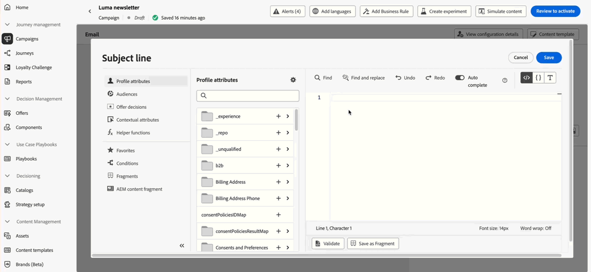

# 릴리스 정보 {#release-notes}

>[!CONTEXTUALHELP]
>id="ajo_homepage_card1"
>title="새로운 기능"
>abstract="**Adobe Journey Optimizer**&#x200B;는 지속적으로 새로운 기능, 기존 기능 개선, 버그 수정을 제공합니다. 모든 변경 사항은 매달 마지막 주에 여기 있는 릴리스 정보에 통합됩니다."

[!DNL Adobe Journey Optimizer]은(는) 지속적으로 새로운 기능, 기존 기능 개선, 버그 해결을 제공합니다. 모든 변경 사항은 매달 마지막 주 여기 있는 릴리스 정보에 통합됩니다. [!DNL Adobe Journey Optimizer]은 기본적으로 [!DNL Adobe Experience Platform] 기반으로 빌드되었으며 최신 혁신 및 향상된 기능을 활용할 수 있습니다. 변경 사항에 대한 자세한 내용은 [Adobe Experience Platform 릴리스 정보](https://experienceleague.adobe.com/docs/experience-platform/release-notes/latest.html?lang=ko-KR){target="_blank"}를 참조하십시오.

## 2025년 3월 릴리스 정보 {#25-3-rn}

### 새로운 기능 {#25-03-features}

이번 릴리스의 새로운 기능을 아래에서 자세히 설명합니다.

<table>
<thead>
<tr>
<th><strong>Adobe Express과의 통합(제한된 가용성)</strong> </th>
</tr>
</thead>
<tbody>
<tr>
<td>

Adobe Journey Optimizer의 Adobe Express 통합을 사용하면 컨텐츠를 만드는 동안 바로 Adobe Express의 편집 도구를 사용할 수 있으므로 에셋의 크기를 조정하고, 배경을 제거하고, 자르고, JPEG 또는 PNG로 변환할 수 있습니다.

Adobe Journey Optimizer의 Adobe Express 통합은 현재 조직 집합(제한된 가용성)에만 사용할 수 있습니다. Healthcare Shield 또는 Privacy and Security Shield와 함께 사용하도록 배포할 수 없습니다.

자세한 내용은 <a href="../integrations/express.md">세부 설명서</a>를 참조하십시오.

 

</td>
</tr>
</tbody>
</table>

<!--table>
<thead>
<tr>
<th><strong>Journey metrics</strong> </th>
</tr>
</thead>
<tbody>
<tr>
<td>

Journey metrics are now available, allowing you to measure the impact of your activities across the key metrics of your business and to provide clearer insights into your performance.

For more information, refer to the <a href="../building-journeys/success-metrics.md">detailed documentation</a>.

</td>
</tr>
</tbody>
</table-->

<!-- table>
<thead>
<tr>
<th><strong>Calendar view for journeys (Limited Availability)</strong> </th>
</tr>
</thead>
<tbody>
<tr>
<td>

A calendar view is now available in Journey Optimizer to visualize all journeys activations. From this view, you can browse your journeys and check details and properties.

This change is only available for a set of organizations (Limited Availability). To gain access, contact your Adobe representative.

For more information, refer to the <a href="../configuration/rule-sets.md">detailed documentation</a>.

</td>
</tr>
</tbody>
</table-->

<table>
<thead>
<tr>
<th><strong>Dynamic Media와 통합(제한된 가용성)</strong> </th>
</tr>
</thead>
<tbody>
<tr>
<td>

이제 Journey Optimizer에서 Dynamic Media 에셋을 바로 사용할 수 있고 액세스할 수 있습니다. 이 통합을 통해 다음과 같은 작업을 수행할 수 있습니다.
<ul>
<li>실시간 업데이트를 통해 자산을 중앙에서 관리</li>
<li>너비 및 높이와 같은 에셋 설정을 즉시 수정합니다</li>
<li>콘텐츠를 업데이트하고 개인화 필드를 추가하여 Dynamic Media 템플릿 맞춤화</li>
</ul>

이 통합은 조직 집합(제한된 가용성)에만 사용할 수 있습니다. 액세스 권한을 받으려면 Adobe 담당자에게 문의하십시오.

자세한 내용은 <a href="../integrations/aem-dynamic.md">세부 설명서</a>를 참조하십시오.

</td>
</tr>
</tbody>
</table>

<table>
<thead>
<tr>
<th><strong>Adobe GenStudio과의 통합(제한된 가용성)</strong> </th>
</tr>
</thead>
<tbody>
<tr>
<td>

이제 마케팅 효율성을 높이고 브랜드 일관성을 유지하기 위해 GenStudio for Performance Marketing 경험을 Journey Optimizer과 원활하게 통합할 수 있습니다. 이를 통해 GenStudio의 고급 오케스트레이션 기능과 함께 Journey Optimizer의 AI 파워 콘텐츠 생성을 활용할 수 있습니다.

Journey Optimizer의 GenStudio 통합은 현재 Healthcare Shield 또는 Privacy and Security Shield(제한된 가용성)와 함께 사용할 수 없습니다.

자세한 내용은 <a href="../integrations/genstudio.md">자세한 설명서</a>를 참조하세요.

</td>
</tr>
</tbody>
</table>

<!--table>
<thead>
<tr>
<th><strong>LINE channel (Limited Availability)</strong> </th>
</tr>
</thead>
<tbody>
<tr>
<td>

Adobe Journey Optimizer has expanded its cross-channel capabilities to include support for the LINE channel. This enhancement allows you to create, edit, and preview LINE experiences enabling more personalized and engaging interactions. With LINE, you can connect with more customers, send relevant content, and improve your engagement.

This capability is only available for a set of organizations (Limited Availability). To gain access, contact your Adobe representative.

For more information, refer to the <a href="../configuration/rule-sets.md">detailed documentation</a>.

</td>
</tr>
</tbody>
</table-->

### 개선 사항 {#25-03-improv}

**Personalization 편집기**(사용 가능한 날짜: 3월 12일)

Journey Optimizer 개인화 편집기가 다음과 같은 새로운 기능으로 업데이트되었습니다.
* **코드 편집기 디자인 업데이트** - 유용성과 집중도 개선을 위한 깔끔하고 현대적인 인터페이스를 적용했습니다.
* **검색 및 바꾸기** - 편집기 내에서 콘텐츠를 빠르게 찾고 바꿀 수 있는 기능이 추가되었습니다.
* **실행 취소 및 다시 실행 지원** - 변경 내용을 쉽게 되돌리거나 다시 적용할 수 있습니다.
* **사용자 정의 가능한 글꼴 크기** - 편집기의 글꼴 크기를 조정하여 가독성을 높일 수 있습니다.
* **인라인 JSON 유효성 검사** - JSON 콘텐츠에 대한 실시간 클라이언트측 유효성 검사를 제공하여 오류 감지 속도를 높입니다.
* **프로필 및 컨텍스트 속성 자동 완성** - 콘텐츠 작성을 간소화하는 스마트 제안을 제공합니다.
* **향상된 구문 강조 표시** - 코드 구조를 보다 시각적으로 구분하기 쉽게 하여 가독성을 개선합니다.

자세한 내용은 [세부 설명서](../personalization/personalization-build-expressions.md)를 참조하십시오.

**승인**

이제 승인 정책에 대한 조건을 정의할 때 태그 및/또는 오브젝트 카테고리별로 필터링할 수 있는 옵션이 제공됩니다.

자세한 내용은 [세부 설명서](../test-approve/approval-policies.md)를 참조하십시오.

**구성**

* 이제 Adobe Experience Platform 통합 태그를 채널 구성에 할당할 수 있습니다. 이렇게 하면 쉽게 분류하고, 모든 목록에서 검색 및 탐색을 개선할 수 있습니다. [자세히 알아보기](../configuration/channel-surfaces.md#channel-config-tags)

* 이제 Journey Optimizer에서 이메일 하위 도메인을 설정하거나 편집할 때 상위 도메인에서 사용 가능한 경우 연결된 DMARC 레코드를 직접 관리하도록 선택할 수 있습니다. [자세히 알아보기](../configuration/dmarc-record.md#set-up-dmarc)

**비즈니스 규칙**

이제 일괄 세분화를 통해 여정 및 캠페인에서 일일 빈도 제한을 사용할 수 있습니다. 일별 빈도 제한 규칙의 정확도를 보장하려면 캠페인이나 여정을 작성하는 동안 우선 순위가 가장 높은 네임스페이스를 선택해야 합니다. [플랫폼 ID 서비스 안내서](https://experienceleague.adobe.com/en/docs/experience-platform/identity/features/identity-graph-linking-rules/namespace-priority){target="_blank"}에서 네임스페이스 우선 순위에 대해 자세히 알아보세요.

다시 말해서, 규칙 세트의 일일 빈도 제한은 조직 집합(제한된 가용성)에만 사용할 수 있습니다. 액세스 권한을 받으려면 Adobe 담당자에게 문의하십시오.

비즈니스 규칙에 대한 자세한 내용은 [자세한 설명서](../configuration/rule-sets.md)를 참조하세요.

<!--**Content management**

To easily manage your fragments and your content templates, you can now use folders to organize them more effectively into a structured hierarchy. This improvement is only available for a set of organizations (Limited Availability). <!--To gain access, contact your Adobe representative.

**Deliverability**

You can now choose to have your emails relayed to your SMTP servers instead of being sent directly from Journey Optimizer to ISPs. This allows you to route final email deliveries through your own Mail Transfer Agents and IPs, or to perform final validations on the emails before sending them to your recipients. The SMTP relay capacity is available on demand - contact your Adobe representative.-->

