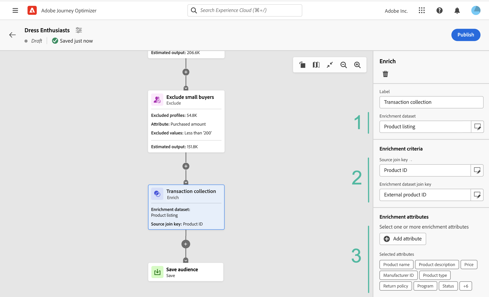

# 컴포지션 캔버스 작업 {#composition-canvas}

>[!BEGINSHADEBOX]

이 설명서에서 찾을 내용:

* [대상자 구성 시작](get-started-audience-orchestration.md)
* [첫 번째 컴포지션 워크플로우 만들기](create-compositions.md)
* **[컴포지션 캔버스 작업](composition-canvas.md)**
* [대상자 액세스 및 관리](access-audiences.md)

>[!ENDSHADEBOX]

대상 컴포지션은 대상을 만들고 다양한 활동(분할, 보강 등)을 사용할 수 있는 시각적 캔버스를 제공합니다.

캔버스에서 대상을 구성하는 단계는 다음과 같습니다.

1. [시작 대상 정의](#starting-audience)
1. [하나 이상의 활동 추가](#action-activities)
1. [결과를 새 대상자에 저장](#save)

## 시작 대상 선택 {#starting-audience}

컴포지션을 만드는 첫 번째 단계는 컴포지션의 기반으로 하나 이상의 기존 대상자를 선택하는 것입니다.

1. 을(를) 선택합니다 **[!UICONTROL Audience]** 그런 다음 활동에 대한 레이블을 제공합니다.

1. 타겟팅할 대상 선택:

   * 을(를) 클릭합니다. **[!UICONTROL 대상 추가]** 단추를 클릭하여 기존 대상자를 하나 이상 선택합니다.
   * 을(를) 클릭합니다. **[!UICONTROL 빌드 규칙]** 단추를 사용하여 새 세그먼트 정의 만들기 [세분화 서비스](https://experienceleague.adobe.com/docs/experience-platform/segmentation/ui/overview.html).

   

1. 여러 대상을 선택한 경우 이러한 대상의 프로필을 병합하는 방법을 지정합니다.

* **[!UICONTROL 결합]**: 선택한 대상의 모든 프로필 포함,
* **[!UICONTROL 교차]**: 선택한 모든 대상에 공통되는 프로필 포함,
* **[!UICONTROL 겹치기 제외]**: 대상자 중 하나에만 속하는 프로필을 포함합니다. 두 개 이상의 대상에 속하는 프로필은 포함되지 않습니다.

이 예에서는 금 및 은 대상에 속하는 모든 프로필을 타겟팅하려고 합니다.

대상을 선택하면 활동 하단에 예상 프로필 수가 표시됩니다.

## 활동 추가 {#action-activities}

시작 대상을 선택한 후 활동을 추가하여 선택 사항을 구체화합니다.

이렇게 하려면 컴포지션 경로에서 + 단추를 클릭한 다음 원하는 활동을 선택합니다. 오른쪽 창이 열리고 새로 추가된 활동을 구성할 수 있습니다.

사용 가능한 활동은 다음과 같습니다.

* [Audience](#audience): 하나 이상의 기존 대상에 속하는 추가 프로필 포함,
* [제외](#exclude): 기존 대상에 속하는 프로필을 제외하거나 특정 속성을 기준으로 프로필을 제외합니다.
* [품질 개선]{#enrich}: Adobe Experience Platform 데이터 세트에서 나오는 추가 특성을 사용하여 대상을 보강하고,
* [등급](#rank): 특정 속성에 따라 프로필 등급을 매기고, 유지할 프로필 수를 지정하여 컴포지션에 포함시킵니다.
* [분할](#split): 임의 비율 또는 속성을 기반으로 컴포지션을 여러 경로로 분할합니다.

추가할 수 있는 수만큼 **[!UICONTROL Audience]** 및 **[!UICONTROL 제외]** 필요에 따라 작성에서 활동을 수행합니다. 하지만 이후에 추가 활동을 추가할 수 없습니다 **[!UICONTROL 등급]** 및 **[!UICONTROL 분할]** 활성화

오른쪽 창에서 삭제 단추를 클릭하여 언제든지 캔버스에서 활동을 제거할 수 있습니다.  삭제하려는 활동이 컴포지션에서 다른 활동의 상위 활동인 경우 선택한 활동만 삭제할지 또는 해당 하위 활동을 모두 삭제할지 여부를 지정할 수 있는 메시지가 표시됩니다.

### 대상 활동 {#audience}

>[!CONTEXTUALHELP]
>id="ajo_ao_audience"
>title="대상 활동"
>abstract="대상 활동을 사용하면 구성에 기존 대상자에 속하는 추가 프로필을 포함할 수 있습니다."

>[!CONTEXTUALHELP]
>id="ajo_ao_merge_types"
>title="병합 유형"
>abstract="선택한 대상의 프로필을 병합하는 방법을 지정합니다."

다음 **[!UICONTROL Audience]** 활동을 사용하면 구성에 기존 대상자에 속하는 추가 프로필을 포함할 수 있습니다.

이 활동의 구성은 시작과 동일합니다 [대상 활동](#starting-audience).

### 활동 제외 {#exclude}

>[!CONTEXTUALHELP]
>id="ajo_ao_exclude_type"
>title="제외 유형"
>abstract="기존 대상에 속하는 프로필을 제외하려면 대상 제외 유형을 사용합니다. 특성 유형을 사용하여 제외 를 사용하면 특정 속성에 따라 프로필을 제외할 수 있습니다."

>[!CONTEXTUALHELP]
>id="ajo_ao_exclude"
>title="활동 제외"
>abstract="제외 활동을 사용하면 기존 대상자를 선택하거나 규칙을 사용하여 컴포지션에서 프로필을 제외할 수 있습니다."

다음 **[!UICONTROL 제외]** 활동을 통해 컴포지션에서 프로필을 제외할 수 있습니다. 두 가지 유형의 제외를 사용할 수 있습니다.

* **[!UICONTROL 대상 제외]**: 기존 대상자에 속하는 프로필을 제외합니다.

   을(를) 클릭합니다. **[!UICONTROL 대상 추가]** 그런 다음 제외할 대상을 선택합니다.

   

* **[!UICONTROL 속성을 사용하여 제외]**: 특정 속성을 기반으로 프로필을 제외합니다.

   조회할 속성을 선택한 다음 제외할 값을 지정합니다. 이 예에서는 홈 주소가 일본에 있는 구성 프로필에서 을 제외합니다.

   

### 품질 개선 {#enrich}

>[!CONTEXTUALHELP]
>id="ajo_ao_enrich"
>title="활동 강화"
>abstract="보강 활동을 사용하여 기존 대상자에 속하는 프로필을 제외합니다. 특성 유형을 사용하여 제외 를 사용하면 특정 속성에 따라 프로필을 제외할 수 있습니다."

>[!CONTEXTUALHELP]
>id="ajo_ao_enrich_dataset"
>title="데이터 세트 보강"
>abstract="대상자와 연결할 데이터가 포함된 데이터 보강 데이터 세트를 선택합니다."

>[!CONTEXTUALHELP]
>id="ajo_ao_enrich_criteria"
>title="데이터 보강 기준"
>abstract="소스 데이터 세트(즉, 대상 및 데이터 보강 데이터 세트) 간의 조정 키로 사용할 필드를 선택합니다."

>[!CONTEXTUALHELP]
>id="ajo_ao_enrich_attributes"
>title="데이터 보강 속성"
>abstract="데이터 보강 데이터 세트에서 하나 또는 여러 속성을 선택하여 대상에 연결합니다. 컴포지션이 게시되면 이러한 속성이 대상자와 연결되며 캠페인에서 게재를 개인화하는 데 활용할 수 있습니다."

다음 **[!UICONTROL 품질 개선]** 활동을 사용하면 Adobe Experience Platform 데이터 세트에서 가져온 추가 속성으로 대상을 보강할 수 있습니다. 예를 들어 이름, 가격 또는 제조업체 ID와 같이 구입한 제품과 관련된 정보를 추가하고 이러한 정보를 활용하여 대상으로 전송된 게재를 개인화할 수 있습니다.

>[!IMPORTANT]
>
>현재, 데이터 집합 수준 또는 필드 수준에서 데이터 집합에 대한 레이블은 새로 만든 대상에게 전파되지 않습니다. 이는 결과 대상의 액세스 제어 및/또는 데이터 거버넌스에 영향을 줄 수 있습니다. 따라서 대상을 작성할 때는 테스트 데이터만 사용하십시오.

활동을 구성하려면 다음 단계를 수행합니다.

1. 을(를) 선택합니다 **[!UICONTROL 데이터 세트 보강]** 대상에 연결할 데이터를 포함합니다.

1. 에서 **[!UICONTROL 데이터 보강 기준]** 섹션에서 소스 데이터 세트, 즉 대상 및 데이터 세트 간의 조정 키로 사용할 필드를 선택합니다. 이 예에서는 구매한 제품의 ID를 조정 키로 사용합니다.

1. 을(를) 클릭합니다. **[!UICONTROL 속성 추가]** 그런 다음 데이터 보강 데이터 세트에서 하나 또는 여러 속성을 선택하여 대상에 연결합니다.

   

컴포지션이 게시되면 선택한 속성이 대상자와 연결되고 캠페인에서 활용하여 게재를 개인화할 수 있습니다.

### 등급 활동 {#rank}

>[!CONTEXTUALHELP]
>id="ajo_ao_ranking"
>title="등급 활동"
>abstract="등급 활동을 사용하면 특정 속성에 따라 프로필의 등급을 매기고 컴포지션에 포함할 수 있습니다. 예를 들어 충성도 포인트가 가장 많은 50개의 프로필을 포함합니다."

>[!CONTEXTUALHELP]
>id="ajo_ao_rank_profilelimit_text"
>title="프로필 제한 추가"
>abstract="이 옵션을 켜서 컴포지션에 포함할 최대 프로필 수를 지정합니다."

다음 **[!UICONTROL 등급]** 활동을 통해 특정 속성에 따라 프로필의 등급을 매기고 구성에 포함할 수 있습니다. 예를 들어 충성도 포인트가 가장 많은 50개의 프로필을 포함할 수 있습니다.

1. 조회할 속성을 선택하고 등급 순서(오름차순 또는 내림차순)를 지정합니다.

   >[!NOTE]
   >
   >다음 데이터 유형을 사용하는 속성을 선택할 수 있습니다. 정수, 숫자, 단락 <!--(other?)-->

1. 전환 **[!UICONTROL 프로필 제한 추가]** 옵션을 설정하고 컴포지션에 포함할 최대 프로필 수를 지정합니다.

   

### 활동 분할 {#split}

<!-- [!CONTEXTUALHELP]
>id="ajo_ao_control_group_text"
>title="Control Group"
>abstract="Use control groups to isolate a portion of the profiles. This allows you to measure the impact of a marketing activity and make a comparison with the behavior of the rest of the population."-->

>[!CONTEXTUALHELP]
>id="ajo_ao_split"
>title="활동 분할"
>abstract="분할 활동을 사용하면 컴포지션을 여러 경로로 나눌 수 있습니다. 컴포지션을 게시할 때 각 경로마다 한 명의 대상이 Adobe Experience Platform에 저장됩니다."

>[!CONTEXTUALHELP]
>id="ajo_ao_split_type"
>title="분할 유형"
>abstract="백분율 분할 유형을 사용하여 프로필을 여러 경로로 임의로 분할합니다. 속성 분할 유형을 사용하면 특정 속성에 따라 프로필을 분할할 수 있습니다."

>[!CONTEXTUALHELP]
>id="ajo_ao_split_otherprofiles_text"
>title="기타 프로필"
>abstract="다른 경로에 지정된 조건과 일치하지 않는 나머지 프로필로 추가 경로를 만들려면 이 옵션을 켜십시오."

다음 **[!UICONTROL 분할]** 활동을 통해 컴포지션을 여러 경로로 나눌 수 있습니다.

이 작업은 자동으로 **[!UICONTROL 저장]** 활동은 각 경로 끝에 있습니다. 컴포지션을 게시할 때 각 경로마다 한 명의 대상이 Adobe Experience Platform에 저장됩니다.

두 가지 유형의 분할 작업을 사용할 수 있습니다.

* **[!UICONTROL 백분율 분할]**: 프로필을 두 개 이상의 경로로 임의로 분할합니다. 예를 들어 프로필을 각각 50%의 두 개의 개별 경로로 분할할 수 있습니다. <!--and add an additional path for control group.-->

   

* **[!UICONTROL 속성 분할]**: 특정 속성에 따라 프로필을 분할합니다. 이 예에서는 룸 유형 환경 설정에 따라 프로필을 분할합니다.

   

   >[!NOTE]
   >
   >다음 **[!UICONTROL 기타 프로필]** 옵션을 사용하면 다른 경로에 지정된 조건과 일치하지 않는 나머지 프로필로 추가 경로를 만들 수 있습니다.

## 대상자 저장 {#save}

Adobe Experience Platform에 저장될 결과 대상을 구성합니다.

이렇게 하려면 **[!UICONTROL 대상자 저장]** 각 경로 끝에 있는 활동에서 만들 새 대상의 이름을 지정합니다.

컴포지션을 준비하고 나면 게시할 수 있습니다. [컴포지션을 만드는 방법 알아보기](create-compositions.md)
