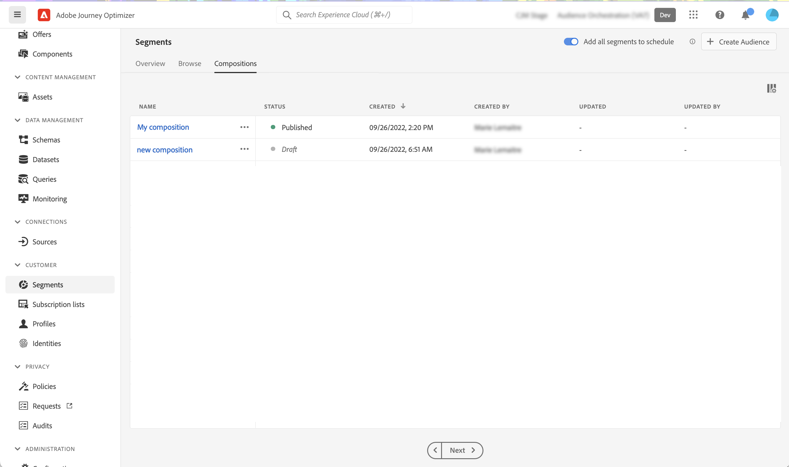

# 첫 번째 컴포지션 워크플로우 만들기 {#create-compositions}

>[!BEGINSHADEBOX]

이 설명서에서 찾을 내용:

* [대상자 구성 시작](get-started-audience-orchestration.md)
* **[첫 번째 컴포지션 워크플로우 만들기](create-compositions.md)**
* [컴포지션 캔버스 작업](composition-canvas.md)
* [대상자 액세스 및 관리](access-audiences.md)

>[!ENDSHADEBOX]

## 컴포지션 워크플로우 만들기 {#create}

컴포지션 워크플로우를 만들려면 다음 단계를 수행합니다.

1. 액세스 권한 **[!UICONTROL 세그먼트]** 메뉴 및 선택 **[!UICONTROL 대상 만들기]**.

1. 선택 **[!UICONTROL 대상자 작성]**.

   

   >[!NOTE]
   >
   >다음 **[!UICONTROL 빌드 규칙]** 생성 방법을 사용하면 [세분화 서비스](https://experienceleague.adobe.com/docs/experience-platform/segmentation/ui/overview.html).

1. 컴포지션 캔버스는 두 개의 기본 활동과 함께 표시됩니다.

   * **[!UICONTROL Audience]**: 컴포지션의 시작점입니다. 이 활동을 사용하면 워크플로우의 기반으로 하나 이상의 대상을 선택할 수 있습니다.

   * **[!UICONTROL 저장]**: 컴포지션의 마지막 단계입니다. 이 활동을 사용하면 워크플로우의 결과를 새 대상에 저장할 수 있습니다.
   컴포지션 워크플로우 캔버스에서 활동을 구성하는 방법에 대한 자세한 내용은 [컴포지션 캔버스 작업](composition-canvas.md).

1. 컴포지션 속성을 열어 제목과 설명을 지정합니다.

   속성에 제목이 정의되지 않으면 컴포지션의 레이블이 &quot;컴포지션&quot;으로 설정되고 작성 날짜 및 시간이 표시됩니다.

   

1. 필요한 만큼 활동을 추가하여 구성을 구성합니다 **[!UICONTROL Audience]** 및 **[!UICONTROL 저장]** 활동. [컴포지션 캔버스 작업 방법 알아보기](composition-canvas.md)

   

1. 컴포지션이 준비되면 **[!UICONTROL 게시]** 단추를 클릭하여 컴포지션을 게시하고 결과 대상을 Adobe Experience Platform에 저장합니다.

   게시 중에 오류가 발생하면 문제를 해결하는 방법에 대한 정보가 포함된 경고가 표시됩니다.

   

1. 컴포지션이 게시되었습니다. 결과 대상은 Adobe Experience Platform에 저장되며 Journey Optimizer 캠페인에서 타겟팅될 준비가 되었습니다. [캠페인 사용 방법 알아보기](../campaigns/get-started-with-campaigns.md)

## 컴포지션 액세스 {#access}

>[!CONTEXTUALHELP]
>id="ajo_ao_publish"
>title="대상자 게시"
>abstract="구성을 게시하여 최종 대상자를 Adobe Experience Platform에 저장합니다."

만든 모든 컴포지션은 **[!UICONTROL 컴포지션]** 탭. 여기에는 다음과 같은 여러 상태가 있을 수 있습니다.

* **[!UICONTROL 초안]**: 컴포지션이 진행 중이며 게시되지 않았습니다.
* **[!UICONTROL 게시됨]**: 컴포지션이 게시되어 결과 대상이 저장되었으며 사용할 수 있습니다.
* **[!UICONTROL 보관됨]**: 컴포지션이 보관되었습니다.

>[!NOTE]
>
>목록의 줄임표 버튼을 사용하여 언제든지 기존 컴포지션을 복제하거나 삭제할 수 있습니다.
