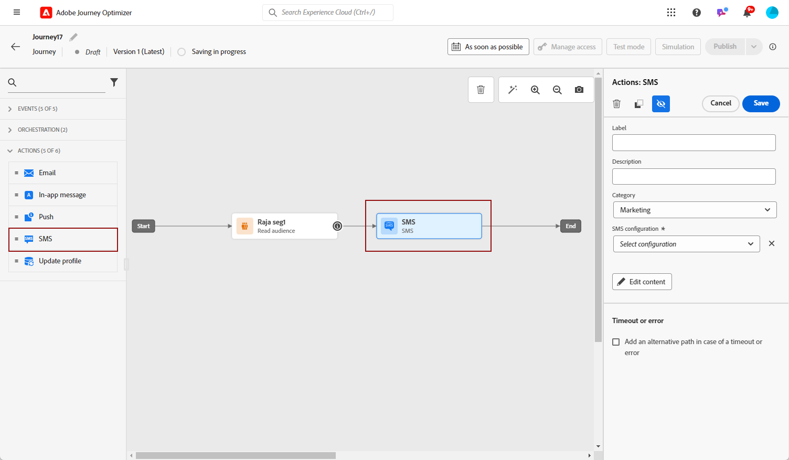

# 문자 메시지(SMS/MMS) 만들기 {#create-sms}

>[!CONTEXTUALHELP]
>id="ajo_message_sms"
>title="텍스트 메시지 만들기"
>abstract="문자 메시지(SMS/MMS)를 만들려면 여정이나 캠페인에 SMS 작업을 추가하고 표현식 편집기로 개인화를 시작합니다."

Adobe Journey Optimizer을 사용하여 텍스트(SMS) 및 멀티미디어(MMS) 메시지를 디자인하고 보낼 수 있습니다. 먼저 여정 또는 캠페인에 SMS 작업을 추가한 다음 아래에 설명된 대로 텍스트 메시지의 콘텐츠를 정의해야 합니다. Adobe Journey Optimizer은 전송 전에 텍스트 메시지를 테스트하여 렌더링, 개인화 속성 및 기타 모든 설정을 확인할 수 있는 기능도 제공합니다.

>[!NOTE]
>
>업계 표준 및 규정에 따라 모든 SMS/MMS 마케팅 메시지에는 수신자가 간편하게 구독을 취소할 수 있는 방법이 포함되어야 합니다. 이를 위해 SMS 수신자는 옵트인 및 옵트아웃 키워드로 회신할 수 있습니다. [옵트아웃 관리 방법 알아보기](../privacy/opt-out.md#sms-opt-out-management-sms-opt-out-management)

## 문자 메시지 추가 {#create-sms-journey-campaign}

아래 탭을 탐색하여 캠페인 또는 여정에서 문자 메시지(SMS/MMS)를 추가하는 방법을 알아봅니다.

>[!BEGINTABS]

>[!TAB 여정에 문자 메시지 추가]

1. 여정을 연 다음 **작업** 팔레트의 섹션입니다.

   

1. 메시지에 대한 기본 정보(레이블, 설명, 카테고리)를 입력한 다음 사용할 메시지 표면을 선택합니다.

   

   여정 구성 방법에 대한 자세한 내용은 [이 페이지](../building-journeys/journey-gs.md)

   다음 **[!UICONTROL 표면]** 필드는 기본적으로 미리 채워져 있으며 사용자가 해당 채널에 대해 마지막으로 사용한 서페이스가 있습니다.

이제에서 SMS 메시지의 콘텐츠 디자인을 시작할 수 있습니다. **[!UICONTROL 콘텐츠 편집]** 아래에 자세히 설명되어 있는 단추입니다.

>[!TAB Campaign에 문자 메시지 추가]

1. 새 예약된 캠페인 또는 API에서 트리거된 캠페인을 만들고, 다음을 선택합니다. **[!UICONTROL SMS]** 을(를) 작업으로 선택하고 **[!UICONTROL 앱 표면]** 사용할 수 있습니다. 에서 SMS 구성에 대해 자세히 알아보기 [이 페이지](sms-configuration.md).

   

1. **[!UICONTROL 만들기]**&#x200B;를 클릭합니다.

1. 다음에서 **[!UICONTROL 속성]** 섹션, 캠페인의 편집 **[!UICONTROL 제목]** 및 **[!UICONTROL 설명]**.

   

1. 다음을 클릭합니다. **[!UICONTROL 대상자 선택]** 사용 가능한 Adobe Experience Platform 대상 목록에서 타깃팅할 대상을 정의하는 단추입니다. [자세히 알아보기](../audience/about-audiences.md).

1. 다음에서 **[!UICONTROL ID 네임스페이스]** 필드에서 선택한 대상에서 개인을 식별하기 위해 사용할 네임스페이스를 선택합니다. [자세히 알아보기](../event/about-creating.md#select-the-namespace).

   

1. 클릭 **[!UICONTROL 실험 만들기]** 콘텐츠 실험 구성을 시작하고 처리를 만들어 성능을 측정하고 타겟 대상자에 대한 최상의 옵션을 식별합니다. [자세히 알아보기](../campaigns/content-experiment.md)

1. 다음에서 **[!UICONTROL 작업 추적]** 섹션에서 SMS 메시지의 링크 클릭을 추적할지 여부를 지정합니다.

1. 캠페인은 특정 날짜 또는 되풀이되는 빈도로 실행되도록 디자인됩니다. 구성 방법 알아보기 **[!UICONTROL 예약]** 의 내 캠페인 [이 섹션](../campaigns/create-campaign.md#schedule).

1. 다음에서 **[!UICONTROL 작업 트리거]** 메뉴에서 다음을 선택합니다. **[!UICONTROL 빈도]** SMS 메시지:

   * 한 번
   * 일별
   * 주별
   * 월

이제 다음 위치에서 텍스트 메시지의 콘텐츠를 디자인할 수 있습니다. **[!UICONTROL 콘텐츠 편집]** 아래에 자세히 설명되어 있는 단추입니다.

>[!ENDTABS]

## SMS 콘텐츠 정의{#sms-content}

>[!CONTEXTUALHELP]
>id="ajo_message_sms_content"
>title="SMS 콘텐츠 정의"
>abstract="표현식 편집기를 사용하여 콘텐츠를 정의하고 동적 요소를 통합하여 문자 메시지(SMS/MMS)를 사용자 정의하고 개인화합니다."

SMS 콘텐츠를 구성하려면 아래 단계를 따르십시오. MMS 설정에 대한 자세한 내용은 [이 섹션](#mms-content).

1. 여정 또는 캠페인 구성 화면에서 **[!UICONTROL 콘텐츠 편집]** 단추를 클릭하여 텍스트 메시지 콘텐츠를 구성합니다.

1. 다음을 클릭합니다. **[!UICONTROL 메시지]** 표현식 편집기를 여는 필드입니다.

   

1. 표현식 편집기를 사용하여 콘텐츠를 정의하고, 개인화 및 다이내믹 콘텐츠를 추가합니다. 프로필 이름 또는 도시 등의 모든 속성을 사용할 수 있습니다. 조건부 규칙을 정의할 수도 있습니다. 자세한 내용은 다음 페이지를 참조하십시오 [개인화](../personalization/personalize.md) 및 [다이내믹 콘텐츠](../personalization/get-started-dynamic-content.md) 를 입력합니다.

1. 콘텐츠를 정의한 후 추적된 URL을 메시지에 추가할 수 있습니다. 이렇게 하려면 **[!UICONTROL 도우미 함수]** 메뉴 및 선택 **[!UICONTROL 도우미]**.

   URL 단축 기능을 사용하려면 먼저 표면에 연결될 하위 도메인을 구성해야 합니다. [자세히 알아보기](sms-subdomains.md)

   >[!CAUTION]
   >
   > SMS 하위 도메인에 액세스하고 편집하려면 **[!UICONTROL SMS 하위 도메인 관리]** 프로덕션 샌드박스에 대한 권한. [이 섹션](../administration/high-low-permissions.md)에서 권한에 대해 자세히 알아보십시오.

   

1. 다음 범위 내 **[!UICONTROL 도우미 함수]** 메뉴, 클릭 **[!UICONTROL URL 함수]** 다음을 선택합니다. **[!UICONTROL URL 추가]**.

   

1. 다음에서 `originalUrl` 필드를, 단축할 URL을 붙여넣고 **[!UICONTROL 저장]**.

1. 클릭 **[!UICONTROL 저장]** 미리 보기에서 메시지를 확인합니다. 이제에 자세히 설명된 대로 메시지 콘텐츠를 테스트하고 확인할 수 있습니다. [이 섹션](#sms-mms-test).

## MMS 콘텐츠 정의{#mms-content}

MMS(멀티미디어 메시지 서비스) 메시지를 전송하여 비디오, 사진, 오디오 클립 및 GIF 등의 미디어를 공유할 수 있도록 함으로써 커뮤니케이션을 향상시킬 수 있습니다. 또한 MMS를 통해 메시지에 최대 1600자의 텍스트를 입력할 수 있습니다.

>[!NOTE]
>
>* 이 기능은 현재 다음에서 사용할 수 있습니다. **Sinch** 만 해당.
>
>* MMS 채널에는 다음과 같은 몇 가지 제한 사항이 있습니다. [이 페이지](../start/guardrails.md#sms-guardrails).

MMS 콘텐츠를 만들려면 다음 단계를 수행합니다.

1. 에 설명된 대로 SMS를 만듭니다 [이 섹션](#create-sms-journey-campaign).

1. 에 자세히 설명된 대로 SMS 콘텐츠를 편집합니다. [이 섹션](#sms-content).

1. SMS 콘텐츠에 미디어를 추가하려면 MMS 옵션을 활성화합니다.

   

1. 추가 **[!UICONTROL 제목]** 미디어.

1. 에 미디어 URL을 입력합니다 **[!UICONTROL 미디어]** 필드.

   

1. 클릭 **[!UICONTROL 저장]** 미리 보기에서 메시지를 확인합니다. 이제 아래에 자세히 설명된 대로 메시지 콘텐츠를 테스트하고 확인할 수 있습니다.

## 메시지 테스트 및 보내기 {#sms-mms-test}

사용 **[!UICONTROL 콘텐츠 시뮬레이션]** 문자 메시지 콘텐츠, 단축된 URL 및 개인화된 콘텐츠를 미리 보기 위한 단추입니다.

테스트를 수행하고 콘텐츠의 유효성을 검사하면 대상자에게 문자 메시지를 보낼 수 있습니다. 다음 단계는에 자세히 설명되어 있습니다. [이 페이지](send-sms.md)

전송되면 캠페인 또는 여정 보고서 내에서 SMS의 영향을 측정할 수 있습니다. 보고와 관련한 자세한 정보는 [이 섹션](../reports/campaign-global-report.md#sms-tab)을 참조하십시오.

**관련 항목**

* [문자 메시지 미리 보기, 테스트 및 보내기](send-sms.md)
* [SMS 채널 구성](sms-configuration.md)
* [SMS/MMS 보고서](../reports/journey-global-report.md#sms-global)
* [여정에 메시지 추가](../building-journeys/journeys-message.md)
* [캠페인에 메시지 추가](../campaigns/create-campaign.md)
