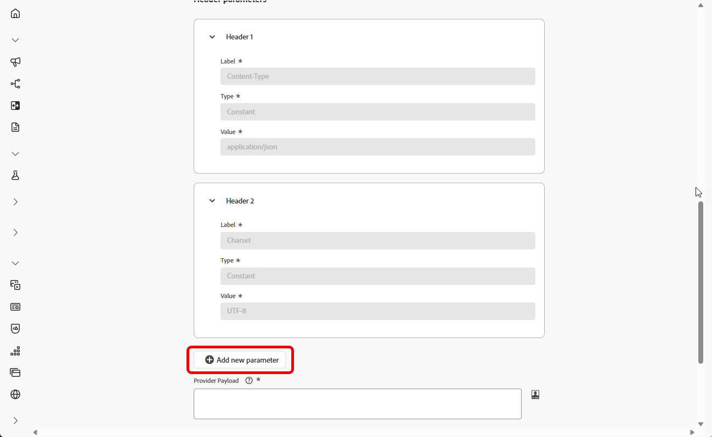

# 사용자 정의 SMS 공급자 구성 {#sms-configuration-custom}

>[!CONTEXTUALHELP]
>id="ajo_admin_sms_api_byop_provider_url"
>title="공급자 URL"
>abstract="외부 API에 연결할 URL을 지정합니다. 이 URL은 API의 특징과 기능에 액세스하기 위한 엔드포인트 역할을 합니다."

>[!CONTEXTUALHELP]
>id="ajo_admin_sms_api_byop_header_parameters"
>title="헤더 매개변수"
>abstract="적절한 인증, 콘텐츠 형식 지정 및 효과적인 API 통신을 위해 추가 헤더의 레이블, 유형 및 값을 지정합니다. "

>[!CONTEXTUALHELP]
>id="ajo_admin_sms_api_byop_provider_payload"
>title="공급자 페이로드"
>abstract="올바른 데이터가 처리 및 응답 생성에 사용될 수 있도록 요청 페이로드를 제공합니다."

이 기능을 사용하면 자체 SMS 공급자를 통합 및 구성할 수 있으므로 기본 공급자(Sinch, Twilio 및 Infobip) 이상의 유연성을 제공합니다. 이를 통해 SMS 작성, 전달, 보고 및 동의 관리를 원활하게 수행할 수 있습니다.

SMS에 대한 사용자 지정 공급자 구성을 통해 Journey Optimizer 내에서 직접 사용자 지정 SMS 공급자를 구성하고, 동적 메시지에 대한 고급 페이로드 사용자 지정을 사용하고, 규정 준수를 위해 동의 환경 설정(옵트인/옵트아웃)을 관리할 수 있습니다.

사용자 지정 SMS 공급자를 구성하려면 아래 단계를 수행합니다.

1. [API 자격 증명 만들기](#api-credential)
1. [Webhook 만들기](#webhook)
1. [채널 구성 만들기](sms-configuration-surface.md)
1. [SMS 채널 작업으로 여정 또는 캠페인 만들기](create-sms.md)

## API 자격 증명 만들기 {#api-credential}

Adobe에서 즉시 사용할 수 없는 사용자 지정 공급자(예: Sinch, Infobip, Twilio)를 사용하여 Journey Optimizer에서 메시지를 보내려면 다음 단계를 수행합니다.

1. 왼쪽 레일에서 **[!UICONTROL 관리]** `>` **[!UICONTROL 채널]**(으)로 이동하고 **[!UICONTROL SMS 설정]**&#x200B;에서 **[!UICONTROL API 자격 증명]** 메뉴를 선택한 다음 **[!UICONTROL 새 API 자격 증명 만들기]** 단추를 클릭합니다.

   

1. 아래에 자세히 설명된 대로 SMS API 자격 증명을 구성합니다.

   * **[!UICONTROL SMS 공급업체]**: 사용자 지정입니다.

   * **[!UICONTROL 이름]**: API 자격 증명의 이름을 입력하십시오.

   * **[!UICONTROL 공급자 AppId]**: SMS 공급자가 제공한 응용 프로그램 ID를 입력하십시오.

   * **[!UICONTROL 공급자 이름]**: SMS 공급자의 이름을 입력하십시오.

   * **[!UICONTROL 공급자 URL]**: SMS 공급자의 URL을 입력하십시오.

   * **인증 유형{&#x200B;1}: 인증 유형을 선택하고 [선택한 인증 방법에 따라 해당 필드를 완료](#auth-options)합니다.**

     

1. **[!UICONTROL Headers]** 섹션에서 **[!UICONTROL 새 매개 변수 추가]**&#x200B;를 클릭하여 외부 서비스로 전송될 요청 메시지에 대한 HTTP 헤더를 지정합니다.

   **Content-Type** 및 **Charset** 헤더 필드는 기본적으로 설정되며 삭제할 수 없습니다.

   

1. **[!UICONTROL 공급자 페이로드]**&#x200B;를 추가하여 요청 페이로드의 유효성을 검사하고 사용자 지정합니다.

1. API 자격 증명 구성을 마치면 **[!UICONTROL 제출]**&#x200B;을 클릭합니다.

1. **[!UICONTROL API 자격 증명]** 메뉴에서 을 클릭하여 API 자격 증명을 삭제합니다.

   

1. 기존 자격 증명을 수정하려면 원하는 API 자격 증명을 찾은 다음 **[!UICONTROL 편집]** 옵션을 클릭하여 필요한 변경을 수행합니다.

   

API 자격 증명을 만들고 구성한 후에는 SMS 메시지에 대해 [Webhook에 대한 인바운드 설정](#webhook)을 설정해야 합니다.

### 사용자 정의 SMS 공급자에 대한 인증 옵션 {#auth-options}

>[!CONTEXTUALHELP]
>id="ajo_admin_sms_api_byop_auth_type"
>title="인증 유형"
>abstract="API에 액세스하는 데 필요한 인증 방법을 지정하면 외부 서비스와의 안전하고 승인된 통신이 보장됩니다."

>[!BEGINTABS]

>[!TAB API 키]

API 자격 증명이 만들어지면 API 키 인증에 필요한 필드를 작성합니다.

* **[!UICONTROL 이름]**&#x200B;: API 키 구성의 이름을 입력하십시오.
* **[!UICONTROL API 토큰]**&#x200B;: SMS 공급자가 제공한 API 토큰을 입력하십시오.

>[!TAB MAC 인증]

API 자격 증명이 만들어지면 MAC 인증에 필요한 필드를 작성합니다.

* **[!UICONTROL 이름]**&#x200B;: MAC 인증 구성의 이름을 입력하십시오.
* **[!UICONTROL API 토큰]**&#x200B;: SMS 공급자가 제공한 API 토큰을 입력하십시오.
* **[!UICONTROL API 암호 키]**: SMS 공급자가 제공한 API 암호 키를 입력하십시오. 이 키는 보안 통신을 위한 MAC(메시지 인증 코드)를 생성하는 데 사용됩니다.
* **[!UICONTROL Mac 인증 해시 형식]**: MAC 인증에 대한 해시 형식을 선택합니다.

>[!TAB OAuth 인증]

API 자격 증명이 생성되면 OAuth 인증에 필요한 필드를 작성합니다.

* **[!UICONTROL 이름]**&#x200B;: OAuth 인증 구성의 이름을 입력합니다.

* **[!UICONTROL API 토큰]**&#x200B;: SMS 공급자가 제공한 API 토큰을 입력하십시오.

* **[!UICONTROL OAuth URL]**&#x200B;: OAuth 토큰을 가져올 URL을 입력합니다.

* **[!UICONTROL OAuth 본문]**&#x200B;: `grant_type`, `client_id` 및 `client_secret` 등의 매개 변수를 포함하여 JSON 형식으로 OAuth 요청 본문을 제공합니다.

>[!TAB JWT 인증]

API 자격 증명이 생성되면 JWT 인증에 필요한 필드를 작성합니다.

* **[!UICONTROL 이름]**&#x200B;: JWT 인증 구성의 이름을 입력하십시오.

* **[!UICONTROL API 토큰]**&#x200B;: SMS 공급자가 제공한 API 토큰을 입력하십시오.

* **[!UICONTROL JWT 페이로드]**&#x200B;: 발급자, 제목, 대상 및 만료와 같이 JWT에 필요한 클레임이 들어 있는 JSON 페이로드를 입력합니다.

>[!ENDTABS]

## Webhook 만들기 {#webhook}

>[!BEGINSHADEBOX]

옵트인 또는 옵트아웃 키워드가 제공되지 않으면 표준 동의 메시지가 사용자 개인 정보를 보장하는 데 사용됩니다. 사용자 지정 키워드를 추가하면 기본값이 자동으로 재정의됩니다.

**기본 키워드:**

* **옵트인**: 구독, 예, 중지 취소, 시작, 계속, 다시 시작, 시작
* **옵트아웃**: 중지, 종료, 취소, 종료, 구독 취소, 아니요
* **도움말**: 도움말

>[!ENDSHADEBOX]

API 자격 증명이 정상적으로 생성되면 다음 단계는 웹후크를 만들고 인바운드 설정을 구성하는 것입니다. 이 구성은 시스템에서 들어오는 데이터 또는 메시지를 제대로 수신하고 처리할 수 있도록 합니다.

1. 왼쪽 레일에서 **[!UICONTROL 관리]** `>` **[!UICONTROL 채널]**(으)로 이동하고 **[!UICONTROL SMS 설정]**&#x200B;에서 **[!UICONTROL SMS 웹후크]** 메뉴를 선택한 다음 **[!UICONTROL 웹후크 만들기]** 단추를 클릭합니다.

   

1. 아래에 자세히 설명된 대로 Webhook 설정을 구성합니다.

   * **[!UICONTROL 이름]**: Webhook의 이름을 입력하십시오.

   * **[!UICONTROL SMS 공급업체 선택]**: 사용자 지정.

   * **[!UICONTROL API 자격 증명 선택]**: 드롭다운에서 [이전에 구성한 API 자격 증명을 선택](#api-credential)합니다.

   * **[!UICONTROL 옵트인 키워드]**: 옵트인 메시지를 자동으로 트리거할 기본 또는 사용자 지정 키워드를 입력합니다. 여러 키워드의 경우 쉼표로 구분된 값을 사용하십시오.

   * **[!UICONTROL 옵트인 메시지]**: 옵트인 메시지로 자동 전송되는 사용자 지정 응답을 입력하십시오.

   * **[!UICONTROL 옵트아웃 키워드]**: 옵트아웃 메시지를 자동으로 트리거할 기본 또는 사용자 지정 키워드를 입력합니다. 여러 키워드의 경우 쉼표로 구분된 값을 사용하십시오.

   * **[!UICONTROL 옵트아웃 메시지]**: 옵트아웃 메시지로 자동 전송되는 사용자 지정 응답을 입력하십시오.

   

1. 요청 페이로드의 유효성을 검사하고 사용자 지정하려면 **[!UICONTROL 페이로드 편집기 보기]**&#x200B;를 클릭하십시오.

   프로필 속성을 사용하여 페이로드를 동적으로 개인화할 수 있으며, 내장된 도우미 함수를 사용하여 처리 및 응답 생성을 위해 정확한 데이터가 전송되도록 할 수 있습니다.

1. Webhook 구성을 마치면 **[!UICONTROL 제출]**&#x200B;을 클릭합니다.

1. **[!UICONTROL Webhooks]** 메뉴에서 을 클릭하여 Webhook을 삭제합니다.

1. 기존 구성을 수정하려면 원하는 웹후크를 찾은 다음 **[!UICONTROL 편집]** 옵션을 클릭하여 필요한 내용을 변경합니다.

1. 이전에 제출한 **[!UICONTROL Webhook]**&#x200B;에서 새 **[!UICONTROL Webhook URL]**&#x200B;에 액세스하여 복사합니다.

   

Webhook에 대한 인바운드 설정을 만들고 구성한 후 SMS 메시지에 대해 [채널 구성](sms-configuration-surface.md)을 만들어야 합니다.

구성하고 나면 메시지 작성, 개인화, 링크 추적 및 보고와 같은 기본 제공 채널 기능을 모두 활용할 수 있습니다.

