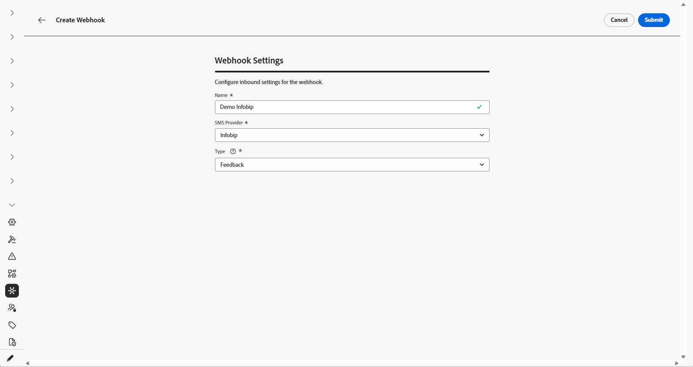
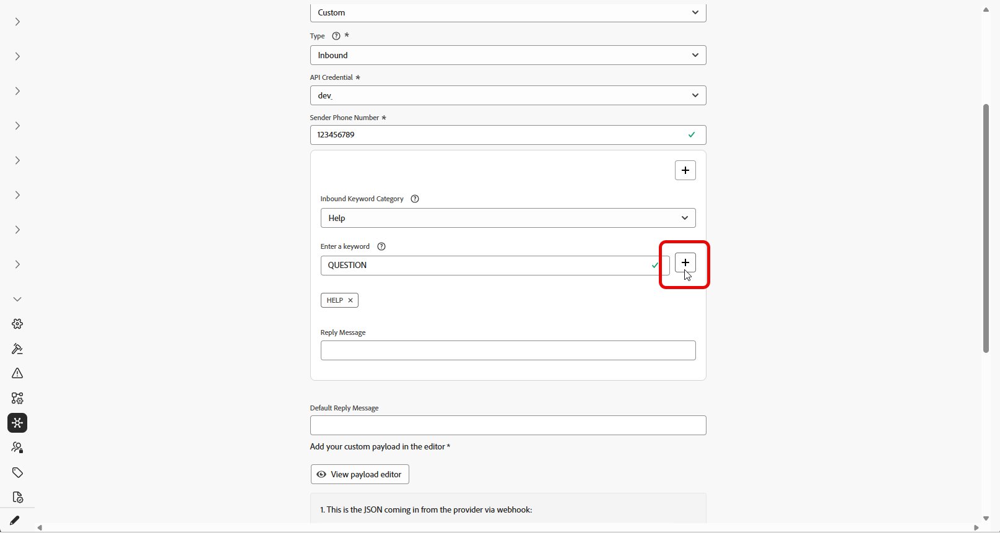

# 웹후크 만들기 {#webhook}

>[!CONTEXTUALHELP]
>id="ajo_channels_sms_webhook_settings_create"
>title="SMS 웹후크 만들기"
>abstract="웹후크를 구성하여 옵트인 및 옵트아웃 동의를 관리하기 위해 인바운드 응답을 캡처하고, 가능한 경우 읽기 확인을 포함한 게재 보고서를 받을 수 있습니다."

>[!CONTEXTUALHELP]
>id="ajo_admin_sms_webhook_flow_type"
>title="웹후크 유형 선택"
>abstract="웹후크를 설정할 때 동의 응답과 사용자 환경 설정을 캡처하려면 **인바운드**&#x200B;를 선택하고, 보고 및 분석을 위해 게재 및 참여 이벤트를 추적하려면 **[!UICONTROL 피드백]**&#x200B;을 선택합니다."

>[!BEGINSHADEBOX]

Journey Optimizer에서 새 API 자격 증명을 만들 때, 이제 SMS 웹후크를 통해 인바운드 키워드와 게재 및 오류와 같은 피드백 이벤트를 모두 캡처할 수 있습니다. 공급자마다 기능이 다르기 때문에 웹후크를 활성화하는 지침이 별도로 있습니다.
이제 웹후크가 사용자 정의 공급자를 지원하므로 Journey Optimizer에서 보고 및 조치를 취할 공급자로부터 피드백 및 인바운드 키워드 수집을 수집할 수 있습니다.

* **새 고객:** SMS 웹후크를 올바르게 구성하기 위한 지침을 따를 수 있습니다.

* **기존 고객:** API 자격 증명에 저장된 정보에서 웹후크로 마이그레이션할 수 있으며 고객이 마이그레이션할 타임라인이 없습니다. SMS 웹후크로 마이그레이션하려는 기존 고객의 경우 마이그레이션 가이드에 설명된 대로 마이그레이션 단계를 수행해야 합니다.

>[!ENDSHADEBOX]

## 개요 {#overview}

API 자격 증명이 정상적으로 생성되면 이제 옵트인 및 옵트아웃 동의 관리를 위한 인바운드 응답을 캡처하고, 사용 가능한 경우 읽기 확인을 포함한 게재 보고서를 수신하도록 웹후크를 구성할 수 있습니다.

웹후크를 설정할 때 캡처할 데이터 유형을 기반으로 용도를 정의할 수 있습니다.

* **인바운드**: 옵트인 또는 옵트아웃과 같은 동의 응답을 캡처하고 사용자 환경 설정을 수집하려면 이 옵션을 사용합니다.

* **피드백**: 보고 및 분석을 지원하기 위해 게재, 아웃바운드 오류, 수신 확인 읽기(해당되는 경우)를 포함한 게재 및 참여 이벤트를 추적하려면 이 옵션을 선택합니다.

공급업체에 따라 SMS를 성공적으로 구현하기 위해 설정해야 하는 항목에 대한 다양한 기대가 있습니다.

* **Sinch 및 Sinch 대화**: 인바운드 이벤트와 피드백 이벤트를 모두 처리하는 웹 후크 하나를 만듭니다. 페이로드 구성은 필요하지 않습니다.

* **Infobip**: 인바운드 이벤트에 대해 하나, 피드백 이벤트에 대해 하나, 별도의 웹 후크를 두 개 만듭니다. Webhook에 페이로드 구성이 필요하지 않습니다.

* **Twilio**: 웹후크를 사용할 수 없습니다. 인바운드 및 피드백 데이터 수집은 지원되지 않습니다.

* **사용자 지정 공급자**: 인바운드 이벤트 및 피드백 이벤트에 대해 하나씩 두 개의 개별 웹후크를 만듭니다. 두 웹후크가 모두 제대로 작동하려면 페이로드 구성이 필요합니다.

### 공급자 지원 {#provider-support}

>[!NOTE]
>
>지원되는 유일한 Webhook 형식은 JSON입니다. 웹 후크에 대한 양식 데이터는 지원되지 않습니다.

다음 표는 인바운드 및 피드백 웹후크를 지원하는 공급자와 페이로드 생성이 필요한지 여부를 보여 줍니다.

| 공급자 | 인바운드 Webhook | 피드백 Webhook | 키워드 | 페이로드 생성 필요 | Webhook 필요 | 페이로드 생성 |
| --- | --- | --- | --- | --- | --- | --- |
| 정보 피드 | 구성 가능 | 구성 가능 | 구성 가능 | 필요 없음 | 필수 여부 | 필요 없음 |
| Sinch | 구성 가능 | 구성 가능 | 구성 가능 | 필요 없음 | 아니요. 통합 지원 | N/A |
| Sinch 대화 | 구성 가능 | 구성 가능 | 구성 가능 | 필요 없음 | 아니요. 통합 지원 | N/A |
| 트빌리오 | 사용할 수 없음 | 사용할 수 없음 | 사용할 수 없음 | 사용할 수 없음 | 사용할 수 없음 | N/A |
| 사용자 정의 | 구성 가능 | 구성 가능 | 구성 가능 | 필수 여부 | 필수 여부 | 필수 여부 |

API 자격 증명에서 SMS 웹후크로 이동하는 고객의 경우 마이그레이션 경로에 대한 정보는 마이그레이션 안내서에 있습니다.

## Webhook 만들기

### Sinch 및 Sinch 대화용 {#create-webhook-sinch}

Sinch 및 Sinch 대화의 경우 인바운드 이벤트와 피드백 이벤트를 모두 처리하는 단일 웹후크를 만듭니다. 사용자 지정 페이로드 구성은 필요하지 않습니다.

1. 왼쪽 레일에서 **[!UICONTROL 관리]** `>` **[!UICONTROL 채널]**(으)로 이동하고 **[!UICONTROL SMS 설정]**&#x200B;에서 **[!UICONTROL SMS 웹후크]** 메뉴를 선택한 다음 **[!UICONTROL 웹후크 만들기]** 단추를 클릭합니다.

   

1. 아래에 자세히 설명된 대로 웹후크 설정을 구성합니다.

   * **[!UICONTROL 이름]**: 웹후크의 이름을 입력하십시오.

   * **[!UICONTROL SMS 공급업체 선택]**: Sinch 또는 Sinch 대화 가능

   * **[!UICONTROL API 자격 증명]**: 드롭다운에서 [이전에 구성한 API 자격 증명](sms-configuration-sinch.md)을 선택합니다.

   * **[!UICONTROL 보낸 사람 전화 번호]**: 통신에 사용할 보낸 사람 전화 번호를 입력하십시오.

   

1. **[!UICONTROL 키워드 입력]** 필드에 키워드를 입력하여 인바운드 키워드 설정을 시작합니다. 여러 키워드를 추가하고 제거할 수 있습니다. 키워드는 대/소문자를 구분하지 않습니다.

   

1. **[!UICONTROL 인바운드 키워드 범주]** 드롭다운에서 키워드 범주를 선택하여 구성하십시오.

   +++ 옵트인

   * 동의를 얻어 사용자를 옵트인하는 키워드를 활성화합니다. 사용자의 메시지가 구성된 키워드와 일치하면 SMS 메시지를 수신하기 위해 해당 전화 번호를 선택합니다.

   * 기본적으로 Subscribe, Yes, Unstop, Continue, Resume 및 Begin 키워드가 활성화됩니다. 을(를) 클릭하여 기본 키워드를 제거합니다.

   * **[!UICONTROL 응답 메시지]** 필드를 사용하여 사용자의 인바운드 메시지가 옵트인 키워드와 일치할 때 자동으로 전송되는 메시지를 만듭니다.

   +++

   +++ 옵트아웃

   * 사용자를 옵트아웃하고 텍스트 메시지 전송에 대한 동의를 제거하는 키워드를 활성화합니다. 사용자의 메시지가 구성된 키워드와 일치하면 해당 전화번호는 SMS 메시지를 수신하지 않도록 옵트아웃됩니다.

   * 기본적으로 Stop, Quit, Cancel, End, Unsubscribe, No 키워드가 활성화됩니다. 을(를) 클릭하여 기본 키워드를 제거합니다.

   * **[!UICONTROL 응답 메시지]** 필드를 사용하여 사용자의 인바운드 메시지가 옵트아웃 키워드와 일치할 때 자동으로 전송되는 메시지를 만듭니다.

   * 구성된 옵트아웃 키워드와 유사한 키워드를 검색하려면 **[!UICONTROL 퍼지 논리]**&#x200B;를 활성화하십시오. 사용자의 응답이 가깝지만 정확하지 않은 경우 **[!UICONTROL 유사 자동 응답]** 필드에 입력한 메시지가 전송됩니다. 일반적으로 이 메시지는 옵트아웃이 발생하지 않았음을 나타내며 구독을 취소하는 데 필요한 정확한 키워드를 지정합니다.

   +++

   +++ 이중 옵트인

   * 이중 옵트인 요구 사항에 대한 키워드를 활성화합니다. 사용자의 메시지가 구성된 키워드와 일치하는 경우, 이 단계에서 완전히 옵트인되지 않습니다. 이 2단계 동의 워크플로를 사용하려면 사용자가 두 번째 키워드로 옵트인을 확인해야 합니다.

   * 이중 옵트인 키워드가 일치할 때 자동으로 전송되는 메시지를 만들려면 **[!UICONTROL 응답 메시지]** 필드를 사용하십시오. 이 메시지는 사용자에게 옵트인 프로세스를 완료하기 위해 옵트인 키워드를 입력하도록 지시합니다.

   +++

   +++ 도움말

   * 도움이 요청될 때 표준 응답을 제공하는 키워드를 활성화합니다. 사용자의 메시지가 구성된 키워드와 일치하면 도움말 회신 메시지를 받습니다.

   * 기본적으로 도움말, 정보, 정보 키워드가 활성화됩니다. 을(를) 클릭하여 기본 키워드를 제거합니다.

   * **[!UICONTROL 응답 메시지]** 필드를 사용하여 사용자의 인바운드 메시지가 도움말 키워드와 일치할 때 자동으로 전송되는 메시지를 만듭니다.

   +++

   +++ 사용자 정의

   * 단일 사용자 지정 키워드를 구성합니다. 사용자의 메시지가 이 키워드와 일치하면 보고 및 대상 작성을 위해 **[!UICONTROL 메시지 피드백 추적]** 데이터 집합에 키워드가 기록됩니다.

   * 여정 및 캠페인에 사용하기 위해 이 키워드를 참조하는 대상(스트리밍 또는 배치)을 빌드합니다.

   +++

1. **[!UICONTROL 기본 회신 메시지]**&#x200B;를 입력하세요. 이 메시지는 사용자의 응답이 구성된 키워드와 일치하지 않을 때 자동으로 전송됩니다.

   

1. **[!UICONTROL 제출]**&#x200B;을 클릭하여 웹후크 구성을 저장합니다.

1. **[!UICONTROL 웹후크]** 메뉴에서 기존 웹후크를 편집하거나 삭제할 수 있습니다.

1. 새로 만든 웹후크에 액세스하여 **[!UICONTROL 웹후크 URL]**&#x200B;을(를) 복사합니다.

   

1. **[!UICONTROL Webhook URL]**&#x200B;을(를) 사용하여 **Feedback** 및 **Inbound** 이벤트를 Journey Optimizer으로 보낼 수 있습니다.

   * SMS 채널의 경우 [Sinch 설명서에서 자세히 알아보기](https://community.sinch.com/t5/SMS/How-do-I-assign-a-callback-URL-to-an-SMS-service/ta-p/8414)

   * MMS 채널의 경우 [Sinch 설명서에서 자세히 알아보기](https://developers.sinch.com/docs/conversation/getting-started#5-handle-incoming-messages)

   * Journey Optimizer을 통해 직접 SMS를 구매한 고객의 경우 Adobe 지원으로 지원 티켓을 제출하십시오. Adobe 계정 팀이 웹후크 URL을 구성합니다.
     

웹후크가 기존 채널 구성에 첨부된 API 자격 증명을 사용하는 경우 웹후크는 즉시 적용됩니다. 그렇지 않으면 새 채널 구성을 만듭니다.

➡️[채널 구성에 대해 자세히 알아보기](sms-configuration-surface.md)

### Infobip용 {#create-webhook-infobip}

Infobip의 경우 피드백 이벤트에 대해 만들고 인바운드 이벤트에 대해 만드는 두 개의 별도 웹후크를 만듭니다.

1. 왼쪽 레일에서 **[!UICONTROL 관리]** `>` **[!UICONTROL 채널]**(으)로 이동하고 **[!UICONTROL SMS 설정]**&#x200B;에서 **[!UICONTROL SMS 웹후크]** 메뉴를 선택한 다음 **[!UICONTROL 웹후크 만들기]** 단추를 클릭합니다.

   

1. 아래에 자세히 설명된 대로 웹후크 설정을 구성합니다.

   * **[!UICONTROL 이름]**: 웹후크의 이름을 입력하십시오.

   * **[!UICONTROL SMS 공급업체 선택]**: Infobip.

   * **[!UICONTROL 유형]**: 피드백 또는 인바운드를 선택하십시오. 두 가지를 개별적으로 생성해야 합니다. 여기에서는 Inbound로 시작합니다.

   * **[!UICONTROL API 자격 증명]**: 드롭다운에서 [이전에 구성한 API 자격 증명](sms-configuration-infobip.md#api-credential)을 선택합니다.

   * **[!UICONTROL 보낸 사람 전화 번호]**: 통신에 사용할 보낸 사람 전화 번호를 입력하십시오.

   

1. **[!UICONTROL 키워드 입력]** 필드에 키워드를 입력하여 인바운드 키워드 설정을 시작합니다. 여러 키워드를 추가하고 제거할 수 있습니다. 키워드는 대/소문자를 구분하지 않습니다.

   

1. **[!UICONTROL 인바운드 키워드 범주]** 드롭다운에서 키워드 범주를 선택하여 구성하십시오.

   +++ 옵트인

   * 동의를 얻어 사용자를 옵트인하는 키워드를 활성화합니다. 사용자의 메시지가 구성된 키워드와 일치하면 SMS 메시지를 수신하기 위해 해당 전화 번호를 선택합니다.

   * 기본적으로 Subscribe, Yes, Unstop, Continue, Resume 및 Begin 키워드가 활성화됩니다. 을(를) 클릭하여 기본 키워드를 제거합니다.

   * **[!UICONTROL 응답 메시지]** 필드를 사용하여 사용자의 인바운드 메시지가 옵트인 키워드와 일치할 때 자동으로 전송되는 메시지를 만듭니다.

   +++

   +++ 옵트아웃

   * 사용자를 옵트아웃하고 텍스트 메시지 전송에 대한 동의를 제거하는 키워드를 활성화합니다. 사용자의 메시지가 구성된 키워드와 일치하면 해당 전화번호는 SMS 메시지를 수신하지 않도록 옵트아웃됩니다.

   * 기본적으로 Stop, Quit, Cancel, End, Unsubscribe, No 키워드가 활성화됩니다. 을(를) 클릭하여 기본 키워드를 제거합니다.

   * **[!UICONTROL 응답 메시지]** 필드를 사용하여 사용자의 인바운드 메시지가 옵트아웃 키워드와 일치할 때 자동으로 전송되는 메시지를 만듭니다.

   * 구성된 옵트아웃 키워드와 유사한 키워드를 검색하려면 **[!UICONTROL 퍼지 논리]**&#x200B;를 활성화하십시오. 사용자의 응답이 가깝지만 정확하지 않은 경우 **[!UICONTROL 유사 자동 응답]** 필드에 입력한 메시지가 전송됩니다. 일반적으로 이 메시지는 옵트아웃이 발생하지 않았음을 나타내며 구독을 취소하는 데 필요한 정확한 키워드를 지정합니다.

   +++

   +++ 이중 옵트인

   * 이중 옵트인 요구 사항에 대한 키워드를 활성화합니다. 사용자의 메시지가 구성된 키워드와 일치하는 경우, 이 단계에서 완전히 옵트인되지 않습니다. 이 2단계 동의 워크플로를 사용하려면 사용자가 두 번째 키워드로 옵트인을 확인해야 합니다.

   * 이중 옵트인 키워드가 일치할 때 자동으로 전송되는 메시지를 만들려면 **[!UICONTROL 응답 메시지]** 필드를 사용하십시오. 이 메시지는 사용자에게 옵트인 프로세스를 완료하기 위해 옵트인 키워드를 입력하도록 지시합니다.

   +++

   +++ 도움말

   * 도움이 요청될 때 표준 응답을 제공하는 키워드를 활성화합니다. 사용자의 메시지가 구성된 키워드와 일치하면 도움말 회신 메시지를 받습니다.

   * 기본적으로 도움말, 정보, 정보 키워드가 활성화됩니다. 을(를) 클릭하여 기본 키워드를 제거합니다.

   * **[!UICONTROL 응답 메시지]** 필드를 사용하여 사용자의 인바운드 메시지가 도움말 키워드와 일치할 때 자동으로 전송되는 메시지를 만듭니다.

   +++

   +++ 사용자 정의

   * 단일 사용자 지정 키워드를 구성합니다. 사용자의 메시지가 이 키워드와 일치하면 보고 및 대상 작성을 위해 **[!UICONTROL 메시지 피드백 추적]** 데이터 집합에 키워드가 기록됩니다.

   * 여정 및 캠페인에 사용하기 위해 이 키워드를 참조하는 대상(스트리밍 또는 배치)을 빌드합니다.

   +++

1. **[!UICONTROL 기본 회신 메시지]**&#x200B;를 입력하세요. 이 메시지는 사용자의 응답이 구성된 키워드와 일치하지 않을 때 자동으로 전송됩니다.

   

1. **[!UICONTROL 제출]**&#x200B;을 클릭하여 웹후크 구성을 저장합니다.

1. 이제 **[!UICONTROL Webhooks]** 메뉴에서 Infobip용 **피드백** 웹후크를 만들어야 합니다.

1. 아래에 자세히 설명된 대로 웹후크 설정을 구성합니다.

   * **[!UICONTROL 이름]**: 웹후크의 이름을 입력하십시오.

   * **[!UICONTROL SMS 공급업체 선택]**: Infobip.

   * **[!UICONTROL 유형]**: 피드백을 선택하십시오.

   

1. **[!UICONTROL 제출]**&#x200B;을 클릭하여 피드백 웹후크 구성을 저장합니다.

1. **[!UICONTROL 웹후크]** 메뉴에서 기존 웹후크를 편집하거나 삭제할 수 있습니다.

1. 새로 만든 웹후크에 액세스하고 각 웹후크에서 **[!UICONTROL 웹후크 URL]**&#x200B;을(를) 복사합니다.

   

1. 이제 이러한 URL을 사용하여 두 콜백 URL을 모두 활성화하여 피드백 및 인바운드 이벤트를 Journey Optimizer으로 가져올 수 있습니다.

웹후크가 기존 채널 구성에 첨부된 API 자격 증명을 사용하는 경우 웹후크는 즉시 적용됩니다. 그렇지 않으면 새 채널 구성을 만듭니다.

➡️[채널 구성에 대해 자세히 알아보기](sms-configuration-surface.md)

### 사용자 정의 공급자의 경우 {#create-webhook-custom}

사용자 지정 SMS 공급자의 경우 두 개의 별도 웹후크를 만듭니다. 하나는 피드백 이벤트에 대해 만들고 다른 하나는 인바운드 이벤트에 대해 만듭니다.

1. 왼쪽 레일에서 **[!UICONTROL 관리]** `>` **[!UICONTROL 채널]**(으)로 이동하고 **[!UICONTROL SMS 설정]**&#x200B;에서 **[!UICONTROL SMS 웹후크]** 메뉴를 선택한 다음 **[!UICONTROL 웹후크 만들기]** 단추를 클릭합니다.

   

1. 아래에 자세히 설명된 대로 웹후크 설정을 구성합니다.

   * **[!UICONTROL 이름]**: 웹후크의 이름을 입력하십시오.

   * **[!UICONTROL SMS 공급업체 선택]**: 사용자 지정.

   * **[!UICONTROL 유형]**: 피드백 또는 인바운드를 선택하십시오. 두 가지를 개별적으로 생성해야 합니다. 여기에서는 Inbound로 시작합니다.

   * **[!UICONTROL API 자격 증명]**: 드롭다운에서 [이전에 구성한 API 자격 증명](sms-configuration-custom.md)을 선택합니다.

   * **[!UICONTROL 보낸 사람 전화 번호]**: 통신에 사용할 보낸 사람 전화 번호를 입력하십시오.

   

1. **[!UICONTROL 키워드 입력]** 필드에 키워드를 입력하여 인바운드 키워드 설정을 시작합니다. 여러 키워드를 추가하고 제거할 수 있습니다. 키워드는 대/소문자를 구분하지 않습니다.

   

1. **[!UICONTROL 인바운드 키워드 범주]** 드롭다운에서 키워드 범주를 선택하여 구성하십시오.

   +++ 옵트인

   * 동의를 얻어 사용자를 옵트인하는 키워드를 활성화합니다. 사용자의 메시지가 구성된 키워드와 일치하면 SMS 메시지를 수신하기 위해 해당 전화 번호를 선택합니다.

   * 기본적으로 Subscribe, Yes, Unstop, Continue, Resume 및 Begin 키워드가 활성화됩니다. 을(를) 클릭하여 기본 키워드를 제거합니다.

   * **[!UICONTROL 응답 메시지]** 필드를 사용하여 사용자의 인바운드 메시지가 옵트인 키워드와 일치할 때 자동으로 전송되는 메시지를 만듭니다.

   +++

   +++ 옵트아웃

   * 사용자를 옵트아웃하고 텍스트 메시지 전송에 대한 동의를 제거하는 키워드를 활성화합니다. 사용자의 메시지가 구성된 키워드와 일치하면 해당 전화번호는 SMS 메시지를 수신하지 않도록 옵트아웃됩니다.

   * 기본적으로 Stop, Quit, Cancel, End, Unsubscribe, No 키워드가 활성화됩니다. 을(를) 클릭하여 기본 키워드를 제거합니다.

   * **[!UICONTROL 응답 메시지]** 필드를 사용하여 사용자의 인바운드 메시지가 옵트아웃 키워드와 일치할 때 자동으로 전송되는 메시지를 만듭니다.

   * 구성된 옵트아웃 키워드와 유사한 키워드를 검색하려면 **[!UICONTROL 퍼지 논리]**&#x200B;를 활성화하십시오. 사용자의 응답이 가깝지만 정확하지 않은 경우 **[!UICONTROL 유사 자동 응답]** 필드에 입력한 메시지가 전송됩니다. 일반적으로 이 메시지는 옵트아웃이 발생하지 않았음을 나타내며 구독을 취소하는 데 필요한 정확한 키워드를 지정합니다.

   +++

   +++ 이중 옵트인

   * 이중 옵트인 요구 사항에 대한 키워드를 활성화합니다. 사용자의 메시지가 구성된 키워드와 일치하는 경우, 이 단계에서 완전히 옵트인되지 않습니다. 이 2단계 동의 워크플로를 사용하려면 사용자가 두 번째 키워드로 옵트인을 확인해야 합니다.

   * 이중 옵트인 키워드가 일치할 때 자동으로 전송되는 메시지를 만들려면 **[!UICONTROL 응답 메시지]** 필드를 사용하십시오. 이 메시지는 사용자에게 옵트인 프로세스를 완료하기 위해 옵트인 키워드를 입력하도록 지시합니다.

   +++

   +++ 도움말

   * 도움이 요청될 때 표준 응답을 제공하는 키워드를 활성화합니다. 사용자의 메시지가 구성된 키워드와 일치하면 도움말 회신 메시지를 받습니다.

   * 기본적으로 도움말, 정보, 정보 키워드가 활성화됩니다. 을(를) 클릭하여 기본 키워드를 제거합니다.

   * **[!UICONTROL 응답 메시지]** 필드를 사용하여 사용자의 인바운드 메시지가 도움말 키워드와 일치할 때 자동으로 전송되는 메시지를 만듭니다.

   +++

   +++ 사용자 정의

   * 단일 사용자 지정 키워드를 구성합니다. 사용자의 메시지가 이 키워드와 일치하면 보고 및 대상 작성을 위해 **[!UICONTROL 메시지 피드백 추적]** 데이터 집합에 키워드가 기록됩니다.

   * 여정 및 캠페인에 사용하기 위해 이 키워드를 참조하는 대상(스트리밍 또는 배치)을 빌드합니다.

   +++

1. **[!UICONTROL 기본 회신 메시지]**&#x200B;를 입력하세요. 이 메시지는 사용자의 응답이 구성된 키워드와 일치하지 않을 때 자동으로 전송됩니다.

   

1. 공급자로부터 받은 JSON과 일치하는 사용자 지정 페이로드를 만듭니다. 지원되는 유일한 Webhook 형식은 JSON입니다. 웹 후크에 대한 양식 데이터는 지원되지 않습니다.

   인바운드 웹후크에서 공급자의 웹후크에서 값을 받으려면 다음 필드가 필요합니다.

   * **InboundMessage**: 사용자로부터 받은 인바운드 메시지 또는 키워드입니다.
   * **ProfileNumber**: 메시지를 보낸 사용자의 전화 번호입니다.
   * **RequestID**: 특정 트랜잭션을 식별하기 위해 SMS 공급자가 제공한 고유 식별자입니다.
   * **OriginTimestamp**: 메시지가 수신된 시점의 타임스탬프(UTC 형식)입니다.
   * **InboundNumber**: 이 웹후크 구성에 사용되는 전화 번호입니다.

   +++페이로드 예제

       &quot;json
       {
       &quot;inboundMessage&quot;: &quot;{{inboundMessage}}&quot;,
       &quot;profileNumber&quot;: &quot;{{profileNumber}}&quot;,
       &quot;requestId&quot;: &quot;{{requestId}}&quot;,
       &quot;originTimestamp&quot;: &quot;{{originTimestamp}}&quot;,
       &quot;인바운드 번호&quot;: &quot;{{inboundNumber}}&quot;
       
       &quot;
   +++

1. JSON 파일이 만들어지면 **[!UICONTROL 페이로드 편집기 보기]**&#x200B;를 클릭한 다음, JSON 페이로드를 복사하여 편집기에 붙여 넣고 저장하십시오.

   

1. **[!UICONTROL 제출]**&#x200B;을 클릭하여 웹후크 구성을 저장합니다.

1. 이제 **[!UICONTROL Webhooks]** 메뉴에서 사용자 지정 공급자에 대한 **피드백** 웹후크를 만들어야 합니다.

1. 아래에 자세히 설명된 대로 웹후크 설정을 구성합니다.

   * **[!UICONTROL 이름]**: 웹후크의 이름을 입력하십시오.

   * **[!UICONTROL SMS 공급업체 선택]**: 사용자 지정.

   * **[!UICONTROL 유형]**: 피드백을 선택하십시오.

   

1. 공급자의 JSON 포맷과 일치하는 사용자 지정 페이로드를 만듭니다. 지원되는 유일한 Webhook 형식은 JSON입니다. 웹 후크에 대한 양식 데이터는 지원되지 않습니다.

   피드백 웹후크에서 공급자의 웹후크에서 값을 받으려면 다음 필드가 필요합니다.

   * **클라이언트 참조**: 로깅 목적으로 페이로드에 반환되는 고유 식별자입니다.
   * **코드**: SMS 공급자가 제공한 오류 코드입니다.
   * **상태**: SMS 공급자가 제공한 실패 상태입니다.

   +++페이로드 예제

       &quot;json
       {
       &quot;clientReference&quot;: &quot;{{client_reference}}&quot;,
       &quot;상태&quot;: [
       {
       &quot;code&quot;: &quot;{{failureCode}}&quot;,
       &quot;상태&quot;: &quot;{{feedbackStatus}}&quot;
       
       ]
       }
       &quot;
   
   +++

1. **[!UICONTROL 페이로드 편집기 보기]**&#x200B;를 클릭한 다음 JSON 페이로드를 복사하여 편집기에 붙여 넣고 저장합니다.

   

1. **[!UICONTROL 제출]**&#x200B;을 클릭하여 피드백 웹후크 구성을 저장합니다.

1. **[!UICONTROL 웹후크]** 메뉴에서 기존 웹후크를 편집하거나 삭제할 수 있습니다.

1. 새로 만든 웹후크에 액세스하고 각 웹후크에서 **[!UICONTROL 웹후크 URL]**&#x200B;을(를) 복사합니다.

1. Journey Optimizer의 해당 웹후크 URL에 **피드백** 및 **인바운드** 이벤트를 보내도록 SMS 공급자를 구성하십시오.

   구성 지침은 SMS 공급자에 따라 다릅니다. 콜백 URL 설정에 대한 자세한 내용은 공급자의 설명서를 참조하십시오.

웹후크가 기존 채널 구성에 첨부된 API 자격 증명을 사용하는 경우 웹후크는 즉시 적용됩니다. 그렇지 않으면 새 채널 구성을 만듭니다.

➡️[채널 구성에 대해 자세히 알아보기](sms-configuration-surface.md)
