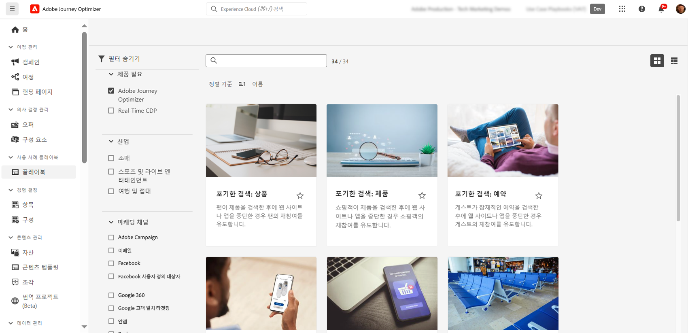

# AI 및 지능형 기능 {#ai-features}

Adobe Journey Optimizer은 인공 지능과 머신 러닝의 기능을 활용하여 탁월한 고객 경험을 만들고, 최적화하고, 제공할 수 있도록 지원합니다. AI 기능은 개인화된 콘텐츠 생성에서 최적의 전송 시간 예측에 이르기까지 워크플로를 간소화하고 효과를 극대화합니다. 사용 사례 플레이북은 일반적인 마케팅 시나리오를 빠르게 구현하기 위해 사전 빌드된 템플릿을 제공합니다.

## AI 어시스턴트 {#ai-assistant}

AI Assistant는 Adobe Journey Optimizer에 대한 대화형 안내서입니다. 제품 기능에 대한 즉각적인 답변, 여정에 대한 운영 통찰력 및 플랫폼 탐색에 대한 도움말을 얻으려면 이것을 사용하십시오.

### AI 어시스턴트 액세스

상단 표시줄의 AI Assistant 아이콘을 클릭하여 화면 오른쪽의 Assistant 패널을 엽니다.

>[!IMPORTANT]
>
>AI Assistant를 사용하기 전에 [Adobe Experience Cloud 생성 AI 사용자 지침](https://experienceleague.adobe.com/ko/docs/experience-platform/ai-assistant/home){target="_blank"}에 동의해야 합니다.

### AI 비서가 수행할 수 있는 작업

**제품 지식** - Adobe Journey Optimizer 기능 및 개념에 대해 질문하기:

* &quot;Adobe Journey Optimizer에서 캠페인을 설정하려면 어떻게 해야 합니까?&quot;
* &quot;여정에서 사용할 사용자 지정 작업을 만들려면 어떻게 합니까?&quot;
* &quot;하나의 샌드박스에서 몇 개의 라이브 활동을 가질 수 있습니까?&quot;

**Operational Insights(Beta)** - 여정에 대한 실시간 정보 가져오기:

* &quot;보유한 라이브 여정은 몇 개입니까?&quot;
* &quot;모든 예약된 여정 목록 제공&quot;
* &quot;지난 7일 동안 생성된 여정은 몇 개입니까?&quot;

>[!NOTE]
>
>Operational Insights는 현재 **여정**&#x200B;에서만 사용할 수 있으며 현재 샌드박스의 데이터를 반영합니다.

### AI Assistant 사용 방법

1. 패널 하단의 텍스트 필드에 질문을 입력합니다
2. 쿼리를 제출하려면 Enter 키를 누르십시오.
3. AI가 생성한 응답 검토
4. 관련 문서에 액세스하려면 **소스 표시**&#x200B;를 클릭하십시오.
5. 엄지 손가락을 사용하여 응답 품질 평가

{width="40%" align="left"}

[Experience Platform에서 AI Assistant에 대해 자세히 알아보기](https://experienceleague.adobe.com/ko/docs/experience-platform/ai-assistant/home){target="_blank"}

## 여정 최적화를 위한 고급 AI 에이전트 {#ai-agents}

AI Assistant의 대화 기능을 기반으로 하는 Adobe Journey Optimizer은 여정 최적화 및 실험을 위해 심층적인 분석과 실행 가능한 권장 사항을 제공하는 전문 AI 에이전트를 제공합니다.

### 여정 분석 에이전트 {#journey-agent}

[여정 분석 에이전트](https://experienceleague.adobe.com/ko/docs/experience-cloud-ai/experience-cloud-ai/agents/ajo-agent-analyze){target="_blank"}를 사용하면 자연어 분석을 통해 여정 성능을 최적화할 수 있습니다.

+++**주요 기능**

* **여정 폴아웃 분석** - 여정 중에 고객이 중단되는 위치와 이유를 식별하고, 이탈 패턴을 감지합니다.
* **대상 겹침 감지** - 여러 여정에 걸쳐 대상 겹침을 분석하여 피로가 과도하게 타기팅되지 않도록 합니다.
* **충돌 검색 예약** - 동일한 대상을 타깃팅하는 예약된 여정 간의 시간 충돌을 식별합니다.
* **Operational Insights** - &quot;모든 라이브 여정 표시&quot; 또는 &quot;X개 이상의 여정에서 사용되는 대상&quot;과 같은 프롬프트 기반 인사이트를 얻습니다.

+++

+++**샘플 프롬프트**

* &quot;\[여정 이름\] 여정에 대한 폴아웃 분석 수행&quot;
* &quot;\[여정 이름\] 여정에 대해 일정 충돌이 있습니까?&quot;
* &quot;여정 \[여정 이름\]에 대한 대상 겹침 충돌 표시&quot;
* &quot;5개 이상의 여정에서 사용되는 대상자는 무엇입니까?&quot;

+++

+++**필요한 권한**

* **여정 보기** - AI Assistant에서 직접 여정에 대한 인사이트 보기
* **여정 관리** - AI Assistant에서 직접 새 여정 만들기
* **세그먼트 보기** - 대상에 대한 인사이트 보기
* **세그먼트 관리** - AI Assistant에서 직접 새 대상 만들기

+++

### 실험용 에이전트 {#experimentation-agent}

[실험 에이전트](https://experienceleague.adobe.com/ko/docs/experience-cloud-ai/experience-cloud-ai/agents/agent-experiment){target="_blank"}은(는) 웹 사이트, 이메일, 푸시 메시지 및 응용 프로그램에서 디지털 실험을 실행하고 관리하는 방법을 현대화합니다.

+++**주요 기능**

* **성능 분석** - 실험에서 발생한 내용을 명확하게 보기
* **인사이트 생성** - 결과가 발생한 이유에 대한 설명
* **기회 검색** - 수행할 다음 작업에 대한 지침
* **콘텐츠 분석** - 메시징 요소를 검사하여 특정 처리가 다른 처리보다 뛰어난 이유를 파악합니다.
* **권장 사항 생성** - 통찰력을 기반으로 새로운 처리 또는 조정을 제안합니다.

+++

+++**샘플 프롬프트**

* &quot;\[Campaign Name\]에 대해 실행 중인 실험은 무엇입니까?&quot;
* &quot;내 \[Experiment Name\]의 경우 어떤 처리가 선행됩니까?&quot;
* &quot;\[실험 이름\]에서 무엇을 배웠습니까?&quot;
* &quot;이 실험 후 다음에 무엇을 하기를 추천합니까?&quot;
* &quot;최근 테스트에서 나타나는 일반적인 패턴은 무엇입니까?&quot;

+++

+++**필요한 권한**

* **실험 보기** - AI Assistant에서 실험에 대한 인사이트 보기
* **실험 메타데이터 관리** - AI Assistant에서 새 실험 만들기

**참고:** Journey Optimizer Experimentation Accelerator 라이선스에서 사용할 수 있습니다.

+++

### 추가 AI 에이전트

**Audience Agent** - 중복 감지 및 크기 추적을 포함하여 Adobe Experience Platform 전반에서 대화형 대상 탐색 및 관리용입니다. [Audience Agent에 대해 자세히 알아보기](https://experienceleague.adobe.com/ko/docs/experience-cloud-ai/experience-cloud-ai/agents/audience){target="_blank"}

**Agent Orchestrator** - 여러 전문 에이전트를 조정하여 복잡하고 여러 단계로 진행되는 마케팅 문제를 해결합니다. Orchestrator는 어떤 에이전트를 포함할 것인지 자동으로 결정하고 작업의 순서를 효율적으로 지정합니다. [Agent Orchestrator에 대해 자세히 알아보기](https://experienceleague.adobe.com/ko/docs/experience-cloud-ai/experience-cloud-ai/agents/agent-orchestrator){target="_blank"}

## AI 기반 콘텐츠 생성 {#content-generation}

생성 AI를 사용하여 여러 채널에서 콘텐츠를 만들고 개인화하여 콘텐츠 생성 프로세스를 가속화하면서 브랜드 일관성을 유지할 수 있습니다. 콘텐츠 생성을 위한 AI 도우미는 [이메일](../email/get-started-email.md), [푸시 알림](../push/get-started-push.md), [SMS](../sms/get-started-sms.md) 및 [웹](../web/get-started-web.md) 경험에 사용할 수 있습니다. 이를 통해 제목란, 본문, 이미지 및 전체 메시지 변형을 생성할 수 있습니다.

### 주요 기능

* **텍스트 생성** - 브랜드 음성 및 목표에 따라 매력적인 복사본을 만듭니다. [AI로 텍스트 생성](../content-management/generative-text.md)
* **이미지 생성** - Adobe Firefly을 사용하여 사용자 지정 이미지를 생성합니다. [AI로 이미지 생성](../content-management/generative-image.md)
* **콘텐츠 변형** - A/B 테스트를 위해 여러 변형을 생성합니다. [AI로 콘텐츠 실험](../content-management/generative-experimentation.md)
* **브랜드 정렬** - 생성된 콘텐츠가 브랜드 지침과 일치하는지 확인합니다. [브랜드 정렬 평가](../content-management/brands-score.md)
* **템플릿 지원** - 기존 전자 메일 템플릿을 활용합니다. [콘텐츠 템플릿 작업](../content-management/content-templates.md)

### 모범 사례

* **구체적으로** - 더 나은 결과를 위해 명확하고 자세한 메시지를 제공합니다.
* **브랜드 자산 업로드** - 브랜드 일관성을 유지하기 위해 PDF, 이미지 또는 ZIP 파일(최대 50MB)을 사용합니다.
* **사용자 지정 템플릿 사용** - 최대 8~10개의 이미지로 브랜드별 템플릿 활용
* **피드백 제공** - AI 모델을 개선하는 데 도움이 되는 출력 평가
* **모든 콘텐츠 검토** - 게시하기 전에 AI에서 생성한 콘텐츠를 항상 정확하게 검토하십시오.

[AI 콘텐츠 생성에 대해 자세히 알아보기](../content-management/gs-generative.md)

## 전송 시간 최적화 {#send-time-optimization}

AI를 사용하여 개별 고객 행동 패턴을 기반으로 각 메시지를 전송할 최적의 시간을 예측하여 참여를 극대화합니다.

### 작동 방법

Send-Time Optimization은 내역 참여 데이터(열기 및 클릭 수)를 분석하여 각 고객이 메시지를 가장 많이 활용할 수 있는 시기를 예측합니다. 시스템은 지정된 기간 내에 자동으로 게재를 예약합니다.

### 사용 시기

| 다음에 대한 우수 사례 | 권장되지 않음 |
|----------|---------------------|
| 마케팅 캠페인 및 뉴스레터 | 시간에 민감한 운영 메시지(주문 확인, 암호 재설정) |
| 프로모션 메시지 | 긴급 알림(비행 지연, 긴급 경고) |
| 교육 콘텐츠 | 특정 시간 요구 사항이 있는 이벤트 기반 메시지 |
| 참여 캠페인 | |

[전송 시간 최적화에 대해 자세히 알아보기](../building-journeys/send-time-optimization.md)

## 의사 결정을 위한 AI 모델 {#ai-decisioning}

각 고객에게 표시할 오퍼를 자동으로 최적화하여 비즈니스 목표를 극대화하는 지능형 순위 모델을 생성합니다.

### 모델 유형

**자동 최적화** - 고객 상호 작용에서 학습하여 시간이 지남에 따라 자동으로 오퍼 성능을 향상시킵니다.

**개인화된 최적화** - 고객 프로필 특성 및 동작을 사용하여 각 개인에게 가장 적합한 오퍼를 예측합니다.

### 요구 사항

* 충분한 상호 작용 데이터가 있는 최소 2개의 오퍼:
   * 100개 이상의 디스플레이 이벤트
   * 5개 이상의 클릭 이벤트
   * 지난 14일 이내
* 조직당 최대 5개의 AI 등급 모델

[의사 결정을 위한 AI 모델에 대해 자세히 알아보기](../experience-decisioning/ranking/ai-models.md) | [AI 등급 모델 만들기](../experience-decisioning/ranking/create-ai-models.md)

## AI를 사용한 콘텐츠 실험 {#experimentation}

**Experiment Accelerator**&#x200B;를 사용하면 AI 기반 인사이트 및 권장 사항을 통해 실험을 더 빠르게 실행하여 우수성이 검증된 콘텐츠 변형을 더 빨리 식별할 수 있습니다.

주요 기능:

* 자동으로 여러 콘텐츠 변형 생성
* 실험 설계를 위한 AI 추천 받기
* 성과 추세의 조기 지표 가져오기
* 통계적 중요성에 대한 시간 단축

[Experiment Accelerator에 대해 자세히 알아보기](../content-management/experiment-accelerator-gs.md)

## 사용 사례 플레이북 {#playbooks}

사용 사례 플레이북은 일반적인 마케팅 시나리오를 빠르게 구현하는 데 도움이 되는 사전 빌드된 워크플로우입니다. 각 플레이북에는 즉시 사용할 수 있는 여정, 메시지, 스키마 및 세그먼트가 포함되어 있습니다.

### 플레이북 작동 방식

1. 플레이북 라이브러리를 **탐색**&#x200B;하여 목표와 일치하는 사용 사례를 찾습니다
2. 필요한 모든 리소스를 자동으로 생성하려면 플레이북을 **사용**&#x200B;하세요.
3. 브랜드 및 요구 사항에 맞게 생성된 자산을 **사용자 지정**
4. 개발 샌드박스의 프로덕션 또는 테스트에 **배포**

### 사용 가능한 플레이북

다음과 같은 일반적인 시나리오가 필요하면 Journey Optimizer 플레이북을 찾아보십시오.

* 포기한 장바구니 복구
* 새로운 고객을 위한 시작 시리즈
* 구매 후 참여
* 생일 메시지
* 재참여 캠페인

+++**전제 조건**

* 적절한 권한이 있는 샌드박스
* 이메일, 푸시 및/또는 SMS에 대한 채널 구성
* 여정 및 메시지를 만들 수 있는 사용자 권한

+++

[사용 가능한 플레이북 모두 보기](https://experienceleague.adobe.com/docs/experience-platform/use-case-playbooks/playbooks/playbooks-list.html?lang=ko){target="_blank"} | [Experience Platform 설명서에서 자세히 알아보기](https://experienceleague.adobe.com/docs/experience-platform/use-case-playbooks/playbooks/overview.html){target="_blank"}

## 추가 AI 기능 {#additional-capabilities}

### 이미지 HTML 전환기

AI 기반 전환 기술을 사용하여 정적 이미지 디자인(JPEG, PNG)을 편집 가능한 HTML 이메일 템플릿으로 변환합니다.

[HTML에 대한 이미지에 대해 자세히 알아보기](../email/image-to-html.md)

### 브랜드 일관성 점수

톤, 음성 및 메시지 일관성을 측정하는 AI 기반 점수를 사용하여 콘텐츠가 브랜드 지침에 얼마나 잘 부합하는지 평가합니다.

[브랜드 정렬에 대해 자세히 알아보기](../content-management/brands-score.md)

## 자주 묻는 질문 {#faq}

+++**AI 기능에 필요한 권한은 무엇입니까?**

* **[콘텐츠 생성을 위한 AI 도우미](#content-generation)** - &quot;콘텐츠 생성&quot; 권한이 필요합니다.
* **[AI Assistant](#ai-assistant)** 제품 지식 - Adobe 생성 AI 사용자 지침에 동의해야 합니다.
* **[여정 분석 에이전트](#journey-agent)** - 여정 보기/관리 및 세그먼트 보기/관리 권한이 필요합니다.
* **[실험 에이전트](#experimentation-agent)** - 실험 보기 및 실험 메타데이터 관리 권한이 필요합니다.

모든 AI 에이전트를 사용하려면 AI Assistant에 액세스하고 Adobe Experience Cloud 생성 AI 사용자 지침에 동의해야 합니다.

[권한에 대해 자세히 알아보기](../administration/ootb-permissions.md)

+++

+++**AI 생성 콘텐츠는 항상 정확한가요?**

아니요. 정확성 및 브랜드 적절성은 항상 [AI 생성 콘텐츠](#content-generation)를 검토하십시오. 피드백 도구(썸네일 위쪽/아래쪽)를 사용하여 모델을 개선합니다.

+++

+++**주요 제한 사항은 무엇입니까?**

* **[전송 시간 최적화](#send-time-optimization)** - 여정에서 전자 메일 및 푸시에만 사용할 수 있으며 30일 교육 기간이 필요합니다.
* **[AI 콘텐츠 생성](#content-generation)** - DM, 콘텐츠 카드, LINE 또는 WhatsApp에는 사용할 수 없습니다.
* **[AI 등급 모델](#ai-decisioning)** - 조직당 최대 5개 모델, 최소 상호 작용 데이터 필요

+++

+++**이 기능에 액세스하려면 어떻게 해야 합니까?**

대부분의 AI 기능이 Adobe Journey Optimizer에 포함되어 있습니다. [전송 시간 최적화](#send-time-optimization) 또는 [AI 에이전트](#ai-agents)와 같은 일부 기능은 Adobe에서 활성화해야 할 수 있습니다. 특정 라이선스 및 사용 가능한 기능에 대한 자세한 내용은 Adobe 담당자에게 문의하십시오.

+++
