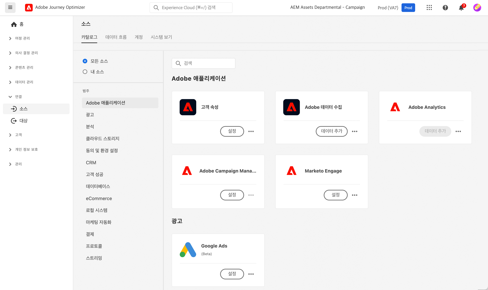

# 소스 커넥터 시작하기 {#sources-gs}

Adobe Journey Optimzer를 사용하면 외부 소스에서 데이터를 수집하는 동시에 Platform 서비스를 사용하여 들어오는 데이터를 구조화하고, 레이블을 지정하고, 개선할 수 있습니다. Adobe 애플리케이션, 클라우드 기반 저장소, 데이터베이스 및 기타 여러 소스와 같은 다양한 소스에서 데이터를 수집할 수 있습니다.

이 비디오에서는 소스 커넥터의 정의와 Journey Optimizer에서 소스 커넥터를 구성하는 방법을 알아봅니다.

>[!VIDEO](https://video.tv.adobe.com/v/335919?quality=12)

소스 커넥터를 사용하여 외부 소스에서 데이터를 수집하는 자세한 방법은 [Adobe Experience Platform 설명서](https://experienceleague.adobe.com/docs/experience-platform/sources/home.html?lang=ko){target="_blank"}에서 확인하실 수 있습니다.
