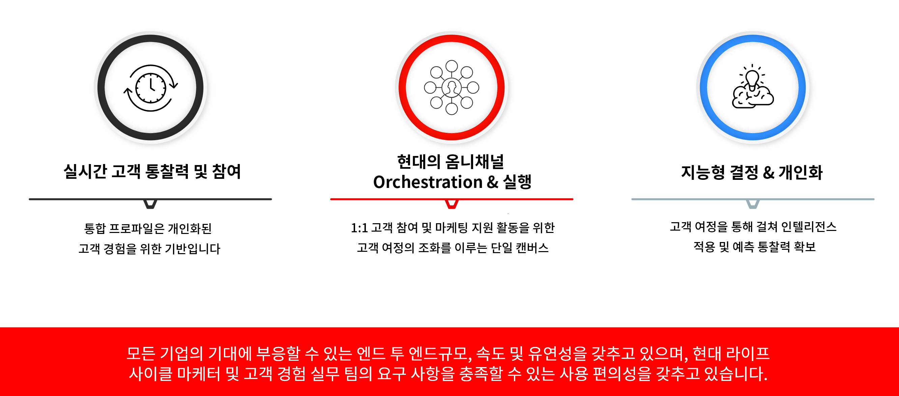

# Journey Optimizer 시작 {#cjm-gs}

>[!CONTEXTUALHELP]
>id="test_id"
>title="일부 테스트 콘텐츠"
>abstract="상황별 도움말을 AJO에 통합하기 위한 테스트 콘텐츠."

## [!DNL Adobe Journey Optimizer] (이)란? {#about-cjm}

[!DNL Adobe Journey Optimizer]는 기업이 고객에게 연관성 있고 상황에 맞는 개인화된 경험을 제공할 수 있도록 해줍니다. 고객 여정은 고객과 브랜드 간의 상호 작용을 위한 전체 프로세스로서, 연락 시작부터 고객이 떠난 시점까지 진행됩니다. 브랜드에 대해 알아보고 높이고 참여를 유도하는 인지도 단계로 시작합니다. 고객은 해당 브랜드와 보다 효과적으로 상호 작용하고, 온라인 및 물리적 사이트를 방문하며, 구매, 메시지 전송 또는 게시물 검토를 수행합니다.

[!DNL Adobe Journey Optimizer]는 기본적으로 [!DNL Adobe Experience Platform]을 기반으로 빌드되었으며 개인화 및 최적화를 위한 통합 실시간 고객 프로필, API 우선 오픈 프레임워크, 중앙 집중식 offer Decisioning 및 AI(인공 지능) 및 ML(머신 러닝)을 결합합니다. Journey Optimizer를 사용하면 전체 고객 여정에서 규모, 속도 및 유연성과 함께 차세대 상호 작용을 지능적으로 결정할 수 있습니다. [!DNL Adobe Journey Optimizer]를 사용하면 회사는 동일한 애플리케이션 내에서 예약된 마케팅 캠페인(예: 소매점의 주별 홍보)과 개인화된 개별 커뮤니케이션(예: 충성도 앱 고객이 이전에 재고 부족 상태인 항목을 검토했을 수 있는 항목에 대한 푸시 알림)을 모두 만들고 게재할 수 있습니다.

➡️ [Journey Optimizer 살펴보기](https://experienceleague.adobe.com/docs/journey-optimizer-learn/tutorials/introduction-to-journey-optimizer/introduction.html?lang=ko){target=&quot;_blank&quot;}(비디오)

## 사용 사례 {#use-cases}

* 마케터는 [!DNL Adobe Journey Optimizer]를 사용하여 개인화된 통신과 대상 기반 일괄 처리 통신을 모두 전송할 수 있습니다. 예를 들어, 의류 매장은 일반적으로 지난 주에 제품을 구매한 모든 고객에게 구매 후 설문 조사를 보냅니다. 악천후 때문에 몇 개의 배송이 지연되었습니다. 배송을 받지 않은 고객을 확인하면 의류 매장에서는 예정된 고객 만족도에서 해당 고객을 제외하고 지연에 대해 사과한 후 고객의 과거 구매를 기반으로 제품 추천과 함께 할인 코드를 제공할 수 있습니다.

   마케터는 애플리케이션을 사용하여 실시간 행동 기반 커뮤니케이션을 전송할 수도 있습니다. 예를 들어, 동일한 리테일 업체는 고객이 매장 주차장에 들어올 때 실시간으로 재입고된 해당 고객 사이즈 스웨터에 대한 푸시 알림을 보내어 단골 고객을 참여시킬 수 있습니다.

* 고객 경험에 참여하는 운영 팀 및 고객 지원과 같은 비마케터는 [!DNL Adobe Journey Optimizer]를 사용하여 운영 알림과 같은 다양한 작업을 관리하거나 온보딩 프로세스를 모니터링할 수 있습니다. 공원 방문자가 공원 경험의 일부로서 모바일 앱을 다운로드하는 놀이공원을 예로 들 수 있습니다. 유지 관리 담당자는 [!DNL Adobe Journey Optimizer]를 사용하여 유지 관리 작업으로 현재 닫힌 놀이기구를 공원 방문자에게 알릴 수 있습니다.

## 주요 기능 {#key-capabilities}

[!DNL Adobe Journey Optimizer]는 모든 앱, 장치 또는 채널에서 개인화되고, 연결되며, 시기적절한 고객 경험을 만들고 게재할 수 있는 민첩하고 확장 가능한 애플리케이션입니다.

주요 기능은 다음을 포함합니다.

* **실시간 고객 인사이트 및 참여** - 통합된 프로필은 행동, 트랜잭션, 재무 및 운영 데이터를 포함하여 고객 접점 전반에 걸쳐 있는 모든 소스의 라이브 데이터를 융합하여 고객을 위한 개인적이고 상황별 경험을 적시에 최적화합니다.

* **최신 옴니채널 오케스트레이션 및 실행** - 1:1 고객 참여 및 마케팅 전달을 위한 고객 여정을 조화롭게 최적화하고 최적화하여 브랜드가 고객 라이프사이클에서 더 많은 가치를 제공할 수 있는 단일 캔버스입니다. [!DNL Adobe Journey Optimizer]에 디자인된 고객 여정은 브랜드가 실시간 신호에 반응하고 이러한 상호 작용을 예약된 캠페인과 연결할 수 있도록 동적 및 이벤트를 기반으로 할 수 있으므로 고객이 언제 어떤 채널을 통해 보낼 커뮤니케이션에 대해 올바른 결정을 내릴 수 있습니다.

* **지능형 의사 결정 및 개인화** - 브랜드는 중앙 집중식 의사 결정을 적용하고 인텔리전스 및 머신 러닝을 통합하여 고객 경험 전반에 대한 예측 인사이트를 보여줄 수 있으므로 의사 결정을 보다 쉽게 자동화하고 경험을 규모에 맞게 최적화할 수 있습니다. Offer Decisioning은 [!DNL Adobe Journey Optimizer]를 통해 대규모로 채널 전반에서 중앙 집중식 오퍼를 구동합니다.

## 아키텍처 {#architecture}

[!DNL Adobe Journey Optimizer]의 기본 아키텍처, 통합 지점, [!DNL Journey Optimizer]와 다른 Adobe 애플리케이션의 관계를 파악합니다.

>[!VIDEO](https://video.tv.adobe.com/v/334205?quality=12)

>[!NOTE]
>
> Adobe Experience Cloud 일반 개인 정보 보호 지침 및 절차는 [!DNL Journey Optimizer]에 적용됩니다. [Adobe Experience Cloud 개인 정보에 대한 자세한 내용을 살펴보십시오](https://www.adobe.com/kr/privacy/experience-cloud.html).
> [시작 전 실시간 고객 프로필 데이터 가드 레일](https://experienceleague.adobe.com/docs/experience-platform/profile/guardrails.html?lang=ko)에 대해 알고 있어야 합니다.

**참조 -**

* [시작하는 주요 단계](quick-start.md)
* [첫 번째 메시지 만들기](../messages/get-started-content.md)
* [여정 디자인 및 메시지 보내기](../building-journeys/journey-gs.md)
* [라이브 보고서](../reports/live-report.md)
* [Journey Optimizer FAQ](assets/do-not-localize/AJO-FAQ.pdf) (PDF)
* [Journey Optimizer 보안 개요](https://www.adobe.com/content/dam/cc/en/security/pdfs/AJO_SecurityOverview.pdf)(PDF)
