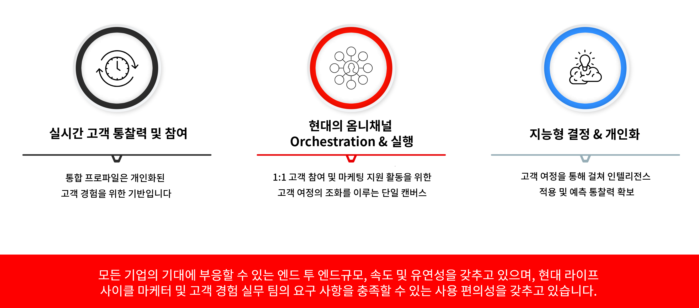
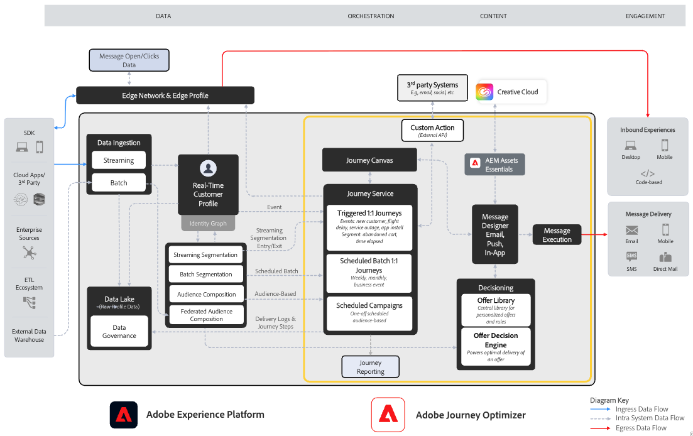

# Journey Optimizer 시작 {#cjm-gs}

이 페이지에서는 Adobe Journey Optimizer의 정의, 대상, 주요 기능 및 Adobe Experience Platform 아키텍처에 적합한 방식을 소개합니다. 새 사용자에게 권장되는 시작점입니다.

## [!DNL Adobe Journey Optimizer] 소개{#about-cjm}

[!DNL Adobe Journey Optimizer]은(는) 모든 채널 및 접점에서 연관성 있고 상황에 맞는 개인화된 고객 경험을 만들고 제공하기 위한 엔터프라이즈 애플리케이션입니다. 기본적으로 [!DNL Adobe Experience Platform]을(를) 기반으로 구축되었으며 통합 실시간 고객 프로필, API 우선 오픈 프레임워크, 중앙 집중식 Offer Decisioning 및 AI/ML 기능을 활용합니다. Journey Optimizer을 사용하면 브랜드가 예약된 마케팅 캠페인과 실시간, 이벤트 트리거 커뮤니케이션을 모두 단일 애플리케이션에서 규모에 맞게 오케스트레이션할 수 있습니다. 그 결과는 고객 충성도와 라이프타임 가치를 높이는 의미 있는 브랜드 경험입니다.

이 안내서는 Journey Optimizer을 처음 사용하는 마케팅 실무자, 운영 팀 및 관리자에게 적용됩니다.

➡️ [Journey Optimizer 살펴보기](https://experienceleague.adobe.com/docs/journey-optimizer-learn/tutorials/introduction-to-journey-optimizer/introduction.html?lang=ko){target="_blank"}(비디오)

<!--
 Use [!DNL Adobe Journey Optimizer] to build multi-step customer journeys that initiate a sequence of interactions, offers, and messages across channels in real time. This approach ensures customers are engaged at the optimal moments based on their actions and relevant business signals. Learn how to build journeys in [this section](../building-journeys/journey-gs.md).

You can also create audience-based campaigns to send messages.
-->

## 사용 사례 {#use-cases}

이러한 예는 다양한 역할, 업계 및 채널에서 Journey Optimizer의 기능이 함께 작동하는 방식을 보여 줍니다.

| 사용 사례 | 역할 | 핵심 기능 |
|----------|------|----------------|
| 선적 복구 지연 | 마케터 | [통합 프로필 + 대상 제외](../audience/get-started-profiles.md) |
| 실시간 매장 참여 | 마케터 | [Geofence 트리거 + 푸시](../push/get-started-push.md) |
| 장바구니 포기 복구 | 마케터 | [이벤트가 트리거된 여러 단계 여정](../building-journeys/journey-gs.md) |
| 스트리밍 서비스 시작 시리즈 | 마케터 | [이벤트가 트리거된 시작 여정](../building-journeys/journey-gs.md) |
| 지침이 포함된 예약 미리 알림 | 마케터 | [예약된 + 위치 인식 메시지](../campaigns/get-started-with-campaigns.md) |
| 사전 서비스 중단 알림 | 작업 | [자동 선택 범위 지정](../audience/about-audiences.md) |
| AI 기반 홍보 캠페인 | 마케터 | [AI 콘텐츠 생성 + 실험](ai-features.md) |
| 모바일 앱을 통한 유지 관리 경고 | 작업 | [비마케팅 오케스트레이션](../building-journeys/journey-gs.md) |

+++**지연된 배송 복구(마케터)**

의류 매장은 일반적으로 지난 주에 제품을 구매한 모든 고객에게 구매 후 설문 조사를 보냅니다. 악천후 때문에 몇 개의 배송이 지연되었습니다. 배송을 받지 않은 고객을 확인하면 의류 매장에서는 예정된 고객 만족도 조사 전송 대상에서 해당 고객을 제외하고 지연에 대해 사과한 후 할인 코드를 제공하며 고객의 과거 구매 내역을 기반으로 제품을 추천할 수 있습니다.

[캠페인 시작](../campaigns/get-started-with-campaigns.md)

+++

+++**실시간 매장 참여(마케터)**

같은 retailer은 재입고된 고객 사이즈 스웨터에 대한 푸시 알림을 보내어 매장 주차장에 실시간으로 들어오는 단골 고객을 참여시킬 수 있다.

[푸시 알림 시작하기](../push/get-started-push.md)

+++

+++**장바구니 포기 복구(마케터)**

고객이 온라인 장바구니에 항목을 추가했지만 구매를 완료하지 않고 떠나면 Journey Optimizer이 실시간으로 이벤트를 감지하고 자동으로 복구 여정을 시작합니다. 고객은 남겨진 항목을 알려 주는 개인화된 이메일을 받게 됩니다. 24시간 이내에 클릭스루하지 않으면 후속 푸시 알림이 전송되며, 브라우징 기록 및 충성도 상태에 따라 개인화됩니다.

[첫 번째 여정 구축](../building-journeys/journey-gs.md)

+++

+++**스트리밍 서비스 시작 시리즈(마케터)**

고객이 스트리밍 서비스에 가입하면 Journey Optimizer이 가입 이벤트를 감지하고 즉시 다단계 환영 여정을 시작합니다. 고객은 앱을 처음 열 수 있도록 권장하는 시작 이메일을 수신합니다. 48시간 이내에 로그인 활동이 감지되지 않으면 등록 중에 명시된 관심사를 기반으로 개인화된 콘텐츠 추천과 함께 후속 푸시 알림이 전송되어 패시브 가입자가 첫날부터 능동적인 참여 사용자로 전환됩니다.

[첫 번째 여정 구축](../building-journeys/journey-gs.md)

+++

+++**지침이 포함된 예약 미리 알림(마케터)**

접대 브랜드는 예약 한 시간 전에 각 고객에게 적시에 미리 알림을 보냅니다. 알림에는 게스트의 이름, 예약 시간 및 장소에 대한 위치 기반 지침이 포함되어 있으며 마케팅 팀의 수동 노력 없이 고객 프로필 및 예약 데이터에서 자동으로 조합됩니다.

[캠페인 시작](../campaigns/get-started-with-campaigns.md)

+++

+++**사전 서비스 중단 알림(운영 팀)**

서비스가 중단되면 Journey Optimizer은 계정 데이터 및 사용 패턴을 기반으로 영향을 받는 고객을 자동으로 식별합니다. 이러한 고객은 문제를 인정하는 사전 알림을 받고 다음 단계를 요약합니다. 즉, 잠재적으로 부정적인 경험을 투명성과 신뢰의 순간으로 전환하여 규모에 맞게 제공할 수 있습니다.

[첫 번째 여정 구축](../building-journeys/journey-gs.md)

+++

+++**AI 기반 홍보 캠페인(마케터)**

제품 출시를 계획하는 소매 브랜드는 Journey Optimizer의 AI Assistant를 사용하여 자연어 프롬프트 및 업로드된 브랜드 지침에 따라 분 단위로 여러 제목 줄 및 본문 사본 변형을 생성합니다. 기본 제공 콘텐츠 실험은 초기 대상 샘플 중에서 가장 성과가 좋은 변형을 자동으로 식별합니다. 그런 다음 우수성이 검증된 메시지가 나머지 수신자에게 배포되어 추가적인 카피라이팅 노력 없이 참여를 극대화합니다.

[AI 및 지능형 기능 살펴보기](ai-features.md) | [콘텐츠 실험에 대해 알아보기](../content-management/experiment-accelerator-gs.md)

+++

+++**모바일 앱을 통한 유지 관리 알림(운영 팀)**

운영 팀 및 고객 지원과 같은 비마케터는 [!DNL Adobe Journey Optimizer]을(를) 사용하여 운영 알림을 관리하거나 온보딩 프로세스를 모니터링할 수 있습니다. 예를 들어 방문자가 경험의 일부로 모바일 앱을 다운로드하는 놀이공원: 유지 관리 직원은 Journey Optimizer을 사용하여 공원 방문자에게 유지 관리로 인해 현재 닫힌 놀이기구를 알릴 수 있습니다.

[첫 번째 여정 구축](../building-journeys/journey-gs.md)

+++

## 주요 기능 {#key-capabilities}

[!DNL Adobe Journey Optimizer]는 모든 앱, 장치 또는 채널에서 개인화되고, 연결되며, 시기적절한 고객 경험을 만들고 게재할 수 있는 민첩하고 확장 가능한 애플리케이션입니다.

주요 기능은 다음을 포함합니다.

### 실시간 고객 인사이트 및 참여

통합 프로필은 행동, 트랜잭션, 재무 및 운영 데이터를 포함하여 고객 접점 전반에 걸쳐 있는 모든 소스의 라이브 데이터를 융합하여 고객을 위한 개인적이고 상황별 경험을 적시에 최적화합니다. [프로필 및 대상자에 대해 알아보기](../audience/get-started-profiles.md)

### 최신 옴니채널 오케스트레이션 및 실행

1:1 고객 참여 및 마케팅 전달을 위한 고객 여정을 조화롭게 최적화하고 최적화하여 브랜드가 고객 라이프사이클에서 더 많은 가치를 제공할 수 있는 단일 캔버스입니다. [!DNL Adobe Journey Optimizer]에 디자인된 고객 여정은 브랜드가 실시간 신호에 반응하고 이러한 상호 작용을 예약된 캠페인과 연결할 수 있도록 동적 및 이벤트를 기반으로 할 수 있으므로 고객이 언제 어떤 채널을 통해 보낼 커뮤니케이션에 대해 올바른 결정을 내릴 수 있습니다. 끌어다 놓기 비주얼 디자이너, 재사용 가능한 템플릿, 콘텐츠 조각 및 개인화 편집기를 포함한 포함된 콘텐츠 작성 도구를 통해 팀은 동일한 워크플로 내에서 모든 채널에 대한 메시지를 직접 작성, 개인화 및 관리할 수 있습니다. [첫 번째 여정 만들기](../building-journeys/journey-gs.md) | [콘텐츠 디자인](../../rp_landing_pages/content-management-landing-page.md)

### Intelligent Decisioning &amp; Personalization

브랜드는 중앙 집중식 의사 결정을 적용하고 인공 지능과 머신 러닝을 통합하여 고객 경험 전반에 대한 예측 인사이트를 구성할 수 있으므로 의사 결정을 보다 쉽게 자동화하고 경험을 규모에 맞게 최적화할 수 있습니다. Decisioning은 [!DNL Adobe Journey Optimizer]을(를) 통해 대규모로 채널 전반에서 중앙 집중식 오퍼를 구동합니다. [Offer Decisioning 살펴보기](../offers/get-started/starting-offer-decisioning.md) | [AI 기능 살펴보기](ai-features.md)

## 가용성 및 라이선스 {#availability}

이 설명서는 Journey Optimizer의 현재 릴리스에 대해 설명하며, 별도로 언급되지 않는 한 B2C 및 B2B edition 사용자 모두에게 적용됩니다. 사용자 환경에서 사용할 수 있는 구성 요소 및 기능은 [사용 권한](../administration/permissions.md) 및 [라이선스 패키지](https://helpx.adobe.com/kr/legal/product-descriptions/adobe-journey-optimizer.html){target="_blank"}에 따라 다릅니다. 질문이 있는 경우 Adobe 고객 성공 관리자 또는 Adobe 담당자에게 문의하세요.

Adobe Experience Cloud 일반 개인 정보 보호 지침 및 절차는 [!DNL Journey Optimizer]에 적용됩니다. [Adobe Experience Cloud 개인 정보에 대한 자세한 내용을 살펴보십시오](https://www.adobe.com/kr/privacy/experience-cloud.html){target="_blank"}.

## 아키텍처 {#architecture}

아래 다이어그램에서 [!DNL Adobe Journey Optimizer]의 기본 아키텍처, 통합 지점, [!DNL Journey Optimizer]와(과) [!DNL Experience Platform] 사이의 관계를 이해합니다.

Adobe Experience Platform은 데이터를 수집, 표준화, 관리하고 AI 인사이트를 적용하고 통합하여, 세심하고 관련성이 높은 디지털 고객 경험을 제공하는 강력하고 유연한 개방형 중앙 집중식 데이터 파운데이션입니다.

{width="70%" zoomable="yes"}

Adobe Real-Time Customer Data Platform, Journey Optimizer, Customer Journey Analytics, Adobe Mix Modeler 등 4개의 애플리케이션이 Experience Platform에 기본적으로 구축되어 있습니다.

Journey Optimizer의 핵심 기능 및 서비스는 실시간 고객 프로필이 포함된 Adobe Experience Platform의 기본 구성 요소에 따라 작동합니다. Journey Optimizer은 원활하게 작동하며 Real-Time CDP 및 Customer Journey Analytics과 상호 운용이 가능하지만 독립 실행형 애플리케이션으로도 독립적으로 작동할 수 있습니다.

{width="70%" zoomable="yes"}

### Adobe Journey Optimizer 블루프린트

디지털 경험 블루프린트는 시스템 및 데이터 흐름 아키텍처 다이어그램을 제공하여 Adobe Experience Platform과 애플리케이션이 통합되고 구현되는 방식에 대한 이해를 돕습니다. 블루프린트는 Adobe Experience Platform 및 애플리케이션의 사용 사례 디자인 및 아키텍처를 알리는 데 도움이 되도록 시스템 간, 구성 요소 간 데이터와 콘텐츠 흐름, 작업 시퀀스, 종속성을 시각적으로 표시합니다.

[Adobe Journey Optimizer 블루프린트](https://experienceleague.adobe.com/en/docs/blueprints-learn/architecture/architecture-diagrams/customer-journeys/journey-optimizer/journey-optimizer-overview){target="_blank"}를 참조하십시오.

>[!MORELIKETHIS]
>
>* [시작하는 주요 단계](quick-start.md) — 관리자, 마케터 및 데이터 엔지니어를 위한 역할 기반 빠른 시작 안내서입니다.
>* [데이터 관리 시작](../data/gs-data.md) - Journey Optimizer에서 데이터를 수집, 통합 및 활성화하는 방법에 대해 알아봅니다.
>* [여정 디자인 및 메시지 보내기](../building-journeys/journey-gs.md) - 첫 번째 고객 여정을 빌드하고 채널 작업을 구성합니다.
>* [실시간 보고서](../reports/live-report.md) - 캠페인 및 여정 성과를 실시간으로 모니터링합니다.
>* [Journey Optimizer 자습서 소개](https://experienceleague.adobe.com/ko/docs/journey-optimizer-learn/tutorials/introduction-to-journey-optimizer/introduction){target="_blank"} - 핵심 Journey Optimizer 개념에 대한 안내 비디오 연습입니다.
>* [Journey Optimizer 보안 개요](https://www.adobe.com/content/dam/cc/en/security/pdfs/AJO_SecurityOverview.pdf)&#x200B;(PDF) - 보안 아키텍처, 데이터 보호 및 규정 준수에 대한 세부 정보.
>* [Journey Optimizer 제품 설명](https://helpx.adobe.com/kr/legal/product-descriptions/adobe-journey-optimizer.html){target="_blank"} — 공식 라이선스 사용 약관 및 편집 기능 분류.
