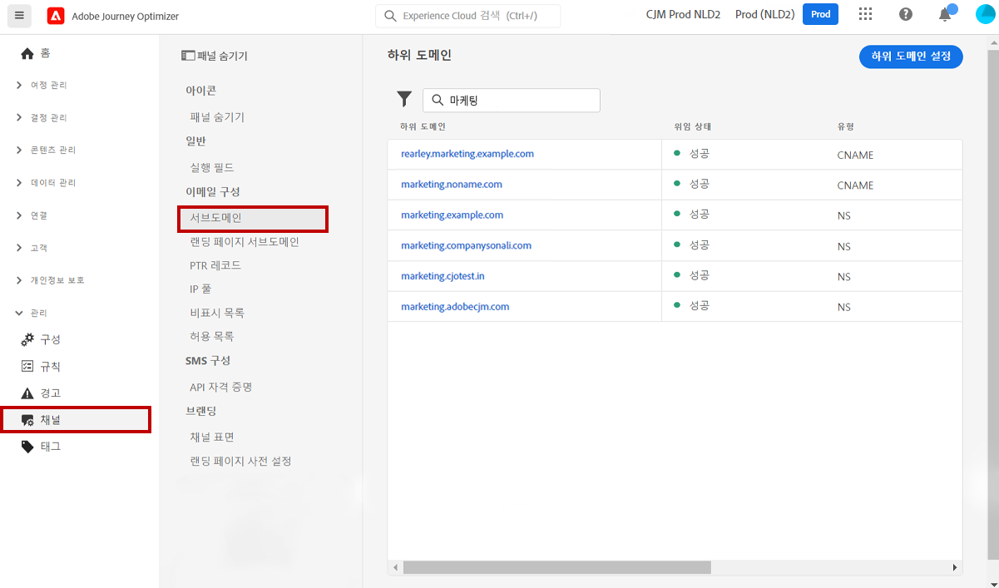

# 시스템 관리자용 시작하기 {#get-started-sys-admins}

**시스템 관리자**&#x200B;로서 Journey Optimizer 환경을 설정하고 액세스 권한을 관리하여 팀이 효율적이고 안전하게 작업할 수 있도록 합니다. [데이터 엔지니어](data-engineer.md), [개발자](developer.md) 및 [마케터](marketer.md)가 [!DNL Adobe Journey Optimizer]로 작업을 시작할 수 있도록 필수 구성 단계를 수행합니다.

주요 업무에는 사용자 그룹 및 권한 설정, 다른 사용자 그룹의 데이터 및 여정을 분할하기 위한 샌드박스 만들기 및 관리, Journey Optimizer를 통해 전달되는 다양한 메시지 및 에셋에서 일관된 브랜딩을 보장하기 위한 게재 채널 및 메시지 사전 설정 구성이 포함됩니다. 적합한 인력이 올바른 기능에 액세스할 수 있도록 보장하면서 보안 및 거버넌스를 유지할 수 있습니다.

이 기능은 Permissions 제품에 액세스할 수 있는 **[!UICONTROL 제품 관리자]**&#x200B;가 관리할 수 있습니다. [Permissions에 대해 자세히 알아보십시오](../../administration/permissions.md){target="_blank"}.

## 액세스 및 권한 설정

액세스 관리를 구성하려면 다음 단계를 따르세요.

1. **샌드박스를 생성**&#x200B;하여 인스턴스를 별도의 격리된 가상 환경으로 분할합니다. **샌드박스**&#x200B;는 [!DNL Journey Optimizer]에서 생성됩니다. [샌드박스](../../administration/sandboxes.md) 섹션에서 자세히 알아보십시오.

   >[!NOTE]
   >**시스템 관리자**&#x200B;인데 [!DNL Journey Optimizer]에 **[!UICONTROL 샌드박스]** 메뉴가 표시되지 않는 경우 사용 권한을 업데이트해야 합니다. [이 페이지](../../administration/permissions.md#edit-product-profile)에서 역할을 업데이트하는 방법을 알아보십시오.

1. **역할 이해**. 역할은 사용자가 인터페이스의 특정 기능이나 개체에 액세스할 수 있도록 하는 통합된 권한 세트입니다. 자세한 내용은 [기본 제공 역할](../../administration/ootb-product-profiles.md) 섹션을 참조하십시오.

1. 역할에 **샌드박스**&#x200B;를 포함한 **권한을 설정**&#x200B;하고 팀원을 다른 역할에 할당하여 액세스 권한을 부여합니다. 권한은 **[!UICONTROL 역할]**&#x200B;에 할당된 사용 권한을 정의할 수 있는 단일 직권입니다. 각 권한은 [!DNL Journey Optimizer]의 다양한 기능 또는 개체를 나타내는 기능(예: 여정 또는 오퍼) 아래에 수집됩니다. 자세한 내용은 [권한 수준](../../administration/high-low-permissions.md) 섹션을 참조하십시오.

1. **개체 수준 액세스 제어 사용**(선택 사항). 여정, 캠페인 및 채널 구성과 같은 오브젝트에 액세스 레이블을 적용하여 특정 리소스에 액세스할 수 있는 사용자를 제어합니다. [OLAC(개체 수준 액세스 제어)](../../administration/object-based-access.md)에 대해 자세히 알아보세요.

또한 Assets Essentials에 액세스해야 하는 사용자를 **Assets Essentials 소비자 사용자**&#x200B;나 **Assets Essentials 사용자** 역할 또는 둘 다에 추가해야 합니다. [Assets Essentials 설명서에서 자세히 읽어 보십시오](https://experienceleague.adobe.com/docs/experience-manager-assets-essentials/help/deploy-administer.html?lang=ko){target="_blank"}.

[!DNL Journey Optimizer]에 처음 액세스하면 프로덕션 샌드박스가 프로비저닝되고 계약에 따라 특정 수의 IP가 할당됩니다.

## 채널 및 메시지 구성

[마케터](marketer.md)가 메시지를 만들고 보낼 수 있도록 하려면 **관리** 메뉴에 액세스하세요. 채널 설정을 구성하려면 **[!UICONTROL 채널]** 메뉴를 찾아보세요.

>[!NOTE]
>**시스템 관리자**&#x200B;인데 [!DNL Journey Optimizer]에서 **[!UICONTROL 채널]** 메뉴를 확인할 수 없는 경우 [Permissions](../../administration/permissions.md){target="_blank"} 제품에서 권한을 업데이트합니다.

다음 단계를 수행하십시오.

1. **채널 구성 설정**. 이메일, SMS, 푸시 알림 및 기타 채널에 필요한 모든 기술 매개 변수를 정의합니다.

   * [!DNL Adobe Experience Platform]과 Adobe Experience Platform 데이터 수집 모두에서 **푸시 알림 설정**&#x200B;을 정의합니다. [자세히 알아보기](../../push/push-gs.md)

   * 이메일, SMS, 푸시, 인앱, 웹 및 기타 채널에 필요한 모든 기술 매개 변수를 구성하려면 **채널 구성**&#x200B;을 만드세요. [자세히 알아보기](../../configuration/channel-surfaces.md)

   * SMS에 필요한 모든 기술 매개 변수를 구성하려면 **SMS 채널**&#x200B;을 구성합니다. [자세히 알아보기](../../sms/sms-configuration.md)

   * 금지 목록에 이메일 주소를 보내기 전에 **재시도**&#x200B;를 하는 기간(일)을 관리합니다. [자세히 알아보기](../../configuration/manage-suppression-list.md)

1. **하위 도메인 위임**: Journey Optimizer에서 사용할 새 하위 도메인의 경우 첫 번째 단계는 이를 위임하는 것입니다. [자세히 알아보기](../../configuration/about-subdomain-delegation.md)

   

1. **IP 풀 만들기성**: 인스턴스와 함께 프로비저닝된 IP 주소를 함께 그룹화하여 이메일 전달 가능성과 평판을 개선합니다. [자세히 알아보기](../../configuration/ip-pools.md)

   

1. **제외 및 허용 목록 관리**: 금지 및 허용 목록으로 전달 가능성을 개선합니다.

   * [금지 목록](../../reports/suppression-list.md)은 게재에서 제외하려는 이메일 주소로 구성되어 있습니다. 이러한 연락처로 보내면 전송 평판과 게재 속도가 떨어질 수 있기 때문입니다. 지속적으로 소프트 바운스되어 이메일 평판에 부정적인 영향을 미칠 수 있는 여정 주소에서 자동으로 제외되는 모든 이메일 주소(예: 잘못된 주소)와 이메일 메시지 중 하나에 대해 일종의 스팸 불만을 제기하는 수신자를 모니터링할 수 있습니다. [금지 목록](../../configuration/manage-suppression-list.md) 및 [재시도](../../configuration/retries.md)를 관리하는 방법을 알아보세요.

   

   * [허용 목록](../../configuration/allow-list.md)을 사용하면 특정 샌드박스에서 보내는 이메일을 수신하도록 승인된 유일한 수신자 또는 도메인이 될 개별 이메일 주소 또는 도메인을 지정할 수 있습니다.. 이렇게 하면 테스트 환경에 있을 때 실수로 실제 고객 주소로 이메일을 보내는 것을 방지할 수 있습니다. [허용 목록을 활성화](../../configuration/allow-list.md)하는 방법을 알아보세요.

   [이 페이지](../../reports/deliverability.md)에서 [!DNL Adobe Journey Optimizer]의 전달성 관리에 대해 자세히 알아보십시오.

## 추가 기능

조직의 요구 사항이 증가함에 따라 다음과 같은 고급 기능을 고려하세요.

* **동의 정책**: 조직에서 Healthcare Shield 또는 Privacy and Security Shield를 구입한 경우 여러 채널에서 고객 환경 설정을 준수하도록 동의 정책을 만드세요. [자세히 알아보기](../../action/consent.md)

* **데이터 거버넌스 정책**: 데이터 사용 레이블 및 정책을 적용하여 마케팅 작업에서 데이터가 사용되는 방식을 제어합니다. [자세히 알아보기](../../action/action-privacy.md)

* **IP 워밍업 계획**: 이메일 공급자를 통해 보낸 사람의 평판을 구축하기 위해 이메일 전송 볼륨을 점차 늘립니다. [자세히 알아보기](../../configuration/ip-warmup-gs.md)

## 다양한 역할 간의 협업

관리 작업을 통해 모든 팀이 성공할 수 있습니다.

>[!BEGINTABS]

>[!TAB 데이터 엔지니어 지원]

데이터 관리 및 액세스에 대해 [데이터 엔지니어](data-engineer.md)와 협업합니다.

* 데이터 관리 및 스키마 생성에 대한 권한 부여
* 개발 및 테스트를 위한 샌드박스 액세스 승인
* 데이터 보존 정책 및 거버넌스 규칙 조정
* 페더레이션된 대상자 컴포지션과 같은 고급 기능에 액세스 활성화

>[!TAB 개발자 활성화]

API 액세스 및 테스트에 대해 [개발자](developer.md)와 협업합니다.

* Adobe Developer Console을 통해 API 자격 증명 제공
* 개발 및 테스트를 위한 샌드박스 환경 설정
* 채널 구성 승인(푸시 인증서, SMS 공급자)
* 테스트 환경 및 배포 전략 조정

>[!TAB 마케터 권한 부여]

권한 및 채널 설정에 대해 [마케터](marketer.md)와 협업합니다.

* 여정 및 캠페인을 만들기 위해 적절한 권한 할당
* 사용할 채널 구성(이메일, 푸시, SMS 등)
* 테스트 환경 및 승인 워크플로 지원
* 새로운 성능 및 기능에 대한 액세스 활성화

>[!ENDTABS]

## 다음 단계

환경이 구성되면 다음을 수행합니다.

1. **설정 확인**: 모든 팀원이 필요한 기능에 액세스할 수 있는지 확인합니다.
2. **사용 모니터링**: 관리 대시보드를 사용하여 시스템 사용을 추적하고 문제를 식별합니다.
3. **권한 유지**: 팀 역할이 발전함에 따라 정기적으로 권한을 검토하고 업데이트합니다.
