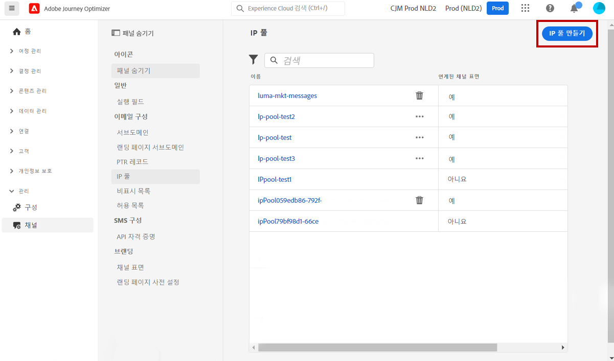
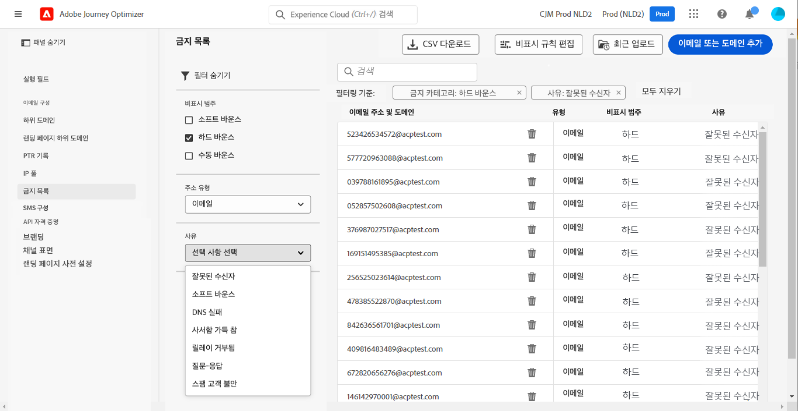

# 시스템 관리자용 시작하기 {#get-started-sys-admins}

[!DNL Adobe Journey Optimizer]을(를) 시작하기 전에 환경을 준비하는 데 필요한 몇 가지 단계가 있습니다.  [데이터 엔지니어](data-engineer.md) 및 [여정 실무자](marketer.md)가 [!DNL Adobe Journey Optimizer] (으)로 작업할 수 있도록 다음 단계를 수행해야 합니다.

**시스템 관리자**&#x200B;는 샌드박스 관리 및 채널 구성을 위해 **제품 프로필을 이해하고 권한을 할당**&#x200B;해야 합니다. 또한 사용 가능한 제품 프로필에 대해 샌드박스를 설정하고 관리해야 합니다. 그러면 팀원을 제품 프로필에 할당할 수 있습니다.

이러한 기능은 관리 콘솔에 액세스할 수 있는 **[!UICONTROL 제품 관리자]**&#x200B;가 관리할 수 있습니다. [Adobe Admin Console에 대한 자세한 내용을 살펴보십시오](https://helpx.adobe.com/kr/enterprise/admin-guide.html){target="_blank"}.

다음 페이지에서 액세스 관리에 대해 알아보세요.

1. **샌드박스를 생성**&#x200B;하여 인스턴스를 별도의 격리된 가상 환경으로 분할합니다. **샌드박스**&#x200B;는 [!DNL Journey Optimizer]에서 생성됩니다. [샌드박스](../../administration/sandboxes.md) 섹션에서 자세히 알아보세요.

   >[!NOTE]
   >**시스템 관리자**&#x200B;인데 [!DNL Journey Optimizer]의 **[!UICONTROL 샌드박스]** 메뉴를 확인할 수 없는 경우 [Admin Console](https://adminconsole.adobe.com/){target="_blank"}에서 권한을 업데이트합니다. [이 페이지](../../administration/permissions.md#edit-product-profile)에서 제품 프로필을 업데이트하는 방법을 알아보세요.
   >

1. **제품 프로필 이해**. 제품 프로필은 사용자가 인터페이스의 특정 기능이나 개체에 액세스할 수 있도록 하는 통합된 권한 세트입니다. [기본 제품 프로필](../../administration/ootb-product-profiles.md) 섹션에서 자세히 알아보세요.

1. **샌드박스**&#x200B;를 포함하여 제품 프로필에 **권한을 설정**&#x200B;하고 팀원을 다른 제품 프로필에 할당하여 액세스 권한을 부여합니다. 이 단계는 [Admin Console](https://adminconsole.adobe.com/){target="_blank"}에서 수행할 수 있습니다. 권한은 **[!UICONTROL 제품 프로필]**&#x200B;에 할당된 권한을 정의할 수 있는 단일 권한입니다. 각 권한은 [!DNL Journey Optimizer]의 다양한 기능 또는 개체를 나타내는 기능(예: 여정 또는 오퍼) 아래에 수집됩니다. 자세한 내용은 [권한 수준](../../administration/high-low-permissions.md) 섹션을 참조하세요.

또한 Assets Essentials에 액세스해야 하는 사용자를 **Assets Essentials 소비자 사용자** 또는/및 **Assets Essentials 사용자** 제품 프로필에 추가해야 합니다. [Assets Essentials 설명서에서 자세히 읽어 보세요](https://experienceleague.adobe.com/docs/experience-manager-assets-essentials/help/deploy-administer.html?lang=ko){target="_blank"}.

>[!NOTE]
>2022년 1월 6일 이전에 획득한 Journey Optimizer 제품의 경우 조직에 [!DNL Adobe Experience Manager Assets Essentials]을(를) 배포해야 합니다. [Assets Essentials 배포](https://experienceleague.adobe.com/docs/experience-manager-assets-essentials/help/deploy-administer.html?lang=ko){target="_blank"} 섹션에서 자세히 알아보세요.

[!DNL Journey Optimizer]에 처음 액세스하면 프로덕션 샌드박스가 프로비저닝되고 계약에 따라 특정 수의 IP가 할당됩니다.

여정을 만들고 메시지를 보내려면 **관리** 메뉴에 액세스합니다. **[!UICONTROL 채널]** 메뉴를 탐색하여 메시지와 채널 구성(예: 메시지 사전 설정)을 구성합니다.

>[!NOTE]
>**시스템 관리자**&#x200B;인데 [!DNL Journey Optimizer]의 **[!UICONTROL 채널]** 메뉴를 확인할 수 없는 경우 [Admin Console](https://adminconsole.adobe.com/){target="_blank"}에서 권한을 업데이트합니다. [이 페이지](../../administration/permissions.md#edit-product-profile)에서 제품 프로필을 업데이트하는 방법을 알아보세요.
>

아래 단계를 따릅니다.

1. **메시지 및 채널 구성**: 구성 정의, 이메일, SMS 및 푸시 메시지 설정 조정 및 사용자 정의

   * [!DNL Adobe Experience Platform] 및 [!DNL Adobe Experience Platform Launch] 모두에서 **푸시 알림 설정**&#x200B;을 정의합니다. [자세히 알아보기](../../push/push-gs.md)

   * 이메일, SMS, 푸시 알림에 필요한 모든 기술 매개 변수를 구성하려면 **채널 구성**(즉, 메시지 사전 설정)을 만듭니다. [자세히 알아보기](../../configuration/channel-surfaces.md)

   * SMS에 필요한 모든 기술 매개 변수를 구성하려면 **SMS 채널**&#x200B;을 구성합니다. [자세히 알아보기](../../sms/sms-configuration.md)

   * 금지 목록에 이메일 주소를 보내기 전에 **재시도**&#x200B;를 하는 기간(일)을 관리합니다. [자세히 알아보기](../../configuration/manage-suppression-list.md)

1. **하위 도메인 위임**: Journey Optimizer에서 사용할 새 하위 도메인의 경우 첫 번째 단계는 이를 위임하는 것입니다. [자세히 알아보기](../../configuration/about-subdomain-delegation.md)

   

1. **IP 풀 만들기성**: 인스턴스와 함께 프로비저닝된 IP 주소를 함께 그룹화하여 이메일 전달 가능성과 평판을 개선합니다. [자세히 알아보기](../../configuration/ip-pools.md)

   

1. **제외 및 허용 목록 관리**: 금지 및 허용 목록으로 전달 가능성을 개선합니다.

   * [금지 목록](../../reports/suppression-list.md)은 게재에서 제외하려는 이메일 주소로 구성되어 있습니다. 이러한 연락처로 보내면 전송 평판과 게재 속도가 떨어질 수 있기 때문입니다. 지속적으로 소프트 바운스되어 이메일 평판에 부정적인 영향을 미칠 수 있는 여정 주소에서 자동으로 제외되는 모든 이메일 주소(예: 잘못된 주소)와 이메일 메시지 중 하나에 대해 일종의 스팸 불만을 제기하는 수신자를 모니터링할 수 있습니다. [금지 목록](../../configuration/manage-suppression-list.md) 및 [재시도](../../configuration/retries.md)를 관리하는 방법을 알아보세요.

   

   * [허용 목록](../../configuration/allow-list.md)을 사용하면 특정 샌드박스에서 보내는 이메일을 수신하도록 승인된 유일한 수신자 또는 도메인이 될 개별 이메일 주소 또는 도메인을 지정할 수 있습니다.. 이렇게 하면 테스트 환경에 있을 때 실수로 실제 고객 주소로 이메일을 보내는 것을 방지할 수 있습니다. [허용 목록을 활성화](../../configuration/allow-list.md)하는 방법을 알아보세요.

   [이 페이지](../../reports/deliverability.md)의 [!DNL Adobe Journey Optimizer]에서 배달 가능성 관리에 대해 자세히 알아보세요.
