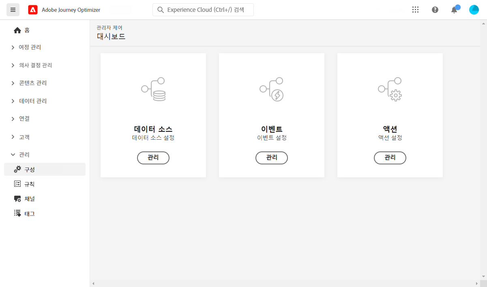

# 데이터 엔지니어 시작 {#data-engineer}

로서의 **Adobe Journey Optimizer 데이터 엔지니어**, 고객 프로필 데이터를 준비하고 유지 관리하여 [!DNL Journey Optimizer]를 스키마에서 고객 및 비즈니스 데이터를 모델링하고 데이터를 수집하기 위한 소스 커넥터를 구성합니다. 작업을 시작할 수 있습니다 [!DNL Adobe Journey Optimizer] 한 번 [시스템 관리자](administrator.md) 환경에 액세스하고 준비할 수 있습니다.

방법 알아보기 **데이터 식별 및 스키마 및 데이터 세트 만들기** 데이터를 이 페이지에서 Adobe Experience Platform으로 가져오기 위해

>[!NOTE]
>
>추가 정보 **데이터 수집** in [Adobe Experience Platform 설명서](https://experienceleague.adobe.com/docs/experience-platform/ingestion/home.html?lang=ko){target=&quot;_blank&quot;}.

ID 네임스페이스 및 프로필에 대해 활성화된 데이터 세트를 만드는 단계는 아래 섹션에 자세히 설명되어 있습니다.

1. **ID 네임스페이스 만들기**. Adobe [!DNL Journey Optimizer], **ID** 여러 장치와 채널에서 소비자를 연결하는 이유는 ID 그래프입니다. 연결된 ID 그래프는 모든 비즈니스 터치포인트에서 상호 작용을 기반으로 경험을 개인화하는 데 사용됩니다.  ID 및 ID 네임스페이스에 대해 자세히 알아보십시오 [이 페이지에서](../get-started-identity.md).

1. **스키마 만들기** 프로필에 대해 활성화합니다. 스키마는 데이터의 구조와 형식을 나타내고 유효성을 검사하는 규칙 세트입니다. 높은 수준에서 스키마는 실제 개체(예: 사람)에 대한 추상적인 정의를 제공하고, 해당 개체의 각 인스턴스(이름, 성, 생일 등)에 어떤 데이터를 포함해야 하는지 설명합니다.  스키마에 대해 자세히 알아보기 [이 페이지에서](../get-started-schemas.md).

1. **데이터 세트 만들기** 프로필에 대해 활성화합니다. 데이터 세트는 스키마(열) 및 필드(행)를 포함하는 데이터 수집을 위한 저장소 및 관리 구조입니다. 데이터 세트에는 저장하는 데이터의 다양한 측면을 설명하는 메타데이터도 포함되어 있습니다. 데이터 세트가 만들어지면 기존 스키마에 매핑하고 데이터를 추가할 수 있습니다. 데이터 세트에 대해 자세히 알아보기 [이 페이지에서](../get-started-datasets.md).

1. **소스 커넥터 구성**. Adobe 여정 최적화 기능을 사용하면 Platform 서비스를 사용하여 들어오는 데이터를 구조화, 레이블 지정 및 향상시키는 기능을 제공하면서 외부 소스에서 데이터를 수집할 수 있습니다. Adobe 애플리케이션, 클라우드 기반 스토리지, 데이터베이스 등과 같은 다양한 소스에서 데이터를 수집할 수 있습니다. 소스 커넥터에 대해 자세히 알아보기 [이 페이지에서](../get-started-sources.md).

1. **테스트 프로필 만들기**. 테스트 프로필은 [테스트 모드](../../building-journeys/testing-the-journey.md) 여정 및 [메시지 미리 보기 및 테스트](../../messages/preview.md) 보내기 전. 테스트 프로필을 만드는 단계를 알아봅니다 [이 페이지에서](../../building-journeys/creating-test-profiles.md).

또한 여정에서 메시지를 보낼 수 있으려면 다음을 구성해야 합니다 **[!UICONTROL Data Sources]**, **[!UICONTROL Events]** 및 **[!UICONTROL Actions]**. 추가 정보 [이 섹션](../../configuration/about-data-sources-events-actions.md).

* 다음 **데이터 소스** 구성을 사용하면 시스템에 대한 연결을 정의하여 여정에서 사용할 추가 정보를 검색할 수 있습니다. 데이터 소스에 대해 자세히 알아보기 [이 섹션](../../datasource/about-data-sources.md).

* **이벤트** 여정으로 유입되는 개인에게 실시간으로 메시지를 보낼 때까지 여정을 트리거할 수 있습니다. 이벤트 구성에서는 여정에 필요한 이벤트를 구성합니다. 수신되는 이벤트 데이터는 Adobe Experience 데이터 모델(XDM)에 따라 표준화됩니다. 이벤트는 인증된 이벤트와 인증되지 않은 이벤트(예: Adobe Mobile SDK 이벤트)를 위한 수집 API 스트리밍에서 옵니다. 이벤트에 대해 자세히 알아보기 [이 섹션](../../event/about-events.md).

* [!DNL Journey Optimizer] 에는 메시지 기능이 내장되어 있습니다. 콘텐츠를 디자인하고 메시지를 게시할 수 있습니다. 서드파티 시스템을 사용하여 메시지를 전송하는 경우(예: Adobe Campaign) **사용자 지정 작업**. 이 단원의 작업에 대해 자세히 알아보기 [이 섹션](../../action/action.md).
