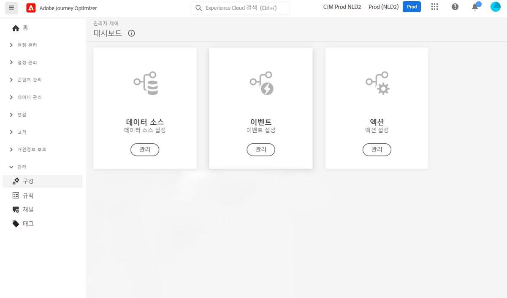

# 데이터 엔지니어용 시작하기 {#data-engineer}

**Adobe Journey Optimizer 데이터 엔지니어**&#x200B;는 고객 프로필 데이터를 준비 및 유지 관리하여 [!DNL Journey Optimizer]에서 오케스트레이션한 경험을 강화하고, 고객 및 비즈니스 데이터를 스키마로 모델링하고, 데이터 수집을 위한 소스 커넥터를 구성합니다. [시스템 관리자](administrator.md)가 액세스 권한을 부여하고 환경을 준비하면 [!DNL Adobe Journey Optimizer] 작업을 시작할 수 있습니다.

이 페이지에서 데이터를 Adobe Experience Platform으로 가져오기 위해 **데이터를 식별하고 스키마와 데이터세트를 만드는** 방법을 알아 보세요.

>[!NOTE]
>
>[Adobe Experience Platform 설명서](https://experienceleague.adobe.com/docs/experience-platform/ingestion/home.html?lang=ko){target=&quot;_blank&quot;}에서 **데이터 수집**&#x200B;에 대해 자세히 알아보세요.

프로필 및 테스트 프로필에 대해 활성화된 ID 네임스페이스 및 데이터 세트를 만드는 단계는 아래 섹션에 자세히 설명되어 있습니다.

1. **ID 네임스페이스 만들기**. Adobe [!DNL Journey Optimizer]에서 **ID**&#x200B;는 장치와 채널 전반에 걸쳐 소비자를 연결하며 결과는 ID 그래프입니다. 연결된 ID 그래프는 모든 비즈니스 접점에서 상호 작용을 기반으로 경험을 개인화하는 데 사용됩니다.  [이 페이지](../../segment/get-started-identity.md)에서 ID 및 ID 네임스페이스에 대해 자세히 알아보세요.

1. **스키마를 만들고** 프로필에 대해 활성화합니다. 스키마는 데이터의 구조와 형식을 나타내고 유효성을 검사하는 규칙 세트입니다. 스키마는 높은 수준에서 실제 개체(예: 사람)에 대한 추상적인 정의를 제공하고, 해당 개체의 각 인스턴스에 포함되어야 하는 데이터(예: 이름, 성, 생일 등)에 대한 개요를 제공합니다.  [이 페이지에서](../../data/get-started-schemas.md) 스키마에 대해 자세히 알아보세요.

1. **데이터 세트를 만들고** 프로필에 대해 활성화합니다. 데이터 세트는 스키마(열) 및 필드(행)를 포함하는 데이터 수집을 위한 저장소 및 관리 구조입니다. 데이터 세트에는 저장하는 데이터의 다양한 측면을 설명하는 메타데이터도 포함됩니다. 데이터 세트가 만들어지면 기존 스키마에 매핑하고 데이터를 추가할 수 있습니다. [이 페이지에서](../../data/get-started-datasets.md) 데이터세트에 대해 자세히 알아보세요.

1. **소스 커넥터 구성**. Adobe Journey Optimzer를 사용하면 외부 소스에서 데이터를 수집하는 동시에 플랫폼 서비스를 사용하여 들어오는 데이터를 구조화하고, 레이블을 지정하고, 개선할 수 있습니다. Adobe 애플리케이션, 클라우드 기반 저장소, 데이터베이스 및 기타 여러 소스와 같은 다양한 소스에서 데이터를 수집할 수 있습니다. [이 페이지에서](../get-started-sources.md) 소스 커넥터에 대해 자세히 알아보세요.

1. **테스트 프로필 만들기**. 테스트 프로필은 여정에서 [테스트 모드](../../building-journeys/testing-the-journey.md)를 사용할 때 필요하며 전송하기 전에 [메시지를 미리 보고 테스트하는 데](../../design/preview.md) 필요합니다. 테스트 프로필을 만드는 단계는 [이 페이지](../../segment/creating-test-profiles.md)에 자세히 설명되어 있습니다.

또한 여정에서 메시지를 보낼 수 있으려면 **[!UICONTROL 데이터 소스]**, **[!UICONTROL 이벤트]** 및 **[!UICONTROL 작업]**&#x200B;을 구성해야 합니다. 자세한 내용은 [이 섹션](../../configuration/about-data-sources-events-actions.md)을 참조하세요.

* **데이터 소스** 구성을 사용하면 여정에 사용될 추가 정보를 검색하기 위해 시스템에 대한 연결을 정의할 수 있습니다. [이 섹션에서](../../datasource/about-data-sources.md) 데이터 소스에 대해 자세히 알아보세요.

* **이벤트**&#x200B;를 사용하면 여정을 통합적으로 트리거하여 여정에 참여하는 개인에게 실시간으로 메시지를 보낼 수 있습니다. 이벤트 구성에서 여정에서 예상되는 이벤트를 구성합니다. 수신되는 이벤트 데이터는 Adobe Experience 데이터 모델(XDM)에 따라 표준화됩니다. 이벤트는 인증된 이벤트와 인증되지 않은 이벤트(예: Adobe Mobile SDK 이벤트)를 위한 수집 API 스트리밍에서 옵니다. [이 섹션에서](../../event/about-events.md) 이벤트에 대해 자세히 알아보세요.

* [!DNL Journey Optimizer]에는 [내장 메시지 기능](../../messages/get-started-content.md)이 함께 제공됩니다. 여정 내에서 메시지를 만들고 콘텐츠를 디자인할 수 있습니다. Adobe Campaign과 같은 타사 시스템을 사용하여 메시지를 보내는 경우 **사용자 정의 작업**&#x200B;을 만듭니다. [이 섹션에서](../../action/action.md) 작업에 대해 자세히 알아보세요.
