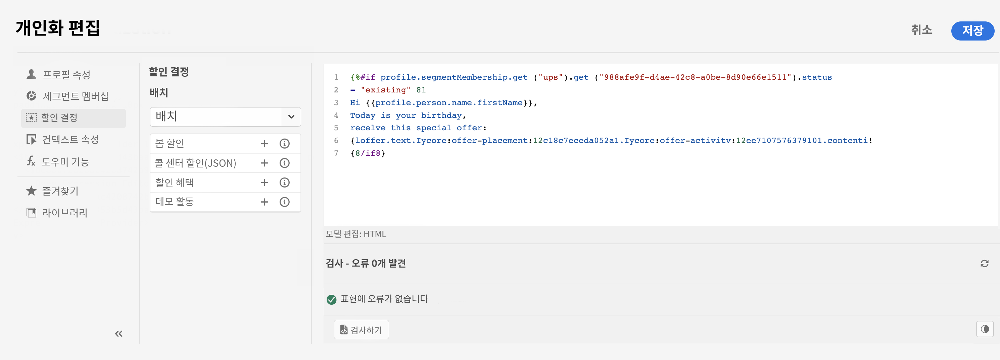
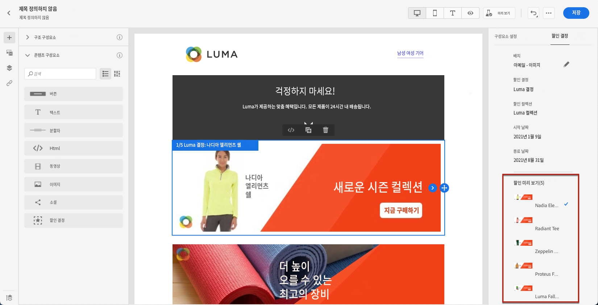
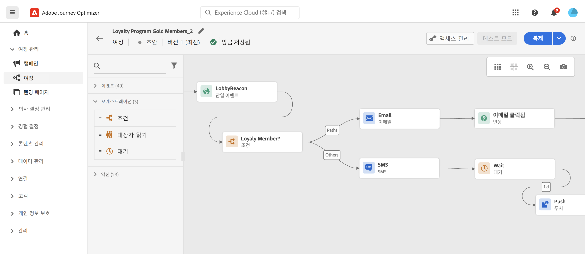

# 마케터를 위한 시작 {#get-started-marketers}

**마케터**&#x200B;로서 또는 **여정 실무자**&#x200B;로서, 오퍼 및 여정을 만들고 컨텐츠를 디자인할 책임이 있습니다. [시스템 관리자](administrator.md) 및 [데이터 엔지니어](data-engineer.md)에 액세스 권한을 부여하고 환경을 준비하면 [!DNL Adobe Journey Optimizer] (으)로 작업을 시작할 수 있습니다.

첫 번째 여정을 설정하고 오퍼 및 자산을 추가하고 메시지를 보내려면 다음 섹션을 참조하십시오:

1. **세그먼트 만들기**. Journey Optimizer를 사용하면 **세그먼트** 메뉴에서 직접 대상 세그먼트를 만들고 여정에 활용할 수 있습니다.  [이 페이지](../../segment/about-segments.md)에서 세그먼트에 대해 자세히 알아보십시오. [이 샘플](../../segment/creating-a-segment.md)에서 세그먼트를 만드는 방법에 대해 살펴보십시오.

1. **개인화 및 다이내믹 콘텐츠 추가**. Journey Optimizer 개인화 및 다이내믹 콘텐츠 기능을 활용하여 메시지를 대상에 맞게 조정하십시오. [개인화](../../personalization/personalize.md) 및 [다이내믹 콘텐츠](../../personalization/get-started-dynamic-content.md)에 대해 자세히 알아보십시오.

   

1. **자산 만들고 관리하기**. [!DNL Adobe Experience Manager Assets Essentials]은(는) 메시지를 채우는 데 사용할 수 있는 자산의 단일 중앙 집중식 저장소입니다. 자세한 내용은 [이 섹션](../../email/assets-essentials.md)을 참조하세요.

1. **오퍼 추가**. [!DNL Journey Optimizer]을(를) 사용하여 적절한 시기에 모든 접점에서 고객에게 최상의 오퍼 및 경험을 제공하십시오. 디자인한 후에는 개인화된 오퍼를 통해 대상을 타기팅하십시오. Decisioning 관리에 대한 자세한 내용은 [이 섹션](../../offers/get-started/starting-offer-decisioning.md)을 참조하세요.

   

1. **테스트 및 유효성 검사**. 콘텐츠가 정의되면 테스트 프로필을 사용하여 미리 보고 테스트할 수 있습니다. [사용자 지정 컨텐츠](../../personalization/personalize.md)를 삽입하면 테스트 프로필 데이터를 활용하여 이 컨텐츠가 메시지에 어떻게 표시되는지 확인할 수 있습니다. 또한 **Litmus** 계정을 [!DNL Journey Optimizer]에 활용하면 인기 있는 이메일 클라이언트에서 **이메일 렌더링**&#x200B;을 즉시 미리 볼 수 있습니다. 그런 다음 모든 받은 편지함에서 이메일 콘텐츠가 제대로 표시되고 제대로 작동하는지 확인할 수 있습니다. 메시지 테스트 및 유효성 검사 방법에 대한 자세한 내용은 [이 섹션](../../email/preview.md)을 참조하세요.

1. **고객 여정 설계**&#x200B;를 통해 개인화된 컨텍스트 기반의 경험을 제공할 수 있습니다. [!DNL Journey Optimizer]을(를) 사용하면 이벤트 또는 데이터 소스에 저장된 상황별 데이터를 활용하여 실시간 오케스트레이션 사용 사례를 구축할 수 있습니다. 다음 기능을 통해 제공되는 여러 단계로 구성된 고급 시나리오 설계:

   * 이벤트가 수신될 때 트리거되는 실시간 **단일 게재**&#x200B;로 보내거나 Adobe Experience Platform 세그먼트를 사용하여 **일괄적으로** 보냅니다.

   * 이벤트의 **컨텍스트 기반 데이터**, Adobe Experience Platform의 정보 또는 서드파티 API 서비스의 데이터를 활용합니다.

   * **기본 제공 채널 작업**(이메일, SMS, 푸시)을 사용하여 [!DNL Journey Optimizer] (으)로 디자인된 메시지를 보내거나 서드파티 시스템을 사용하여 메시지를 전송하는 경우 **사용자 지정 작업**&#x200B;을 만듭니다.

   * **여정 디자이너**&#x200B;를 사용하여 여러 단계 사용 사례를 빌드합니다. 시작 이벤트 또는 세그먼트 읽기 활동을 쉽게 끌어다 놓고 조건을 추가하고 개인화된 메시지를 보냅니다.

   

   여정 디자인 및 실행 방법에 대한 자세한 내용은 [이 섹션](../../building-journeys/journey-gs.md)을 참조하세요.

1. **메시지 및 여정 모니터링**. 메시지가 성공적으로 실행, 전송 및 게재되는지 확인하기 위해 [!DNL Journey Optimizer]은(는) 현재 게시되고 트리거된 메시지를 모니터링하는 기능을 제공합니다. 성과 모니터링 방법에 대한 자세한 내용은 [이 섹션](../../reports/global-report.md)을 참조하세요.
