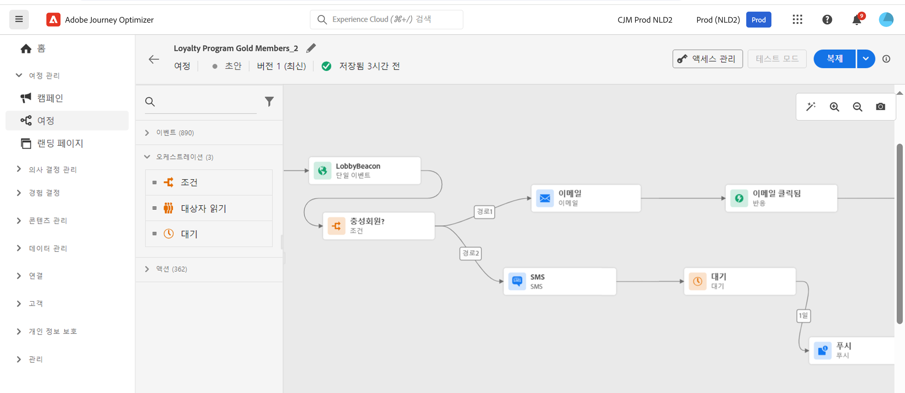

# 마케터를 위한 시작 {#get-started-marketers}

**마케터** 또는 **비즈니스 전문가**&#x200B;로서, 고객에게 개인적이고 상황에 맞는 경험을 제공하기 위해 고객 여정을 디자인합니다. 메시지 콘텐츠를 지능적으로 개인화하기 위해 이메일 및 푸시 메시지, 오퍼 및 의사 결정 구성 요소를 포함하여 이러한 개인화된 여정의 모든 다양한 구성 요소를 만들고 관리합니다. Journey Optimizer는 전체 엔드투엔드 사용 사례를 한 곳에서 구현할 수 있는 통합 사용자 경험을 제공합니다. [시스템 관리자](administrator.md) 및 [데이터 엔지니어](data-engineer.md)에 액세스 권한을 부여하고 환경을 준비하면 [!DNL Adobe Journey Optimizer]&#x200B;(으)로 작업을 시작할 수 있습니다.

## 필수 사항으로 시작

Journey Optimizer는 실시간 고객 인사이트, 최신 옴니채널 오케스트레이션 및 지능형 의사 결정을 단일 애플리케이션에 통합합니다. 이메일, SMS, 푸시, 인앱, 웹, 콘텐츠 카드 등에서 개인화되고 연결된 고객 경험을 만듭니다.

Journey Optimizer는 두 가지 강력한 오케스트레이션 접근 방식을 제공합니다.

* **여정**: 비헤이비어 또는 이벤트에 의해 트리거된 각 고객이 원하는 속도로 진행하는 실시간 일대일 참여
* **오케스트레이션된 캠페인**: 워크플로우를 통해 대상자가 함께 진행하는 규모의 복잡한 여러 단계 일괄 처리 캠페인으로 계절별 프로모션, 제품 출시 또는 계정 기반 커뮤니케이션과 같은 브랜드 주도 캠페인에 적합합니다.

[관리자](administrator.md)와 협력하여 액세스 권한을 얻고 [데이터 엔지니어](data-engineer.md)와 협력하여 고급 세분화를 위한 대상, 데이터 및 관계형 스키마를 설정하세요.

다음 핵심 단계에 따라 경험을 구축하세요.

1. **대상자 만들기**. 세그먼트 정의를 통해 대상자를 만들거나, CSV 파일을 업로드하거나, 대상자 구성을 사용하세요. Journey Optimizer는 적합한 고객을 타깃팅하는 다양한 방법을 제공합니다. [대상](../../audience/about-audiences.md) 및 [세그먼트 정의 만들기](../../audience/creating-a-segment-definition.md)에 대해 자세히 알아보세요.

1. **콘텐츠 디자인** 이메일, SMS, 푸시, 인앱, 웹 및 콘텐츠 카드를 포함하여 모든 채널에서 매력적인 메시지를 만드세요.
   * **AI 어시스턴트**&#x200B;를 사용하여 브랜드 지침을 기반으로 이메일 콘텐츠, 제목 줄 및 이미지를 생성합니다. [AI 콘텐츠 생성에 대해 알아보기](../../content-management/gs-generative.md)
   * 고객 데이터, 다이내믹 콘텐츠 및 조건부 논리를 사용하여 **메시지를 개인화**&#x200B;합니다. [개인화에 대해 알아보기](../../personalization/personalize.md)
   * 이벤트, 사용자 지정 작업 및 데이터 집합 조회의 동적 목록을 표시하려면 **상황별 데이터를 반복합니다**. [상황별 데이터 반복에 대해 알아보기](../../personalization/iterate-contextual-data.md)
   * 브랜드 일관성을 유지하기 위해 재사용 가능한 **콘텐츠 템플릿** 및 **조각**&#x200B;을 만듭니다. [템플릿 작업](../../content-management/content-templates.md)
   * 모바일 앱 및 웹 사이트에서 지속적이고 비간섭적인 **콘텐츠 카드**&#x200B;를 제공합니다. 푸시 알림과 달리 콘텐츠 카드는 해제될 때까지 계속 표시됩니다. [콘텐츠 카드에 대해 알아보기](../../content-card/create-content-card.md)
   * **Adobe Experience Manager Assets** 통합으로 자산을 관리합니다. [애셋에 대해 알아보기](../../integrations/assets.md)

   

1. **오퍼 및 의사 결정 추가**. AI 기반 의사 결정을 사용하여 각 고객에게 적시에 최상의 오퍼를 제공합니다. [의사 결정 관리](../../offers/get-started/starting-offer-decisioning.md) 및 [경험 결정](../../experience-decisioning/gs-experience-decisioning.md)에 대해 알아봅니다.

   

1. **테스트 및 유효성 검사**. 보내기 전에 콘텐츠 미리 보기 및 테스트:
   * **테스트 프로필**&#x200B;을 사용하여 개인 맞춤화를 미리 보고 장치 간 렌더링을 확인하세요.
   * CSV/JSON 파일의 **샘플 데이터**&#x200B;로 테스트
   * 인기 있는 이메일 클라이언트에서 **이메일 렌더링** 미리 보기
   * 콘텐츠 변형을 최적화하려면 **A/B 테스트 및 실험**&#x200B;을 실행하세요. multi-armed bandit 실험을 통해 실시간으로 더 많은 트래픽을 승리 변형에 자동으로 할당합니다. [실험에 대해 알아보기](../../content-management/content-experiment.md)
   * 캠페인 및 여정에 대해 **승인 워크플로**&#x200B;를 설정합니다(추가 라이선스 필요). [승인에 대해 알아보기](../../test-approve/gs-approval.md)

   [메시지 테스트 및 유효성 검사](../../content-management/preview-test.md)하는 방법을 알아보세요.

1. **고객 여정 작성**. 여정 캔버스를 사용하여 개인화된 실시간 경험을 만듭니다.

   * **이벤트**(고객 작업) 또는 **대상**(일괄 전송)으로 여정 트리거
   * 고객 데이터를 기반으로 개인화된 경로를 만들려면 **조건**&#x200B;을 추가하세요.
   * **대기 활동**&#x200B;을 사용하여 메시지 사이에 완벽한 타이밍을 만드세요.
   * 한 여정 내에서 **여러 채널**&#x200B;을 통해 메시지 보내기
   * **A/B 테스트**&#x200B;를 적용하고 전송 시간을 최적화하여 참여를 극대화합니다.
   * **데이터 세트 조회**&#x200B;를 사용하여 Adobe Experience Platform의 실시간 데이터로 여정을 보강합니다. [데이터 세트 조회 알아보기](../../building-journeys/dataset-lookup.md)
   * **보조 식별자**&#x200B;를 활용하여 동일한 프로필로 여러 여정 인스턴스(예: 다른 주문 또는 예약)에 참여할 수 있도록 합니다. [보조 식별자 알아보기](../../building-journeys/supplemental-identifier.md)

   

   [여정을 디자인 및 실행](../../building-journeys/journey-gs.md)하는 방법을 배우고 [여정 사용 사례](../../building-journeys/jo-use-cases.md)를 살펴봅니다. 프로필 흐름을 제어하려면 [시작/종료 기준](../../building-journeys/entry-exit-criteria-guide.md)을 이해합니다.

1. **오케스트레이션된 캠페인 시작**. 시각적 캔버스를 사용하여 복잡하고 여러 단계로 이루어진 대규모 배치 캠페인을 디자인합니다.

   * 고객 데이터를 계정, 구매, 구독 및 기타 엔터티와 연결하는 관계형 쿼리를 사용하여 즉시 **온디맨드 대상자**&#x200B;를 작성합니다.
   * 정확한 타기팅을 위해 **다중 엔터티 세분화**&#x200B;를 생성합니다(예: &quot;구독 만료일이 30일 이내인 고객&quot; 또는 &quot;최근 고액 구매 내역이 있는 계정&quot;).
   * 발송 전에 정확한 대상자 수를 파악하여 **사전 가시성**&#x200B;을 확보합니다.
   * 계절별 프로모션, 제품 출시, 로열티 오퍼 또는 계정 기반 마케팅을 위한 **다단계 워크플로**&#x200B;를 디자인합니다.
   * 캠페인을 즉시 실행하거나, 특정 시간에 실행하거나, 되풀이 일정(매일, 매주, 매월)에 따라 실행하도록 예약합니다.
   * 모든 프로필이 워크플로를 통해 함께 진행되는 **배치 모드**&#x200B;에서 대상자를 처리합니다.

   [오케스트레이션 캠페인을 시작](../../orchestrated/gs-orchestrated-campaigns.md)하는 방법과 언제 [캠페인과 여정을 사용](../../orchestrated/orchestrated-campaigns-faq.md)해야 하는지 알아봅니다.

1. **모니터링 및 최적화**. 시간 경과에 따라 성과 추적 및 결과 개선:
   * **실시간 여정** 성능 모니터링 및 병목 현상 파악
   * **메시지 게재** 비율 및 참여 지표 분석
   * Customer Journey Analytics 통합으로 **보고 대시보드** 사용
   * **전환** 및 비즈니스 영향 추적
   * 과도한 의사소통을 방지하기 위해 충돌 관리 규칙을 사용하여 **메시지 빈도와 우선순위** 관리 [충돌 관리 알아보기](../../conflict-prioritization/gs-conflict-prioritization.md)

   [성능 모니터링](../../reports/report-gs-cja.md) 방법을 알아봅니다.

## 성공 모범 사례

### 콘텐츠 제작

* **템플릿으로 시작**: 사전 설치 템플릿과 콘텐츠 조각을 사용하여 제작 속도를 높이고 일관성을 유지합니다.
* **초기에 테스트, 자주 테스트**: 모든 장치에서 항상 콘텐츠를 미리 보고 테스트 프로필을 사용하여 개인화의 유효성을 검증합니다.
* **AI를 현명하게 활용**: AI 어시스턴트는 초기 초안 및 변형 작업에 활용하되, 항상 브랜드 이미지에 맞게 검토하고 다듬어야 합니다.
* **단순하게 유지**: 명확하고 간결한 메시지와 강력한 행동 유도 문구(CTA)가 복잡한 레이아웃보다 더 나은 성과를 냅니다.

### 여정 디자인

* **명확한 목표 정의**: 여정을 구축하기 전에 성공 지표를 설정합니다.
* **고객 경험 매핑**: 구현하기 전에 전체 여정을 시각화합니다.
* **전략적으로 대기 활동 사용**: 후속 조치를 보내기 전에 고객에게 참여할 시간을 줍니다.
* **종료 전략 계획**: 고객이 여정을 종료해야 하는 시점과 이유를 정의합니다.
* **초안 모드에서 테스트**: 활성화하기 전에 시험 실행으로 여정 로직을 검증합니다.

[여정 모범 사례 알아보기](../../building-journeys/entry-exit-criteria-guide.md#best-practices)

### 캠페인 오케스트레이션

* **올바른 방법 선택**: [동작이 트리거된 실시간 경험에 대해 여정 유형 비교](../../building-journeys/journey.md#journey-types) 또는 예약된 일괄 처리 캠페인에 대해 [캠페인 유형](../../campaigns/get-started-with-campaigns.md#campaign-types)
* **명확한 캠페인 목표 정의**: 여러 단계로 이루어진 워크플로를 디자인하기 전에 목표를 설정합니다.
* **파일럿 대상자로 시작**: 확장하기 전에 카운트 및 세분화 로직을 검증합니다.
* **관계형 데이터 활용**: 다중 엔터티 세분화를 사용하여 고객 데이터를 계정, 구매, 구독과 연결하여 정확한 타겟팅을 구현합니다.
* **세분화를 단순하게 유지**: 명확하고 유지 관리 가능한 규칙으로 성과와 투명성을 최적화합니다.
* **일관된 명명 규칙 사용**: 명확한 명명 규칙을 사용하여 캠페인 관리를 간소화합니다.

### 대상자 타겟팅

* **신중하게 세그먼트 생성**: 명확한 기준에 따라 구체적이고 실행 가능한 대상자 세그먼트를 만듭니다.
* **정기적으로 새로 고침**: 대상자가 최신 정보를 받을 수 있도록 적절한 평가 일정을 설정합니다.
* **규모와 정밀도의 균형**: 통계적 유의성을 확보할 만큼 충분히 크면서 관련성을 확보할 만큼 충분히 구체적인 대상자를 설정합니다.
* **보강 속성 사용**: 계산된 속성과 보강 데이터를 활용하여 더욱 심층적인 개인화를 구현합니다.

### 빈도 관리

* **고객 선호 사항 준수**: 옵트아웃 및 커뮤니케이션 선호 사항을 존중합니다.
* **빈도 상한 설정**: 채널 전반에서 메시지 피로를 방지하기 위해 규칙 세트를 사용합니다.
* **캠페인 조정**: 충돌 관리를 사용하여 고객이 적시에 올바른 메시지를 받을 수 있도록 합니다.
* **참여도 모니터링**: 피로 징후(이메일 열람률 하락, 구독 취소 증가)를 주의 깊게 살펴봅니다.

[빈도 상한 설정 알아보기](../../conflict-prioritization/channel-capping.md)

## 사용 사례 살펴보기

Journey Optimizer의 기능을 보여주는 실제 사례를 통해 알아보세요.

**여정 사용 사례**(실시간, 일대일):

* **시작 시리즈**: 여러 단계로 이루어진 개인화된 여정을 통해 신규 고객을 온보딩합니다. [사용 사례 표시](https://experienceleague.adobe.com/ko/docs/journey-optimizer-learn/tutorials/use-cases/customer-onboarding)
* **장바구니 이탈 복구**: 장바구니에 상품을 담아두고 간 고객의 참여를 유도합니다. [사용 사례 표시](https://experienceleague.adobe.com/ko/docs/journey-optimizer-learn/tutorials/use-cases/abandoned-cart)
* **이벤트 기반 메시징**: 고객 액션에 실시간으로 대응합니다.
* **생일 캠페인**: 프로필 날짜에 따라 맞춤형 생일 메시지를 보냅니다.
* **제품 추천**: 검색 및 구매 내역을 바탕으로 관련 제품을 추천합니다.

**오케스트레이션된 캠페인 사용 사례**(배치, 일대다):

* **계절별 프로모션**: 고객 세그먼트별로 연계된 캠페인을 진행합니다(예: 연휴 세일, 개학 시즌).
* **제품 출시**: 단계별 메시지 전달을 통해 목표 대상자에게 신제품을 홍보합니다.
* **충성도 프로그램 오퍼**: 구매 내역을 기반으로 단계별 오퍼를 제공하여 고가치 고객에게 보상합니다.
* **계정 기반 마케팅**: 특정 특성을 가진 고객과 관련 담당자를 대상으로 합니다.
* **구독 갱신**: 구독 만료가 임박한 고객에게 다중 엔터티 쿼리를 사용하여 접근합니다.
* **재참여 캠페인**: 배치 모드에서 타겟팅된 오퍼를 통해 비활성 고객을 다시 확보할 수 있습니다. [사용 사례 표시](https://experienceleague.adobe.com/ko/docs/experience-platform/rtcdp/use-cases/personalization-insights-engagement/use-cases-luma)

**여정 패턴:**

* [구독자에게 메시지 보내기](../../building-journeys/message-to-subscribers-uc.md): 개인화된 콘텐츠가 있는 구독 목록을 대상으로 합니다.
* [다중 채널 메시징](../../building-journeys/journeys-uc.md): 이메일과 푸시를 반응 이벤트와 결합합니다.
* [평일 전용 이메일](../../building-journeys/weekday-email-uc.md): 시간 기반 조건을 사용하여 커뮤니케이션을 예약합니다.

전체 [여정 사용 사례 라이브러리](../../building-journeys/jo-use-cases.md)를 살펴보고 [오케스트레이션된 캠페인](../../orchestrated/gs-orchestrated-campaigns.md)에 대해 자세히 알아보세요.

## 다양한 역할 간의 협업

마케팅 작업은 다른 팀과 연결됩니다.

>[!BEGINTABS]

>[!TAB 데이터 엔지니어와 협업]

데이터 및 대상자 구성에 대해 다음과 같이 [데이터 엔지니어](data-engineer.md)와 협업합니다.

* 개인화 및 세분화를 위해 새로운 계산된 속성 요청
* 오케스트레이션된 캠페인을 위한 관계형 스키마 조정
* 대상자 품질 및 데이터 정확도에 대한 피드백 제공
* 고급 세분화를 위한 다중 엔터티 데이터 요구 사항 충족

>[!TAB 개발자와 협업]

이벤트 추적 및 구현에 대해 다음과 같이 [개발자](developer.md)와 협업합니다.

* 여정 이벤트를 트리거해야 하는 사용자 상호 작용 조정
* 시작 전 모바일 및 웹 구현 테스트
* 콘텐츠 성능 및 사용자 참여에 대한 추적 유효성 검사
* 메시지 게재 또는 개인화 관련 문제 해결

>[!TAB 관리자와 협업]

액세스 및 구성에 대해 다음과 같이 [관리자](administrator.md)와 협업합니다.

* 캠페인 및 여정에 대한 채널 구성 요청
* 오케스트레이션된 캠페인 및 기타 기능에 대한 라이선스 액세스 확인
* 권한 또는 액세스 관련 문제 보고
* 새로운 기능 지원 및 테스트 환경 조정

>[!ENDTABS]

## 다음 단계

1. **작게 시작**: 플랫폼 학습을 위한 간단한 환영 여정 또는 단일 메시지 캠페인을 만듭니다.
2. **AI 활용**: AI 어시스턴트를 활용하여 질문하고 콘텐츠 제작 속도를 높입니다.
3. **커뮤니티에 참여**: [Experience League 커뮤니티](https://experienceleaguecommunities.adobe.com/t5/adobe-journey-optimizer/ct-p/journey-optimizer?profile.language=ko){target="_blank"}에서 다른 Journey Optimizer 사용자와 소통합니다.
4. **튜토리얼 살펴보기**: [Experience League](https://experienceleague.adobe.com/docs/journey-optimizer-learn/tutorials/overview.html?lang=ko){target="_blank"}에서 단계별 비디오를 봅니다.
