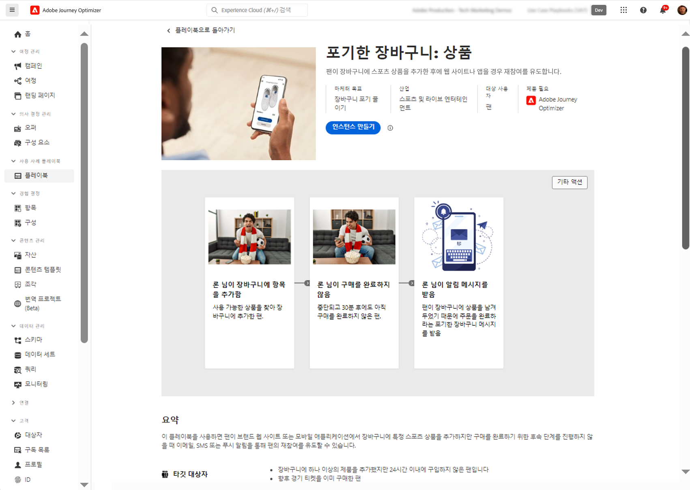
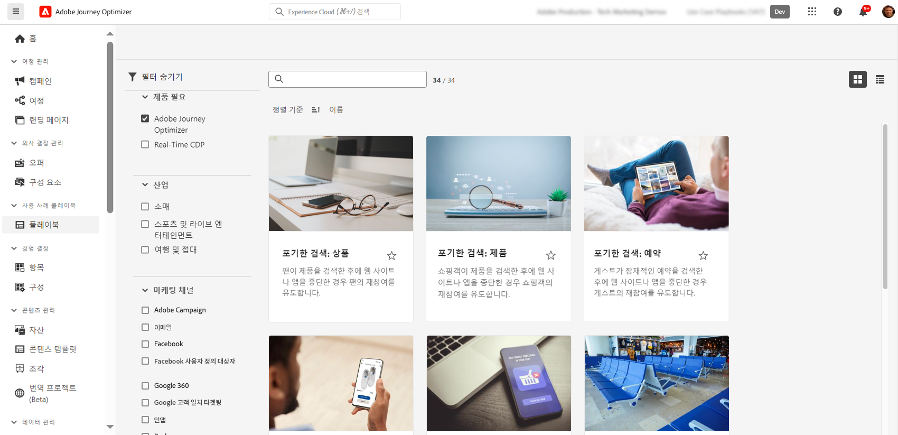

# 사용 사례 플레이북 {#playbooks}

## 사용 사례 플레이북이란 무엇입니까? {#gs}

사용 사례 플레이북은 Adobe Experience Platform 및 Journey Optimizer을 사용하여 수행할 수 있는 일반적인 사용 사례를 처리하는 사전 정의된 워크플로입니다.

{width="85%"}

각 플레이북은 의도, 목표, 타겟팅된 가상 사용자 및 이를 구현하는 데 필요한 리소스를 포함한 포괄적인 개요를 제공합니다. 또한 각 플레이북에서 마인드맵을 사용하여 플레이북과 관련된 실제 고객 터치포인트를 시각적으로 표시할 수 있습니다.

{width="85%"}

## 전제 조건 {#prerequisites}

사용 사례 플레이북을 사용하기 전에 다음 구성 단계가 필요합니다. 각 단계에 대한 자세한 내용은 사용 사례 플레이북 설명서 [시작](https://experienceleague.adobe.com/docs/experience-platform/use-case-playbooks/playbooks/get-started.html?lang=ko){target="_blank"} 페이지에서 확인할 수 있습니다.

* 샌드박스 만들기
* 사용자 권한 구성
* 이메일, 푸시, SMS 알림에 대한 Journey Optimizer 채널 구성을 구성

## 플레이북 액세스 및 활성화 {#access}

플레이북에 액세스하려면 왼쪽 탐색 레일에 있는 **[!UICONTROL 플레이북]** 메뉴로 이동합니다. 라이브러리에는 Adobe Journey Optimizer를 사용하여 구현된 몇 가지 플레이북이 포함되어 있습니다. 이러한 기능에 쉽게 액세스하려면 검색 창 옆에 있는 필터를 사용하십시오. Journey Optimizer 플레이북의 전체 목록은 [사용 사례 플레이북 설명서](https://experienceleague.adobe.com/docs/experience-platform/use-case-playbooks/playbooks/playbooks-list.html?lang=ko){target="_blank"}에서 확인할 수 있습니다.

{width="85%"}

필요에 가장 적합한 플레이북을 선택하면 활성화할 수 있습니다. 이렇게 하면 플레이북의 인스턴스가 만들어지고 특정 사용 사례를 지원하는 데 필요한 리소스가 자동으로 생성됩니다. 리소스에는 여정, 메시지와 같은 Journey Optimizer 자산과 스키마 또는 세그먼트와 같은 Adobe Experience Platform 자산이 포함됩니다.

>[!NOTE]
>
>이러한 오브젝트의 목적은 특정 사용 사례를 구현하는 데 필요한 모든 리소스를 이해하는 데 도움을 주는 것입니다. 데이터를 포함하지 않으며 개발 샌드박스에서 생성됩니다. 

사용 사례를 구현하기 위해 각 오브젝트를 탐색하여 필요에 맞게 조정할 수 있습니다. 또한 팀 간에 플레이북 인스턴스 페이지 URL을 공유하여 사용 사례 구현을 공동 작업할 수도 있습니다.

또한 플레이북 자산을 다른 샌드박스로 가져올 수 있습니다. 이렇게 하면 이미 고유한 스키마, 필드 및 필드 그룹을 설정한 경우 생성된 자산을 기존 자산에 맞추고 데이터와 호환되는지 확인할 수 있습니다. 다음 단계는 사용 사례 플레이북 설명서에 자세히 설명되어 있습니다. [플레이북에서 생성한 에셋을 다른 샌드박스에 게시](https://experienceleague.adobe.com/docs/experience-platform/use-case-playbooks/playbooks/data-awareness.html?lang=ko){target="_blank"}.

## 나만의 플레이북 만들기(Beta) {#create}

>[!AVAILABILITY]
>
>사용 사례 플레이북 생성은 현재 모든 고객이 공개 베타로 사용할 수 있습니다.

사전 정의된 플레이북을 활용하는 것 외에도 Adobe Experience Platform 내에서 나만의 플레이북을 만들고 공유할 수 있습니다.

AI 지원 또는 수동 입력을 사용하여 메타데이터를 정의하고 스키마, 세그먼트와 같은 기술 자산을 연결하며 다양한 IMS 조직 간에 플레이북을 공유할 수 있습니다.

플레이북을 만들고 공유하는 방법에 대한 자세한 내용은 사용 사례 플레이북 설명서를 참조하세요. [AI Assistant를 사용하여 플레이북을 만들고 공유](https://experienceleague.adobe.com/docs/experience-platform/use-case-playbooks/playbooks/author.html?lang=en#sharing-playbooks-sandboxes){target="_blank"}.
