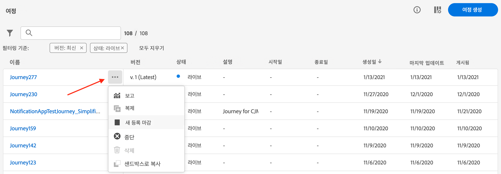

# 검색, 필터링, 구성 {#search-filter-organize}

## 검색{#unified-search}

Adobe Journey Optimizer 인터페이스의 모든 곳에서 상단 표시줄의 중앙에 있는 통합 Adobe Experience Cloud 검색 기능을 사용하여 샌드박스 전반의 에셋, 여정, 데이터세트 등을 찾을 수 있습니다.

상위 결과를 표시할 컨텐츠 입력을 시작합니다. 입력한 키워드에 대한 도움말 문서도 결과에 표시됩니다.

모든 결과에 액세스하여 비즈니스 객체별로 필터링하려면 **Enter 키**&#x200B;를 누릅니다.

## 목록 필터링{#filter-lists}

대부분의 목록에서 검색 표시줄을 사용하여 특정 항목을 찾고 필터링 기준을 정의합니다.

목록 왼쪽 위의 필터 아이콘을 클릭하여 필터에 액세스할 수 있습니다. 필터 메뉴에서는 표시된 요소를 다양한 기준에 따라 필터링할 수 있습니다. 특정 유형이나 상태의 요소, 직접 만든 요소 또는 지난 30일 동안 수정한 요소만 표시하도록 선택할 수 있습니다. 선택 사항은 컨텍스트에 따라 다릅니다.

또한 통합 태그를 사용하여 객체에 지정된 태그에 따라 목록을 필터링할 수 있습니다. 현재, 여정 및 캠페인에 태그를 사용할 수 있습니다. [태그 작업 방법 알아보기](#tags)

>[!NOTE]
>
>목록 오른쪽 위의 구성 버튼을 사용하면 표시되는 열을 개인화할 수 있습니다. 개인화는 내용은 각 사용자별로 저장됩니다.

해당 목록에서 각 요소에 대해 기본적인 작업을 수행할 수 있습니다. 예를 들어 항목을 복제하거나 삭제할 수 있습니다.

## 통합 태그 작업 {#tags}

Adobe Experience Platform 사용 [통합 태그](https://experienceleague.adobe.com/docs/experience-platform/administrative-tags/overview.html)를 사용하면 Journey Optimizer 여정 및 캠페인을 쉽게 분류하여 목록에서 검색을 향상시킬 수 있습니다.

>[!AVAILABILITY]
>
>통합 태그는 현재 베타 버전입니다. 설명서 및 기능은 변경될 수 있습니다.

### 개체에 태그 추가

다음 **태그** 필드, [여정](../building-journeys/journey-gs.md#change-properties) 또는 [campaign](../campaigns/create-campaign.md#create) 속성을 사용하면 개체의 태그를 정의할 수 있습니다. 기존 태그를 선택하거나 새 태그를 만들 수 있습니다.

원하는 태그의 이름을 입력하고 목록에서 선택합니다. 사용할 수 없는 경우 **만들기** 새 항목을 만들어 추가합니다. 필요한 만큼 태그를 정의할 수 있습니다.

정의된 태그 목록은 **태그** 필드.

>[!NOTE]
>
> 태그는 대/소문자를 구분합니다
> 
> 여정 또는 캠페인의 새 버전을 복제하거나 만드는 경우 태그가 유지됩니다.

### 태그로 필터링

여정 및 캠페인 목록에 전용 열이 표시되므로 태그를 쉽게 시각화할 수 있습니다.

필터를 사용하면 특정 태그가 있는 여정 또는 캠페인만 표시할 수도 있습니다.

모든 유형의 여정 또는 캠페인(라이브, 초안 등)에서 태그를 추가하거나 제거할 수 있습니다. 이렇게 하려면 **추가 작업** 객체 옆에 있는 아이콘을 선택하고 **태그 편집**.

### 태그 관리

관리자는 태그를 삭제하고 **태그** 메뉴 아래의 **관리**. 자세한 내용은 [통합 태그 설명서](https://experienceleague.adobe.com/docs/experience-platform/administrative-tags/ui/managing-tags.html).

>[!NOTE]
>
> 에서 직접 만든 태그 **[!UICONTROL 태그]** Journey Optimizer의 필드는 기본 제공 &quot;분류되지 않음&quot; 카테고리에 자동으로 추가됩니다.
