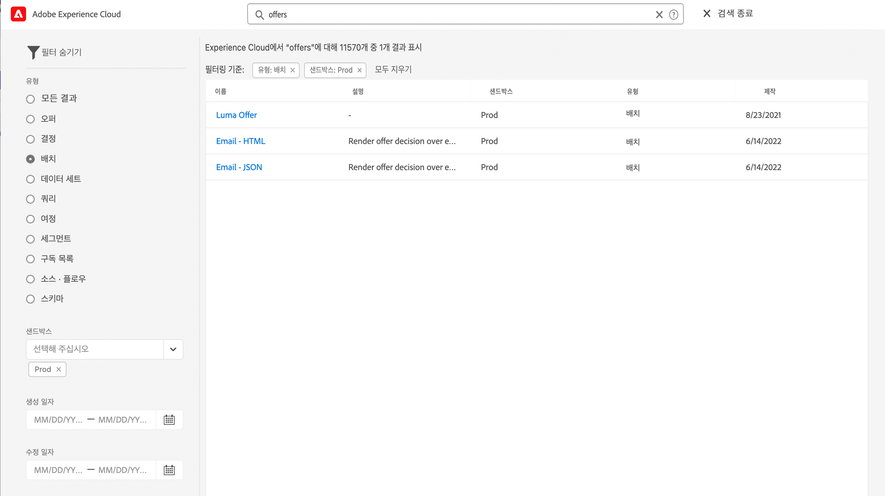
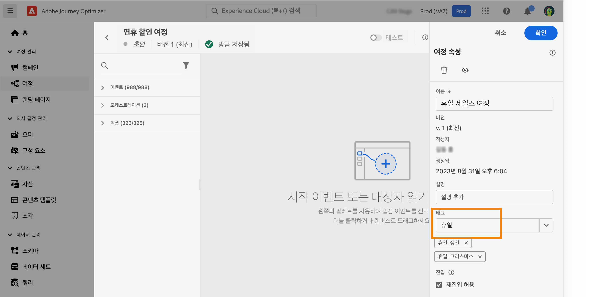
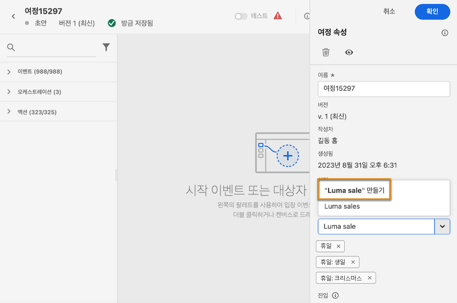
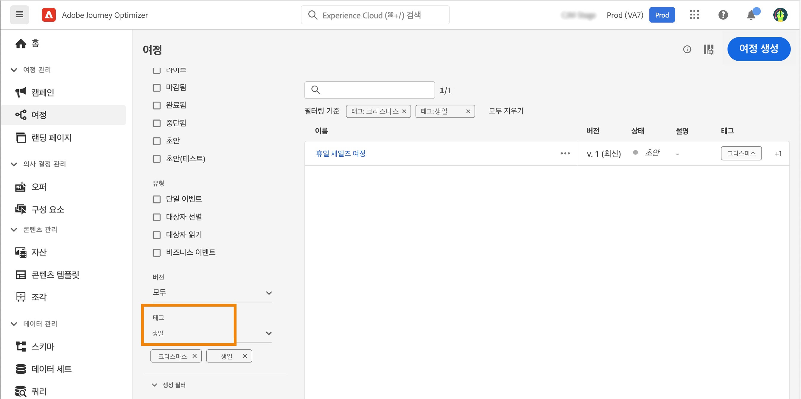
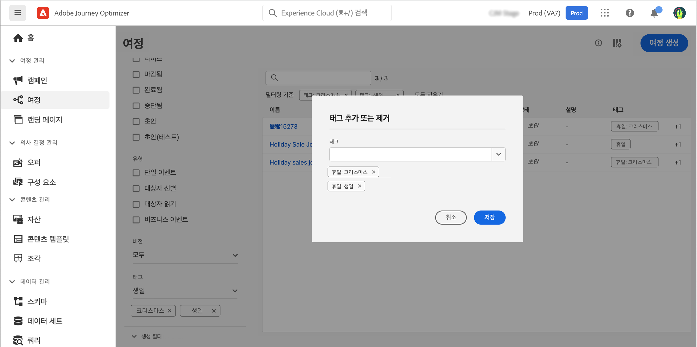

# 검색, 필터, 정리 {#search-filter-organize}

## 검색 {#unified-search}

Adobe Journey Optimizer 인터페이스에서 상단 표시줄의 중앙에 있는 통합 Adobe Experience Cloud 검색 기능을 사용하여 샌드박스 전반의 에셋, 여정, 데이터세트 등을 찾을 수 있습니다.

상위 결과를 표시할 컨텐츠 입력을 시작합니다. 입력한 키워드에 대한 도움말 문서도 결과에 표시됩니다.

모든 결과에 액세스하여 비즈니스 객체별로 필터링하려면 **Enter 키**&#x200B;를 누릅니다.

## 목록 필터링 {#filter-lists}

대부분의 목록에서 검색 표시줄을 사용하여 특정 항목을 찾고 필터링 기준을 정의합니다.

목록 왼쪽 위의 필터 아이콘을 클릭하여 필터에 액세스할 수 있습니다. 필터 메뉴에서는 표시할 요소를 다양한 기준에 따라 필터링할 수 있습니다. 예를 들어 특정 유형이나 상태인 요소, 사용자가 직접 만든 요소, 또는 지난 30일 내에 수정한 요소만 표시할 수 있습니다. 선택 사항은 컨텍스트에 따라 다릅니다.

또한 [통합 태그]를 사용하여 개체에 할당된 태그를 기준으로 목록을 필터링할 수 있습니다. 현재는 여정과 캠페인에 태그를 사용할 수 있습니다. [태그 작업 방법 알아보기](#tags)

>[!NOTE]
>
>목록 오른쪽 위의 구성 버튼을 사용하면 표시되는 열을 개인화할 수 있습니다. 개인화는 내용은 각 사용자별로 저장됩니다.

해당 목록에서 각 요소에 대해 기본적인 작업을 수행할 수 있습니다. 예를 들어 항목을 복제하거나 삭제할 수 있습니다.

## 통합 태그 작업 {#tags}

>[!CONTEXTUALHELP]
>id="ajo_campaigns_tags"
>title="태그"
>abstract="이 필드로 Adobe Experience Platform 통합 태그를 캠페인에 할당할 수 있습니다. 태그를 할당하면 캠페인을 간단히 분류하고 캠페인 목록에서 편하게 검색할 수 있습니다."

Adobe Experience Platform [통합 태그](https://experienceleague.adobe.com/docs/experience-platform/administrative-tags/overview.html?lang=ko)를 사용하면 Journey Optimizer 오브젝트를 쉽게 분류하여 목록에서 보다 편하게 검색할 수 있습니다.

Journey Optimizer의 대상자에게 의미 있는 태그를 추가하면 나중에 필터링하고 검색하여 대상자를 보다 쉽게 찾을 수 있습니다. 태그를 추가로 사용하여 대상자를 관련성 있고 검색 가능한 폴더에 정리하고, 개인화된 오퍼 및 경험을 만들고, 경험 결정 규칙에서 사용할 수 있습니다.

### 개체에 태그 추가 {#add-tags}

다음 **[!UICONTROL 태그]** 필드에서는 오브젝트에 대한 태그를 정의할 수 있습니다. 태그는 다음 오브젝트에 사용할 수 있습니다.

* [캠페인](../campaigns/create-campaign.md#create)
* [결정 항목](../experience-decisioning/items.md)
* [조각](../content-management/fragments.md)
* [여정](../building-journeys/journey-properties.md)
* [랜딩 페이지](../landing-pages/create-lp.md)
* [구독 목록](../landing-pages/subscription-list.md)
* [템플릿](../content-management/content-templates.md)
* [채널 구성](../configuration/channel-surfaces.md#channel-config-tags)

기존 태그를 선택하거나 새 태그를 만들 수 있습니다. 그 방법은 다음과 같습니다.

1. 원하는 태그의 이름을 입력하거나 목록에서 선택합니다.

   

   >[!NOTE]
   >
   > 태그는 대/소문자를 구분하지 않습니다.

1. 검색 중인 태그를 사용할 수 없는 경우 **[!UICONTROL 만들기 &quot;&quot;]**&#x200B;를 클릭하여 새로운 태그를 정의하면 현재 오브젝트에 자동으로 추가되고 다른 모든 오브젝트에서 사용할 수 있게 됩니다.

   

1. 선택한 태그 또는 생성된 태그의 목록이 **[!UICONTROL 태그]** 필드 아래에 표시됩니다. 태그 정의 수에는 제한이 없습니다.

>[!NOTE]
> 
> 오브젝트를 복제하거나 새 버전을 만들 때는 태그가 유지됩니다.

### 태그로 필터링 {#filter-on-tags}

각 오브젝트 목록에는 태그를 쉽게 시각화할 수 있도록 전용 열이 표시됩니다.

필터를 통해 특정 태그가 있는 오브젝트나 캠페인만 표시할 수도 있습니다.

모든 유형의 여정 또는 캠페인(라이브, 초안 등)에 태그를 추가하거나 제거할 수 있습니다. 개체 옆의 **[!UICONTROL 추가 작업]** 아이콘을 클릭하고 **[!UICONTROL 태그 편집]**&#x200B;을 선택하면 됩니다.

### 태그 관리 {#manage-tags}

관리자는 **[!UICONTROL 관리]** 아래의 **[!UICONTROL 태그]** 메뉴를 사용하여 태그를 삭제하고 카테고리별로 정리할 수 있습니다. [통합 태그 설명서](https://experienceleague.adobe.com/docs/experience-platform/administrative-tags/ui/managing-tags.html?lang=ko)에서 태그 관리에 대해 자세히 알아보세요.

>[!NOTE]
>
> Journey Optimizer의 **[!UICONTROL 태그]** 필드에서 직접 만든 태그는 기본적으로 제공되는 “미분류” 카테고리에 자동으로 추가됩니다.
