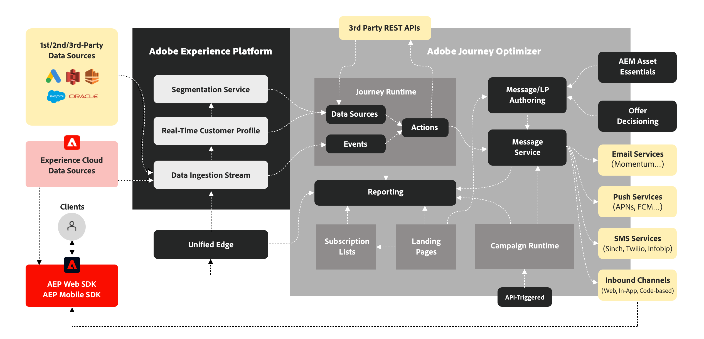

# Journey Optimizer 이해 {#understanding-ajo}

Adobe Journey Optimizer과 Adobe Experience Platform은 함께 작동하여 규모에 맞게 데이터 기반 개인화를 활성화합니다. 이 페이지에서는 이러한 시스템의 작동 방식과 주요 기능 영역이 결합되어 탁월한 고객 경험을 제공하는 방법을 설명합니다. [주요 기능에 대해 알아보기](get-started.md) | [주요 용어 탐색](terminology.md)

## Journey Optimizer 작동 방식 {#how-it-works}

Adobe Journey Optimizer은 개인화된 고객 여정을 만들기 위해 데이터를 수집, 분석 및 적용하는 연속 흐름으로 작동합니다.

### Adobe Experience Platform: The Foundation {#aep-foundation}

Adobe Experience Platform은 브랜드가 고객 데이터를 중앙 집중화하고 개인화된 경험에 대해 활성화할 수 있도록 하는 뼈대 역할을 합니다.

* **데이터 플랫폼** - 고객 데이터를 수집, 관리 및 구조화하여 시스템 전반에서 일관성을 보장하기 위한 중앙 허브입니다. [스키마 및 데이터 세트에 대해 알아보기](../data/get-started-schemas.md)
* **데이터 수집(소스)** - 미리 만들어진 커넥터를 사용하여 CRM 플랫폼, 웹 사이트, 모바일 앱 및 클라우드 저장소에서 데이터를 가져옵니다. [데이터 원본 탐색](get-started-sources.md)
* **실시간 고객 프로필** - 여러 소스의 데이터(이메일 상호 작용, 매장 내 구매, 웹 동작)를 병합하여 통합 프로필을 만듭니다. [프로필에 대해 알아보기](../audience/get-started-profiles.md)
* **거버넌스 계층** - 규정을 준수하면서 데이터 액세스, 개인 정보 보호 규정 준수 및 보안을 제어합니다. [개인 정보 보호 문서 보기](../privacy/get-started-privacy.md)

### Adobe Journey Optimizer: 오케스트레이션 엔진 {#ajo-orchestration}

Adobe Journey Optimizer은 Adobe Experience Platform의 데이터와 통찰력을 적용하여 지능적이고 개인화된 고객 경험을 제공합니다.

* **고객 이해** - 실시간 고객 프로필을 통해 대상 메시지를 세분화할 수 있습니다. [대상자 만들기](../audience/about-audiences.md)
* **콘텐츠 및 오퍼** - 콘텐츠 만들기, 관리 및 개인화를 위한 도구, 각 개인에게 가장 적합한 오퍼를 선택하는 실시간 논리. [콘텐츠 디자인](../../rp_landing_pages/content-management-landing-page.md) | [오퍼 관리](../offers/get-started/starting-offer-decisioning.md)
* **여정 및 캠페인 관리** - 상호 작용(여정) 시퀀스를 자동화하거나 일회성 타겟팅된 메시지(캠페인)를 예약합니다. [여정 작성](../building-journeys/journey-gs.md) | [캠페인 만들기](../campaigns/get-started-with-campaigns.md)
* **게재(연결)** - 이메일, SMS, 푸시 알림 및 DM과 같은 채널을 통해 메시지를 전달하고 외부 시스템으로 데이터를 내보냅니다. [채널 구성](../configuration/get-started-configuration.md)
* **측정 및 분석** - 지속적인 개선을 위한 보고서로 고객 참여 및 캠페인 성과를 추적합니다. [보고서 보기](../reports/campaign-global-report-cja.md)

### 지속적인 최적화 주기 {#optimization-cycle}

이 생태계는 지속적인 최적화 사이클로 작동합니다. 데이터는 고객 이해를 유도하여 개인화된 콘텐츠와 의사 결정을 알려줍니다. 이러한 기능은 여정으로 오케스트레이션되고, 여러 채널에 걸쳐 전달되며, 효과를 측정하고 시간이 지남에 따라 개선됩니다.

## 주요 기능 영역 {#functional-areas}

Journey Optimizer에는 원활하게 함께 작동하는 7개의 주요 기능 영역이 포함되어 있습니다.

| 기능 영역 | 용도 | 주요 활동 |
|-----------------|---------|----------------|
| **데이터 관리** | 고객 데이터 구성 | 스키마를 정의하고, 데이터 세트를 만들고, 다양한 시스템에서 데이터를 가져옵니다. [자세히 알아보기](../data/get-started-schemas.md) |
| **고객 관리** | 고객이 누구인지 이해 | 통합 프로필 작성, ID 확인, 대상자 만들기 [자세히 알아보기](../audience/get-started-profiles.md) |
| **콘텐츠 관리** | 개인화된 메시지 만들기 | 이메일 디자인, 에셋 관리, 템플릿 및 조각 빌드, 콘텐츠 개인화 [자세히 알아보기](../../rp_landing_pages/content-management-landing-page.md) |
| **의사 결정 관리** | 실시간으로 최상의 오퍼 선택 | 오퍼 라이브러리 관리, 규칙 정의, 제한 적용, 순위 논리 설정. [자세히 알아보기](../offers/get-started/starting-offer-decisioning.md) |
| **여정 관리** | 자동화된 고객 경험 디자인 | 비주얼 디자이너를 사용하여 여정을 만들고, 트리거를 설정하고, 조건을 추가하고, 단계를 기다립니다. [자세히 알아보기](../building-journeys/journey-gs.md) |
| **연결** | 데이터 소스 및 채널 연결 | 소스 커넥터를 구성하고, 채널을 설정하고, 외부 플랫폼에 연결합니다. [자세히 알아보기](../configuration/get-started-configuration.md) |
| **관리 및 개인 정보** | 설정 및 규정 준수 제어 | 사용자 관리, 샌드박스 구성, 채널 설정, 개인 정보 보호 요청 처리. [자세히 알아보기](../administration/permissions.md) |

### 이러한 영역을 함께 사용하는 방법 {#working-together}

이러한 기능 영역은 연속적인 사이클에서 작동합니다.

1. **데이터 수집** - 데이터가 데이터 관리로 구성된 Adobe Experience Platform으로 이동합니다.
2. **고객 이해** - 실시간 고객 프로필은 데이터를 통합하고, 고객 관리는 대상을 만듭니다
3. **컨텐츠 및 오퍼 전략** - 컨텐츠 관리에서 메시지를 만들고 의사 결정 관리에서 오퍼 논리를 정의합니다.
4. **오케스트레이션** - 여정 관리에서 고객 데이터, 콘텐츠 및 의사 결정을 사용하여 채널 간 상호 작용을 매핑합니다.
5. **게재** - 연결을 통해 채널을 통해 메시지를 전달하거나 외부 시스템과 데이터를 공유할 수 있습니다.
6. **측정** - 성능 데이터 피드에서 대상, 콘텐츠, 의사 결정 및 여정을 세분화하기 위해 통찰력을 다시 가져옵니다.
7. **거버넌스** - 관리 및 개인 정보 보호 컨트롤을 통해 규정 준수 보장

## 아키텍처 세부 정보 {#architecture-details}

기술 팀의 경우 Journey Optimizer과 Adobe Experience Platform의 통합 방식을 보여주는 자세한 아키텍처 다이어그램입니다. 실제로 이러한 구성 요소를 탐색하려면 [인터페이스를 탐색합니다](user-interface.md).

Adobe Real-Time Customer Data Platform, Journey Optimizer, Customer Journey Analytics, Adobe Mix Modeler 등 4개의 애플리케이션이 Experience Platform에 기본적으로 구축되어 있습니다. Journey Optimizer은 이러한 애플리케이션과 원활하게 작동하지만 독립적으로 작동할 수도 있습니다. 구현 고려 사항에 대해서는 [보호 기능 및 제한 사항을 검토](guardrails.md)하십시오.

### 통합 포인트 {#integration-points}

Journey Optimizer은 여러 수준에서 Adobe Experience Platform과 통합됩니다.

* **데이터 계층** - 동일한 실시간 고객 프로필, ID 그래프 및 데이터 세트를 공유합니다.
* **서비스 계층** - Adobe Experience Platform의 거버넌스, 개인 정보 및 쿼리 서비스를 활용합니다.
* **응용 프로그램 계층** - Adobe Experience Platform을 기반으로 여정 오케스트레이션, 의사 결정 관리 및 콘텐츠 관리를 제공합니다.

[Adobe Journey Optimizer 블루프린트](https://experienceleague.adobe.com/ko/docs/blueprints-learn/architecture/customer-journeys/journey-optimizer/journey-optimizer-overview){target="_blank"}에 대해 자세히 알아보세요.

## 개인 정보 보호 및 보안 {#privacy-security}

Adobe Experience Cloud의 개인 정보 보호 및 보안 방침은 Adobe Journey Optimizer에 적용됩니다. 이러한 조치는 GDPR과 같은 개인 정보 보호 규정을 준수하도록 함으로써 고객 신뢰를 유지하면서 개인화된 경험을 제공할 수 있도록 합니다. [Journey Optimizer의 개인 정보 보호에 대해 자세히 알아보기](../privacy/get-started-privacy.md)
