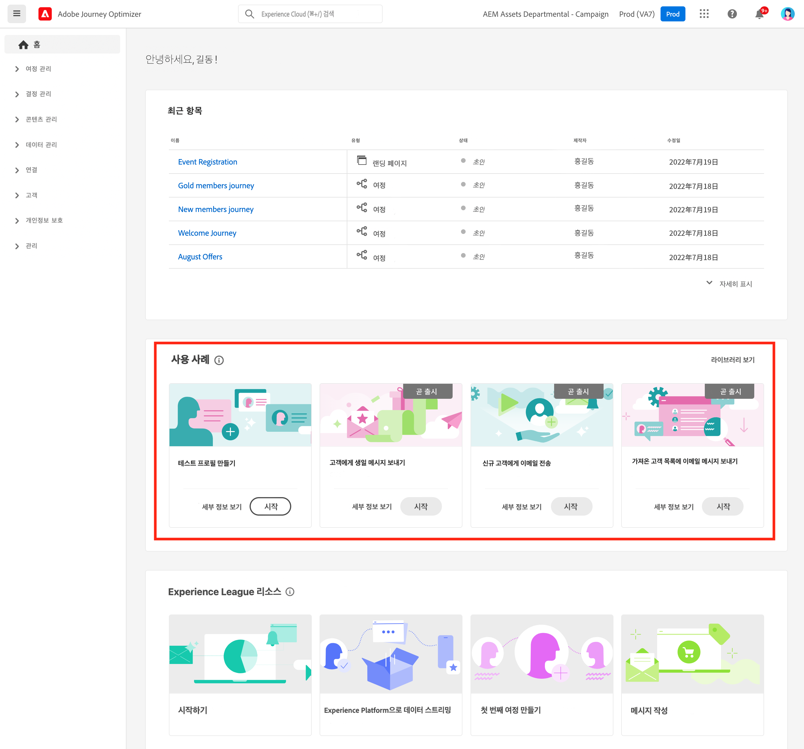

# 사용자 인터페이스 {#cjm-user-interface}

[!DNL Adobe Journey Optimizer]에 액세스하려면 Adobe ID로 [Adobe Experience Cloud](https://experience.adobe.com)에 접속하고 [!DNL Journey Optimizer]를 선택합니다.

사용자 인터페이스를 검색할 때의 주요 개념은 Adobe Experience Platform과 공통됩니다. 자세한 내용은 [Adobe Experience Platform 설명서](https://experienceleague.adobe.com/docs/experience-platform/landing/platform-ui/ui-guide.html?lang=ko#adobe-experience-platform-ui-guide)를 참조하십시오.{target="_blank"}

사용자 인터페이스에서 사용할 수 있는 구성 요소 및 기능은 사용자의 [권한](../administration/permissions.md)과 [라이선스 패키지](https://helpx.adobe.com/kr/legal/product-descriptions/adobe-journey-optimizer.html){target="_blank"}에 따라 다릅니다. 질문이 있는 경우 Adobe 고객 성공 관리자에게 문의하십시오.

>[!NOTE]
>
>이 설명서는 사용자 인터페이스 제품의 최근 변경 사항을 반영하여 자주 업데이트됩니다. 하지만 어떤 스크린샷은 실제 사용자 인터페이스와 약간 다를 수 있습니다.

## 왼쪽 탐색 {#left-nav}

왼쪽의 링크를 열어 [!DNL Journey Optimizer] 기능에 액세스합니다.

>[!NOTE]
>
>사용 가능한 기능은 사용 권한 및 라이선스 계약에 따라 달라질 수 있습니다.

왼쪽 탐색에 있는 서비스 및 기능의 전체 목록 및 관련 도움말 페이지에 대한 링크를 아래에서 확인할 수 있습니다.

### 홈 {#left-nav-home}

[!DNL Journey Optimizer] 홈 페이지에는 시작할 주요 링크와 리소스가 포함되어 있습니다.

**[!UICONTROL 최근 항목]** 목록은 최근에 만들어진 이벤트 및 여정에 대한 단축키를 제공합니다. 이 목록에는 작성 및 수정 날짜와 상태가 표시됩니다.

제품 내 사용 사례를 찾아보며 리소스와 메시지 작성을 시작해 보세요. [자세히 알아보기](#in-product-use-cases).

[!DNL Journey Optimizer]를 처음 사용하는 방법을 알아보려면 홈 페이지 하단에 있는 링크를 사용하세요. [자세히 알아보기](#find-help-and-support).

### [!UICONTROL 여정 관리] {#left-nav-journey}

이 섹션에서는 캠페인과 여정을 작성합니다.

* **[!UICONTROL 캠페인]** - 다양한 채널을 사용하여 특정 대상자에게 보이는 일회성 콘텐츠를 게재하는 캠페인을 만들고 구성하고 오케스트레이션합니다. [자세히 알아보기](../campaigns/get-started-with-campaigns.md)

* **[!UICONTROL 여정]** - 고객 여정을 만들고 구성하고 오케스트레이션합니다. 이벤트와 오케스트레이션, 작업 활동을 조합하여 여러 단계로 이루어진 크로스채널 시나리오를 작성합니다. [자세히 알아보기](../building-journeys/journey-gs.md#jo-build)

* **[!UICONTROL 랜딩 페이지]** - 랜딩 페이지를 만들고 디자인하고 테스트 및 게시합니다. 사용자에게 커뮤니케이션 수신을 옵트인 또는 옵트아웃하거나 특정 서비스를 구독할 수 있는 온라인 양식으로 가는 링크를 보냅니다. [자세히 보기](../landing-pages/get-started-lp.md)

### [!UICONTROL 의사 결정 관리] {#left-nav-offers}

이 섹션에서는 오퍼와 구성 요소를 만듭니다.

* **[!UICONTROL 오퍼]** - 이 메뉴에서 최근 소스 및 데이터 세트에 액세스합니다. 이 섹션을 사용하여 오퍼를 만듭니다. [자세히 알아보기](../offers/offer-library/creating-personalized-offers.md)

* **[!UICONTROL 구성 요소]** - 배치, 규칙, 태그를 만듭니다. [자세히 보기](../offers/offer-library/key-steps.md)

### [!UICONTROL 콘텐츠 관리] {#left-nav-content}

이 섹션에서는 콘텐츠를 만들고 관리합니다.

* **[!UICONTROL 자산]** - [!DNL Adobe Experience Manager Assets]은 메시지를 채우는 데 사용할 수 있는 자산의 중앙 집중식 저장소입니다. [자세히 보기](../content-management/assets.md)

* **[!UICONTROL 콘텐츠 템플릿]** - 보다 빠르고 품질 높은 디자인 프로세스를 위해 Journey Optimizer 캠페인 및 여정 전반에서 사용자 정의 콘텐츠를 쉽게 재사용할 수 있는 독립 실행형 템플릿을 만듭니다. [자세히 알아보기](../content-management/content-templates.md)

* **[!UICONTROL 조각]** - 보다 원활한 이메일 디자인 프로세스를 위해 조각을 만들고 관리합니다. 이메일 콘텐츠를 빠르게 조합하는 데 사용할 수 있는 사용자 정의 콘텐츠 블록을 미리 작성해 봅니다. [자세히 보기](../content-management/fragments.md)

### [!UICONTROL 데이터 관리] {#left-nav-data}

이 섹션에서는 데이터를 관리합니다.

* **[!UICONTROL 스키마]** - Adobe Experience Platform을 사용하여 스키마 편집기라는 인터랙티브한 시각적 캔버스에서 XDM(경험 데이터 모델) 스키마를 만들고 관리할 수 있습니다. [자세히 보기](../data/get-started-schemas.md)

* **[!UICONTROL 데이터 세트]** - Adobe Experience Platform에 수집되는 모든 데이터는 데이터 세트로 Data Lake 내에 보관됩니다. 데이터 세트는 스키마(열) 및 필드(행)를 포함하는 데이터 수집을 위한 저장소 및 관리 구조입니다. [자세히 알아보기](../data/get-started-datasets.md)

* **[!UICONTROL 쿼리]** - Adobe Experience Platform 쿼리 서비스를 사용하여 쿼리를 작성하여 실행하고, 이전에 실행한 쿼리를 보고, 조직 내에서 사용자가 저장한 쿼리에 액세스합니다. [자세히 보기](../data/get-started-queries.md)

* **[!UICONTROL 모니터링]** - 이 메뉴를 사용하여 Adobe Experience Platform 사용자 인터페이스 내에서 데이터 수집을 모니터링합니다. 자세한 내용은 [Adobe Experience Platform 설명서](https://experienceleague.adobe.com/docs/experience-platform/ingestion/quality/monitor-data-ingestion.html?lang=ko){target="_blank"}를 참조하십시오

### [!UICONTROL 연결] {#left-nav-connections}

이 섹션에서는 다른 앱 및 클라우드와의 데이터 연결을 관리합니다.

* **[!UICONTROL 소스]** - 이 메뉴를 사용하여 Adobe 애플리케이션, 클라우드 기반의 저장소, 데이터베이스 등 다양한 소스의 데이터를 수집합니다. 들어오는 데이터를 구조화, 라벨링하고 개선할 수 있습니다. [자세히 알아보기](get-started-sources.md)

* **[!UICONTROL 대상]** - 이 메뉴에서는 클라우드 스토리지 위치와 실시간 연결을 설정하여 데이터 세트의 콘텐츠를 내보낼 수 있습니다. [자세히 보기](../data/export-datasets.md)

### [!UICONTROL 고객] {#left-nav-customers}

이 섹션에서는 대상자 및 프로필 데이터를 관리합니다.

* **[!UICONTROL 대상자]** - Experience Platform 대상자 정의를 만들고 관리하며 여정에 사용할 수 있습니다. [자세히 알아보기](../audience/about-audiences.md)

* **[!UICONTROL 구독 목록]** - [!DNL Journey Optimizer]에서는 구독 서비스에 옵트인한 고객 정보를 수집해 구독 목록을 만듭니다. [자세히 보기](../landing-pages/subscription-list.md)

* **[!UICONTROL 프로필]** - 실시간 고객 프로필은 온라인, 오프라인, CRM 및 타사 데이터를 비롯한 다양한 채널의 데이터를 취합하여 각 개별 고객을 전체적으로 파악할 수 있도록 합니다. [자세히 보기](../audience/get-started-profiles.md)

* **[!UICONTROL ID]** - Adobe Experience Platform ID 서비스는 Adobe Experience Platform 내에서 ID 그래프로 알려진 방식으로 크로스 디바이스, 크로스 채널 및 실시간 고객 식별을 관리합니다. [자세히 보기](../audience/get-started-identity.md)

### [!UICONTROL 개인 정보 보호] {#left-nav-privacy}

이 섹션에서는 개인 정보 관리 및 요청을 제어합니다.

* **[!UICONTROL 정책]** - Adobe Experience Platform에서는 필드에 레이블을 지정하고 각 채널에 대한 마케팅 작업을 만들 수 있습니다. 그런 다음 레이블 및 마케팅 작업에 연결된 거버넌스 정책을 정의합니다. [자세히 알아보기](../action/action-privacy.md)

* **[!UICONTROL 요청]** - 개인 정보 요청은 Adobe Experience Platform Privacy Service에서 관리합니다. 이 서비스에서는 고객 데이터 요청을 관리하는 데 도움이 되는 RESTful API 및 사용자 인터페이스를 제공합니다. [자세히 알아보기](../privacy/requests.md)

* **[!UICONTROL 감사]** - 이 섹션으로 이동하면 활동 로그를 확인할 수 있습니다. [자세히 알아보기](../privacy/audit-logs.md)

* **[!UICONTROL 데이터 위생]** - 이 섹션에서는 데이터 위생 작업을 구성하고 예약함으로써 기록을 적절하게 유지 관리할 수 있습니다. [자세히 보기](../privacy/data-hygiene.md)

### [!UICONTROL 관리] {#left-nav-admin}

* **[!UICONTROL 구성]** - 이 메뉴에서는 여정에서 사용할 [이벤트](../event/about-events.md), [데이터 소스](../datasource/about-data-sources.md), [작업](../action/action.md)을 구성할 수 있습니다.

  **보고** 섹션에 액세스하여 캠페인 실험 보고를 구성할 수도 있습니다. [자세히 알아보기](../content-management/reporting-configuration.md)

* **[!UICONTROL 비즈니스 규칙]** - 이 섹션에서는 크로스 채널 비즈니스 규칙을 만들어 사용자가 메시지를 받거나 여정에 입장하는 빈도를 제어합니다. [자세히 보기](../configuration/frequency-rules.md)

* **[!UICONTROL 경고]** - 사용자 인터페이스를 사용하면 Adobe Experience Platform Observability Insights에서 공개한 지표를 기반으로 받은 경고 내역을 볼 수 있습니다. 또한 UI에서 사용 가능한 경고 규칙을 보고, 활성화 및 비활성화할 수 있습니다. [자세히 알아보기](../reports/alerts.md)

* **[!UICONTROL 샌드박스]** - Adobe Experience Platform은 디지털 경험 애플리케이션을 개발하고 발전시키는 데 도움이 되는 단일 플랫폼 인스턴스를 별도의 가상 환경으로 분할하는 샌드박스를 제공합니다. 이 섹션에서 샌드박스를 관리할 수 있습니다. [자세히 알아보기](../administration/sandboxes.md)

* **[!UICONTROL 채널]** - 이 섹션에서 하위 도메인, 구성, 전달성 설정 등을 지정하여 채널을 구성할 수 있습니다. [자세히 알아보기](../configuration/get-started-configuration.md)

* **[!UICONTROL 태그]** - [통합 태그]를 사용하면 여정과 캠페인을 쉽게 분류하여 목록에서 보다 편하게 검색할 수 있습니다. [자세히 알아보기](../start/search-filter-categorize.md#work-with-unified-tags)

## 제품 내 사용 사례 {#in-product-uc}

[!DNL Adobe Journey Optimizer] 홈 페이지의 제품 사용 사례를 토대로 테스트 프로필이나 첫 번째 고객 여정을 빠르게 만들 수 있습니다.

사용 가능한 사용 사례는 다음과 같습니다.

* **테스트 프로필을 만들고**, CSV 템플릿을 사용하여 테스트 프로필을 만들어 개인화된 메시지 및 여정을 테스트합니다. [이 페이지](../audience/creating-test-profiles.md#use-case-1)에서 이 사용 사례를 구현하는 방법을 알아보세요.
* **고객에게 생일 메시지를 보내기** 고객의 생일을 축하하기 위해 자동으로 이메일을 보냅니다. (준비 중)
* **신규 고객 환영 이메일 보내기**&#x200B;로 새로 가입한 고객을 환영하는 이메일을 최대 두 개까지 간단히 보낼 수 있습니다. (준비 중)
* **가져온 고객 목록에 푸시 메시지 보내기** CSV 파일에서 가져온 고객 목록에 푸시 알림을 신속하게 전송할 수 있습니다. (준비 중)

각 사용 사례에 대해 자세히 알아보려면 **[!UICONTROL 세부 정보 보기]** 링크를 클릭합니다.

사용 사례를 실행하려면 **[!UICONTROL 시작]** 버튼을 클릭합니다.

실행한 사용 사례에는 **[!UICONTROL 라이브러리 보기]** 버튼으로 액세스할 수 있습니다.

## 도움말 및 지원 찾기 {#find-help}

홈페이지의 하위 섹션에서 Adobe Journey Optimizer 주요 도움말 페이지에 액세스합니다.

**도움말** 아이콘을 사용하여 도움말 페이지에 액세스하고, 지원 팀에 문의하고 피드백을 공유할 수 있습니다. 검색 필드에서 도움말 문서와 비디오를 검색할 수 있습니다.

각 페이지에서 상황별 도움말 버튼을 사용하여 기능에 대해 자세히 알아보고 **[!DNL Adobe Experience League]** 설명서를 검색할 수 있습니다.

## 언어 환경 설정 {#language-pref}

사용자 인터페이스 제공 언어:

* 영어
* 프랑스어
* 독일어
* 이탈리아어
* 스페인어
* 포르투갈어(브라질)
* 일본어
* 한국어
* 중국어 번체
* 중국어 간체

기본 인터페이스 언어는 사용자 프로필에 지정된 기본 언어로 결정됩니다.

언어를 변경하는 방법:

* 오른쪽 상단의 아바타에서 **환경 설정**을 클릭합니다.
  
* 그런 다음 이메일 주소 아래에 표시되는 언어를 클릭합니다.
* 기본 언어를 선택하고 **저장**을 클릭합니다. 사용 중인 구성 요소가 첫 번째 언어로 현지화되지 않은 경우 두 번째 언어를 선택할 수 있습니다.
  

<!--CONTEXTUAL HELP TO DISPATCH IN DOCS ONCE FEATURE LIVE-->

<!--PRIORITIZATION & CONFLICT MANAGEMENT-->

>[!CONTEXTUALHELP]
>id="ajo_rule_set_domain"
>title="오브젝트 유형"
>abstract="오브젝트 유형"

>[!CONTEXTUALHELP]
>id="ajo_journey_capping_rule"
>title="여정에 규칙 세트 적용"
>abstract="규칙 세트를 적용하여 빈도 상한 설정 규칙에 따라 대상자의 일부에서 이 여정을 제외합니다."

>[!CONTEXTUALHELP]
>id="ajo_rule_set_rule_type"
>title="규칙 유형"
>abstract="규칙 유형"

>[!CONTEXTUALHELP]
>id="ajo_rule_set_concurrency_prioritization"
>title="우선 순위 지정 미리 보기"
>abstract=" 여기에 지정된 기간 내에 더 높은 우선 순위의 여정이 예약된 경우, 고객은 이 여정에 참여할 수 없습니다. 여정을 순서대로 입력하려는 상황에서는 일일 예상 기간을 선택하고 해당 날짜에 다른 여정의 우선 순위 점수가 해당 여정의 우선 순위 점수보다 낮은지 확인하는 것이 좋습니다. 여정에 100점의 우선 순위 점수를 부여하면 해당 여정은 입력됩니다."

>[!CONTEXTUALHELP]
>id="ajo_campaigns_capping_rule"
>title="캠페인에 규칙 세트 적용"
>abstract="추가 예정"

<!--TO REMOVE?-->

>[!CONTEXTUALHELP]
>id="ajo_rule_set_prioritization"
>title="우선 순위 지정 요소"
>abstract="추가 예정"

<!--TO REMOVE?-->

<!--CONTENT LOCKING-->

>[!CONTEXTUALHELP]
>id="ajo_locking_governance"
>title="거버넌스"
>abstract="거버넌스"

>[!CONTEXTUALHELP]
>id="ajo_locking_mode"
>title="모드"
>abstract="모드"

>[!CONTEXTUALHELP]
>id="ajo_locking_content_addition"
>title="콘텐츠 추가 활성화"
>abstract="콘텐츠 추가 활성화"

>[!CONTEXTUALHELP]
>id="ajo_locking_structure"
>title="콘텐츠 고정 구조"
>abstract="콘텐츠 고정 구조"

>[!CONTEXTUALHELP]
>id="ajo_locking_component"
>title="특정 고정 구성 요소 사용"
>abstract="특정 고정 구성 요소 사용"

>[!CONTEXTUALHELP]
>id="ajo_email_editable_areas"
>title="편집 가능한 영역 강조 표시"
>abstract="편집 가능한 영역 강조 표시"

>[!CONTEXTUALHELP]
>id="ajo_email_locking_activated"
>title="거버넌스 활성화됨"
>abstract="콘텐츠 잠금이 활성화되어 수정이 불가할 수 있습니다."

>[!CONTEXTUALHELP]
>id="ajo_email_locking_read_only"
>title="읽기 전용"
>abstract="이 콘텐츠는 읽기 전용이며 수정할 수 없습니다."

<!--APPROVAL POLICIES-->

>[!CONTEXTUALHELP]
>id="ajo_permissions_approval_policy"
>title="승인 정책"
>abstract="승인 정책"

>[!CONTEXTUALHELP]
>id="ajo_approval_policy_request_approval"
>title="승인 요청"
>abstract="승인 요청"

>[!CONTEXTUALHELP]
>id="ajo_approval_policy_request_change"
>title="변경 요청"
>abstract="변경 요청"

>[!CONTEXTUALHELP]
>id="ajo_campaigns_edit_disabled"
>title="편집 비활성화"
>abstract="편집 비활성화(캠페인)"

>[!CONTEXTUALHELP]
>id="ajo_journey_edit_disabled"
>title="편집 비활성화"
>abstract="편집 비활성화(여정)"

>[!CONTEXTUALHELP]
>id="ajo_approval_policy_approval_status"
>title="승인 상태"
>abstract="승인 상태"

>[!CONTEXTUALHELP]
>id="ajo_campaigns_approve"
>title="승인"
>abstract="승인(캠페인)"

>[!CONTEXTUALHELP]
>id="ajo_journey_approve"
>title="승인"
>abstract="승인(여정)"

<!--Multilingual-->

>[!CONTEXTUALHELP]
>id="ajo_multi_custom_conditional"
>title="사용자 지정 조건부 설정"
>abstract="사용자 지정 조건부 설정"

>[!CONTEXTUALHELP]
>id="ajo_multi_fallback"
>title="대체 환경 설정"
>abstract="대체 환경 설정"

<!-- ExD in email-->

>[!CONTEXTUALHELP]
>id="ajo_email_enable_experience_decisioning"
>title="경험 결정 활성화"
>abstract="경험 결정 활성화"
