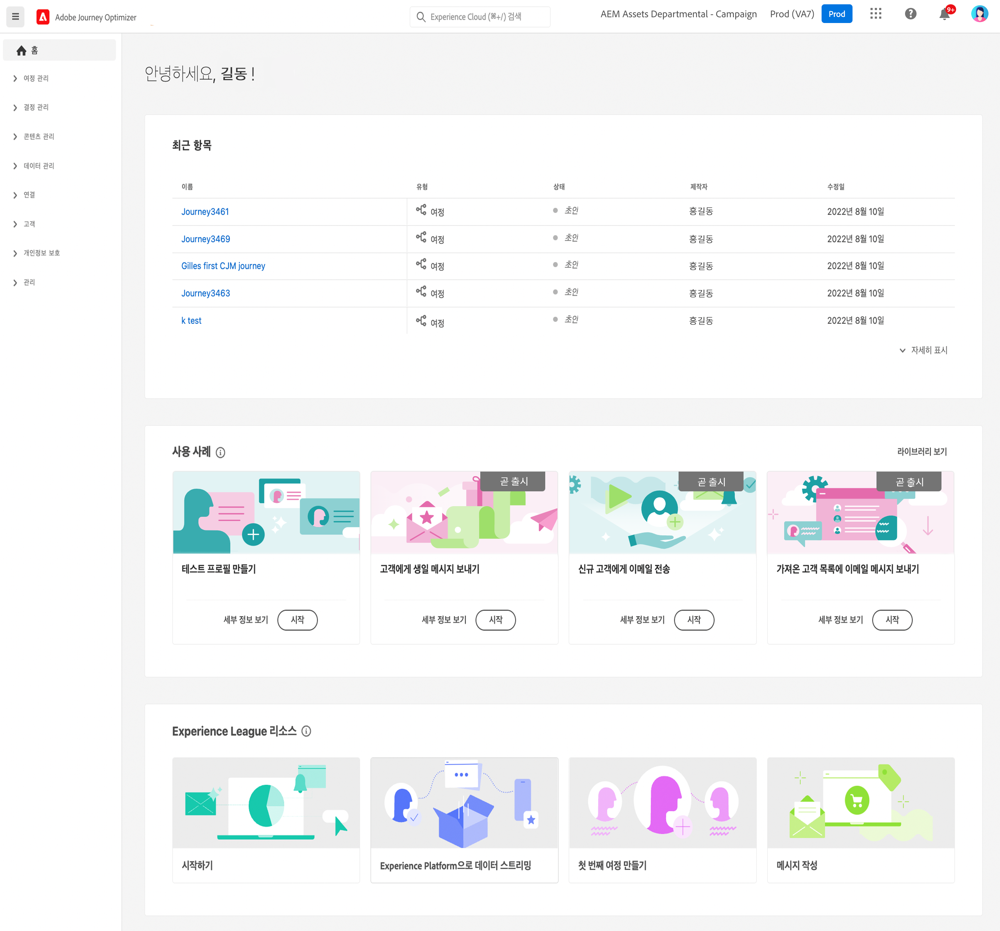
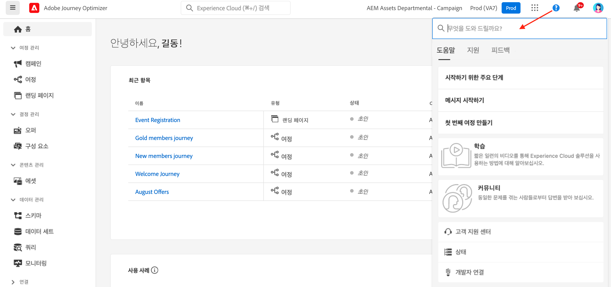
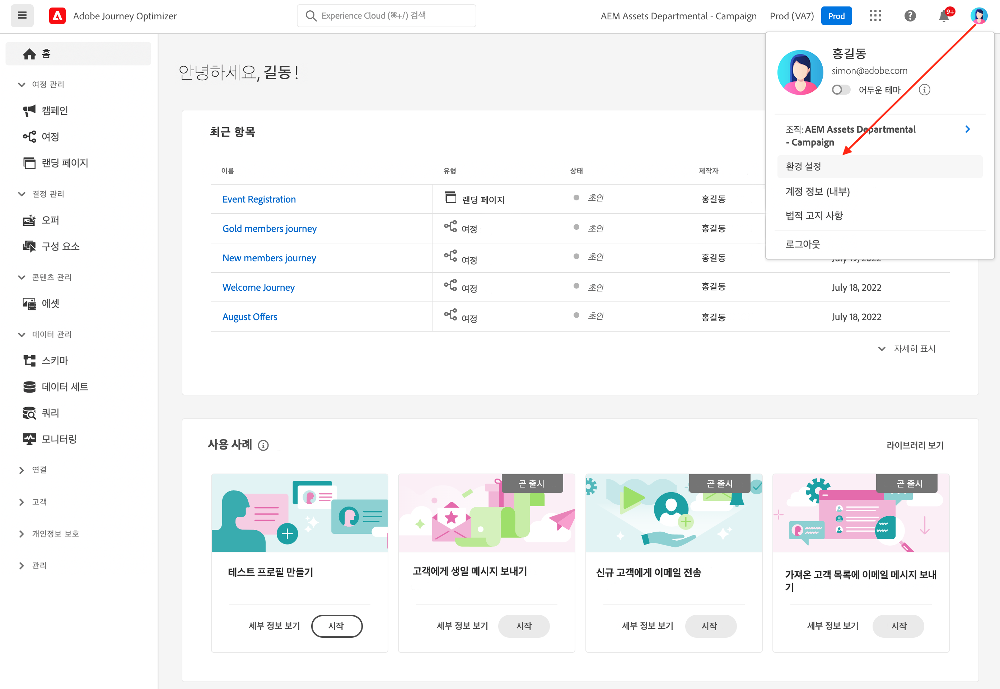

# 사용자 인터페이스 {#cjm-user-interface}

[Adobe Experience Cloud](http://experience.adobe.com)에 연결하여 [!DNL Journey Optimizer]를 찾습니다.

사용자 인터페이스를 검색할 때의 주요 개념은 Adobe Experience Platform과 공통됩니다. 자세한 내용은 [Adobe Experience Platform documentation](https://experienceleague.adobe.com/docs/experience-platform/landing/platform-ui/ui-guide.html?lang=ko#adobe-experience-platform-ui-guide){target=&quot;_blank&quot;}를 참조하십시오.

UI에서 사용할 수 있는 구성 요소 및 기능은 [사용 권한](../administration/permissions.md) 및 [라이선스 패키지](https://helpx.adobe.com/kr/legal/product-descriptions/adobe-journey-optimizer.html){target=&quot;_blank&quot;}에 따라 다릅니다. 질문이 있는 경우 Adobe 고객 성공 관리자에게 문의하십시오.

>[!NOTE]
>
>이 설명서는 사용자 인터페이스 제품의 최근 변경 사항을 반영하여 자주 업데이트됩니다. 하지만 어떤 스크린샷은 실제 사용자 인터페이스와 약간 다를 수 있습니다.

## 왼쪽 탐색 {#left-nav}

왼쪽의 링크를 사용하여 기능을 찾아봅니다.

>[!NOTE]
>
>사용 가능한 기능은 사용 권한 및 라이선스 계약에 따라 달라질 수 있습니다.

왼쪽 탐색에 있는 서비스 및 기능의 전체 목록 및 관련 문서에 대한 링크를 아래에서 확인할 수 있습니다.

**홈**

[!DNL Journey Optimizer] 홈 페이지에는 시작할 주요 링크와 리소스가 포함되어 있습니다. **[!UICONTROL Recents]** 목록은 최근에 만들었거나 업데이트된 메시지, 이벤트 및 여정에 대한 단축키를 제공합니다. 이 목록에는 작성 및 수정 날짜와 상태가 표시됩니다.

**[!UICONTROL JOURNEY MANAGEMENT]**

* **[!UICONTROL Journeys]** - 고객 여정 생성, 구성 및 조정 [자세히 알아보기](../building-journeys/journey-gs.md#jo-build)

* **[!UICONTROL Messages]** - 이메일 및 푸시 메시지의 작성, 디자인, 테스트 및 게시 [자세히 알아보기](../messages/create-message.md)

**[!UICONTROL DECISION MANAGEMENT]**

* **[!UICONTROL Offers]** - 이 메뉴에서 최근 소스 및 데이터 세트에 액세스합니다. 이 섹션을 사용하여 새 오퍼를 만듭니다. [자세히 알아보기](../offers/offer-library/creating-personalized-offers.md)

* **[!UICONTROL Components]** - 배치, 규칙 및 태그를 만듭니다. [자세히 알아보기](../offers/offer-library/key-steps.md)

**[!UICONTROL CONTENT MANAGEMENT]**

* **[!UICONTROL Assets]** - [!DNL Adobe Experience Manager Assets Essentials]는 메시지를 채우는 데 사용할 수 있는 자산의 중앙 집중식 저장소입니다. [자세히 알아보기](../messages/assets-essentials.md)

**[!UICONTROL DATA MANAGEMENT]**

* **[!UICONTROL Schemas]** - Adobe Experience Platform을 사용하여 스키마 편집기라는 인터랙티브한 시각적 캔버스에서 XDM(Experience Data Model) 스키마를 만들고 관리할 수 있습니다. [자세히 알아보기](get-started-schemas.md)

* **[!UICONTROL Datasets]** - Adobe Experience Platform에 수집되는 모든 데이터는 데이터 세트로 Data Lake 내에 보관됩니다. 데이터 세트는 스키마(열) 및 필드(행)를 포함하는 데이터 수집을 위한 저장소 및 관리 구조입니다. [자세히 알아보기](get-started-datasets.md)

* **[!UICONTROL Queries]** - Adobe Experience Platform 쿼리 서비스를 사용하여 쿼리를 작성하여 실행하고, 이전에 실행한 쿼리를 보고, 조직 내에서 사용자가 저장한 쿼리에 액세스합니다. [자세히 알아보기](get-started-queries.md)

* **[!UICONTROL Monitoring]** - 이 메뉴를 사용하여 Adobe Experience Platform 사용자 인터페이스 내에서 데이터 수집을 모니터링합니다. [자세히 알아보기](https://experienceleague.adobe.com/docs/experience-platform/ingestion/quality/monitor-data-ingestion.html?lang=ko){target=&quot;_blank&quot;}

**[!UICONTROL CONNECTIONS]**

* **[!UICONTROL Sources]** - 이 메뉴를 사용하여 Adobe 애플리케이션, 클라우드 기반의 저장소, 데이터베이스 등 다양한 소스의 데이터를 수집할 수 있고 수신 데이터를 구조화하고 레이블을 지정하고 향상시킬 수 있습니다. [자세히 알아보기](get-started-sources.md)

**[!UICONTROL CUSTOMER]**

* **[!UICONTROL Segments]** - Experience Platform 세그먼트 정의를 만들고 관리하며 여정에 활용할 수 있습니다. [자세히 알아보기](../segment/about-segments.md)

* **[!UICONTROL Profiles]** - 실시간 고객 프로파일은 온라인, 오프라인, CRM 및 서드파티 데이터를 비롯한 다양한 채널의 데이터를 취합하여 각 개별 고객을 전체적으로 파악할 수 있도록 합니다. [자세히 알아보기](get-started-profiles.md)

* **[!UICONTROL Identities]** - Adobe Experience Platform Identity Service는 Adobe Experience Platform 내에서 ID 그래프라고 알려진 것을 통해 고객의 ID를 크로스 디바이스, 크로스 채널 및 거의 실시간으로 식별하여 관리합니다. [자세히 알아보기](get-started-identity.md)

**[!UICONTROL ADMINISTRATION]**

* **[!UICONTROL Journey Administration]** - 이 메뉴를 사용하여 여정에서 사용할 [이벤트]../event/about-events.md), [데이터 소스](../datasource/about-data-sources.md), [작업](../action/action.md)을 구성할 수 있습니다.

* **[!UICONTROL Sandboxes]** - Adobe Experience Platform은 디지털 경험 애플리케이션을 개발하고 발전시키는 데 도움이 되는 단일 플랫폼 인스턴스를 별도의 가상 환경으로 분할하는 샌드박스를 제공합니다. [자세히 알아보기](../administration/sandboxes.md)

<!--
* **[!UICONTROL Alerts]** - The user interface allows you to view a history of received alerts based on metrics revealed by Adobe Experience Platform Observability Insights. The UI also allows you to view, enable, and disable available alert rules. [Learn more](https://experienceleague.adobe.com/docs/experience-platform/observability/alerts/overview.html){target="_blank"}
-->

## 제품 내 사용 사례 {#in-product-uc}

홈페이지에서 [!DNL Adobe Journey Optimizer] 사용 사례를 활용하고 고객 여정을 만들기 위한 몇 가지 빠른 입력을 제공합니다.

사용 가능한 사용 사례는 다음과 같습니다.

* **테스트 프로필을 만들고**, CSV 템플릿을 사용하여 테스트 프로필을 만들어 개인화된 메시지 및 여정을 테스트합니다. [이 페이지](../building-journeys/creating-test-profiles.md#use-case-1)에서 이 사용 사례를 구현하는 방법을 알아보세요.
* **고객에게 생일 메시지를 보내기** 고객의 생일을 축하하기 위해 자동으로 이메일을 보냅니다. (준비 중)
* **신규 고객 환영 이메일 보내기**&#x200B;로 새로 가입한 고객을 환영하는 이메일을 최대 두 개까지 간단히 보낼 수 있습니다. (준비 중)
* **가져온 고객 목록에 푸시 메시지 보내기** CSV 파일에서 가져온 고객 목록에 푸시 알림을 신속하게 전송할 수 있습니다. (준비 중)

각 사용 사례에 대한 자세히 알아보려면 **[!UICONTROL View details]**&#x200B;를 클릭하십시오.

**[!UICONTROL Begin]** 버튼을 클릭하여 사용 사례를 시작합니다.

**[!UICONTROL View use case library]** 버튼에서 실행된 사용 사례에 액세스할 수 있습니다.

## 접근성{#accessibility}

[!DNL Adobe Journey Optimizer]의 접근성 기능은 Adobe Experience Platform의 기능을 가져온 것으로 다음과 같은 기능이 제공됩니다.

* 키보드 접근성
* 색상 대비
* 필수 필드 유효성 검사

Adobe Experience Platform 설명서에서 [자세히 알아보기](https://experienceleague.adobe.com/docs/experience-platform/accessibility/features.html?lang=ko){target=&quot;_blank&quot;}

[!DNL Journey Optimizer]에서는 다음과 같은 일반적 키보드 단축키를 사용할 수 있습니다.

| 작업 | 단축키 |
| --- | --- |
| 사용자 인터페이스 요소, 섹션, 메뉴 그룹 간 이동 | 탭 |
| 사용자 인터페이스 요소, 섹션, 메뉴 그룹 간에 뒤로 이동 | Shift + Tab |
| 섹션 내에서 이동하여 포커스를 개별 요소로 설정 | 화살표 |
| 포커스에 있는 요소 선택 또는 지우기 | Enter 또는 스페이스바 |
| 선택 취소, 패널 축소 또는 대화 상자 닫기 | Esc |

Adobe Experience Platform 설명서에서 [자세히 알아보기](https://experienceleague.adobe.com/docs/experience-platform/accessibility/custom.html?lang=ko){target=&quot;_blank&quot;}

Journey Optimizer의 특정 부분에서 다음 단축키를 사용할 수 있습니다.

<table>
  <thead>
    <tr>
      <th>인터페이스 요소</th>
      <th>작업</th>
      <th>단축키</th>
    </tr>
  </thead>
  <tr>
    <td>여정, 작업, 데이터 소스 또는 이벤트의 목록</td>
    <td>여정, 작업, 데이터 소스 또는 이벤트 만들기</td>
    <td>C</td>
  </tr>
  <tr>
    <td rowspan="3">초안 상태의 여정 캔버스</td>
    <td>왼쪽 팔레트의 사용 가능한 첫 번째 위치에 활동 추가(위에서 아래로)</td>
    <td>활동 두 번 클릭</td>
  </tr>
  <tr>
    <td>모든 활동 선택</td>
    <td>Ctrl + A(Windows) Command + A(Mac)</td>
  </tr>
  <tr>
    <td>선택한 활동 삭제</td>
    <td>[삭제]를 선택하거나 백스페이스를 누른 다음 Enter 키로 삭제 확인</td>
  </tr>
  <tr>
  <td rowspan="3">

다음 요소의 구성 창:

<ul>
  <li>여정의 활동</li>
  <li>이벤트</li>
  <li>데이터 소스</li>
  <li>작업</li>
</ul>

</td>
    <td>구성할 다음 필드로 이동</td>
    <td>탭</td>
  </tr>
  <tr>
    <td>변경 내용을 저장하고 구성 창 닫기</td>
    <td>Enter</td>
  </tr>
  <tr>
    <td>변경 내용을 취소하고 구성 창 닫기</td>
    <td>Esc</td>
  </tr>
  <tr>
    <td rowspan="4">테스트 모드 여정</td>
    <td>테스트 모드 활성화 또는 비활성화</td>
    <td>T</td>
  </tr>
  <tr>
    <td>이벤트 기반 여정에서 이벤트 트리거</td>
    <td>E</td>
  </tr>
  <tr>
    <td>

**[!UICONTROL Single profile at a time]** 옵션이 켜진 세그먼트 기반 여정에서 이벤트 트리거

</td>
    <td>P</td>
  </tr>
  <tr>
    <td>테스트 로그 표시</td>
    <td>L</td>
  </tr>
<!-- //Ajouter ce raccourci quand il marchera (actuellement, le raccourci Ctrl/Cmd+F du navigateur a priorité sur celui de AJO).//
  <tr>
    <td>Page with a search bar</td>
    <td>Select the search bar</td>
    <td>Ctrl/Command + F</td>
  </tr>
-->
  <tr>
    <td>텍스트 필드</td>
    <td>선택한 필드의 모든 텍스트 선택</td>
    <td>Ctrl + A(Windows) Command + A(Mac)</td>
  </tr>
  <tr>
    <td rowspan="2">팝업 창</td>
    <td>변경 내용을 저장하거나 작업 확인</td>
    <td>Enter 키</td>
  </tr>
  <tr>
    <td>창 닫기</td>
    <td>Esc</td>
  </tr>
  <tr>
    <td>단순 표현식 편집기</td>
    <td>필드 선택 및 추가</td>
    <td>필드 두 번 클릭</td>
  </tr>
  <tr>
    <td>XDM 필드 검색</td>
    <td>노드의 모든 필드 선택</td>
    <td>상위 노드 선택</td>
  </tr>
  <tr>
    <td>페이로드 미리 보기</td>
    <td>페이로드 선택</td>
    <td>Ctrl + A(Windows) Command + A(Mac)</td>
  </tr>
</table>

## 도움말 및 지원 찾기 {#find-help}

홈페이지의 하위 섹션에서 Adobe Journey Optimizer 주요 도움말 페이지에 액세스합니다.

**도움말** 아이콘을 사용하여 도움말 페이지에 액세스하고, 지원 팀에 문의하고 피드백을 공유할 수 있습니다. 검색 필드에서 도움말 문서와 비디오를 검색할 수 있습니다.

## 지원되는 브라우저 {#browsers}

Adobe [!DNL Journey Optimizer] 인터페이스는 최신 버전의 Google Chrome에서 최적으로 작동되도록 디자인되었습니다. 이전 버전 또는 기타 브라우저에서 특정 기능을 사용하는 데 문제가 있을 수 있습니다.

## 언어 환경 설정 {#language-pref}

사용자 인터페이스는 현재 다음 언어로 제공됩니다.

* 영어
* 프랑스어
* 독일어

기본 인터페이스 언어는 사용자 프로필에 지정된 기본 언어로 결정됩니다.

언어를 변경하는 방법:

* 오른쪽 상단의 아바타에서 **환경 설정**을 클릭합니다.
   
* 그런 다음 이메일 주소 아래에 표시되는 언어를 클릭합니다.
* 기본 언어를 선택하고 **저장**을 클릭합니다. 사용 중인 구성 요소가 이전 언어로 현지화되지 않은 경우 두 번째 언어를 선택할 수 있습니다.
   

## 검색{#unified-search}

Adobe Journey Optimizer 인터페이스의 모든 곳에서 상단 표시줄의 중앙에 있는 Adobe Experience Cloud 검색을 사용하여 샌드박스 전반의 자산, 여정 또는 메시지를 찾을 수 있습니다.

상위 결과를 표시할 컨텐츠 입력을 시작합니다. 입력한 키워드에 대한 도움말 문서도 결과에 표시됩니다.

모든 결과에 액세스하여 비즈니스 객체별로 필터링하려면 **Enter 키**&#x200B;를 누릅니다.

## 목록 필터링{#filter-lists}

대부분의 목록에서 검색 막대를 사용하여 특정 항목을 검색하고 필터링 기준을 선택할 수 있습니다.

목록 왼쪽 위의 필터 아이콘을 클릭하면 필터에 액세스할 수 있습니다. 필터 메뉴에서는 표시된 요소를 여러 조건에 따라 필터링할 수 있습니다. 예를 들어 특정 유형이나 상태의 요소, 직접 만든 요소 또는 지난 30일 동안 수정한 요소만 표시하도록 선택할 수 있습니다. 선택 사항은 컨텍스트에 따라 다릅니다.

여정 목록의 **[!UICONTROL Status and version filters]**&#x200B;에서 상태, 유형 및 버전에 따라 여정을 필터링할 수 있습니다. 유형은 다음과 같습니다. **[!UICONTROL Unitary event]**, **[!UICONTROL Segment qualification]**, **[!UICONTROL Read segment]**, **[!UICONTROL Business event]** 또는 **[!UICONTROL Burst]**. **[!UICONTROL Activity filters]** 및 **[!UICONTROL Data filters]**&#x200B;에서 특정 이벤트, 필드 그룹 또는 작업을 사용하는 여정만 표시하도록 선택할 수 있습니다. **[!UICONTROL Publication filters]**&#x200B;에서는 발행 날짜 또는 사용자를 선택할 수 있습니다. 예를 들어 어제 게시된 라이브 경로의 최신 버전만 표시하도록 선택할 수 있습니다. [자세히 알아보기](../building-journeys/using-the-journey-designer.md).

>[!NOTE]
>
>목록 오른쪽 위의 구성 버튼을 사용하면 표시되는 열을 개인화할 수 있습니다. 개인화는 내용은 각 사용자별로 저장됩니다.

**[!UICONTROL Last update]** 및 **[!UICONTROL Last update by]** 열을 사용하여 여정의 마지막 업데이트 및 저장한 사용자를 확인합니다.

이벤트, 데이터 소스 및 작업 구성 창에서 **[!UICONTROL Used in]** 필드를 적용하면 특정 이벤트, 필드 그룹 또는 작업을 사용하는 경로 수가 표시됩니다. **[!UICONTROL View journeys]** 버튼을 클릭하여 해당 여정의 목록을 표시할 수 있습니다.

여러 목록에서 각 요소에 대해 기본적인 작업을 수행할 수 있습니다. 예를 들어 항목을 복제하거나 삭제할 수 있습니다.

