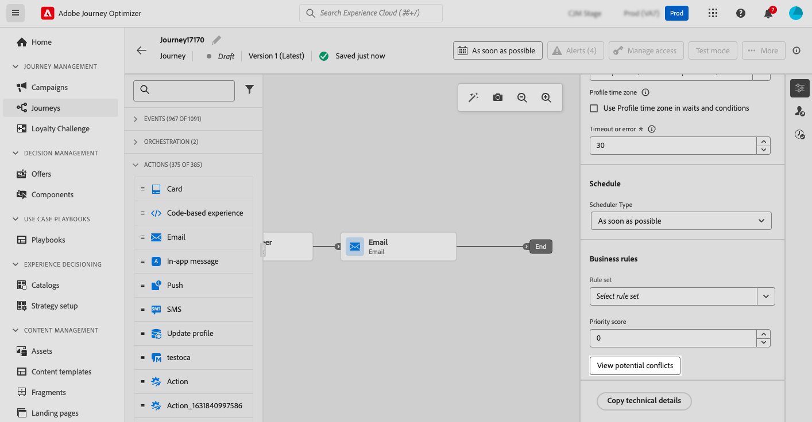

# 충돌 관리 및 우선 순위 지정 {#conflict-prioritization}

>[!AVAILABILITY]
>
>충돌 관리 및 우선 순위 지정 도구는 현재 선택한 사용자만 Beta로 사용할 수 있습니다.

Journey Optimizer에서 너무 많은 상호 작용으로 압도적인 고객을 피하려면 캠페인 및 여정의 양과 타이밍을 관리하는 것이 필수적입니다. 다음 두 섹션에서는 균형을 유지하고 커뮤니케이션의 우선순위를 효과적으로 지정하는 데 도움이 되는 주요 도구를 소개합니다.

## 여행 및 캠페인의 잠재적인 충돌 보기 {#conflict}

>[!CONTEXTUALHELP]
>id="ajo_campaigns_campaign_conflict"
>title="캠페인의 충돌 뷰어"
>abstract="이 도구를 사용하여 다른 여정, 캠페인 또는 채널 구성과의 중복을 확인할 수 있습니다. 대상자, 시작 및 종료 날짜, 채널 구성, 채널 또는 규칙 세트 등에서 중복을 식별하고자 하는 경우, 여기에서 잠재적인 충돌을 확인할 수 있습니다."

>[!CONTEXTUALHELP]
>id="ajo_journey_conflict"
>title="여정의 충돌 뷰어"
>abstract="이 도구를 사용하여 다른 여정, 캠페인 또는 채널 구성과의 중복을 확인할 수 있습니다. 대상자, 시작 및 종료 날짜, 채널 구성, 채널 또는 규칙 세트 등에서 중복을 식별하고자 하는 경우, 여기에서 잠재적인 충돌을 확인할 수 있습니다."

마케터가 Journey Optimizer에서 캠페인 및 여정의 볼륨을 증가시키면 마케터가 고객에게 너무 많은 마케팅 상호 작용을 하는지 여부를 알기가 점점 어려워집니다. 따라서 캠페인과 여정이 겹치는 시점을 쉽게 파악하여 고객 피로감의 위험을 완화하면서 마케팅 커뮤니케이션의 적절한 균형을 달성하고 있는지 확인하는 것이 중요합니다.

잠재적 중복을 모니터링하는 주요 영역은 다음과 같습니다.

* **타임라인**(시작 및 종료 날짜): 동시에 실행되는 여정이 너무 많습니까?
* **대상**: 내 여정 대상의 비율도 다른 여정의 일부입니까?
* **채널**: 같은 일정에 예약된 다른 통신이 있으며, 예약된 경우 몇 개나 됩니까?
* **최대 가용량 여정 집합**: 최대 가용량 규칙 유형은 무엇이며 해당 규칙 내에서 겹칩니까?
* **채널 구성**: 이 여정 구성을 사용하는 다른 캠페인이 사용자에게 표시되지 않을 수 있습니까?

Journey Optimizer을 사용하면 다른 여정 또는 캠페인과 겹칠 가능성이 있을 때마다 확인할 수 있습니다. 이렇게 하려면 다음 단계를 수행합니다.

1. 여정 또는 캠페인을 작성할 때 여정 또는 캠페인 속성에서 **[!UICONTROL 잠재적 충돌 보기]** 단추를 클릭합니다.

   

   >[!NOTE]
   >
   >**[!UICONTROL 시작/종료 날짜]**, **[!UICONTROL 대상자]**, **[!UICONTROL 채널]**, **[!UICONTROL 채널 구성]** 및 **[!UICONTROL 규칙 집합]** 설정을 할당하면 **[!UICONTROL 잠재적 충돌 보기]** 단추를 선택할 수 있습니다. 변경 내용이 저장될 때까지 단추를 선택할 수 없으므로 이러한 설정을 할당한 후 **[!UICONTROL 저장]**&#x200B;을 선택하십시오.

1. **[!UICONTROL 잠재적 충돌]** 창이 열리고 현재 여정/캠페인과 겹치는 모든 요소를 시각화할 수 있습니다.

   이 화면에서 이름을 선택하여 겹치는 여정 또는 캠페인을 직접 열 수 있습니다.

   

>[!NOTE]
>
>잠재적인 겹침 검색에 대한 검색을 세분화하기 위해 관련된 필드를 기준으로 캠페인 및 여정 목록을 필터링할 수 있습니다. 이렇게 하려면 인벤토리 보기에서 필터 아이콘을 선택합니다. [필터 작업 방법 알아보기](../start/search-filter-categorize.md#filter-lists)

잠재적인 중복이 식별되면 Journey Optimizer에서 이를 해결하는 몇 가지 방법을 제공합니다.

* 캠페인 또는 여정이 겹치지 않도록 **시작/종료 날짜**&#x200B;를 조정하세요.
* **대상 타깃팅**&#x200B;을 세분화하여 여정 간 겹침을 최소화합니다.
* 고객이 너무 많은 커뮤니케이션을 받지 않도록 **주파수 상한**&#x200B;을 구현하십시오.
* 고객 경험을 보다 효과적으로 관리하려면 **활성 여정**&#x200B;의 수를 줄이십시오.
* 가장 중요한 작업이 고객에게 표시되도록 하려면 인바운드 작업에 대해 **우선 순위**&#x200B;를 설정하십시오.

이러한 기능을 활용하면 마케팅 활동을 적절히 조정하고 커뮤니케이션 전략의 균형을 유지할 수 있습니다.

## 여정 및 캠페인에 우선 순위 점수 할당 {#priority}

>[!CONTEXTUALHELP]
>id="ajo_journey_priority"
>title="우선 순위"
>abstract="여정에 0~100 사이의 우선 순위 점수를 할당합니다. 숫자가 높을수록 우선 순위가 높다는 뜻입니다. 여기에 삽입된 우선 순위 값은 이 여정에 포함된 모든 인바운드 액션(예: 인앱)에 상속됩니다. 동일한 인바운드 채널 구성이 다른 캠페인이나 여정에 사용되는 경우, 우선 순위 점수가 가장 높은 인바운드 액션이 수신자에게 표시됩니다. 여러 여정이나 캠페인의 점수가 동일한 경우, 가장 최근에 수정된 요소가 선택됩니다."

>[!CONTEXTUALHELP]
>id="ajo_campaigns_campaign_priority"
>title="우선 순위"
>abstract="캠페인에 0~00 사이의 우선 순위 점수를 할당합니다. 숫자가 높을수록 우선 순위가 높다는 뜻입니다. 동일한 인바운드 채널 구성(예: 인앱)이 다른 캠페인이나 여정에 사용되는 경우, 우선 순위 점수가 가장 높은 인바운드 액션이 수신자에게 표시됩니다. 여러 여정이나 캠페인의 점수가 동일한 경우, 가장 최근에 수정된 요소가 선택됩니다."

Journey Optimizer을 사용하면 여정 또는 캠페인에 우선 순위 점수를 할당할 수 있습니다. 우선 순위는 부과된 제한(예: 빈도 제한)이 있는 경우 여정, 캠페인 또는 작업의 우선 순위를 지정하는 데 필수적입니다. 고객이 많은 여정, 캠페인 또는 커뮤니케이션에 대한 자격을 얻고 고객이 입력 및 수신해야 하는 대상을 선택하려는 경우 이 필드를 활용해야 합니다.

>[!NOTE]
>
>우선 순위 점수는 인바운드 채널(웹, 인앱 및 코드 기반 채널)에 사용할 수 있습니다. 여정에서 우선 순위 점수는 **인앱** 및 **코드 기반** 채널에서만 사용할 수 있습니다.

웹, 모바일 및 인앱과 같은 인바운드 커뮤니케이션에는 우선순위 점수를 할당하는 것이 중요합니다. 동일한 채널 구성을 사용하는 캠페인이 여러 개 있는 경우(예: 웹 페이지의 상단에 있는 배너), 한 캠페인의 콘텐츠만 표시할 수 있으므로 문제가 될 수 있습니다. 우선 순위 점수는 수신자가 둘 이상의 캠페인에 대한 자격이 있을 때 표시되어야 하는 캠페인에 대한 환경 설정을 삽입하는 것입니다.

여정 또는 캠페인에 우선 순위 점수를 할당하려면 여정 또는 캠페인 속성에 있는 **[!UICONTROL 우선 순위 점수]** 필드에 숫자 값(0-100)을 입력하십시오. 숫자가 높을수록 우선순위가 높은 것을 알려드립니다. 이 캠페인을 작성 중이고 이 캠페인 콘텐츠가 표시되도록 하려면 100점을 부여해야 합니다.

두 캠페인의 우선 순위 점수가 동일한 상황의 경우 가장 최근에 활성화된 캠페인이 표시됩니다.
