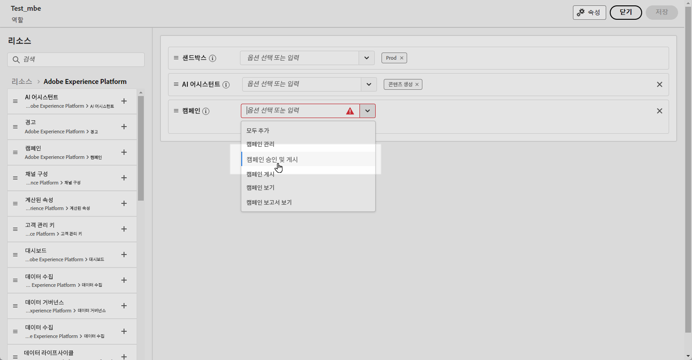
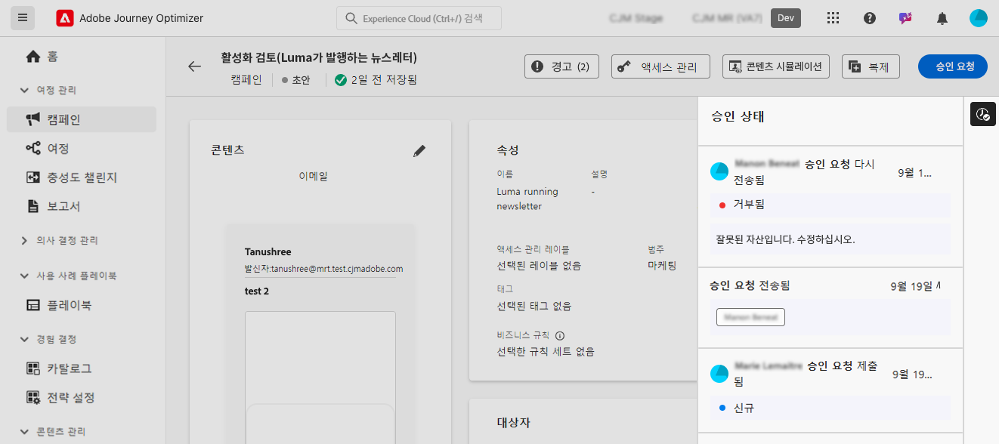

# 여정 및 캠페인 승인 시작 {#send-proofs}

## 승인 정책 시작 {#gs}

[!DNL Journey Optimizer]을(를) 사용하면 마케팅 팀이 캠페인과 여정을 실행하기 전에 적절한 관련자가 검토하고 승인하도록 하는 승인 프로세스를 설정할 수 있습니다.

승인 정책은 사용자 인터페이스 내에 직접 구조화된 워크플로를 도입하여 이메일이나 작업 관리 도구와 같은 외부 매체가 필요하지 않게 하고 모든 승인을 중앙에서 관리하고 추적하도록 합니다.

또한 이 기능을 사용하면 여정 및 캠페인의 게시에 대한 통제력이 강화됩니다. Journey Optimizer에 승인 프로세스가 임베드되면 검토하는 동안 캠페인 및 여정이 &#39;잠긴&#39; 상태로 유지되므로 필요한 모든 승인이 완료되기 전에 변경이나 의도하지 않은 활성화가 발생하지 않도록 할 수 있습니다.

## 전제 조건 {#prerequisites}

시작하기 전에 아래 권한이 구성되어 있는지 확인해야 합니다.

여정 및 캠페인을 승인하고 게시하려면 사용자에게 **캠페인 승인 및 게시** 및 **여정 승인 및 게시** 권한을 부여해야 합니다. [자세히 알아보기](../administration/permissions.md)

+++  승인 관련 권한을 할당하는 방법을 알아봅니다

1. **권한** 제품에서 **역할** 탭으로 이동하여 원하는 **역할**&#x200B;을 선택하십시오.

1. 권한을 수정하려면 **편집**&#x200B;을 클릭하십시오.

1. **캠페인** 리소스를 추가한 다음 드롭다운 메뉴에서 **캠페인 승인 및 게시**&#x200B;를 선택합니다.

   {zoomable="yes"}

1. **여정** 리소스를 추가한 다음 드롭다운 메뉴에서 **여정 승인 및 게시**&#x200B;를 선택합니다.

   {zoomable="yes"}

1. 변경 내용을 적용하려면 **저장**&#x200B;을 클릭하십시오.

이 역할에 이미 할당된 모든 사용자의 권한은 자동으로 업데이트됩니다.

1. 새 사용자에게 이 역할을 할당하려면 **역할** 대시보드의 **사용자** 탭으로 이동하여 **사용자 추가**&#x200B;를 클릭하십시오.

1. 사용자 이름, 이메일 주소를 입력하거나 목록에서 선택한 다음 **저장**&#x200B;을 클릭합니다.

1. 사용자를 이전에 만들지 않은 경우 [이 설명서](https://experienceleague.adobe.com/ko/docs/experience-platform/access-control/abac/permissions-ui/users)를 참조하세요.

사용자는 인스턴스에 액세스하기 위한 지침이 포함된 이메일을 받게 됩니다.

+++

## 승인 프로세스 개요 {#process}

전반적인 승인 프로세스는 다음과 같습니다.

{zoomable="yes"}

1. **승인 정책 설정**

   관리자는 여정 또는 캠페인에 정책을 적용해야 하는 조건을 정의하는 승인 정책을 만듭니다. 예를 들어 활성화 전에 주어진 사용자가 만든 모든 예약된 캠페인을 승인해야 하는 승인 정책을 만들 수 있습니다. [승인 정책을 만드는 방법 알아보기](approval-policies.md)

1. **승인을 위한 캠페인/여정 제출**

   캠페인/여정 작성자는 여정 또는 캠페인을 작성하고 승인을 위해 제출합니다. 캠페인/여정이 &#39;검토 중&#39; 상태로 전환되면 요청이 취소되지 않는 한 편집할 수 없습니다. [승인을 요청하는 방법 알아보기](request-approval.md)

   >[!NOTE]
   >
   >캠페인 및 여정을 제출하여 승인을 받을 의무는 승인 정책이 설정된 경우에만 해당됩니다. 이 정책이 적용되지 않는 경우 작성자는 승인을 요청할 필요 없이 캠페인 또는 여정을 직접 게시할 수 있습니다.

1. **검토 및 승인**

   해당 여정 또는 캠페인에 적용되는 승인 정책에서 정의한 승인자가 알림을 받습니다. 승인자는 여정 또는 캠페인의 콘텐츠, 대상자, 설정을 검토할 수 있습니다. 변경이 필요한 경우 승인자가 변경을 요청하여 캠페인을 수정할 수 있도록 &#39;초안&#39; 상태로 되돌립니다. 준비가 되면 여정 또는 캠페인을 활성화하고 시작할 수 있습니다. [요청을 검토하고 승인하는 방법 알아보기](review-approve-request.md)

## 승인 요청 모니터링 {#monitor}

주어진 여정 또는 캠페인에 대해 제출된 모든 승인 및 변경 요청을 모니터링할 수 있습니다. 이렇게 하려면 여정 캔버스 또는 캠페인 검토 화면의 오른쪽 위 섹션에 있는 **[!UICONTROL 감사 추적 표시]** 아이콘을 클릭합니다.

## 추가 리소스

* **[승인 정책 만들기](approval-policies.md)** - 캠페인 및 여정에 검토 워크플로를 적용하기 위해 승인 정책을 설정하는 방법에 대해 알아봅니다.
* **[승인 요청](request-approval.md)** - 승인을 위해 콘텐츠를 제출하고 승인 상태를 추적하는 방법을 이해합니다.
* **[요청 검토 및 승인](review-approve-request.md)** - 승인자로서 승인 요청을 검토, 승인 또는 거부하는 방법을 알아봅니다.
* **[샘플 입력을 사용한 시뮬레이션](simulate-sample-input.md)** - 샘플 프로필 데이터를 사용하여 콘텐츠를 테스트하고 확인하는 방법을 알아봅니다.
