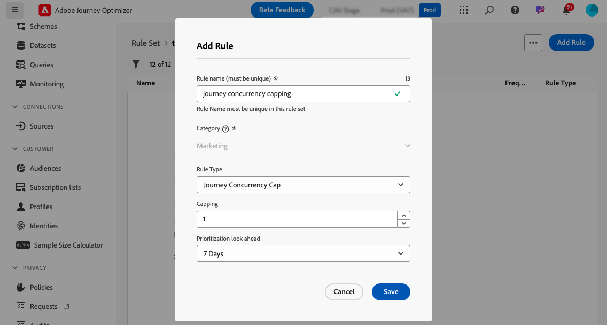
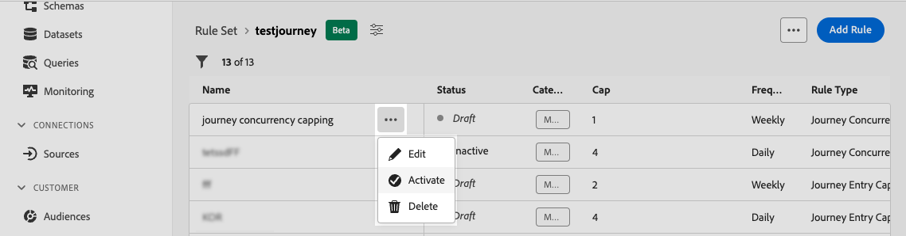

# 여정 한도 및 중재 {#journey-capping}

>[!BEGINSHADEBOX]

이 설명서의 내용:

* [충돌 관리 및 우선 순위 지정 시작](gs-conflict-prioritization.md)
* [여정 및 캠페인에서 발생할 수 있는 충돌 감지](conflicts.md)
* [여정 및 캠페인에 우선 순위 점수 할당](priority-scores.md)
* **[여정 한도 및 중재](journey-capping.md)**

>[!ENDSHADEBOX]

>[!AVAILABILITY]
>
>충돌 관리 및 우선 순위 지정 도구는 현재 선택한 사용자만 제한된 가용성으로 사용할 수 있습니다.

여정 캡핑은 프로필이 등록할 수 있는 여정 수를 제한하는 데 도움이 되며, 이를 통해 통신 과부하를 방지할 수 있습니다. Journey Optimizer에서는 두 가지 유형의 가용량 규칙을 설정할 수 있습니다.

* **항목 제한**&#x200B;은(는) 프로필에 지정된 기간 동안 여정 항목 수를 제한합니다.
* **동시성 한도**&#x200B;는 프로필을 동시에 등록할 수 있는 여정 수를 제한합니다.

두 가지 유형의 여정 제한 모두 우선 순위 점수를 활용하여 항목을 중재합니다.

## 여정 최대 가용량 규칙 만들기 {#create-rule}

여정 최대 가용량 규칙을 만들려면 다음 단계를 수행합니다.

1. **[!UICONTROL 비즈니스 규칙(Beta)]** 메뉴로 이동하여 규칙 집합 인벤토리에 액세스합니다.

1. 최대 가용량 규칙을 추가할 규칙 세트를 선택하거나 새 규칙 세트를 만듭니다.

   * 기존 규칙 세트를 사용하려면 목록에서 선택합니다. 여정 한도 규칙은 &quot;여정&quot; 도메인이 있는 규칙 세트에만 추가할 수 있습니다. **[!UICONTROL 도메인]** 열의 규칙 집합 목록에서 이 정보를 확인할 수 있습니다.

     

   * 새 규칙 집합 내에 최대 가용량 규칙을 만들려면 **[!UICONTROL 규칙 집합 만들기]**&#x200B;를 클릭하고 규칙 집합에 고유한 이름을 지정한 다음 **[!UICONTROL 여정 집합 도메인]** 드롭다운에서 &quot;도메인&quot;을 선택한 다음 **[!UICONTROL 저장]**&#x200B;을 클릭합니다.

     

1. 규칙 집합 화면에서 **[!UICONTROL 규칙 추가]** 단추를 클릭한 다음 필요에 맞게 규칙을 구성합니다.

   

   * 규칙의 고유한 이름을 제공합니다.

   * **[!UICONTROL 규칙 유형]** 드롭다운 목록에서 규칙의 최대 가용량 유형을 지정합니다.

      * **[!UICONTROL 여정 시작 상한]**: 프로필에 지정된 기간 동안 여정에 들어오는 항목 수를 제한합니다.
      * **[!UICONTROL 여정 동시성 상한]**: 프로필을 동시에 등록할 수 있는 여정 수를 제한합니다.

   * 아래 섹션을 확장하여 각 유형의 캡핑을 구성하는 방법을 알아봅니다.

     +++여정 항목 한도 규칙 구성

      1. **[!UICONTROL 최대]** 필드에서 프로필이 입력할 수 있는 최대 여정 수를 설정합니다.
      1. **[!UICONTROL 기간]** 필드에서 고려할 기간을 정의합니다. 기간은 UTC 시간대를 기반으로 합니다. 예를 들어 일별 상한은 자정(UTC)에 재설정됩니다.

     이 예제에서는 프로필이 한 달에 &quot;5&quot;개가 넘는 여정을 입력할 수 없도록 제한하려고 합니다.

     

     >[!NOTE]
     >
     >시스템에서는 이 규칙이 적용되는 향후 예약된 여정의 우선 순위를 고려합니다.
     >
     >이 예에서 마케터가 이미 4개의 여정을 입력했고 더 높은 우선 순위를 가진 이번 달에 예정된 다른 예약 여정이 있는 경우 고객은 더 낮은 우선 순위 여정에 들어가지 않습니다.

+++

     +++여정 동시성 최대 가용량 규칙 구성

      1. **[!UICONTROL 최대]** 필드에서 프로필을 동시에 등록할 수 있는 최대 여정 수를 설정합니다.

      1. **[!UICONTROL 우선 순위 미리 보기]** 필드를 사용하여 선택한 기간(예: 1일, 7일, 30일)에 대한 우선 순위 점수를 기반으로 여정 항목을 중재합니다. 이렇게 하면 프로필이 여러 여정에 적합한 경우 더 높은 가치의 여정에 우선 순위를 지정하는 데 도움이 됩니다.

     이 예제에서는 프로필이 동일한 여정 세트를 포함하는 다른 여정에 이미 등록되어 있는 경우 해당 프로필로 들어가지 못하도록 제한하려고 합니다. 앞으로 7일 이내에 다른 여정에 더 높은 우선 순위 점수가 있는 경우 프로필이 이 여정을 입력하지 않습니다.

     {width="50%" zommable="yes"}

+++

1. 최대 가용량 규칙을 여정에 적용할 준비가 되면 이름 옆에 있는 줄임표 버튼을 클릭하여 활성화합니다.

   

1. 화면 오른쪽 상단에 있는 규칙 추가 버튼 옆에 있는 줄임표 버튼을 클릭하여 전체 규칙 세트를 활성화합니다.

   

## 여정에 최대 가용량 규칙 적용 {#apply-capping}

여정에 최대 가용량 규칙을 적용하려면 여정에 액세스하여 해당 속성을 엽니다. **[!UICONTROL 최대 가용량 규칙]** 드롭다운에서 관련 규칙 집합을 선택합니다.

규칙이 활성화되면 여정 세트에 정의된 최대 가용량 규칙이 적용됩니다.

>[!IMPORTANT]
>
>여정이 즉시 활성화되면 시스템이 고객 억제를 시작하는 데 최대 15분이 걸릴 수 있습니다. 이러한 가능성을 방지하기 위해 적어도 15분 후에 여정을 시작하도록 예약할 수 있습니다.
