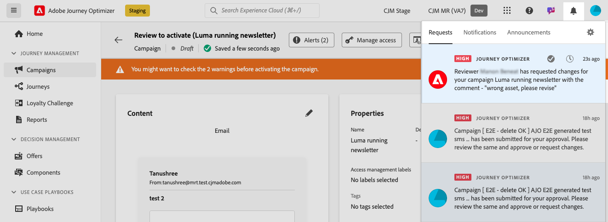

# 승인 요청 {#request-approval}

승인 작업 과정에 대한 액세스는 특정 사용 사례에 따라 결정됩니다.

* **활성 승인 정책이 없습니다**

   * **캠페인**: 샌드박스의 Campaign 개체에 대해 활성화된 승인 정책이 없는 경우 캠페인에 **[!UICONTROL 활성화]** 단추가 표시되므로 승인 없이도 활성화할 수 있습니다.

   * **여정**: 여정 개체에 대해 활성화된 승인 정책이 없으면 여정이 직접 게시할 수 있도록 **[!UICONTROL Publish]** 단추를 표시합니다.

* **활성 승인 정책이 있음**

   * **캠페인**: 샌드박스의 Campaign 개체에 대해 하나 이상의 활성 승인 정책이 있는 경우 해당 샌드박스의 모든 캠페인에 **[!UICONTROL 승인 요청]** 단추가 표시됩니다.
**[!UICONTROL 승인 요청]** 단추를 클릭할 때 선택한 개체에 승인 정책이 적용되지 않으면 자동 승인 워크플로가 트리거됩니다.

   * **여정**: 샌드박스의 여정 개체에 대해 하나 이상의 활성 승인 정책이 있는 경우 모든 여정이 **[!UICONTROL 승인 요청]** 단추를 표시합니다.
**[!UICONTROL 승인 요청]** 단추를 클릭할 때 선택한 개체에 승인 정책이 적용되지 않으면 자동 승인 워크플로가 트리거됩니다.

## 승인 요청 보내기

캠페인 또는 여정을 만든 후 **[!UICONTROL 승인 요청]** 단추를 클릭합니다. 샌드박스에 캠페인이나 여정에 적용되는 활성 승인 정책이 있는지 확인합니다.

* 적용 가능한 승인 정책이 발견되면 검토를 위해 캠페인 또는 여정이 전송됩니다.

* **[!UICONTROL 승인 요청]** 단추를 클릭한 후 캠페인 또는 여정에 승인 정책을 적용할 수 없으면 캠페인이나 여정이 자동으로 승인되고 활성화 또는 게시됩니다.

**[!UICONTROL 승인 요청]** 창이 열립니다. 필요한 경우 승인자에게 메시지를 제공하고 **[!UICONTROL 보내기]**&#x200B;를 클릭하여 요청을 제출하세요.

캠페인 또는 여정이 **[!UICONTROL 검토 중]** 상태일 때 승인 요청을 취소할 수 있는 옵션이 있습니다. **[!UICONTROL 요청 취소]** 단추를 클릭하면 캠페인이나 여정이 초안 단계로 돌아간 후 요청이 취소되었음을 알리는 알림이 검토자에게 전송됩니다. 그런 다음 필요한 편집 작업을 수행하고 승인을 위해 캠페인 또는 여정을 다시 제출할 수 있습니다.

## 승인 요청 관리

승인 요청이 승인자에게 전송되면 승인자는 이를 검토하고 여정/캠페인을 활성화하여 라이브로 전환하거나 필요한 경우 변경을 요청할 수 있습니다. [요청 검토 및 승인 방법 알아보기](review-approve-request.md)

승인자 요청이 변경되면 전자 메일과 Journey Optimizer 알림을 받게 됩니다. 전자 메일은 화면 오른쪽 상단의 벨 아이콘을 클릭할 때 **[!UICONTROL 요청]** 탭에서 액세스할 수 있습니다.

변경 요청을 처리하려면 이메일 또는 경고에서 해당 여정을 열어 캠페인이나 캠페인에 액세스하고 요청된 변경 작업을 수행합니다. 여정/캠페인을 다시 검토할 준비가 되면 **[!UICONTROL 승인 요청]** 버튼을 사용하여 새 승인 요청을 보내십시오.

