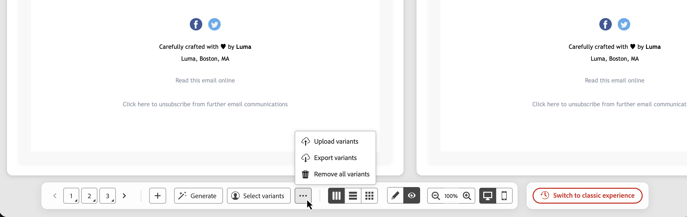
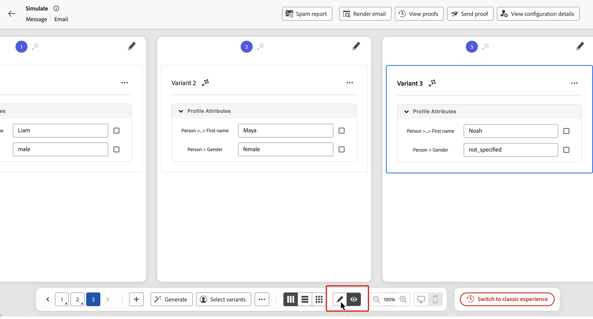
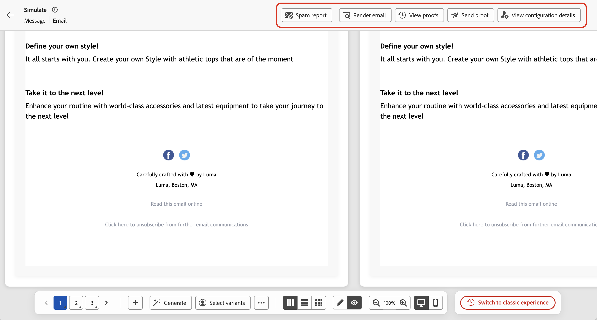

# 콘텐츠 변형 시뮬레이션 {#simulate-content-variations}

>[!BEGINSHADEBOX]

**이 페이지에서:** 모든 콘텐츠 변형을 나란히 그리드에서 한눈에 미리 보고, 통합된 맨 아래 작업 표시줄에서 관리하고, 언제든지 클래식 경험으로 다시 전환합니다.

>[!ENDSHADEBOX]

**[!UICONTROL 콘텐츠 변형 시뮬레이션]** 경험은 변형을 더 빠르고 쉽게 테스트하고 비교할 수 있도록 새롭게 디자인되었습니다. 이제 모든 변형이 스크롤 가능한 단일 그리드에서 함께 렌더링되며, 필요한 모든 컨트롤은 단일 아래쪽 작업 표시줄에서 사용할 수 있습니다.

새 경험에 액세스하려면 콘텐츠에서 **[!UICONTROL 콘텐츠 시뮬레이션]**&#x200B;을 클릭하여 콘텐츠 시뮬레이션 화면을 엽니다. 변형을 이미 사용할 수 있는 경우 미리보기 격자가 즉시 표시됩니다. 아직 존재하지 않는 경우 빈 변형이 표시되며, 아래에 설명된 방법 중 하나를 사용하여 변형을 만들 수 있습니다.

이전 레이아웃을 선호하는 경우 언제든지 맨 아래 작업 표시줄의 **[!UICONTROL 클래식 경험으로 전환]**&#x200B;을 클릭하세요. 클래식 경험 설명서는 [콘텐츠 변형 시뮬레이션(클래식 경험)](simulate-sample-input.md)에서 사용할 수 있습니다.

## 변형 만들기 및 관리 {#manage-variants}

변형은 수동으로 하나씩 또는 파일을 가져오거나 AI를 사용하여 생성하거나 기존 시뮬레이션된 사용자를 선택하여 만들 수 있습니다. 수동으로 또는 파일 업로드를 통해 최대 30개의 변형을 추가할 수 있습니다. AI 생성을 사용할 때 콘텐츠의 복잡성에 따라 최대 40개의 변형을 만들 수 있습니다.

### 수동으로 변형 추가 {#add-variants}

빈 변형을 수동으로 추가하려면 맨 아래 작업 표시줄에서 **[!UICONTROL +]**&#x200B;을(를) 클릭합니다. 빈 변형이 새로 추가되고 속성 값을 직접 입력할 수 있습니다.

**[!UICONTROL ..]** > **변형 업로드**&#x200B;를 사용하여 각 행 또는 항목이 변형이 되는 CSV, JSON 또는 JSONLINES 파일을 가져올 수도 있습니다. 업로드 대화 상자에서 파일 템플릿을 다운로드하여 올바른 형식을 사용합니다.

### 변형 자동 생성 {#auto-generate}

AI를 사용하여 변형을 자동으로 생성하려면 맨 아래의 작업 표시줄에서 **[!UICONTROL 생성]** 단추를 클릭하십시오. 시스템은 콘텐츠를 분석하고 개인화 필드 및 조건부 분기를 식별하며 실제 값으로 해당 필드를 포함하는 데 필요한 수만큼 변형을 생성합니다. AI에서 생성한 변형은 카드에 표시된 스파클 아이콘으로 식별할 수 있습니다.

>[!CAUTION]
>
>**[!UICONTROL 생성]**&#x200B;을 클릭하면 수동으로 추가되거나 파일에서 추가된 변형을 포함하여 기존의 모든 변형이 바뀝니다.

### 시뮬레이션된 사용자의 변형 선택 {#simulated-users}

여러 세션에 저장되고 다른 사용자와 공유할 수 있는 재사용 가능한 프로필과 유사한 테스트 엔터티인 **시뮬레이션된 사용자**&#x200B;를 기준으로 변형을 만들 수 있습니다. 수동으로 입력한 변형과 달리, 시뮬레이션된 사용자는 현재 브라우저 세션 이후에도 유지됩니다.

시뮬레이션된 사용자는 여정 **[!UICONTROL 시뮬레이션]** 기능에서 만들고 관리합니다. 전체 절차는 [시뮬레이션된 사용자 만들기 및 관리](../building-journeys/simulate-journey.md#test-users)를 참조하십시오.

시뮬레이트된 사용자를 변형으로 사용하려면

1. 맨 아래 작업 표시줄에서 **[!UICONTROL 변형 선택]**&#x200B;을 클릭합니다.
1. 목록에서 사용할 시뮬레이션된 사용자를 선택한 다음 **[!UICONTROL 선택]**&#x200B;을 클릭합니다.

선택한 시뮬레이션된 사용자가 변형으로 추가됩니다. 테스트를 위해 변형의 속성 값을 로컬로 편집할 수 있지만 이러한 변경 사항은 시뮬레이션된 사용자 레코드에 다시 저장되지 않습니다.

### 변형 내보내기 {#export-variants}

수동으로 추가하든, AI로 생성하든, 시뮬레이션된 사용자에서 선택하든 관계없이 현재 변형을 모두 CSV 파일로 내보낼 수 있습니다. 아래쪽 작업 표시줄에서 **[!UICONTROL ..]**&#x200B;을(를) 클릭한 다음 **[!UICONTROL 변형 내보내기]**&#x200B;를 선택합니다.

## 변형 미리 보기 {#preview-grid}

### 변형 간 전환 {#switch-variants}

미리 보기 모드에서는 모든 변형이 맨 위에 번호가 매겨진 표시기와 나란히 렌더링됩니다. 변형 간에 전환하려면 숫자를 클릭하거나 맨 아래 작업 표시줄의 **&lt; >** 탐색 단추를 사용하십시오.

### 미리보기 또는 편집 모드로 변형 표시 {#edit-variants}

변형은 미리 보기 또는 편집 모드에서 표시할 수 있으며, 이 모드에서는 콘텐츠 및 속성 값을 직접 편집할 수 있습니다. 맨 아래 작업 표시줄에서 **[!UICONTROL 미리 보기]** 또는 **[!UICONTROL 편집]**&#x200B;을 클릭하여 두 모드 간에 모든 미리 보기를 한 번에 전환합니다.

단일 변형을 개별적으로 전환하려면 카드 상단의 **[!UICONTROL 미리 보기 표시]** 또는 **[!UICONTROL 변형 세부 정보 표시]** 단추를 클릭하거나 하단 작업 표시줄에서 해당 번호를 길게 누르거나 Alt+위쪽/아래쪽 단추를 사용합니다.

### 레이아웃 변경 {#change-layout}

변형이 표시되는 방식을 변경하려면 **아래쪽 작업 표시줄**&#x200B;을 사용하여 나란히, 세로로 스택 또는 래핑된 레이아웃 간을 전환합니다.

### 데스크탑 보기와 모바일 보기 간 전환 {#switch-views}

다양한 디바이스에서 변형이 렌더링되는 방법을 표시하려면 맨 아래 작업 표시줄의 아이콘을 클릭하여 데스크탑 보기와 모바일 보기 간에 전환합니다. 미리보기 그리드가 업데이트되어 선택한 디바이스에서 변형이 어떻게 표시되는지 보여 줍니다.

## 이메일 채널을 위한 추가 기능 {#email-capabilities}

이메일 콘텐츠를 시뮬레이션할 때 상단 표시줄에 추가 이메일 관련 도구가 제공됩니다.

* **[!UICONTROL 스팸 보고서]** - 스팸 필터에 대해 이메일 콘텐츠를 분석하고 게재 가능성 점수를 얻습니다. [자세히 알아보기](../content-management/spam-report.md)
* **[!UICONTROL 전자 메일 렌더링]** — 인기 있는 전자 메일 클라이언트 및 장치에서 전자 메일이 렌더링되는 방식을 미리 봅니다. [자세히 알아보기](../content-management/rendering.md)
* **[!UICONTROL 증명 보내기]** — 하나 이상의 변형에 대한 증명을 전자 메일 수신자 집합에 보냅니다. **[!UICONTROL 증명 보내기]**&#x200B;를 클릭하고 받는 사람 주소를 최대 10개까지 추가한 다음 포함할 변형을 선택한 다음 **[!UICONTROL 증명 보내기]**&#x200B;를 클릭하여 확인합니다. 이전에 보낸 증명을 검토하려면 **[!UICONTROL 증명 보기]**&#x200B;를 클릭하세요. [자세히 알아보기](../content-management/proofs.md)
* **[!UICONTROL 구성 세부 정보 보기]** — 이 콘텐츠에 적용된 채널 구성을 검토하십시오.
