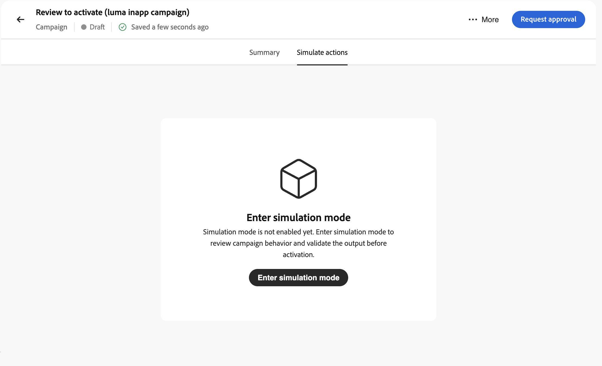

# 인바운드 경험 시뮬레이션 {#simulate-inbound-experiences}

>[!BEGINSHADEBOX]

**이 페이지에서:** 링크 및 QR 미리 보기, 시뮬레이션 동작 및 주요 제한 사항을 포함하여 라이브로 전환되기 전에 시뮬레이션된 사용자와 함께 인바운드 동작 캠페인 환경을 확인합니다.

>[!ENDSHADEBOX]

>[!AVAILABILITY]
>
>이 기능은 현재 Private Beta에 있습니다. 액세스 권한을 요청하려면 Adobe 담당자에게 문의하십시오.

## 개요 {#inbound-simulation-overview}

인바운드 경험 시뮬레이션을 사용하면 캠페인이 라이브되기 전에 시뮬레이션된 사용자를 사용하여 **작업 캠페인**&#x200B;에 대한 개인화된 인바운드 경험을 확인할 수 있습니다. 이 템플릿을 사용하여 타깃팅, 의사 결정, 렌더링된 콘텐츠를 확인하고 웹 및 모바일 미리 보기 경로에서 동작 문제를 해결할 수 있습니다.

시뮬레이션 모드가 시작되면 캠페인이 **[!UICONTROL 시뮬레이션]** 상태로 전환됩니다. 시뮬레이션이 활성 상태를 유지하고 캠페인 컨텐츠 및 구성을 편집하기 위해 잠그는 동안 다른 곳으로 이동하여 나중에 돌아갈 수 있습니다(게시된 상태와 유사). 시뮬레이션된 경험은 프로덕션 대상자에게 노출되지 않습니다.

콘텐츠 미리 보기 및 시뮬레이션 컨텍스트를 포함한 전체 캠페인 검토 흐름에 대해서는 [작업 캠페인 검토 및 활성화](../campaigns/review-activate-campaign.md)를 참조하십시오.

## 시뮬레이션 모드 시작 및 실행 {#enter-simulation-mode}

시뮬레이션 모드에 들어가려면

1. 작업 캠페인에서 **[!UICONTROL 활성화 검토]** 인터페이스에 액세스한 다음 **[!UICONTROL 작업 시뮬레이션]** 탭을 선택합니다.

   

1. 사용 가능한 방법 중 하나를 사용하여 시뮬레이션에 사용할 시뮬레이션된 사용자를 선택합니다.

   * **[!UICONTROL 인벤토리 찾아보기]** - 이전에 만든 시뮬레이션 사용자를 선택하십시오.
   * **[!UICONTROL 양식에서 만들기]** - 필드별로 시뮬레이션된 사용자 필드를 만듭니다.
   * **[!UICONTROL JSON에서 만들기]** - 시뮬레이션된 JSON 파일 사용자 프로필 페이로드를 가져옵니다.

   

   시뮬레이션 사용자 만들기 및 관리에 대한 자세한 내용은 [시뮬레이션 사용자 만들기 및 관리](../building-journeys/simulate-journey.md#test-users)를 참조하세요.

1. 시뮬레이트된 사용자가 선택되거나 생성되면 중앙 창에 나타납니다. 각 사용자에 대해 세부 정보를 보거나 사용자 정보를 업데이트하거나 시뮬레이션 목록에서 사용자를 제거할 수 있습니다.

   

1. 각 사용자에 대해 시뮬레이션된 출력을 생성하려면 **[!UICONTROL 링크 생성]** 단추를 클릭하십시오. 이를 통해 다음이 생성됩니다.

   * 선택한 사용자에 대해 렌더링된 인바운드 경험을 미리 보기 위한 공유 가능한 URL.
   * 모바일 미리 보기 시나리오에 대한 QR 코드입니다.

1. 시뮬레이션된 각 사용자에 대해 생성된 컨트롤을 사용하여 경험을 확인합니다.

   

   | 버튼 | 기능 |
   | --- | --- |
   |  | 브라우저에서 생성된 링크를 열어 시뮬레이션된 해당 사용자에 대한 인바운드 경험을 미리 봅니다. |
   |  | 생성된 링크를 복사하여 공유하거나 다른 브라우저나 장치에 붙여넣을 수 있습니다. |
   |  | QR 코드를 열고(채널에 사용 가능한 경우) **[!UICONTROL iOS]** 또는 **[!UICONTROL Android]**&#x200B;을(를) 선택하고 장치 카메라로 코드를 스캔한 다음 메시지가 표시되면 표시된 코드를 입력합니다. |
   |  | **[!UICONTROL 보증 세션 열기]** 또는 **[!UICONTROL 새 보증 세션 열기]**&#x200B;에 대한 추가 옵션을 열고 Assurance 사용자 인터페이스에서 문제 해결을 계속합니다. |

1. 캠페인 작업 표시줄에서 **[!UICONTROL 시뮬레이션 중지]**&#x200B;를 클릭하여 언제든지 시뮬레이션 모드를 종료할 수 있습니다. 예를 들어, 돌아가서 캠페인을 편집해야 하는 경우입니다.
