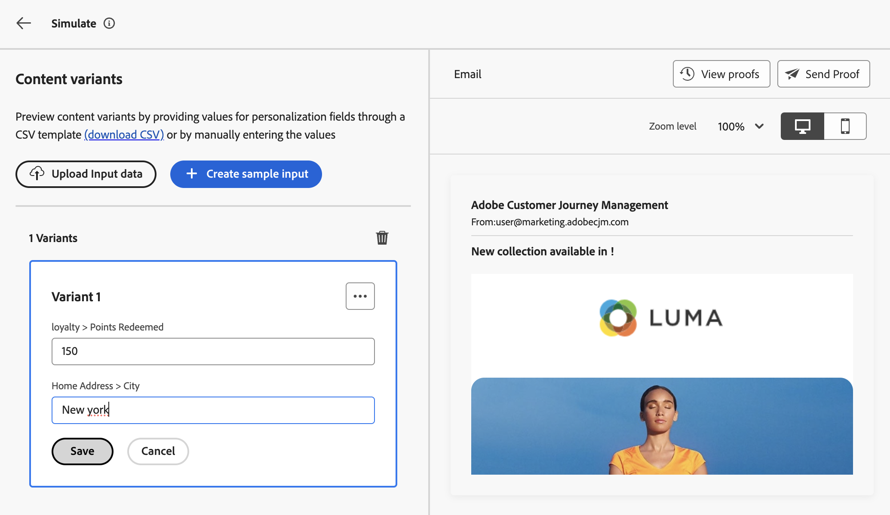

# 샘플 입력 데이터를 사용하여 콘텐츠 테스트 {#custom-profiles}

>[!CONTEXTUALHELP]
>id="ajo_simulate_sample_profiles"
>title="샘플 입력을 사용하여 시뮬레이션"
>abstract="이 화면에서는 CSV 템플릿(CSV 다운로드)을 통해 개인화 필드에 값을 제공하거나 수동으로 값을 입력하여 이메일 콘텐츠의 다양한 변형을 테스트할 수 있습니다."

>[!AVAILABILITY]
>
>이 기능은 현재 선택한 사용자만 베타 버전으로 사용할 수 있습니다.

여정 최적기를 사용하면 CSV 파일에서 업로드하거나 수동으로 추가한 샘플 입력 데이터를 사용하여 전자 메일 콘텐츠를 미리 보고 증명을 전송하여 다양한 변형을 테스트할 수 있습니다. 개인화를 위한 콘텐츠에 사용되는 모든 프로필 속성은 시스템에서 자동으로 감지되며 테스트에 사용하여 여러 변형을 만들 수 있습니다.

Beta 이 경험에 액세스하려면 **[!UICONTROL 콘텐츠 시뮬레이션]** 단추를 클릭하고 **[!UICONTROL CSV로 시뮬레이션]**&#x200B;을 선택하십시오.

콘텐츠를 테스트하는 주요 단계는 다음과 같습니다.

1. CSV 파일을 업로드하거나 데이터를 수동으로 추가하여 샘플 입력 데이터를 사용하여 최대 30개의 변형을 추가할 수 있습니다. [변형을 추가하는 방법 알아보기](#profiles)
1. 다른 변형을 사용하여 콘텐츠 미리보기를 확인합니다. [콘텐츠를 미리 보는 방법 알아보기](#preview)
1. 다른 변형을 사용하여 이메일 주소에 최대 10개의 증명을 보낼 수 있습니다. [증명을 보내는 방법 알아보기](#proofs)

## 가드레일 및 제한 사항 {#limitations}

샘플 입력 데이터를 사용하여 콘텐츠 테스트를 시작하기 전에 다음 보호 기능 및 사전 요구 사항을 고려하십시오.

* 현재 샘플 입력 데이터를 사용한 테스트는 이메일 채널에만 사용할 수 있습니다. 이메일 Designer 내의 &quot;콘텐츠 시뮬레이션&quot; 버튼에서 경험에 액세스할 수 없습니다.
* 받은 편지함 렌더링, 스팸 보고서, 다국어 콘텐츠 및 콘텐츠 실험과 같은 기능은 현재 경험에서 사용할 수 없습니다. 이러한 기능을 사용하려면 콘텐츠에서 **[!UICONTROL 콘텐츠 시뮬레이션]** 버튼을 선택하여 이전 사용자 인터페이스에 액세스합니다.
* 프로필 속성만 현재 지원됩니다. 개인화를 위해 콘텐츠에 컨텍스트 속성을 사용하는 경우 이러한 속성을 사용하여 콘텐츠를 테스트할 수 없습니다.
* 변형에 대한 데이터를 입력할 때 숫자(정수 및 십진수), 문자열, 부울 및 날짜 유형 데이터 유형만 지원됩니다. 다른 데이터 유형에는 오류가 표시됩니다.

## 변형 추가 {#profiles}

CSV 파일을 사용하거나 수동으로 콘텐츠를 테스트하는 최대 30개의 변형을 추가할 수 있습니다.

* CSV 파일에서 샘플 입력 데이터를 업로드하려면 **[!UICONTROL CSV 다운로드]** 링크를 클릭하여 CSV 파일 템플릿을 검색합니다. 이 템플릿에는 개인화를 위해 콘텐츠에 사용되는 각 프로필 속성에 대한 열이 포함되어 있습니다.

  CSV 파일을 입력한 다음 **[!UICONTROL 입력 데이터 업로드]**&#x200B;를 클릭하여 콘텐츠를 테스트하도록 로드합니다.

* 변형을 수동으로 추가하려면 **[!UICONTROL 샘플 입력 만들기]** 단추를 클릭하고 변형에 대한 샘플 입력 데이터를 채우십시오. 개인화를 위해 콘텐츠에 사용되는 각 프로필 속성에 대해 하나의 필드가 표시됩니다.

  

프로필을 선택하면 화면 왼쪽에 각 변형에 대해 한 개의 상자가 나타납니다. 이러한 프로필을 사용하여 콘텐츠를 미리 보고 증명을 보낼 수 있습니다.

>[!NOTE]
>
>추가된 변형은 현재 콘텐츠의 테스트 목적으로만 사용됩니다. 은 Adobe Experience Platform 내에 저장되지 않고 사용자 브라우저 세션에 저장됩니다. 즉, 로그오프할 때 또는 다른 장치에서 작업할 때 표시되지 않습니다.

## 콘텐츠 변형 미리 보기 {#preview}

변형 중 하나를 사용하여 콘텐츠를 미리 보려면 관련 상자를 선택하여 오른쪽 섹션의 콘텐츠 미리 보기를 이 변형에 대해 입력한 정보로 업데이트합니다.

오른쪽 상단의 줄임표 버튼을 사용하고 **[!UICONTROL 제거]**&#x200B;를 선택하면 언제든지 변형을 제거할 수 있습니다. 변형에 대한 정보를 편집하려면 줄임표 버튼을 클릭하고 **[!UICONTROL 편집]**&#x200B;을 선택하세요.

## 증명 보내기 {#proofs}

Journey Optimizer을 사용하면 시뮬레이션 화면에 추가한 하나 또는 여러 변형을 가장하는 동안 증명을 이메일 주소로 보낼 수 있습니다. 단계는 다음과 같습니다.

1. 콘텐츠를 테스트하기 위해 변형이 추가되었는지 확인하고 **[!UICONTROL 증명 보내기]** 단추를 클릭합니다.

1. **[!UICONTROL 받는 사람]** 필드에 증명을 보낼 전자 메일 주소를 입력한 다음 **[!UICONTROL 추가]**&#x200B;를 클릭합니다. 추가 이메일 주소로 증명을 보내려면 작업을 반복하십시오. 최대 10명의 증명 수신자를 추가할 수 있습니다.

1. 화면 하단에서 증명에 사용할 변형을 선택합니다. 여러 변형을 선택할 수 있습니다. 이 경우 이메일에는 선택한 변형만큼 많은 증명이 포함됩니다.

   변형에 대한 자세한 내용을 보려면 **[!UICONTROL 프로필 세부 정보 보기]** 링크를 선택하십시오. 이렇게 하면 다른 변형에 대해 이전 화면에 입력한 정보를 표시할 수 있습니다.

   

1. 증명 전송을 시작하려면 **[!UICONTROL 증명 보내기]** 단추를 클릭하세요.

1. 증명 전송을 추적하려면 콘텐츠 시뮬레이션 화면에서 **[!UICONTROL 증명 보기]** 단추를 클릭하십시오.

