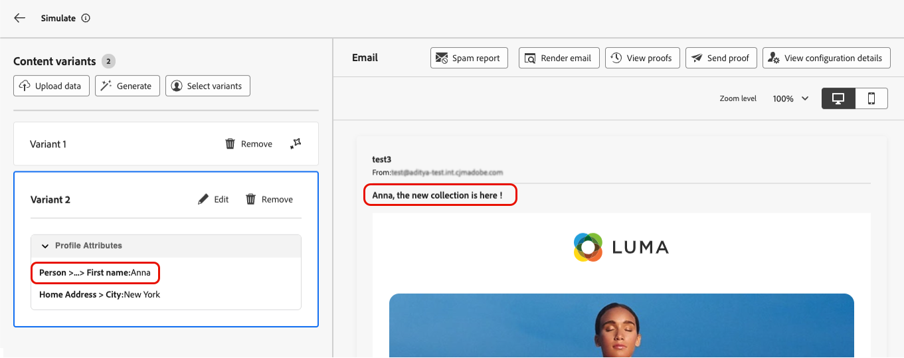

# 콘텐츠 변형 시뮬레이션 {#custom-profiles}

>[!CONTEXTUALHELP]
>id="ajo_simulate_sample_profiles"
>title="샘플 입력을 사용하여 시뮬레이션"
>abstract="이 화면에서는 AI를 통해 콘텐츠 변형을 자동 생성하거나, CSV 또는 JSON 템플릿을 통해 값을 추가하거나, 수동으로 입력하거나, 테스트 프로필을 사용해 콘텐츠 변형을 테스트할 수 있습니다."

콘텐츠에 개인화 또는 조건부 논리가 포함된 경우 콘텐츠를 보내기 전에 모든 유형의 수신자에 대해 올바르게 렌더링되는지 확인해야 합니다.

[!DNL Journey Optimizer]의 **[!UICONTROL 콘텐츠 변형 시뮬레이션]** 경험은 AI로 자동으로 생성되거나, 수동으로 입력되거나, 파일에서 가져오거나, 재사용 가능한 시뮬레이션된 사용자를 기반으로 한 단일 화면에서 콘텐츠의 여러 변형을 테스트할 수 있도록 함으로써 이를 해결합니다. Adobe Experience Platform에서 영구 프로필을 미리 만들지 않고도 각 변형이 어떻게 렌더링하고 증명을 전송하는지 미리 볼 수 있습니다.

콘텐츠에서 **[!UICONTROL 콘텐츠 시뮬레이션]**&#x200B;을 클릭하여 다음 작업을 수행할 수 있는 단일 환경을 엽니다.

* 개인화 및 조건부 분기를 처리하기 위해 AI를 사용하여 **변형 자동 생성**
* **변형을 수동으로 추가** 또는 CSV 또는 JSON 파일에서 추가
* **시뮬레이트된 사용자를 사용**&#x200B;하여 저장하고 재사용 가능한 테스트 데이터를 사용하여 미리 보고 증명을 확인할 수 있습니다.
* 선택한 변형에 대해 **미리 보기** 렌더링 및 **전자 메일 증명 보내기**

개인화를 위해 콘텐츠에 사용된 모든 속성이 자동으로 감지됩니다. 변형은 속성에 대해 다른 값을 갖는 콘텐츠 버전입니다.

>[!NOTE]
>
>변형은 현재 콘텐츠에 대한 테스트 목적으로만 사용됩니다. 이러한 파일은 Adobe Experience Platform에 저장되지 않고 사용자 브라우저 세션에 저장되므로 로그오프할 때 또는 다른 장치에서 작업할 때 표시되지 않습니다.

## 가드레일 및 제한 사항 {#limitations}

샘플 입력 데이터를 사용하여 콘텐츠 테스트를 시작하기 전에 다음 보호 기능 및 사전 요구 사항을 고려하십시오.

* **채널** - 콘텐츠 변형 시뮬레이션을 사용할 수 있는 대상:

   * 이메일, SMS 및 푸시 알림 채널
   * 모든 인바운드 채널(웹, 코드 기반 경험, 인앱, 콘텐츠 카드);
   * 조정된 캠페인.

* **지원되는 기능** - 콘텐츠 변형을 [!DNL Journey Optimizer] 다국어 콘텐츠 및 콘텐츠 실험 기능과 함께 사용할 수 있습니다. 이를 통해 여러 언어로 메시지를 테스트하고 실험을 통해 콘텐츠를 최적화할 수 있습니다.

  콘텐츠 변형을 활용하여 콘텐츠 템플릿을 테스트할 수도 있습니다.

  >[!NOTE]
  >
  >현재 환경에서는 받은 편지함 렌더링 및 스팸 보고서를 사용할 수 없습니다. 이러한 기능을 사용하려면 **[!UICONTROL 콘텐츠 시뮬레이션]**&#x200B;을 클릭한 다음 드롭다운에서 **[!UICONTROL 콘텐츠 시뮬레이션(AEP 프로필)]**&#x200B;을 선택하여 이전 사용자 인터페이스에 액세스합니다.

* **특성** - 프로필과 컨텍스트 특성이 모두 지원됩니다.

* **데이터 형식** - 변형에 대한 데이터를 입력할 때 숫자(정수 및 십진수), 문자열, 부울 및 날짜 형식만 지원됩니다. 다른 데이터 유형에는 오류가 표시됩니다.

* **변형 수** - 파일을 사용하거나 수동으로 추가할 때 최대 30개의 변형을 추가하여 콘텐츠를 테스트할 수 있습니다. AI 자동 생성을 사용할 때 시스템은 콘텐츠(개인화 필드 및 조건부 분기)를 기반으로 최대 40개의 변형을 만들어 낼 변형 수를 결정합니다.

## 콘텐츠 변형 만들기

콘텐츠의 변형을 만들려면 **[!UICONTROL 콘텐츠 시뮬레이션]** 단추를 클릭하십시오.

다음과 같은 방법으로 변형을 만들 수 있습니다.

* [수동으로 또는 파일에서 변형을 추가](#profiles).
* AI를 사용하여 [변형 자동 생성](#auto-generate-variants).
* [기존 시뮬레이션된 사용자의 변형을 선택하십시오](#simulated-users).

변형이 만들어지면 [콘텐츠를 미리 보고 증명을 보낼 수 있습니다](#preview-proofs).

### 수동으로 또는 파일에서 변형 추가 {#profiles}

콘텐츠 변형 경험에 액세스하면 콘텐츠에 사용된 모든 개인화 필드가 자동으로 감지되어 빈 변형에 표시됩니다.

예를 들어 이메일에 두 개의 개인화 필드 &quot;이름&quot;과 &quot;구/군/시&quot;가 포함되어 있는 경우 목록에 표시됩니다. 처음에는 값을 입력하지 않으며 미리 보기 창에 개인화된 콘텐츠가 표시되지 않습니다.


변형을 수동으로 추가하거나 파일에서 업로드할 수 있습니다.

+++ 수동으로 변형 추가

기본 변형의 값을 편집하려면 **[!UICONTROL 편집]** 단추를 클릭하여 각 개인화 필드에 대한 사용자 지정 값을 제공하십시오. 미리 보기 창이 업데이트되어 콘텐츠가 입력된 값으로 렌더링되는 방식을 보여 줍니다.

새 변형을 추가하려면 **[!UICONTROL 샘플 만들기]** 단추를 클릭합니다. 감지된 모든 개인화 필드를 포함하는 새로운 빈 변형이 나타납니다. 필요에 따라 새 변형을 편집할 수 있습니다.


+++

+++ 파일에서 변형 추가

사전 정의된 변형과 값이 있는 파일을 업로드하여 프로세스 속도를 높일 수 있습니다.

1. **[!UICONTROL 데이터 업로드]** 단추를 클릭하여 파일 업로드 화면을 엽니다.
1. **[!UICONTROL 샘플 다운로드]**&#x200B;를 선택하여 CSV, JSON 또는 JSONLINES 파일 템플릿을 다운로드합니다.
1. 템플릿 파일을 열고 각 프로필 속성에 대해 원하는 값을 입력합니다. 템플릿에는 개인화를 위한 콘텐츠에 사용되는 각 프로필 속성에 대한 열이 포함되어 있습니다.

   JSON 구문 예:

   ```json
   {
   "profile": {
       "attributes": {
       "person": {
           "name": {
               "lastName": "Doe",
               "firstName": "John"
               }
           }
       }
   }
   }
   ```

1. 파일이 준비되면 **[!UICONTROL 확인]**&#x200B;을 선택하여 로드합니다. 업로드한 후에는 파일의 각 항목에 대한 목록에 새 변형이 추가됩니다.

+++

### 콘텐츠 변형 자동 생성 {#auto-generate-variants}

[!DNL Journey Optimizer]은(는) AI 기반 시뮬레이션을 사용하여 콘텐츠 변형을 자동으로 생성할 수 있으므로 직접 변형을 작성하지 않고도 개인화 논리의 유효성을 검사할 수 있습니다. 시스템은 콘텐츠를 분석하고 개인화 필드 및 조건부 분기를 식별하며 거의 사실적인 미리 보기에 대해 의미 있는 값으로 해당 필드를 커버하는 데 필요한 만큼 변형을 만듭니다.

변형을 자동으로 생성하려면 **[!UICONTROL 생성]** 단추를 클릭하고 시스템이 생성이 완료될 때까지 기다립니다. 변형 목록에서 생성된 변형을 검토하고 미리 보기 창에서 해당 렌더링을 검토합니다.


>[!NOTE]
>
>생성된 변형의 수는 콘텐츠에 따라 다릅니다. 간단한 개인화가 있는 메시지는 단일 변형을 생성할 수 있는 반면, 여러 조건부 분기가 있는 콘텐츠는 여러 변형을 생성할 수 있습니다. **[!UICONTROL 생성]**&#x200B;을 클릭하면 수동으로 추가했거나 파일에서 추가한 콘텐츠 변형을 포함하여 목록의 모든 기존 콘텐츠 변형이 AI가 생성한 변형으로 바뀝니다.

### 시뮬레이션된 사용자의 변형 선택 {#simulated-users}

**[!UICONTROL 콘텐츠 변형 시뮬레이션]**&#x200B;에서 **시뮬레이션된 사용자**&#x200B;를 기준으로 변형을 만들 수 있습니다. 시뮬레이션된 사용자는 Adobe Experience Platform에서 영구 프로필을 사용하지 않고 테스트를 위해 만든 프로필과 유사한 임시 엔티티입니다. 현재 브라우저 세션에 대해서만 추가된 변형과 달리, 시뮬레이션된 사용자는 저장되고 여정 간 및 다른 사용자가 재사용할 수 있습니다.

시뮬레이션된 사용자는 여정 **[!UICONTROL 시뮬레이션]** 기능에서 만들고 관리합니다. 생성, 저장 및 재사용을 위한 전체 절차는 [시뮬레이션된 사용자 만들기 및 관리](../building-journeys/simulate-journey.md#test-users)를 참조하십시오.

시뮬레이션된 사용자가 만들어지면 해당 사용자를 사용하여 콘텐츠를 미리 볼 수 있습니다. 이렇게 하려면 다음 단계를 수행합니다.

1. **[!UICONTROL 변형 선택]** 단추를 클릭합니다.
1. 기존 시뮬레이션 사용자 목록에서 사용할 사용자를 선택한 다음 **[!UICONTROL 선택]**&#x200B;을 클릭합니다.

   

1. 선택한 시뮬레이션된 사용자는 콘텐츠 변형 목록에 추가되며, 여기에서 속성 값으로 콘텐츠를 미리 볼 수 있습니다. 테스트를 위해 변형 값을 수동으로 편집할 수도 있지만 이러한 변경 사항은 시뮬레이션된 사용자에게 다시 저장되지 않습니다.

## 콘텐츠 미리보기 및 증명 보내기 {#preview-proofs}

변형이 추가되면 오른쪽 창에서 콘텐츠를 미리 보고 이메일 증명을 보낼 수 있습니다.

### 콘텐츠 변형 미리 보기 {#preview}

변형을 사용하여 콘텐츠를 미리 보려면 목록에서 관련 변형을 선택하여 미리 보기 창의 콘텐츠를 이 변형에 대해 입력한 정보로 업데이트합니다.

아래 예에는 이메일 제목 줄에 대한 두 가지 변형이 추가되었습니다.

| 변형 1 선택 | 변형 2 선택 |
|----------|-------------|
|  |  |

<!--
For multilingual content and experimentation, a dropdown is available to switch between the different language variants or treatments.


-->

### 교정쇄 보내기 {#proofs}

Journey Optimizer을 사용하면 시뮬레이션 화면에 추가한 하나 또는 여러 변형을 가장하는 동안 증명을 이메일 주소로 보낼 수 있습니다. 단계는 다음과 같습니다.

1. 콘텐츠를 테스트하기 위해 변형이 추가되었는지 확인하고 **[!UICONTROL 증명 보내기]** 단추를 클릭합니다.

1. **[!UICONTROL 받는 사람]** 필드에 증명을 보낼 전자 메일 주소를 입력한 다음 **[!UICONTROL 추가]**&#x200B;를 클릭합니다. 추가 이메일 주소로 증명을 보내려면 작업을 반복하십시오. 최대 10명의 증명 수신자를 추가할 수 있습니다.

1. 화면 하단에서 증명에 사용할 변형을 선택합니다. 여러 변형을 선택할 수 있습니다. 이 경우 이메일에는 선택한 변형만큼 많은 증명이 포함됩니다.

   변형에 대한 자세한 내용을 보려면 **[!UICONTROL 프로필 세부 정보 보기]** 링크를 선택하십시오. 이렇게 하면 다른 변형에 대해 이전 화면에 입력한 정보를 표시할 수 있습니다.

   

1. 증명 전송을 시작하려면 **[!UICONTROL 증명 보내기]** 단추를 클릭하세요.

1. 증명 전송을 추적하려면 콘텐츠 시뮬레이션 화면에서 **[!UICONTROL 증명 보기]** 단추를 클릭하십시오.


