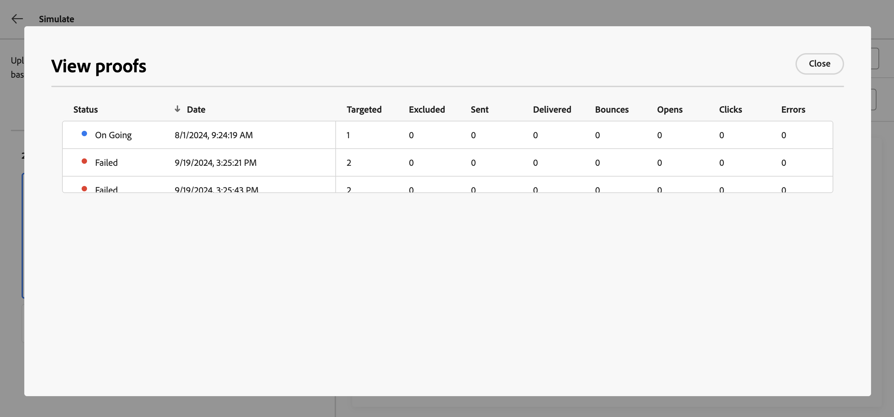

# 콘텐츠 변형 시뮬레이션 {#custom-profiles}

>[!CONTEXTUALHELP]
>id="ajo_simulate_sample_profiles"
>title="샘플 입력을 사용하여 시뮬레이션"
>abstract="이 화면에서는 CSV 또는 JSON 템플릿을 통해 개인화 필드에 값을 제공하거나 수동으로 값을 입력하여 콘텐츠의 다양한 변형을 테스트할 수 있습니다."

[!DNL Journey Optimizer]을(를) 사용하면 CSV 또는 JSON 파일에서 업로드하거나 수동으로 추가한 샘플 입력 데이터를 사용하여 다양한 콘텐츠 변형을 미리 볼 수 있습니다.

개인화를 위해 콘텐츠에 사용된 모든 속성은 시스템에서 자동으로 감지되며 테스트에 사용하여 여러 변형을 만들 수 있습니다. 변형은 속성에 대해 다른 값을 갖는 콘텐츠 버전을 나타냅니다.

>[!NOTE]
>
>변형은 현재 콘텐츠에 대한 테스트 목적으로만 사용됩니다. 이러한 파일은 Adobe Experience Platform에 저장되지 않고 사용자 브라우저 세션에 저장되므로 로그오프할 때 또는 다른 장치에서 작업할 때 표시되지 않습니다.

## 가드레일 및 제한 사항 {#limitations}

샘플 입력 데이터를 사용하여 콘텐츠 테스트를 시작하기 전에 다음 보호 기능 및 사전 요구 사항을 고려하십시오.

* **채널** - 콘텐츠 변형 시뮬레이션을 사용할 수 있는 대상:

   * 이메일, SMS 및 푸시 알림 채널
   * 모든 인바운드 채널(웹, 코드 기반 경험, 인앱, 콘텐츠 카드).

* **지원되는 기능** - 콘텐츠 변형을 [!DNL Journey Optimizer] 다국어 콘텐츠 및 콘텐츠 실험 기능과 함께 사용할 수 있습니다. 이를 통해 여러 언어로 메시지를 테스트하고 실험을 통해 콘텐츠를 최적화할 수 있습니다.

  콘텐츠 변형을 활용하여 콘텐츠 템플릿을 테스트할 수도 있습니다.

  >[!NOTE]
  >
  >현재 환경에서는 받은 편지함 렌더링 및 스팸 보고서를 사용할 수 없습니다. 이러한 기능을 사용하려면 콘텐츠에서 **[!UICONTROL 콘텐츠 시뮬레이션]** 버튼을 선택하여 이전 사용자 인터페이스에 액세스합니다.

* **특성** - 프로필과 컨텍스트 특성이 모두 지원됩니다.

* **데이터 형식** - 변형에 대한 데이터를 입력할 때 숫자(정수 및 십진수), 문자열, 부울 및 날짜 형식만 지원됩니다. 다른 데이터 유형에는 오류가 표시됩니다.

* **변형 수** - 파일을 사용하거나 수동으로 콘텐츠를 테스트하는 최대 30개의 변형을 추가할 수 있습니다.

## 콘텐츠 변형 추가 및 미리 보기

콘텐츠의 변형을 만들고 미리 보려면 **[!UICONTROL 콘텐츠 시뮬레이션]** 단추를 클릭하고 **[!UICONTROL 콘텐츠 변형 시뮬레이션]**&#x200B;을 선택하십시오.


콘텐츠를 테스트하는 주요 단계는 다음과 같습니다.

1. **변형 추가** - 파일을 업로드하거나 수동으로 데이터를 추가하여 샘플 입력 데이터를 사용하여 최대 30개의 변형을 추가합니다. [변형을 추가하는 방법 알아보기](#profiles)
1. **콘텐츠 변형 미리 보기** - 다른 변형을 사용하는 콘텐츠의 미리 보기를 확인합니다. [콘텐츠를 미리 보는 방법 알아보기](#preview)
1. **전자 메일 증명 보내기** - 전자 메일 콘텐츠의 경우 다른 변형을 사용하여 전자 메일 주소에 최대 10개의 증명을 보냅니다. [증명을 보내는 방법 알아보기](#proofs)

### 변형 추가 {#profiles}

콘텐츠 변형 경험에 액세스하면 콘텐츠에 사용된 모든 개인화 필드가 자동으로 감지되어 빈 변형 목록에 표시됩니다.

예를 들어 이메일에 두 개의 개인화 필드 &quot;도시&quot;와 &quot;프로그램 포인트 균형&quot;이 포함되어 있으면 목록에 표시됩니다. 처음에는 값을 입력하지 않으며 미리 보기 창에 개인화된 콘텐츠가 표시되지 않습니다.


변형 값을 편집하려면 다음을 수행하십시오.

1. 변형 옆에 있는 줄임표 버튼을 클릭합니다.
1. 각 개인화 필드에 사용자 지정 값을 제공하려면 **[!UICONTROL 편집]**&#x200B;을(를) 선택하십시오.
1. 미리 보기 창이 업데이트되어 콘텐츠가 입력된 값으로 렌더링되는 방식을 보여 줍니다.

새 변형을 추가하려면:

1. **[!UICONTROL 샘플 입력 만들기]** 단추를 클릭합니다.
1. 감지된 모든 개인화 필드를 포함하는 새로운 빈 변형이 나타납니다.
1. 필요에 따라 새 변형을 편집합니다.


사전 정의된 변형과 값이 있는 파일을 업로드하여 프로세스 속도를 높일 수도 있습니다.

1. 파일 템플릿을 다운로드하려면 **[!UICONTROL 샘플 다운로드]**&#x200B;를 클릭하십시오.
1. CSV, JSON 또는 JSONLINES와 같은 파일 형식을 선택합니다.
1. 템플릿 파일을 열고 각 프로필 속성에 대해 원하는 값을 입력합니다. 템플릿에는 개인화를 위한 콘텐츠에 사용되는 각 프로필 속성에 대한 열이 포함되어 있습니다.

   JSON 구문 예:

   ```
   {
   "profile": {
       "attributes": {
       "person": {
           "name": {
               "lastName": "Doe",
               "firstName": "John"
               }
           }
       }
   }
   }
   ```

1. 파일이 준비되면 **[!UICONTROL 입력 데이터 업로드]**&#x200B;를 클릭하여 로드합니다.
1. 업로드한 후에는 파일의 각 항목에 대한 목록에 새 변형이 추가됩니다.

   

변형이 추가되면 오른쪽 창에서 콘텐츠를 미리 보고 이메일 증명을 보낼 수 있습니다.

### 콘텐츠 변형 미리 보기 {#preview}

변형을 사용하여 콘텐츠를 미리 보려면 목록에서 관련 변형을 선택하여 미리 보기 창의 콘텐츠를 이 변형에 대해 입력한 정보로 업데이트합니다.

아래 예에는 이메일 제목 줄에 대한 두 가지 변형이 추가되었습니다.

| 변형 1 선택 | 변형 2 선택 |
|----------|-------------|
|  |  |

다국어 콘텐츠 및 실험의 경우 다양한 언어 변형 또는 처리 간을 전환하는 드롭다운을 사용할 수 있습니다.


언제든지 오른쪽 상단의 줄임표 버튼을 사용하고 **[!UICONTROL 제거]**&#x200B;를 선택하여 변형을 제거할 수 있습니다. 변형에 대한 정보를 편집하려면 줄임표 버튼을 클릭하고 **[!UICONTROL 편집]**&#x200B;을 선택하세요.

### 교정쇄 보내기 {#proofs}

Journey Optimizer을 사용하면 시뮬레이션 화면에 추가한 하나 또는 여러 변형을 가장하는 동안 증명을 이메일 주소로 보낼 수 있습니다. 단계는 다음과 같습니다.

1. 콘텐츠를 테스트하기 위해 변형이 추가되었는지 확인하고 **[!UICONTROL 증명 보내기]** 단추를 클릭합니다.

1. **[!UICONTROL 받는 사람]** 필드에 증명을 보낼 전자 메일 주소를 입력한 다음 **[!UICONTROL 추가]**&#x200B;를 클릭합니다. 추가 이메일 주소로 증명을 보내려면 작업을 반복하십시오. 최대 10명의 증명 수신자를 추가할 수 있습니다.

1. 화면 하단에서 증명에 사용할 변형을 선택합니다. 여러 변형을 선택할 수 있습니다. 이 경우 이메일에는 선택한 변형만큼 많은 증명이 포함됩니다.

   변형에 대한 자세한 내용을 보려면 **[!UICONTROL 프로필 세부 정보 보기]** 링크를 선택하십시오. 이렇게 하면 다른 변형에 대해 이전 화면에 입력한 정보를 표시할 수 있습니다.

   

1. 증명 전송을 시작하려면 **[!UICONTROL 증명 보내기]** 단추를 클릭하세요.

1. 증명 전송을 추적하려면 콘텐츠 시뮬레이션 화면에서 **[!UICONTROL 증명 보기]** 단추를 클릭하십시오.


