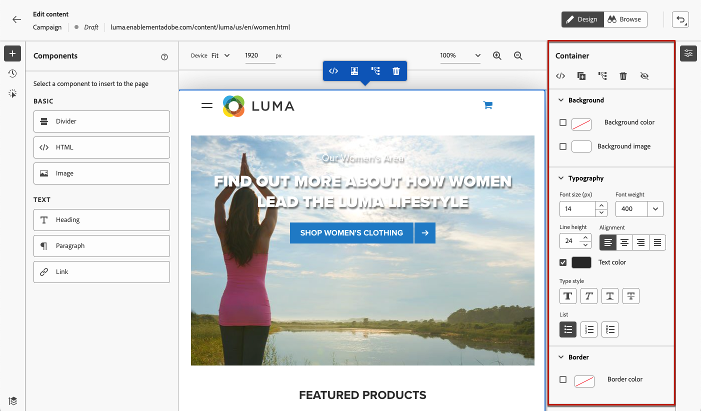

# 웹 페이지 작성  {#author-web}

>[!AVAILABILITY]
>
>웹 채널 기능은 현재 베타로 사용되어 사용자만 선택할 수 있습니다.

in [!DNL Journey Optimizer] 웹 작성은 Adobe Experience Cloud Visual Helper chrome 브라우저 확장 프로그램에서 지원합니다. [자세히 알아보기](visual-editing-helper.md)

에서 웹 페이지에 액세스하여 작성할 수 있도록 하려면 [!DNL Journey Optimizer] 사용자 인터페이스에 나열된 사전 요구 사항을 따르십시오. [이 섹션](create-web.md#prerequesites).

## 웹 페이지 컨텐츠 편집 {#edit-web-content}

캠페인에서 웹 작업을 만들면 웹 디자이너를 사용하여 콘텐츠를 편집할 수 있습니다. 이렇게 하려면 아래 절차를 따르십시오.

>[!CAUTION]
>
>에서 액세스 [!DNL Journey Optimizer]를 설정하는 경우 웹 페이지는 [Adobe Experience Platform Web SDK](https://experienceleague.adobe.com/docs/platform-learn/implement-web-sdk/overview.html?lang=ko-KR){target=&quot;_blank&quot;}.

1. 에서 **[!UICONTROL 작업]** 캠페인의 탭에서 을 선택합니다. **[!UICONTROL 컨텐츠 편집]** 웹 캠페인 작성을 시작하려면 다음을 수행하십시오.

1. 페이지 일치 규칙을 만든 경우 이 규칙과 일치하는 URL을 입력해야 합니다. 규칙과 일치하는 모든 페이지에 변경 사항이 적용됩니다.

   >[!NOTE]
   >
   >웹 화면으로 단일 URL을 입력하면 개인화할 URL이 이미 채워집니다.

   

1. 페이지의 컨텐츠가 표시됩니다.

   >[!CAUTION]
   >
   >웹 페이지에는 [Adobe Experience Platform Web SDK](https://experienceleague.adobe.com/docs/platform-learn/implement-web-sdk/overview.html){target=&quot;_blank&quot;}.

1. 클릭 **[!UICONTROL 웹 디자이너 열기]** 편집 [자세히 알아보기](author-web.md)

   

1. 웹 디자이너가 표시됩니다.

   

1. 이미지, 단추, 단락, 텍스트, 컨테이너, 제목, 링크 등의 요소를 캔버스에서 선택합니다. 및 사용:

   * 컨텍스트 메뉴를 사용하여 콘텐츠, 레이아웃, 삽입 링크 또는 개인화 등을 편집할 수 있습니다.

      

   * 각 요소를 편집, 복제, 삭제 또는 숨길 오른쪽 패널 상단에 있는 아이콘입니다.

      

   * 선택한 요소에 따라 동적으로 변경되는 오른쪽 패널입니다. 예를 들어 요소의 배경, 타이포그래피, 테두리, 크기, 위치, 간격, 효과 또는 인라인 스타일을 편집할 수 있습니다.

      

## 콘텐츠 구성 요소 사용 {#content-components}

1. 에서 **[!UICONTROL 구성 요소]** 왼쪽의 웹 페이지에 다음 구성 요소를 추가하고 필요에 따라 편집할 수 있습니다.

   * [구분선](../design/content-components.md#divider)
   * [HTML](../design/content-components.md#HTML)
   * [이미지](../design/content-components.md#image)
   * 제목 - 이 구성 요소를 사용하는 것은 **[!UICONTROL 텍스트]** 이메일 디자이너의 구성 요소입니다. [자세히 알아보기](../design/content-components.md#text)
   * 단락 - 이 구성 요소를 사용하는 것은 **[!UICONTROL 텍스트]** 이메일 디자이너의 구성 요소입니다. [자세히 알아보기](../design/content-components.md#text)
   * 링크 - 에서 링크 스타일을 정의하는 방법을 알아봅니다. [이 섹션](../design/styling-links.md)
   * [오퍼 결정](../design/deliver-personalized-offers.md)

   

1. 페이지를 마우스로 가리킨 다음 **[!UICONTROL 다음 항목 앞에 삽입]** 또는 **[!UICONTROL 다음 항목 뒤에 삽입]** 단추를 클릭하여 구성 요소를 페이지의 기존 요소에 추가합니다.

   

1. 이 구성 요소에 대해 표시되는 컨테이너에서 필요에 따라 구성 요소 컨텐츠를 편집합니다.

   

1. 에서 표시되는 스타일을 조정합니다 **[!UICONTROL 컨테이너]** 오른쪽 창(예: 배경, 텍스트 색상, 테두리, 크기, 위치 등) 선택한 구성 요소에 따라 다릅니다.

   

## 웹 디자이너 탐색

### 탐색 표시 사용

1. 캔버스에서 요소를 선택합니다.

1. 을(를) 클릭합니다. **[!UICONTROL 탐색 표시 확장/축소]** 화면의 왼쪽 하단에 있는 버튼을 클릭하여 선택한 요소에 대한 정보를 빠르게 표시합니다.

   

1. 탐색 표시를 마우스로 가리키면 해당 요소가 편집기에서 강조 표시됩니다.

1. 이를 사용하면 시각적 편집기 내에서 상위 요소, 동일 수준의 요소 또는 하위 요소로 쉽게 이동할 수 있습니다.

### 찾아보기 모드로 교체 {#browse-mode}

기본값에서 바꿀 수 있습니다 **[!UICONTROL 디자인]** 모드로 **[!UICONTROL 찾아보기]** 전용 단추를 사용하여 모드 지정

에서 **[!UICONTROL 찾아보기]** 모드에서는 개인화할 선택한 서피스에서 정확한 페이지로 이동할 수 있습니다.

이 기능은 특히 특정 URL에서 시작 시점부터 사용할 수 없거나 인증이 뒤따르는 페이지를 처리할 때 유용합니다. 예를 들어 계정 페이지 또는 장바구니 페이지를 인증하고, 이동한 다음, **[!UICONTROL 디자인]** 모드 로 이동하여 원하는 페이지에서 변경할 수 있습니다.

### 장치 크기 변경

장치 크기를 다음과 같이 사전 정의된 크기로 변경할 수 있습니다 **[!UICONTROL 태블릿]** 또는 **[!UICONTROL 모바일 가로]**&#x200B;또는 사용자 지정 크기를 정의합니다. 원하는 픽셀 수를 입력하여 사용자 정의 크기를 정의합니다.

확대/축소 포커스를 25%에서 400%로 변경할 수도 있습니다.

## 수정 사항 관리 {#manage-modifications}

웹 페이지에 추가한 모든 구성 요소, 조정 및 스타일을 쉽게 관리할 수 있습니다.

1. 을(를) 선택합니다 **[!UICONTROL 수정 사항]** 버튼을 클릭하여 왼쪽에 해당 창을 표시합니다.

   

1. 페이지에서 수행한 각 변경 사항을 검토할 수 있습니다.

1. 원치 않는 수정 사항을 선택하고 삭제 아이콘을 클릭하여 제거합니다.

   

   >[!CAUTION]
   >
   >작업을 삭제하면 후속 작업에 영향을 줄 수 있으므로 삭제 시 주의해서 진행하십시오.

1. 를 사용하여 작업을 취소하거나 재실행할 수도 있습니다 **[!UICONTROL 실행 취소/다시 실행]** 화면 오른쪽 상단의 단추.

   

   버튼을 클릭하고 버튼을 눌러 **[!UICONTROL 실행 취소]** 및 **[!UICONTROL 다시 실행]** 옵션. 그런 다음 단추 자체를 클릭하여 원하는 작업을 적용합니다.

## 개인화 및 오퍼 추가

개인화를 추가하려면 컨테이너를 선택하고 표시되는 상황별 메뉴 표시줄에서 개인화 아이콘을 선택합니다. 표현식 편집기를 사용하여 변경 사항을 추가합니다. [자세히 알아보기](../personalization/personalization-build-expressions.md)

를 사용하십시오 **[!UICONTROL 오퍼 결정]** 삽입할 구성 요소 [오퍼](../offers/get-started/starting-offer-decisioning.md) 참조하십시오. 프로세스는 와 같습니다 [이메일에 오퍼 추가](../design/deliver-personalized-offers.md). 의사 결정 관리 를 활용하여 고객에게 제공할 최상의 오퍼를 선택할 수 있습니다.

## 웹 캠페인 테스트 {#test-web-campaign}

수정된 웹 경험의 미리 보기를 표시하려면 아래 단계를 따르십시오.

>[!CAUTION]
>
>사용자에게 전달될 오퍼를 시뮬레이션하려면 사용 가능한 테스트 프로필이 있어야 합니다. 방법 알아보기 [테스트 프로필 만들기](../segment/creating-test-profiles.md).

1. 다음 중 하나에서 **[!UICONTROL 컨텐츠 편집]** 화면 또는 웹 디자이너에서 **[!UICONTROL 컨텐츠 시뮬레이션]**.

   

1. 클릭 **[!UICONTROL 테스트 프로필 관리]** 테스트 프로필을 한 개 이상 선택하려면 다음을 수행하십시오.
1. 수정된 웹 페이지의 미리 보기가 표시됩니다.

   

1. 테스트 URL을 복사하여 브라우저에 붙여넣거나 기본 브라우저에서 열 수도 있습니다.
