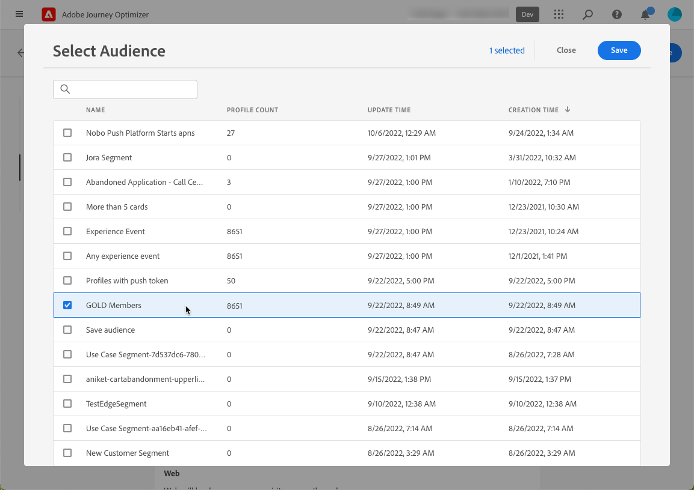
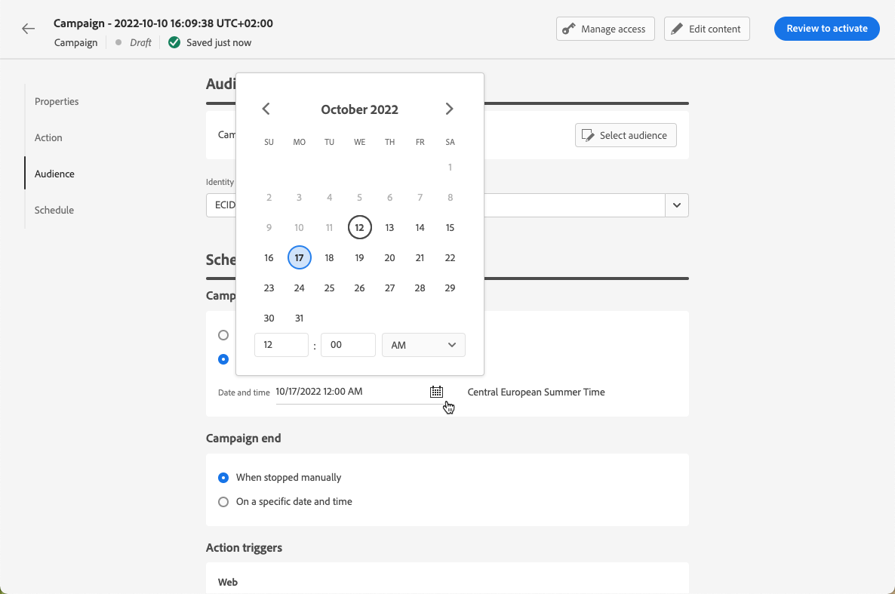

# 웹 경험 만들기  {#create-web}

>[!AVAILABILITY]
>
>웹 채널 기능은 현재 베타로 사용되어 사용자만 선택할 수 있습니다.

[!DNL Journey Optimizer] 인바운드 웹 캠페인을 통해 고객에게 전달하는 웹 경험을 개인화할 수 있습니다.

>[!CAUTION]
>
>현재 [!DNL Journey Optimizer] 를 사용하여 웹 경험만 만들 수 있습니다. **캠페인**.

## 전제 조건 {#prerequesites}

에서 웹 페이지에 액세스하여 작성할 수 있도록 하려면 [!DNL Journey Optimizer] 사용자 인터페이스에서 아래 전제 조건을 따르십시오.

* 웹 사이트에 수정 사항을 추가하려면 [Adobe Experience Platform Web SDK](https://experienceleague.adobe.com/docs/platform-learn/implement-web-sdk/overview.html?lang=ko-KR)웹 사이트에서 {target=&quot;_blank&quot;}.

* 에 액세스하려면 [!DNL Journey Optimizer] 웹 디자이너는 [Adobe Experience Cloud Visual Editing Helper](https://chrome.google.com/webstore/detail/adobe-experience-cloud-vi/kgmjjkfjacffaebgpkpcllakjifppnca)Chrome에서 {target=&quot;_blank&quot;} 브라우저 확장 프로그램. [자세히 알아보기](visual-editing-helper.md)

>[!CAUTION]
>
>Google Chrome은 현재 웹 페이지 작성을 지원하는 유일한 브라우저입니다 [!DNL Journey Optimizer].

웹 경험을 올바르게 전달하려면 다음 설정을 정의해야 합니다.

* 에서 [Adobe Experience Platform 데이터 수집](https://experienceleague.adobe.com/docs/experience-platform/edge/datastreams/overview.html){target=&quot;_blank&quot;}, 다음과 같이 정의된 데이터 스트림이 있는지 확인하십시오. **[!UICONTROL Adobe Experience Platform]** 두 가지 서비스를 모두 제공합니다. **[!UICONTROL 에지 세그멘테이션]** 및 **[!UICONTROL Adobe Journey Optimizer]** 옵션이 활성화되었습니다.

   이렇게 하면 Adobe Experience Platform Edge에서 Journey Optimizer 인바운드 이벤트를 올바르게 처리할 수 있습니다. [자세히 보기](https://experienceleague.adobe.com/docs/experience-platform/edge/datastreams/configure.html){target=&quot;_blank&quot;}

   

   >[!NOTE]
   >
   >다음 **[!UICONTROL Adobe Journey Optimizer]** 옵션은 **[!UICONTROL 에지 세그멘테이션]** 옵션이 이미 활성화되어 있습니다.

* in [Adobe Experience Platform](https://experienceleague.adobe.com/docs/experience-platform/profile/home.html?lang=ko){target=&quot;_blank&quot;}, 병합 정책이 하나 있는지 확인하십시오 **[!UICONTROL Active-On-Edge 병합 정책]** 옵션을 활성화했습니다. 이렇게 하려면 아래에서 정책을 선택합니다 **[!UICONTROL 고객]** > **[!UICONTROL 프로필]** > **[!UICONTROL 병합 정책]** Experience Platform 메뉴. [자세히 보기](https://experienceleague.adobe.com/docs/experience-platform/profile/merge-policies/ui-guide.html#configure){target=&quot;_blank&quot;}

   이 병합 정책은 [!DNL Journey Optimizer] 에지에서 인바운드 캠페인을 올바르게 활성화하고 게시할 수 있는 인바운드 채널입니다. [자세히 보기](https://experienceleague.adobe.com/docs/experience-platform/profile/merge-policies/ui-guide.html){target=&quot;_blank&quot;}

   

## 웹 캠페인 만들기 {#create-web-campaign}

>[!CONTEXTUALHELP]
>id="ajo_web_surface"
>title="웹 서피스 정의"
>abstract="웹 서피스는 단일 페이지 URL 또는 여러 페이지를 일치시킬 수 있으므로 하나 또는 여러 웹 페이지에서 컨텐츠 수정 사항을 게재할 수 있습니다."

캠페인을 통해 웹 경험 작성을 시작하려면 아래 단계를 따르십시오.

1. 캠페인 만들기. [자세히 알아보기](../campaigns/create-campaign.md)

1. 을(를) 선택합니다 **[!UICONTROL 웹]** 작업.

   

1. 웹 서피스를 정의합니다.

   >[!NOTE]
   >
   >웹 서피스는 컨텐츠가 전달될 URL로 식별되는 웹 속성입니다. 단일 페이지 URL 또는 여러 페이지를 일치시킬 수 있으므로 하나 또는 여러 웹 페이지에서 수정 사항을 전달할 수 있습니다.

   을(를) 입력할 수 있습니다. **[!UICONTROL 페이지 URL]** 변경 사항을 단일 페이지에만 적용하려면

   

1. 또는 **[!UICONTROL 페이지 일치 규칙]** 동일한 규칙과 일치하는 여러 URL을 타깃팅하려면, 예를 들어 전체 웹 사이트 전체에서 히어로 배너에 변경 사항을 적용하거나 웹 사이트의 모든 제품 페이지에 표시되는 최상위 이미지를 추가하려는 경우.

   이렇게 하려면 을(를) 선택합니다. **[!UICONTROL 페이지 일치 규칙]** 을(를) 클릭합니다. **[!UICONTROL 규칙 만들기]**.

   

1. 에 대한 기준을 정의합니다 **[!UICONTROL 도메인]** 및 **[!UICONTROL 페이지]** 필드.

   예를 들어, Luma 웹 사이트의 모든 여성 제품 페이지에 표시되는 요소를 편집하려면 을(를) 선택합니다 **[!UICONTROL 도메인]** > **[!UICONTROL 다음으로 시작]** > `luma` 및 **[!UICONTROL 페이지]** > **[!UICONTROL 다음 포함]** > `women`.

   

1. 변경 내용을 저장합니다. 규칙이 **[!UICONTROL 캠페인 만들기]** 화면.

   

1. 웹 서피스를 정의했으면 다음을 선택합니다 **[!UICONTROL 만들기]**. 이제 캠페인 속성 및 설정을 구성할 수 있습니다.

## 웹 캠페인 구성 {#configure-web-campaign}

1. 에서 **[!UICONTROL 속성]** 탭에서 캠페인 이름을 편집하고 필요한 경우 설명을 추가할 수 있습니다.

   

1. 사용자 지정 또는 핵심 데이터 사용 레이블을 웹 캠페인에 지정하려면 **[!UICONTROL 액세스 관리]** 단추를 클릭합니다. [OLAC(개체 수준 액세스 제어)에 대해 자세히 알아보기](../administration/object-based-access.md)

1. 선택할 수 있습니다 **[!UICONTROL 컨텐츠 실험]** 특정 지표에 대해 가장 적합한 처리를 확인하기 위해 대상자의 일부와 함께 컨텐츠 처리를 테스트하십시오. [자세히 알아보기](../campaigns/content-experiment.md)

   >[!AVAILABILITY]
   >
   >다음 **컨텐츠 실험** 기능은 현재 조직 집합(제한된 가용성)에만 사용할 수 있습니다. 자세한 내용은 Adobe 직원에게 문의하십시오.

1. 에서 **[!UICONTROL 작업]** 캠페인의 탭에서 을 선택합니다. **[!UICONTROL 컨텐츠 편집]** 웹 캠페인 작성을 시작하려면 다음을 수행하십시오. [자세히 알아보기](author-web.md)

   

1. 에서 **[!UICONTROL Audience]** 탭에서 웹 캠페인을 볼 수 있는 사용자를 정의합니다. 기본적으로 웹 캠페인은 모든 방문자에게 표시됩니다.

   

   특정 대상을 선택할 수도 있습니다. 를 사용하십시오 **[!UICONTROL 대상 선택]** 사용 가능한 Adobe Experience Platform 세그먼트 목록을 표시하는 단추. [세그먼트에 대해 자세히 알아보기](../segment/about-segments.md)

   >[!NOTE]
   >
   >API로 트리거되는 캠페인의 경우 API 호출을 통해 대상을 설정해야 합니다. [자세히 알아보기](../campaigns/api-triggered-campaigns.md)

   

1. 에서 **[!UICONTROL ID 네임스페이스]** 필드에서 선택한 세그먼트에서 개인을 식별하는 데 사용할 네임스페이스를 선택합니다. [네임스페이스에 대해 자세히 알아보기](../event/about-creating.md#select-the-namespace)

1. 정의 **[!UICONTROL 예약]** 참조하십시오. [자세히 알아보기](../campaigns/create-campaign.md#schedule)

   

   기본적으로 수동으로 활성화하면 시작되고 수동으로 중지되면 종료되지만, 수정 사항이 표시될 특정 날짜 및 시간을 정의할 수도 있습니다.

   

## 웹 캠페인 활성화 {#activate-web-campaign}

을(를) 정의했으면 [웹 캠페인 설정](#configure-web-campaign) 원하는 대로 컨텐츠를 편집한 다음 [웹 디자이너](author-web.md), 웹 캠페인을 검토하고 활성화할 수 있습니다. 아래 절차를 따르십시오.

>[!NOTE]
>
>웹 캠페인 콘텐츠를 활성화하기 전에 미리 볼 수도 있습니다. [자세히 알아보기](author-web.md#test-web-campaign)

1. 웹 캠페인에서 를 선택합니다 **[!UICONTROL 활성화 검토]**.

   

1. 필요한 경우 컨텐츠, 속성, 서피스, 대상 및 일정을 검토하고 편집합니다.

1. 선택 **[!UICONTROL 활성화]**.

   

   >[!NOTE]
   >
   >을 클릭한 후 **[!UICONTROL 활성화]**&#x200B;웹 캠페인 변경 사항을 웹 사이트에서 실시간으로 사용할 수 있도록 하려면 최대 15분이 걸릴 수 있습니다.

웹 캠페인이 **[!UICONTROL 라이브]** 이제 선택한 대상자에게 상태 및 가 표시됩니다. 캠페인의 각 수신자는 [!DNL Journey Optimizer] 웹 디자이너

>[!NOTE]
>
>웹 캠페인에 대한 일정을 정의한 경우 해당 웹 캠페인에 가 있습니다 **[!UICONTROL 예약됨]** 시작 날짜 및 시간에 도달할 때까지의 상태입니다.
>
>이미 사용 중인 다른 캠페인과 동일한 페이지에 영향을 주는 웹 캠페인을 활성화하면 웹 페이지에 모든 변경 사항이 적용됩니다.

에서 캠페인 활성화에 대해 자세히 알아보십시오 [이 섹션](../campaigns/review-activate-campaign.md).

## 웹 캠페인 중지 {#stop-web-campaign}

웹 캠페인이 라이브 상태일 때 이를 중지하여 대상자가 수정 사항을 보지 못하도록 할 수 있습니다. 아래 절차를 따르십시오.

1. 목록에서 라이브 캠페인을 선택합니다.

1. 상단 메뉴에서 **[!UICONTROL 캠페인 중지]**.

   

1. 추가한 수정 사항은 정의한 대상에 더 이상 표시되지 않습니다.

>[!NOTE]
>
>웹 캠페인이 중지되면 다시 편집하거나 활성화할 수 없습니다. 복제하고 복제된 캠페인만 활성화할 수 있습니다.
