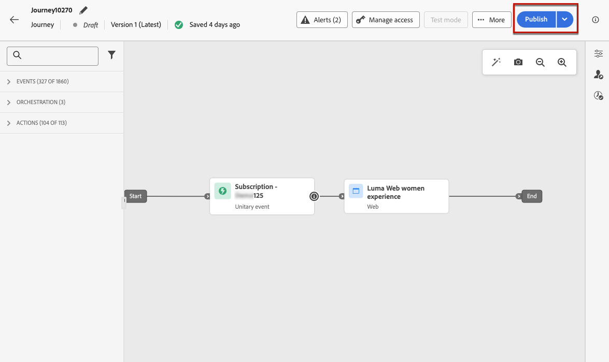

# 웹 경험 만들기  {#create-web}

[!DNL Journey Optimizer]을(를) 사용하면 인바운드 여정 또는 캠페인을 통해 고객에게 제공하는 웹 경험을 개인화할 수 있습니다.

## 여정 또는 캠페인을 통한 웹 경험 추가 {#create-web-experience}

>[!CONTEXTUALHELP]
>id="ajo_web_surface"
>title="웹 구성 정의"
>abstract="웹 구성이 단일 페이지 URL 또는 여러 페이지와 일치하면 하나 또는 여러 웹 페이지에 콘텐츠 수정 내용을 전달할 수 있습니다."

>[!CONTEXTUALHELP]
>id="ajo_web_surface_rule"
>title="페이지 일치 규칙 작성"
>abstract="페이지 일치 규칙을 사용하면 전체 웹 사이트의 히어로 배너에 변경 사항을 적용하거나 웹 사이트의 모든 제품 페이지에 표시되는 상단 이미지를 추가하려는 경우와 같이 동일한 규칙과 일치하는 여러 URL을 대상으로 지정할 수 있습니다."

캠페인이나 여정을 통해 웹 경험을 구축하려면 아래 단계를 따르십시오.

>[!NOTE]
>
>웹 경험을 처음 만드는 경우에는 [이 섹션](web-prerequisites.md)에서 설명하는 전제 조건을 충족해야 한다는 점에 유의하십시오.

>[!BEGINTABS]

>[!TAB 여정에 웹 환경 추가]

여정에 **Web** 활동을 추가하려면 다음 단계를 수행합니다.

1. [여정 만들기](../building-journeys/journey-gs.md).

1. [이벤트](../building-journeys/general-events.md) 또는 [대상자 읽기](../building-journeys/read-audience.md) 활동으로 여정을 시작하십시오.

1. 팔레트의 **[!UICONTROL 작업]** 섹션에서 **[!UICONTROL 웹]** 활동을 끌어서 놓습니다.

   

   >[!NOTE]
   >
   >**Web**&#x200B;은(는) 인바운드 메시지 활동이므로 3일 **대기** 활동과 함께 제공됩니다. [자세히 알아보기](../building-journeys/wait-activity.md#auto-wait-node)

1. 메시지에 대해 **[!UICONTROL 레이블]** 및 **[!UICONTROL 설명]**&#x200B;을 입력하십시오.

1. 사용할 [웹 구성](web-configuration.md)을 선택하거나 만드십시오.

   

1. **[!UICONTROL 콘텐츠 편집]** 단추를 선택하고 웹 디자이너를 사용하여 원하는 대로 콘텐츠를 편집하십시오. [자세히 알아보기](edit-web-content.md)

1. 필요한 경우 추가 작업 또는 이벤트를 끌어다 놓아 여정 흐름을 완료합니다. [자세히 알아보기](../building-journeys/about-journey-activities.md)

1. 웹 경험이 준비되면 구성을 완료하고 여정을 게시하여 활성화합니다. [자세히 알아보기](../building-journeys/publishing-the-journey.md)

여정 구성 방법에 대한 자세한 내용은 [이 페이지](../building-journeys/journey-gs.md)를 참조하세요.

>[!TAB 웹 캠페인 만들기]

캠페인을 통해 웹 경험을 구축하려면 아래 단계를 따르십시오.

1. 캠페인을 만듭니다. [자세히 알아보기](../campaigns/create-campaign.md)

1. 실행할 캠페인 유형 선택

   * **예약됨 - 마케팅**: 캠페인을 즉시 또는 지정한 날짜에 실행합니다. 예약된 캠페인은 마케팅 메시지 전송을 목적으로 합니다. 사용자 인터페이스에서 구성 및 실행됩니다.

   * **API 트리거됨 - 마케팅/트랜잭션**: API 호출을 사용하여 캠페인을 실행하십시오. API 트리거 캠페인은 마케팅 또는 트랜잭션 메시지(예: 암호 재설정, 장바구니 구매 등 개인이 수행한 작업에 따라 전송된 메시지)를 보내는 것을 목표로 합니다. [API를 사용하여 캠페인을 트리거하는 방법을 알아봅니다](../campaigns/api-triggered-campaigns.md)

1. 캠페인 속성, [대상자](../audience/about-audiences.md) 및 [일정](../campaigns/create-campaign.md#schedule)과 같은 웹 캠페인을 만드는 단계를 완료합니다.

1. **[!UICONTROL 웹]** 작업을 선택하십시오.

1. 웹 구성을 선택하거나 만듭니다. [웹 구성에 대해 자세히 알아보기](web-configuration.md)

   

1. 웹 디자이너를 사용하여 원하는 대로 콘텐츠를 편집하려면 **[!UICONTROL 콘텐츠 편집]** 단추를 클릭하십시오. [자세히 알아보기](edit-web-content.md)

   <!---->

캠페인을 구성하는 방법에 대한 자세한 내용은 [이 페이지](../campaigns/get-started-with-campaigns.md)를 참조하세요.

➡️[이 비디오에서 웹 캠페인을 만드는 방법을 알아보세요](#video)

>[!ENDTABS]

## 웹 경험 테스트 {#test-web-experience}

>[!CONTEXTUALHELP]
>id="ajo_web_designer_preview"
>title="웹 경험 미리보기"
>abstract="웹 경험이 어떻게 시각화되는지 시뮬레이션을 수행합니다."

웹 디자이너를 사용하여 [웹 경험을 작성](edit-web-content.md)하면 테스트 프로필을 사용하여 수정된 웹 페이지를 미리 볼 수 있습니다. 개인화된 콘텐츠를 삽입한 경우 테스트 프로필 데이터를 활용하여 이 콘텐츠가 어떻게 표시되는지 확인할 수 있습니다.

이렇게 하려면 여정 또는 캠페인 콘텐츠 편집 화면에서 **[!UICONTROL 콘텐츠 시뮬레이션]**&#x200B;을 클릭한 다음 테스트 프로필을 추가하여 테스트 프로필 데이터를 사용하여 웹 페이지를 확인합니다.

기본 브라우저에서 열거나 테스트 URL을 복사하여 모든 브라우저에 붙여넣을 수도 있습니다. 이렇게 하면 캠페인이 시작되기 전에 모든 브라우저에서 새 웹 경험을 미리 볼 수 있는 팀 및 관련자와 링크를 공유할 수 있습니다.

>[!NOTE]
>
>테스트 URL을 복사할 때 표시되는 콘텐츠는 [!DNL Journey Optimizer]에서 콘텐츠 시뮬레이션이 생성될 때 사용된 테스트 프로필에 대해 개인화된 콘텐츠입니다.

테스트 프로필을 선택하고 콘텐츠를 미리 보는 방법에 대한 자세한 내용은 [콘텐츠 관리](../content-management/preview-test.md) 섹션에서 확인할 수 있습니다.

## 웹 경험을 라이브로 만들기 {#web-experience-live}

>[!IMPORTANT]
>
>9월 릴리스부터 새로운 캠페인 및 여정 활성화 환경을 사용하면 전체 승인 프로세스를 관리할 수 있으므로 캠페인 및 여정이 시작하기 전에 해당 관련자로부터 철저하게 검토 및 승인되도록 합니다. 이 기능은 제한된 가용성으로 사용할 수 있습니다. [자세히 알아보기](../test-approve/gs-approval.md)

웹 경험을 정의하고 [웹 디자이너](edit-web-content.md#work-with-web-designer)을(를) 사용하여 원하는 대로 콘텐츠를 편집한 후에는 여정 또는 캠페인을 활성화하여 대상자에게 변경 사항을 표시할 수 있습니다.

웹 경험 콘텐츠를 라이브로 전환하기 전에 미리 볼 수도 있습니다. [자세히 알아보기](#test-web-experience)

>[!NOTE]
>
>이미 라이브 상태인 다른 여정 또는 캠페인과 동일한 페이지에 영향을 주는 웹 여정/캠페인을 활성화하면 모든 변경 사항이 웹 페이지에 적용됩니다.
>
>여러 여정 또는 캠페인이 웹 사이트의 동일한 요소를 업데이트하는 경우, 우선 순위가 가장 높은 여정/캠페인이 우선합니다.

### Publish a 웹 여정 {#activate-web-journey}

웹 경험을 여정에서 라이브로 만들려면 아래 단계를 따르십시오.

1. 여정이 유효하고 오류가 없는지 확인합니다. [자세히 알아보기](../building-journeys/troubleshooting.md#checking-for-errors-before-testing)

1. 여정에서 오른쪽 상단 드롭다운 메뉴에 있는 **[!UICONTROL Publish]** 옵션을 선택합니다.

   

   >[!NOTE]
   >
   >[이 섹션](../building-journeys/publishing-the-journey.md)에서 여정 게시에 대해 자세히 알아보세요.

웹 여정은 **[!UICONTROL Live]** 상태를 사용하며 이제 읽기 전용입니다. 여정의 각 수신자는 웹 사이트에 추가한 수정 사항을 볼 수 있습니다.

>[!NOTE]
>
>**[!UICONTROL Publish]**&#x200B;을(를) 클릭하면 변경 내용을 웹 사이트에서 실시간으로 사용할 수 있게 되는 데 최대 15분이 걸릴 수 있습니다.

### 웹 캠페인 활성화 {#activate-web-campaign}

웹 캠페인 설정을 정의하고 [웹 디자이너](edit-web-content.md#work-with-web-designer)을(를) 사용하여 원하는 대로 콘텐츠를 편집한 후에는 웹 캠페인을 검토하고 활성화할 수 있습니다. 아래 단계를 수행합니다.

1. 웹 캠페인에서 **[!UICONTROL 활성화 검토]**&#x200B;를 선택합니다.

1. 필요한 경우 컨텐츠, 속성, 구성, 대상자 및 일정을 확인하고 편집합니다.

1. **[!UICONTROL 활성화]**&#x200B;를 선택합니다.

   

   >[!NOTE]
   >
   >[이 섹션](../campaigns/review-activate-campaign.md)에서 캠페인을 활성화하는 방법에 대해 자세히 알아보세요.

웹 캠페인은 **[!UICONTROL Live]** 상태를 사용하며 이제 선택한 대상자에게 표시됩니다. 캠페인의 각 수신자는 웹 사이트에 추가한 수정 사항을 볼 수 있습니다.

>[!NOTE]
>
>**[!UICONTROL 활성화]**&#x200B;를 클릭하면 웹 캠페인 변경 내용을 웹 사이트에서 실시간으로 사용할 수 있게 되는 데 최대 15분이 걸릴 수 있습니다.
>
>웹 캠페인에 대한 일정을 정의한 경우 시작 날짜 및 시간에 도달할 때까지 **[!UICONTROL 예약됨]** 상태가 됩니다.

## 웹 여정 또는 캠페인 중지 {#stop-web-experience}

웹 여정 또는 캠페인이 라이브 상태일 때 이를 중지하여 대상자가 수정 사항을 보지 못하도록 할 수 있습니다. 아래 단계를 수행합니다.

1. 해당 목록에서 라이브 여정 또는 캠페인을 선택합니다.

1. 사용 사례에 따라 관련 작업을 수행합니다.

   * 캠페인 상단 메뉴에서 **[!UICONTROL 캠페인 중지]**&#x200B;를 선택합니다.

     

   * 여정 상단 메뉴에서 **[!UICONTROL 자세히]** 단추를 클릭하고 **[!UICONTROL 중지]**&#x200B;를 선택합니다.

     

1. 추가한 수정 사항은 정의한 대상자에게 더 이상 표시되지 않습니다.

>[!NOTE]
>
>웹 여정 또는 캠페인이 중지되면 다시 편집하거나 활성화할 수 없습니다. 복제하고 복제된 여정/캠페인만 활성화할 수 있습니다.

## 방법 비디오{#video}

아래 비디오에서는 웹 캠페인을 만들고, 속성을 구성하고, 검토하고, 게시하는 방법을 보여 줍니다.

>[!VIDEO](https://video.tv.adobe.com/v/3418800/?quality=12&learn=on)