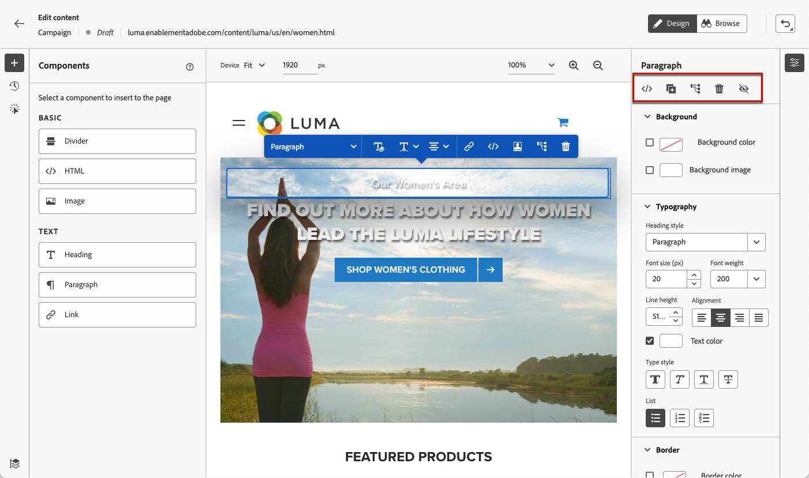
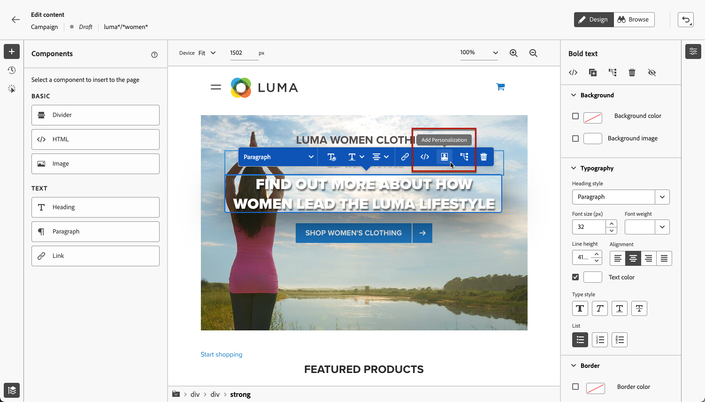
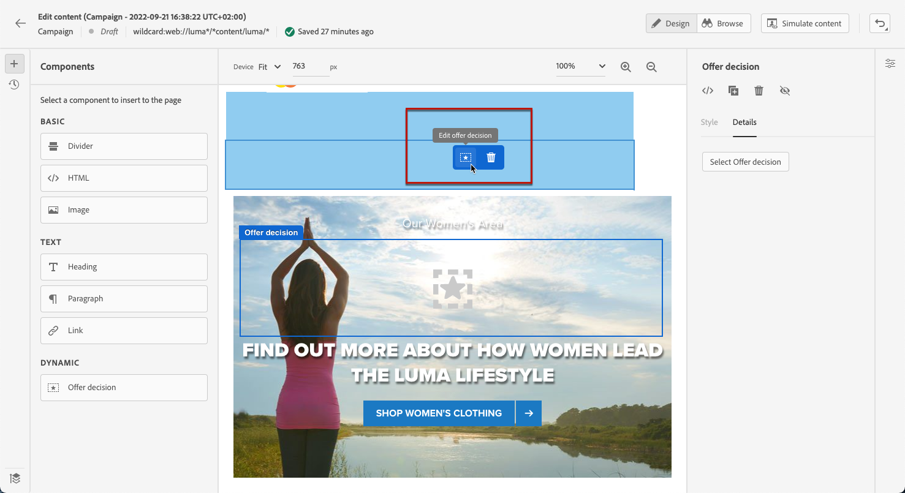

# 웹 콘텐츠 편집 {#edit-web-content}

한 번 [웹 액션 추가됨](create-web.md#create-web-campaign) 웹 디자이너를 사용하여 캠페인에 대한 사이트의 콘텐츠를 편집할 수 있습니다.

[이 비디오에서는 웹 캠페인을 만드는 방법을 알아봅니다.](#video)

위치 [!DNL Journey Optimizer], 웹 작성은 **Adobe Experience Cloud Visual Helper** chrome 브라우저 확장 프로그램. [자세히 알아보기](web-prerequisites.md#visual-authoring-prerequisites)

>[!CAUTION]
>
>에서 웹 페이지에 액세스하고 웹 페이지를 작성하려면 [!DNL Journey Optimizer] 사용자 인터페이스에서에 나열된 사전 요구 사항을 준수하십시오. [이 섹션](web-prerequisites.md).

다음 섹션에 액세스하여 각 주제에 대해 자세히 알아보십시오.

* [수정 사항 관리](manage-web-modifications.md)

* [웹 캠페인 모니터링](monitor-web-campaigns.md)

## 웹 디자이너를 사용하여 작업 {#work-with-web-designer}

>[!CONTEXTUALHELP]
>id="ajo_web_url_to_edit_surface"
>title="편집할 URL 확인"
>abstract="위에 정의된 웹 표면에 적용되는 콘텐츠 편집에 사용할 특정 웹 페이지의 URL을 확인합니다. Adobe Experience Platform Web SDK를 사용하여 웹 페이지를 구현해야 합니다."
>additional-url="https://experienceleague.adobe.com/docs/platform-learn/implement-web-sdk/overview.html?lang=ko-KR" text="추가 정보"

>[!CONTEXTUALHELP]
>id="ajo_web_url_to_edit_rule"
>title="편집할 URL 입력"
>abstract="규칙과 일치하는 모든 페이지에 적용되는 콘텐츠 편집에 사용할 특정 웹 페이지의 URL을 입력합니다. Adobe Experience Platform Web SDK를 사용하여 웹 페이지를 구현해야 합니다."
>additional-url="https://experienceleague.adobe.com/docs/platform-learn/implement-web-sdk/overview.html?lang=ko-KR" text="추가 정보"

웹 캠페인 작성을 시작하려면 아래 단계를 따르십시오.

1. 다음에서 **[!UICONTROL 작업]** 의 탭 [campaign](create-web.md#create-web-campaign), 선택 **[!UICONTROL 콘텐츠 편집]**.<!--change screen with rule-->

   

1. 페이지 일치 규칙을 만든 경우 이 규칙과 일치하는 URL을 입력해야 합니다. 변경 사항은 규칙과 일치하는 모든 페이지에 적용됩니다. 페이지의 콘텐츠가 표시됩니다.

   >[!NOTE]
   >
   >단일 URL을 웹 표면으로 입력한 경우 개인화할 URL이 이미 채워져 있습니다.

   

   >[!CAUTION]
   >
   >웹 페이지에는 다음을 포함해야 합니다. [Adobe Experience Platform 웹 SDK](https://experienceleague.adobe.com/docs/platform-learn/implement-web-sdk/overview.html?lang=ko-KR){target="_blank"}. [자세히 알아보기](web-prerequisites.md#implementation-prerequisites)

1. 클릭 **[!UICONTROL 웹 페이지 편집]** 작성을 시작합니다. 웹 디자이너가 표시됩니다.

   

   >[!NOTE]
   >
   >로드에 실패한 웹 사이트를 로드하려고 하면 다음을 설치하라는 메시지가 표시됩니다. [Visual Editing Helper 브라우저 확장 기능](#install-visual-editing-helper). 에서 문제 해결을 위한 몇 가지 팁을 참조하십시오. [이 섹션](web-prerequisites.md#troubleshooting).

1. 캔버스에서 이미지, 단추, 단락, 텍스트, 컨테이너, 머리글, 링크 등과 같은 요소를 선택합니다. [자세히 알아보기](#content-components)

1. 사용:

   * 컨텍스트 메뉴 를 사용하여 콘텐츠, 레이아웃, 링크 또는 개인화 등을 편집할 수 있습니다.

     

   * 오른쪽 패널 상단에 있는 아이콘으로 각 요소를 편집, 복제, 삭제 또는 숨길 수 있습니다.

     

   * 선택한 요소에 따라 동적으로 변경되는 오른쪽 패널. 예를 들어 요소의 배경, 타이포그래피, 테두리, 크기, 위치, 간격, 효과 또는 인라인 스타일을 편집할 수 있습니다.

     

>[!NOTE]
>
>웹 콘텐츠 디자이너는 대부분 이메일 디자이너와 유사합니다. 자세히 알아보기 [콘텐츠 디자인 [!DNL Journey Optimizer]](../email/get-started-email-design.md).

## 구성 요소 사용 {#content-components}

>[!CONTEXTUALHELP]
>id="ajo_web_designer_components"
>title="웹 페이지에 구성 요소 추가"
>abstract="여러 구성 요소를 웹 페이지에 추가하고 필요에 따라 편집할 수 있습니다."

1. 다음에서 **[!UICONTROL 구성 요소]** 왼쪽의 창에서 항목을 선택합니다. 웹 페이지에 다음 구성 요소를 추가하고 필요에 따라 편집할 수 있습니다.

   * [구분선](../email/content-components.md#divider)
   * [HTML](../email/content-components.md#HTML)
   * [이미지](../email/content-components.md#image)
   * 제목 - 이 구성 요소를 사용하는 것은 다음을 사용하는 것과 비슷합니다. **[!UICONTROL 텍스트]** 이메일 디자이너의 구성 요소입니다. [자세히 알아보기](../email/content-components.md#text)
   * 단락 - 이 구성 요소를 사용하는 것은 다음을 사용하는 것과 비슷합니다. **[!UICONTROL 텍스트]** 이메일 디자이너의 구성 요소입니다. [자세히 알아보기](../email/content-components.md#text)
   * 링크
   * [오퍼 결정](../email/add-offers-email.md)

   

1. 페이지를 마우스로 가리키고 **[!UICONTROL 다음 항목 앞에 삽입]** 또는 **[!UICONTROL 다음 항목 뒤에 삽입]** 단추를 클릭하여 구성 요소를 페이지의 기존 요소에 추가합니다.

   

   >[!NOTE]
   >
   >구성 요소 선택을 취소하려면 **[!UICONTROL ESC]** 캔버스 맨 위에 표시되는 파란색 상황에 맞는 배너의 단추입니다.

1. 페이지 콘텐츠에서 필요에 따라 구성 요소를 바로 편집합니다.

   

1. 배경, 텍스트 색상, 테두리, 크기, 위치 등과 같이 오른쪽에 있는 상황별 창에서 표시되는 스타일을 조정합니다. - 선택한 구성 요소에 따라 다릅니다.

   

## 개인화 및 오퍼 추가

개인화를 추가하려면 컨테이너를 선택하고 표시되는 상황별 메뉴 모음에서 개인화 아이콘을 선택합니다. 표현식 편집기를 사용하여 변경 사항을 추가합니다. [자세히 알아보기](../personalization/personalization-build-expressions.md)

사용 **[!UICONTROL 오퍼 결정]** 삽입할 구성 요소 [오퍼](../offers/get-started/starting-offer-decisioning.md) 을 클릭하여 웹 페이지에 추가합니다. 프로세스는 다음과 동일합니다 [이메일에 오퍼 추가](../email/add-offers-email.md). 의사 결정 관리를 활용하여 고객에게 제공할 최상의 오퍼를 선택합니다.

## 웹 디자이너 탐색 {#navigate-web-designer}

이 섹션에서는 웹 디자이너를 탐색할 수 있는 다양한 방법에 대해 자세히 설명합니다. 웹 경험에 추가된 수정 사항을 보고 관리하려면 다음을 참조하십시오. [이 섹션](manage-web-modifications.md).

### 탐색 표시 사용 {#breadcrumbs}

1. 캔버스에서 요소를 선택합니다.

1. 다음을 클릭합니다. **[!UICONTROL 탐색 표시 확장/축소]** 선택한 요소에 대한 정보를 빠르게 표시하려면 화면 왼쪽 하단의 단추를 클릭합니다.

   

1. 이동 경로를 마우스로 가리키면 편집기에서 해당 요소가 강조 표시됩니다.

1. 이를 사용하여 시각적 편집기 내에서 상위 요소, 동위 요소 또는 하위 요소로 쉽게 이동할 수 있습니다.

### 찾아보기 모드로 전환 {#browse-mode}

>[!CONTEXTUALHELP]
>id="ajo_web_designer_browse"
>title="찾아보기 모드 사용"
>abstract="이 모드의 선택한 표면에서 개인화하려는 정확한 페이지로 이동할 수 있습니다."

기본값에서 바꿀 수 있습니다. **[!UICONTROL 디자인]** 모드: **[!UICONTROL 찾아보기]** 전용 버튼을 사용하는 모드입니다.

다음에서 **[!UICONTROL 찾아보기]** 모드에서는 개인화할 선택한 서피스에서 정확한 페이지로 이동할 수 있습니다.

이 메서드는 인증이 지연되거나 특정 URL에서 처음부터 사용할 수 없는 페이지를 처리할 때 특히 유용합니다. 예를 들어 을 인증하고 계정 페이지 또는 장바구니 페이지로 이동한 다음 다시 로 전환할 수 있습니다. **[!UICONTROL 디자인]** 을 클릭하여 원하는 페이지에서 변경 작업을 수행합니다.

사용 **[!UICONTROL 찾아보기]** 또한 모드에서는 단일 페이지 애플리케이션을 작성할 때 웹 사이트의 모든 보기를 탐색할 수 있습니다. [자세히 알아보기](web-spa.md)

### 장치 크기 변경 {#change-device-size}

웹 디자이너 디스플레이의 장치 크기를 다음과 같이 미리 정의된 크기로 변경할 수 있습니다. **[!UICONTROL 태블릿]** 또는 **[!UICONTROL 모바일 환경]**&#x200B;또는 원하는 픽셀 수를 입력하여 사용자 지정 크기를 정의합니다.

확대/축소 포커스를 25%에서 400%로 변경할 수도 있습니다.

장치 크기를 변경하는 기능은 다양한 장치, 창 및 화면 크기에서 잘 렌더링되는 반응형 사이트를 위해 설계되었습니다. 반응형 사이트는 데스크탑, 노트북, 태블릿 또는 휴대폰을 포함하여 모든 화면 크기를 자동으로 조정하고 적응합니다.

>[!CAUTION]
>
>특정 장치 크기로 웹 경험을 편집할 수 있습니다. 그러나 선택기가 동일한 한 이러한 변경 사항은 작업 중인 장치 크기뿐만 아니라 모든 크기와 장치에 적용됩니다. 마찬가지로, 일반 데스크탑 보기에서 경험을 편집하면 데스크탑 보기뿐만 아니라 모든 화면 크기에 변경 사항이 적용됩니다.
>
>현재, [!DNL Journey Optimizer] 은 장치 크기별 페이지 변경을 지원하지 않습니다. 즉, 별도의 사이트 구조를 사용하는 별도의 모바일 웹 사이트가 있는 경우 다른 캠페인에서 모바일 사이트별로 변경해야 합니다.

## 방법 비디오{#video}

아래 비디오는에서 웹 디자이너를 사용하여 웹 경험을 작성하는 방법을 보여 줍니다 [!DNL Journey Optimizer] 캠페인.

>[!VIDEO](https://video.tv.adobe.com/v/3418803/?quality=12&learn=on)