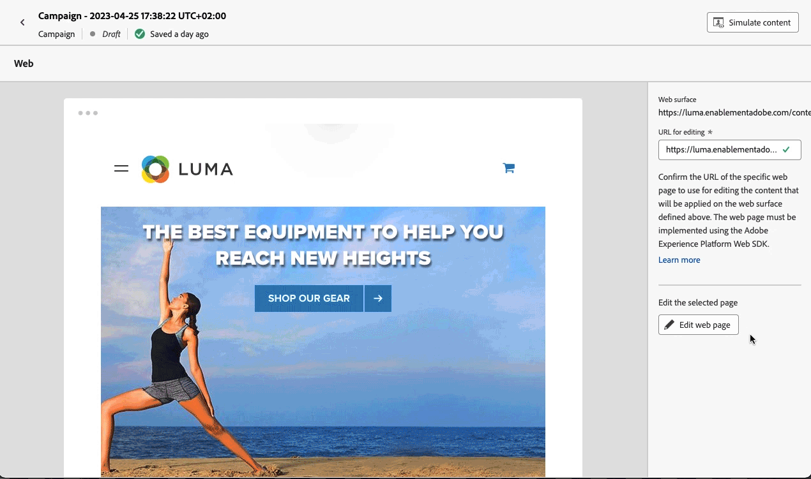

# 웹 채널 시작하기 {#get-sarted-web}

[!DNL Journey Optimizer]에서는 개인화된 웹 경험을 시각적으로 작성하여 고객에게 제공할 수 있습니다.

이 기능을 사용하면 직관적인 시각적 인터페이스에서 웹 속성을 간단히 수정하여 최종 사용자 캠페인을 실험하고 최적화하고 개인화할 수 있습니다.

이메일이나 SMS 또는 푸시 알림 등 아웃바운드 채널을 이미 사용하고 있다면, 이제 인바운드 웹 채널을 활용하여 어떤 채널에서나 제대로 개인화된 경험을 제공할 수 있습니다.

캠페인을 만든 후 작업으로 **웹**&#x200B;을 선택하고 기본 설정을 정의합니다. 캠페인을 구성하는 자세한 방법은 이 [페이지](../campaigns/create-campaign.md#configure)를 참조하십시오.

>[!NOTE]
>
>웹 경험을 처음 만드는 경우에는 [이 섹션](web-prerequisites.md)에서 설명하는 전제 조건을 충족해야 한다는 점에 유의하십시오.

웹 캠페인을 만드는 자세한 단계는 [이 비디오](create-web.md#video)를 참조하십시오.

<table style="table-layout:fixed"><tr style="border: 0;">
<td>

<a href="web-prerequisites.md"><strong>전제 조건</strong>

</td>
<td>

<a href="create-web.md"><strong>웹 경험 만들기</strong></a>

</td>
<td>

<a href="edit-web-content.md"><strong>웹 페이지 작성 </strong></a>

</td>
<td>

<a href="monitor-web-experiences.md"><strong>보고</strong></a>

</td>
</tr></table>

