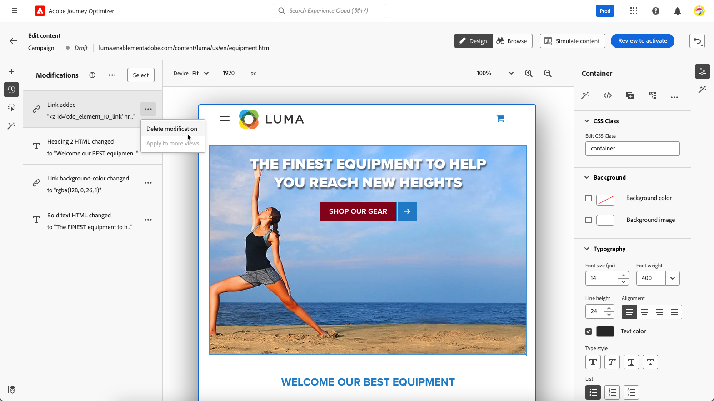

# 웹 수정 사항 관리 {#manage-web-modifications}

>[!CONTEXTUALHELP]
>id="ajo_web_designer_modifications"
>title="손쉽게 모든 변경 내용 관리"
>abstract="이 창을 사용하여 웹 페이지에 추가된 모든 조정 내용 및 스타일을 탐색하고 관리할 수 있습니다."

웹 페이지에 추가한 모든 구성 요소, 조정 및 스타일을 쉽게 관리할 수 있습니다. 전용 창에서 직접 수정 사항을 추가할 수도 있습니다.

## 수정 사항 창 작업 {#use-modifications-pane}

1. 다음 항목 선택 **[!UICONTROL 수정 사항]** 아이콘을 클릭하면 해당 창이 왼쪽에 표시됩니다.

   

1. 페이지에 수행한 각 변경 사항을 검토할 수 있습니다.

1. 원하지 않는 수정 사항을 선택하고 **[!UICONTROL 수정 사항 삭제]** 옵션에서 **[!UICONTROL 추가 작업]** 단추를 클릭하여 제거합니다.

   

   >[!CAUTION]
   >
   >후속 작업에 영향을 미칠 수 있으므로 작업을 삭제할 때 주의하여 진행하십시오.

1. 여러 수정 사항을 동시에 삭제하려면 **[!UICONTROL 선택]** 단추(위) **[!UICONTROL 수정 사항]** 창에서 선택 사항의 수정 사항을 확인하고 **[!UICONTROL 삭제]** 아이콘.

   

1. 사용 **[!UICONTROL 추가 작업]** 단추(위) **[!UICONTROL 수정 사항]** 모든 수정 사항을 한 번에 삭제할 수 있는 창입니다.

   

1. 잘못된 수정 사항만 삭제할 수도 있습니다. 즉, 다른 변경 사항으로 인해 재정의된 변경 사항만 삭제할 수 있습니다. 예를 들어, 텍스트 색상을 수정한 다음 해당 텍스트를 삭제하면 텍스트가 더 이상 존재하지 않으므로 색상 수정이 유효하지 않게 됩니다.

1. 다음을 사용하여 작업을 취소하거나 재실행할 수 있습니다. **[!UICONTROL 실행 취소/다시 실행]** 화면 오른쪽 상단의 단추.

   

   단추를 길게 클릭하여 **[!UICONTROL 실행 취소]** 및 **[!UICONTROL 다시 실행]** 옵션. 그런 다음 버튼 자체를 클릭하여 원하는 작업을 적용합니다.

## 전용 창에서 수정 사항 추가 {#add-modifications}

웹 디자이너를 사용하여 페이지를 편집할 때 **[!UICONTROL 수정 사항]** 창 - 구성 요소를 선택하고 웹 디자이너 인터페이스에서 편집할 필요가 없습니다. 아래 단계를 수행합니다.

1. 다음에서 **[!UICONTROL 수정 사항]** 창에서 **[!UICONTROL 추가 작업]** 단추를 클릭합니다.

1. 선택 **[!UICONTROL 수정 사항 추가]**.

   

1. 수정 유형을 선택합니다.

   * **[!UICONTROL CSS 선택기]** - [자세히 알아보기](#css-selector)
   * **[!UICONTROL 페이지`<Head>`]** - [자세히 알아보기](#page-head)

1. 콘텐츠 입력 및 **[!UICONTROL 저장]** 변경 사항.

1. 다음을 클릭합니다. **[!UICONTROL 추가 작업]** 수정 사항 옆에 있는 버튼을 클릭하고 **[!UICONTROL 정보]** 세부 정보를 표시합니다.

   

### CSS 선택기 {#css-selector}

을(를) 추가하려면 **CSS 선택기** 수정 사항을 입력하고 아래 단계를 수행합니다.

1. 선택 **[!UICONTROL CSS 선택기]** 을(를) 수정 유형으로 사용하십시오.

1. 다음 **[!UICONTROL CSS 요소 선택기]** 필드에서는 변경 사항을 적용할 HTML 요소(또는 DOM 트리의 노드)를 찾아 선택할 수 있습니다. <!--specify the desired CSS element that you want to modify.-->

   

1. 작업 유형 선택(**[!UICONTROL 콘텐츠 설정]** 또는 **[!UICONTROL 속성 설정]**) 필요한 정보/컨텐츠를 입력합니다.

   * **[!UICONTROL 콘텐츠 설정]**: 로 식별되는 요소에 들어가는 콘텐츠를 지정합니다. **[!UICONTROL CSS 요소 선택기]** 필드.

   * **[!UICONTROL 속성 설정]**: 이 선택기를 이 속성으로도 식별할 수 있도록 현재 CSS 선택기와 연결할 속성을 지정합니다. 이렇게 하려면 **[!UICONTROL 속성 이름]** 필드 및 값 **[!UICONTROL 콘텐츠]** 필드. 속성이 이미 있으면 값이 업데이트되고, 그렇지 않으면 지정된 이름과 값으로 새 속성이 추가됩니다.

     

### 페이지 `<head>` {#page-head}

>[!CONTEXTUALHELP]
>id="ajo_web_designer_head"
>title="사용자 정의 코드 추가"
>abstract="HEAD 요소는 메타데이터 컨테이너이며 HTML 태그와 BODY 태그 사이에 배치됩니다. SCRIPT 및 STYLE 요소만 추가하십시오. DIV 태그 및 기타 요소를 추가하면 나머지 HEAD 요소가 BODY에 들어갈 수 있습니다."

다음을 사용하여 사용자 지정 코드를 추가할 수 있습니다. **[!UICONTROL 페이지`<head>`]** 수정 유형.

다음 `<head>` 요소는 메타데이터(데이터에 대한 데이터)의 컨테이너이며 `<html>` 태그 및 `<body>` 태그에 가깝게 배치하십시오. 이 경우 코드는 본문 또는 페이지 로드 이벤트를 기다리지 않고 페이지 로드 시작 시 실행됩니다.

다음 `<head>` 요소는 일반적으로 페이지의 맨 위에 JavaScript 또는 CSS 코드를 추가하는 데 사용됩니다. 이어지는 시각적 작업을 위한 선택기는 이 탭에 추가된 HTML 요소에 따라 다릅니다.

을(를) 추가하려면 **페이지`<head>`** 수정 사항을 입력하고 아래 단계를 수행합니다.

1. 선택 **[!UICONTROL 페이지`<head>`]** 을(를) 수정 유형으로 사용하십시오.

   

1. 에 사용자 지정 코드를 추가합니다. **[!UICONTROL 콘텐츠]** 상자.

   >[!CAUTION]
   >
   >만 추가할 수 있습니다. `<script>` 및 `<style>` 요소를 로 `<head>` 섹션. `<div>` 태그 및 기타 요소를 추가하면 나머지 `<head>` 요소가 `<body>`에 들어갈 수 있습니다. 

1. 다음을 클릭합니다. **[!UICONTROL 고급 편집 옵션]** 단추를 클릭합니다. 표현식 편집기가 열립니다.

   

   다음을 활용할 수 있습니다. [!DNL Journey Optimizer] 모든 개인화 및 작성 기능이 있는 표현식 편집기. [자세히 알아보기](../personalization/personalization-build-expressions.md)

#### 사용자 지정 코드 예 {#custom-code-examples}

다음을 사용할 수 있습니다. **[!UICONTROL 페이지`<head>`]** 수정 유형:

* JavaScript 인라인 또는 외부 JavaScript 파일에 대한 링크를 사용합니다.

  예를 들어 요소의 색상을 변경하려면 다음과 같이 하십시오.

  ```
  <script type="text/javascript">
  document.getElementById("element_id").style.color = "blue";
  </script>
  ```

* 외부 스타일시트에 대한 스타일 인라인 또는 링크를 구성합니다.

  예를 들어 오버레이 요소의 클래스를 정의하려면

  ```
  <style>
  .overlay
  { position: absolute; top:0; left: 0; right: 0; bottom: 0; background: red; }
  </style>
  ```

#### 사용자 지정 코드 우수 사례 {#custom-code-best-practices}

+++ **항상 하나의 요소에 사용자 지정 코드를 래핑합니다.**

예:

```
<script>
// Code goes here
</script>
```

수정이 필요한 경우 이 컨테이너 내에서 변경합니다.

사용자 지정 코드가 더 이상 필요하지 않은 경우 이 컨테이너를 비워 두되 제거하지 마십시오. 이렇게 하면 다른 경험 수정 사항에는 영향을 주지 않습니다.

+++

+++ **사용자 지정 코드 스크립트에서 document.write 작업을 수행하지 마십시오.**

스크립트는 비동기적으로 실행됩니다. 이로 인해 document.write 작업이 종종 페이지의 잘못된 위치에 나타납니다. 사용자 지정 코드에서 생성된 스크립트에는 document.write를 사용하지 않는 것이 좋습니다.

+++

+++ **요소를 만든 다음 수정하는 경우 원래 요소를 삭제하지 마십시오.**

각 변경 사항은에 새 요소를 만듭니다. **[!UICONTROL 수정 사항]** 패널. 두 번째 작업은 요소 1을 수정하므로, 요소 1을 삭제하면 해당 작업에는 더 이상 수정할 사항이 없게 되며, 따라서 변경이 더 이상 작동하지 않습니다.

+++

+++ **사용할 때 주의하십시오.**[!UICONTROL &#x200B;페이지 `<head>`]**동일한 URL에 영향을 주는 두 캠페인에 대한 수정 유형.**

를 사용하는 경우 **[!UICONTROL 페이지`<head>`]** 수정 유형 동일한 URL에 영향을 주는 두 캠페인에 대해 JavaScript는 두 캠페인의 페이지에 삽입됩니다. [!DNL Journey Optimizer] 게재된 콘텐츠의 순서를 자동으로 결정합니다. 코드가 배치에 따라 달라지지 않는지 확인하십시오. 코드에 충돌이 없는지 확인하는 것은 귀하의 책임입니다.

+++
