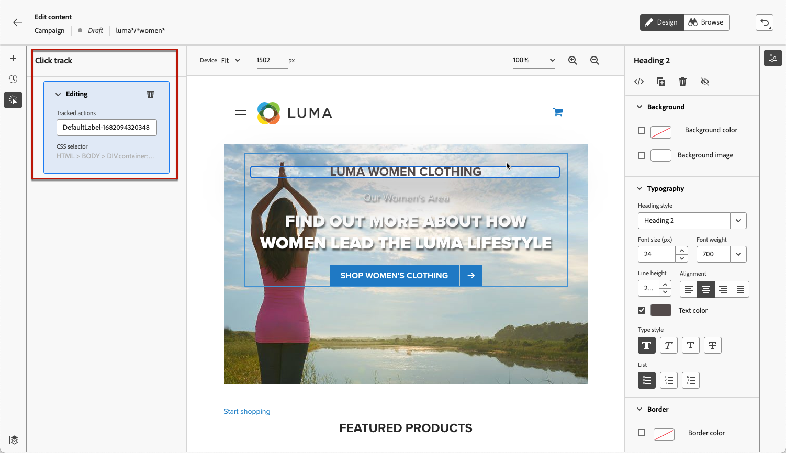

# 웹 캠페인 모니터링 {#monitor-web-experiences}

## 웹 보고서 확인 {#check-web-reports}

웹 여정이 라이브되면 [캠페인 보고서](../reports/journey-global-report-cja.md#web-cja) 및 [캠페인 보고서](../reports/campaign-global-report-cja.md#web)의 **[!UICONTROL 웹]** 탭을 확인하여 노출 횟수, 클릭률 및 웹 페이지와의 참여 수와 같은 요소를 비교할 수 있습니다.

<!--You can check the **[!UICONTROL Web]** tab of the campaign reports. Learn more on the campaign web [live report](../reports/campaign-live-report.md#web-tab) and [global report](../reports/campaign-global-report.md#web-tab).-->

웹 경험 모니터링을 더욱 개선하기 위해 웹 사이트의 특정 요소에 대한 클릭 수를 추적할 수도 있습니다. 이렇게 하면 웹 보고서에서 해당 요소의 클릭 수를 표시할 수 있습니다. [방법 알아보기](#use-click-tracing)

## 클릭 추적 사용 {#use-click-tracing}

웹 디자이너를 사용하면 웹 사이트의 요소를 선택하고 해당 요소에 대한 클릭 수를 추적할 수 있습니다.

이 정보는 웹 사이트 사용자의 경험을 개선하는 데 유용할 수 있습니다. 예를 들어, [웹 보고서](../reports/campaign-global-report.md#web-tab)에서 많은 사용자가 실제로 클릭할 수 없는 요소를 클릭하는 것으로 표시되면 해당 요소에 링크를 추가할 수 있습니다.

1. 페이지에서 요소를 선택하고 상황별 메뉴에서 **[!UICONTROL 추적 요소 클릭]**&#x200B;을 선택합니다.

   

   >[!NOTE]
   >
   >클릭 가능한 모든 항목을 선택할 수 있습니다.

1. 해당하는 추적 작업이 왼쪽의 **[!UICONTROL 트랙 클릭]** 창에 자동으로 표시됩니다.

   

1. 추적된 모든 요소를 관리하고 보고서에서 쉽게 찾을 수 있도록 의미 있는 레이블을 추가합니다. **[!UICONTROL CSS 선택기]** 필드에 선택한 요소를 찾는 정보가 표시됩니다.

1. 위의 단계를 반복하여 클릭 추적에 필요한 만큼 다른 요소를 선택합니다. 왼쪽 창에 해당 작업이 모두 나열됩니다.

   

1. 요소에 대한 클릭 추적을 제거하려면 해당 삭제 아이콘을 선택합니다.

캠페인이 라이브되면 캠페인 웹 [라이브 보고서](../reports/campaign-live-report.md#web-tab) 및 [글로벌 보고서](../reports/campaign-global-report.md#web-tab)에서 각 요소의 클릭 횟수를 확인할 수 있습니다.
