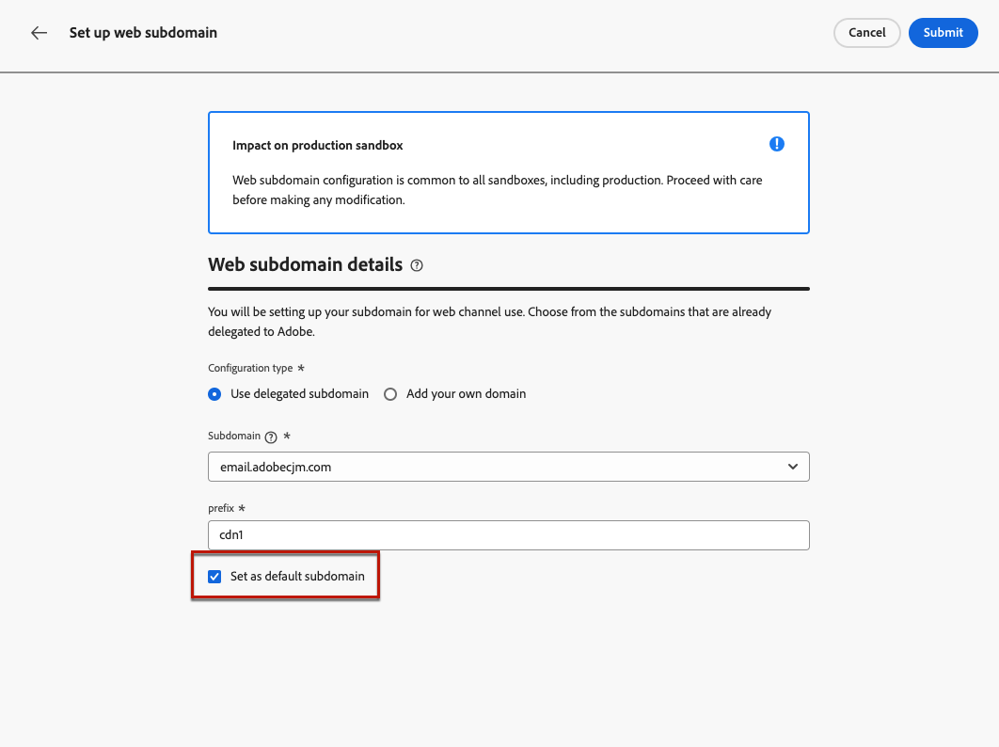

# 웹 하위 도메인 구성 {#web-subdomains}

>[!CONTEXTUALHELP]
>id="ajo_admin_subdomain_web_header"
>title="웹 하위 도메인 위임"
>abstract="웹 채널을 사용하려면 하위 도메인을 설정합니다. Adobe에 이미 위임된 하위 도메인에서 선택합니다."

>[!CONTEXTUALHELP]
>id="ajo_admin_subdomain_web"
>title="웹 하위 도메인 위임"
>abstract="Adobe Experience Manager Assets Essentials의 콘텐츠를 웹 경험에 추가하는 경우 이 콘텐츠를 게시하는 데 사용할 하위 도메인을 설정해야 합니다. Adobe에 이미 위임된 하위 도메인 중에서 선택합니다."

>[!CONTEXTUALHELP]
>id="ajo_admin_subdomain_web_default"
>title="웹 하위 도메인 설정"
>abstract="Adobe에 위임된 하위 도메인 목록에서 하위 도메인을 선택합니다. 이 웹 하위 도메인을 기본 하위 도메인으로 설정할 수 있지만 기본 하위 도메인은 한 번에 하나만 사용할 수 있습니다."

웹 경험을 작성할 때에서 오는 콘텐츠를 추가하는 경우 [Adobe Experience Manager Assets Essentials](../email/assets-essentials.md) 라이브러리에서는 이 콘텐츠를 게시하는 데 사용할 하위 도메인을 설정해야 합니다.

이렇게 하려면 이미 Adobe에게 위임된 하위 도메인 목록에서 선택해야 합니다. 에서 Adobe에 하위 도메인 위임에 대해 자세히 알아보기 [이 섹션](../configuration/delegate-subdomain.md).

>[!CAUTION]
>
>웹 하위 도메인 구성은 모든 환경에 공통됩니다. 그 결과는 다음과 같습니다.
>
>* 웹 하위 도메인에 액세스하고 편집하려면 **[!UICONTROL 웹 하위 도메인 관리]** 프로덕션 샌드박스에 대한 권한.
>
> * 웹 하위 도메인을 수정하면 프로덕션 샌드박스에도 영향을 줍니다.

여러 웹 하위 도메인을 만들 수 있지만 **기본값** 하위 도메인이 사용됩니다. 기본 웹 하위 도메인을 변경할 수 있지만 한 번에 하나만 사용할 수 있습니다.

1. 액세스 **[!UICONTROL 관리]** > **[!UICONTROL 채널]** 메뉴, 선택 **[!UICONTROL 웹 구성]** > **[!UICONTROL 웹 하위 도메인]**.

   

1. 클릭 **[!UICONTROL 하위 도메인 설정]**.

1. 목록에서 위임된 하위 도메인을 선택합니다.

   

   >[!NOTE]
   >
   >이미 웹 하위 도메인으로 사용되고 있는 하위 도메인은 선택할 수 없습니다.

1. 웹 URL에 표시될 접두사가 자동으로 추가됩니다. 변경할 수 없습니다.

1. 이 하위 도메인을 기본값으로 설정하려면 해당 옵션을 선택합니다.

   

   >[!NOTE]
   >
   >만 **기본값** 하위 도메인이 사용됩니다.

1. **[!UICONTROL 제출을 클릭합니다]**. 하위 도메인은 **[!UICONTROL 성공]** 상태. 웹 경험에 사용할 준비가 되었습니다.

   >[!NOTE]
   >
   >매우 드문 경우이지만 하위 도메인 설정이 실패할 수 있습니다. 이 경우 **[!UICONTROL 실패]** 하위 도메인: **[!UICONTROL 삭제]** 단추 **[!UICONTROL 추가 작업]** 아이콘.

1. 다음 **[!UICONTROL 기본값]** 배지는 현재 기본값으로 사용되는 하위 도메인 옆에 표시됩니다. 기본 하위 도메인을 변경하려면 **[!UICONTROL 기본값으로 설정]** 다음에서 **[!UICONTROL 추가 작업]** 원하는 하위 도메인 옆에 있는 단추.

   

   >[!NOTE]
   >
   >기본 웹 하위 도메인을 변경할 수 있지만 한 번에 하나만 사용할 수 있습니다.

   <!--Only a subdomain with the **[!UICONTROL Success]** status can be set as default.

    You cannot delete a subdomain with the **[!UICONTROL Processing]** status.-->
