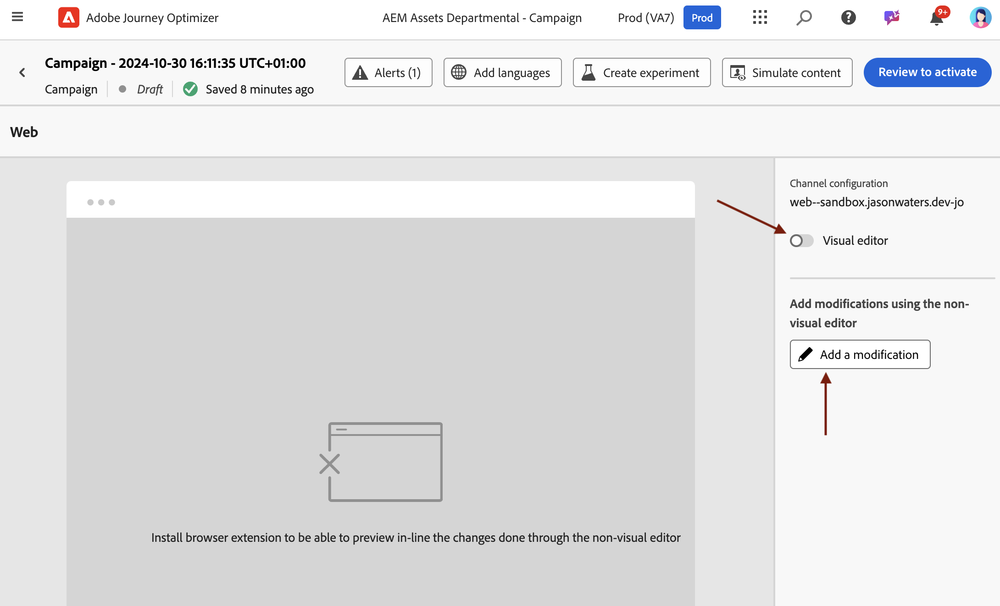

# 시각적이지 않은 웹 편집기 사용 {#web-non-visual-editor}

[!DNL Journey Optimizer] 비주얼 [웹 디자이너](web-visual-editor.md) 외에도 **비비주얼 편집기**&#x200B;를 사용하여 웹 페이지에 수정 사항을 추가할 수도 있습니다.

이 기능은 웹 디자이너에서 페이지를 로드하는 데 필요한 [Adobe Experience Cloud Visual Helper](web-prerequisites.md#visual-authoring-prerequisites)와 같은 브라우저 확장 기능을 설치할 수 없거나 설치할 수 없는 경우에 유용합니다.

경우에 따라, 웹 페이지의 다른 요소를 수정하거나 페이지 구조를 변경하지 않고도 시각적이지 않은 편집기를 사용하여 특정 CSS 선택기에 수정 사항을 적용하는 것이 더 쉬울 수 있습니다.

시각적이지 않은 편집기로 웹 경험을 작성하려면 아래 단계를 따르십시오.

1. 여정 또는 캠페인의 **[!UICONTROL 콘텐츠 편집]** 화면에서 **[!UICONTROL 시각적 편집기]** 옵션을 선택 취소합니다.

1. 웹 콘텐츠 편집을 시작하려면 **[!UICONTROL 수정 사항 추가]**&#x200B;를 클릭하세요.

   

1. 비시각적 편집기가 표시됩니다. 왼쪽 창을 사용하여 첫 번째 수정 사항을 추가할 수 있습니다.

   

1. 수정 유형을 선택합니다.

   * **[!UICONTROL CSS 선택기]** - [자세히 알아보기](manage-web-modifications.md#css-selector)
   * **[!UICONTROL 페이지`<Head>`]** - [자세히 알아보기](manage-web-modifications.md#page-head)

1. **[!UICONTROL 고급 편집 옵션]** 단추를 클릭합니다. 개인화 편집기가 열립니다.

   [!DNL Journey Optimizer] 개인화 편집기를 모든 개인화 및 작성 기능과 함께 활용할 수 있습니다. [자세히 알아보기](../personalization/personalization-build-expressions.md)

1. 콘텐츠를 입력하고 변경 내용을 **[!UICONTROL 저장]**&#x200B;합니다.

   

1. 첫 번째 수정 사항이 **[!UICONTROL 수정 사항]** 창 위에 표시됩니다.

   수정 내용 옆에 있는 **[!UICONTROL 추가 작업]** 단추를 클릭하고 **[!UICONTROL 정보]**&#x200B;를 선택하여 세부 정보를 표시합니다. 수정 사항을 **[!UICONTROL 편집]**&#x200B;하거나 **[!UICONTROL 삭제]**&#x200B;할 수도 있습니다.

   

   >[!NOTE]
   >
   >**[!UICONTROL 수정 사항]** 창은 [웹 디자이너](web-visual-editor.md)을 사용할 때와 동일합니다. 수행할 수 있는 모든 작업은 [이 섹션](manage-web-modifications.md#use-modifications-pane)에 자세히 설명되어 있습니다.

1. **[!UICONTROL 수정 사항 추가]**&#x200B;에 대한 **[!UICONTROL 수정 사항]** 창 상단의 **[!UICONTROL 추가 작업]** 단추를 클릭하고 위의 단계를 반복합니다. [자세히 알아보기](manage-web-modifications.md#add-modifications)

   

1. 화면 왼쪽 위의 화살표를 선택하여 여정 또는 캠페인 버전 화면으로 돌아갑니다. 현재 변경 사항 수를 보고 더 많은 수정 사항을 추가할 수 있습니다.

   

   원하는 경우 웹 디자이너로 전환할 수도 있습니다. 수정 사항이 모두 유지됩니다.

1. 클릭 추적을 활성화하고 아래와 같이 왼쪽 레일의 두 번째 아이콘에서 추적할 작업을 정의할 수 있습니다.

   

   추적할 새 작업을 선택하려면 **구성 요소 추가** 단추를 클릭하십시오.
