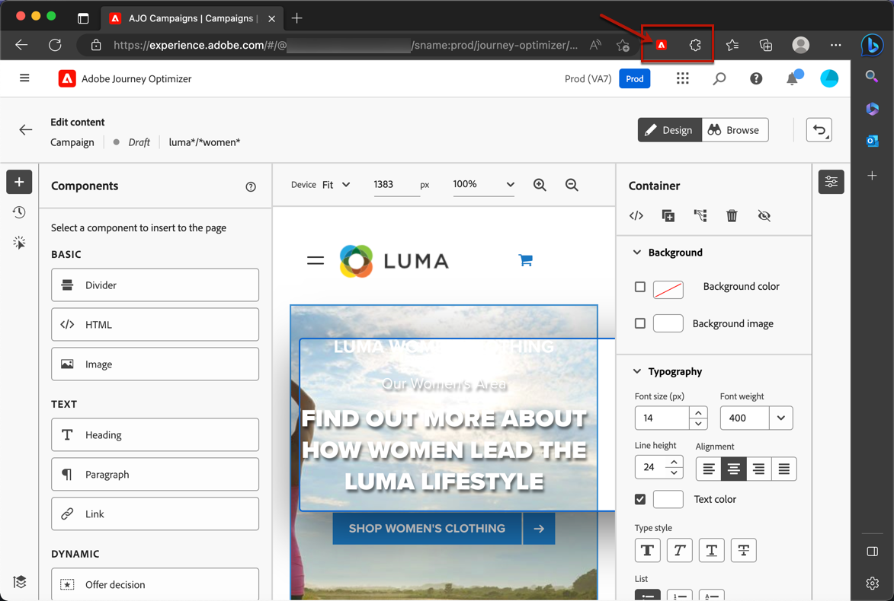

# 웹 채널 사전 요구 사항 {#web-prerequisites}

에서 웹 페이지에 액세스하여 작성할 수 있도록 하려면 [!DNL Journey Optimizer] 사용자 인터페이스에서 아래 전제 조건을 따르십시오.

* 웹 사이트에 수정 사항을 추가하려면 특정 구현이 있어야 합니다. [자세히 알아보기](#implementation-prerequisites)

* 에 액세스하려면 [!DNL Journey Optimizer] 웹 디자이너는 특정 Google Chrome 브라우저 확장 프로그램이 설치되어 있어야 합니다. [자세히 알아보기](#visual-authoring-prerequesites)

* 웹 경험이 올바르게 전달되도록 하려면 Adobe Experience Platform 설정을 자세히 정의해야 합니다 [여기](#delivery-prerequisites).

## 구현 사전 요구 사항 {#implementation-prerequisites}

현재 웹 속성에서 웹 채널 캠페인을 작성 및 전달할 수 있도록 두 가지 유형의 구현이 지원됩니다.

* 클라이언트측 전용 - 웹 사이트에 수정 사항을 추가하려면 [Adobe Experience Platform Web SDK](https://experienceleague.adobe.com/docs/platform-learn/implement-web-sdk/overview.html?lang=ko-KR){target="_blank"} 클릭합니다.

* 하이브리드 모드 - [AEP Edge Network Server API](https://experienceleague.adobe.com/docs/experience-platform/edge-network-server-api/data-collection/interactive-data-collection.html){target="_blank"} to request for personalization server-side; the response is provided to the Adobe Experience Platform Web SDK to render the modifications client-side. Learn more in the Adobe Experience Platform [Edge Network Server API documentation](https://experienceleague.adobe.com/docs/experience-platform/edge-network-server-api/overview.html?lang=ko-KR){target="_blank"}. You can find out more about the hybrid mode and check some implementation samples in [this blog post](https://blog.developer.adobe.com/hybrid-personalization-in-the-adobe-experience-platform-web-sdk-6a1bb674bf41){target="_blank"}.

>[!NOTE]
>
>서버측 전용 구현은 현재 지원되지 않습니다.

<!--If the Adobe Experience Platform Web SDK is not yet implemented on the website, a message displays in the web designer suggesting that you install the Visual Editing Helper browser extension and implement the [Web SDK](https://experienceleague.adobe.com/docs/platform-learn/implement-web-sdk/overview.html){target="_blank"}.-->

## 시각적 작성 사전 요구 사항 {#visual-authoring-prerequisites}

<!--In order to rapidly author and preview your web experiences, the Adobe Experience Cloud Visual Editing Helper browser extension for Google Chrome lets you load websites reliably within the Adobe [!DNL Journey Optimizer] web designer.-->

웹 페이지를 안정적으로 로 열고, 작성 및 미리 볼 수 있도록 [!DNL Journey Optimizer] 웹 디자이너는 [Adobe Experience Cloud Visual Editing Helper](https://chrome.google.com/webstore/detail/adobe-experience-cloud-vi/kgmjjkfjacffaebgpkpcllakjifppnca){target="_blank"} 웹 브라우저에 설치된 브라우저 확장.

>[!CAUTION]
>
>Google Chrome 및 Microsoft Edge는 현재 웹 페이지 작성을 지원하는 유일한 브라우저입니다 [!DNL Journey Optimizer].

### Visual Editing Helper 확장 프로그램 설치 {#install-visual-editing-helper}

Visual Editing Helper 브라우저 확장 프로그램을 다운로드하여 설치하려면 아래 단계를 따르십시오.

1. 브라우저에서 새 탭(Google Chrome 또는 Microsoft Edge)을 엽니다.

1. 로 이동합니다. [Google Chrome 웹 스토어](https://chrome.google.com/webstore/category/extensions){target="_blank"}.

1. Microsoft Edge를 사용하는 경우 **[!UICONTROL 다른 저장소에서 확장 허용]** 위쪽 배너에 있습니다. 이렇게 하면 Chrome 웹 스토어의 확장을 Microsoft Edge에 추가할 수 있습니다.

1. 을(를) 검색하고 로 이동합니다. [Adobe Experience Cloud Visual Editing Helper](https://chrome.google.com/webstore/detail/adobe-experience-cloud-vi/kgmjjkfjacffaebgpkpcllakjifppnca){target="_blank"} 브라우저 확장.

1. **[!UICONTROL Chrome에 추가]** > **[!UICONTROL 확장 기능 추가]**&#x200B;를 클릭합니다.

   >[!NOTE]
   >
   >Microsoft Edge를 사용하는 경우 단추에 레이블이 지정되더라도 확장이 Edge에 추가됩니다 **[!UICONTROL Chrome에 추가]**.

1. Visual Editing Helper 브라우저 확장 프로그램이 브라우저의 도구 모음에서 올바르게 활성화되어 있는지 확인합니다.

   

<!--1. Launch [!DNL Journey Optimizer] in a new tab of your browser with the extension installed.

1. Create a web channel campaign in [!DNL Journey Optimizer]. [Learn how](author-web.md#create-web-campaign)

1. Open the [!DNL Journey Optimizer] web designer to start authoring your web experience. [Learn more](author-web.md)-->

이제 웹 사이트가 [!DNL Journey Optimizer] 웹 디자이너의 강력한 저작 기능

확장에는 조건부 설정이 없으며 SameSite 쿠키 설정을 포함하여 모든 설정을 자동으로 처리합니다.

>[!NOTE]
>
>일부 웹 사이트는 [!DNL Journey Optimizer] 다음 이유 중 하나로 인해 웹 디자이너
>
> * 웹 사이트에 엄격한 보안 정책이 있습니다.
> * 웹 사이트가 iframe으로 되어 있습니다.
> * 고객의 QA 또는 스테이지 사이트는 외부에서 사용할 수 없습니다(사이트는 내부 사이트임).

### 웹 사이트를 로드할 수 없는 문제 해결 {#troubleshooting}

Adobe 사용 시 [!DNL Journey Optimizer] 웹 디자이너에 로드하지 못하는 웹 사이트를 로드하려고 하면 설치 메시지가 표시됩니다 [시각적 편집 도우미 브라우저 확장](#install-visual-editing-helper).

Visual Editing Helper 브라우저 확장 프로그램이 올바르게 설치되었지만 웹 사이트가 로드되지 않거나 예기치 않게 동작하는 경우 브라우저에서 웹 사이트를 열고 쿠키를 수락한 후에 브라우저에서 웹 사이트를 로드해 볼 수 있습니다 [!DNL Journey Optimizer] 웹 디자이너

인증 중인 페이지의 경우, 로그인 페이지가 로드되지 않거나 로그인 시도 후 로그인하지 않은 경우:

* 먼저 새 브라우저 탭에 로그인하고 원하는 페이지로 이동한 다음 URL을 복사하여 [!DNL Journey Optimizer] 웹 디자이너

* 여전히 웹 사이트를 [!DNL Journey Optimizer] 웹 디자이너는 Adobe 고객 지원 센터에 문의하여 실패한 URL을 지정했는지 확인하십시오.

## 게재 사전 요구 사항 {#delivery-prerequisites}

웹 경험을 올바르게 전달하려면 다음 설정을 정의해야 합니다.

* 에서 [Adobe Experience Platform 데이터 수집](https://experienceleague.adobe.com/docs/experience-platform/edge/datastreams/overview.html){target="_blank"}를 설정하는 경우, 아래에 와 같이 정의된 데이터 스트림이 있는지 확인합니다. **[!UICONTROL Adobe Experience Platform]** 두 가지 서비스를 모두 제공합니다. **[!UICONTROL 에지 세그멘테이션]** 및 **[!UICONTROL Adobe Journey Optimizer]** 옵션이 활성화되었습니다.

   이렇게 하면 Adobe Experience Platform Edge에서 Journey Optimizer 인바운드 이벤트를 올바르게 처리할 수 있습니다. [자세히 알아보기](https://experienceleague.adobe.com/docs/experience-platform/edge/datastreams/configure.html?lang=ko-KR){target="_blank"}

   

   >[!NOTE]
   >
   >다음 **[!UICONTROL Adobe Journey Optimizer]** 옵션은 **[!UICONTROL 에지 세그멘테이션]** 옵션이 이미 활성화되어 있습니다.

* in [Adobe Experience Platform](https://experienceleague.adobe.com/docs/experience-platform/profile/home.html?lang=ko){target="_blank"}, make sure you have one merge policy with the **[!UICONTROL Active-On-Edge Merge Policy]** option enabled. To do this, select a policy under the **[!UICONTROL Customer]** > **[!UICONTROL Profiles]** > **[!UICONTROL Merge Policies]** Experience Platform menu. [Learn more](https://experienceleague.adobe.com/docs/experience-platform/profile/merge-policies/ui-guide.html#configure){target="_blank"}

   이 병합 정책은 [!DNL Journey Optimizer] 에지에서 인바운드 캠페인을 올바르게 활성화하고 게시할 수 있는 인바운드 채널입니다. [자세히 알아보기](https://experienceleague.adobe.com/docs/experience-platform/profile/merge-policies/ui-guide.html){target="_blank"}

   

<!--
Branded domains for assets

When authoring web experiences, if you add content coming from the [Adobe Experience Manager Assets Essentials](../email/assets-essentials.md) library, you  must set up the subdomain that will be used to publish this content. [Learn more](web-delegated-subdomains.md)-->

