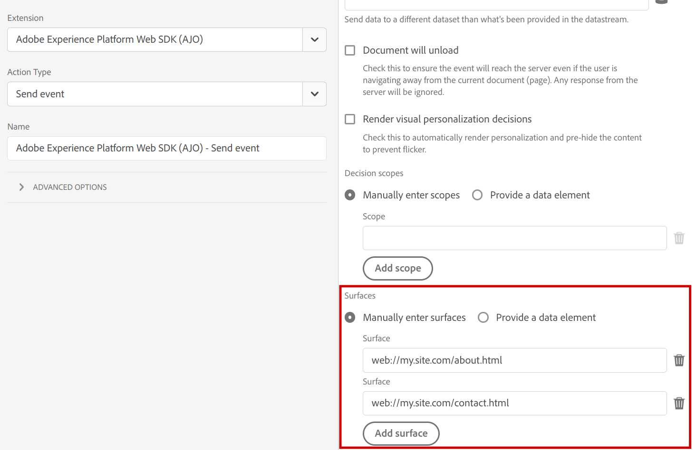

# [!DNL Experience Platform Web SDK]에 [!DNL Adobe Journey Optimizer] 사용 중

[!DNL Adobe Experience Platform] [!DNL Web SDK]은(는) [!DNL Adobe Journey Optimizer]에서 관리되는 개인화된 경험을 웹 채널에 전달하고 렌더링할 수 있습니다. WYSIWYG 편집기, [!DNL Adobe Journey Optimizer] [웹 채널](get-started-web.md) 또는 [코드 기반 경험 채널](../code-based/get-started-code-based.md)인 비시각적 인터페이스를 사용하여 [!DNL Journey Optimizer Web] 캠페인 및 개인화 경험을 만들고 활성화하고 제공할 수 있습니다.

## 용어 {#terminology}

**[!UICONTROL 표면]**: 웹 표면은 [!DNL Adobe Journey Optimizer] 경험 콘텐츠가 전달될 URI로 식별된 페이지의 웹 페이지나 위치입니다.

**[!UICONTROL 제안]**: [!DNL Adobe Journey Optimizer]에서 제안은 [!DNL Journey Optimizer Campaign]에서 선택한 경험과 상관 관계가 있습니다.

## [!DNL Adobe Journey Optimizer] 사용 {#enable-ajo}

[!DNL Adobe Journey Optimizer]을(를) 사용하려면 아래 단계를 따르십시오.

1. 특히 [필수 구성 요소](web-prerequisites.md)를 살펴보십시오.
   * [!DNL Adobe Experience Cloud Visual Editing Helper]을(를) 설정합니다.
   * [데이터스트림](https://experienceleague.adobe.com/docs/experience-platform/datastreams/overview.html?lang=ko){target="_blank"}에서 [!DNL Adobe Journey Optimizer]을(를) 사용하도록 설정합니다.
   * [!UICONTROL Active-On-Edge 병합 정책] 옵션을 사용하도록 설정합니다.

1. 이벤트에 `renderDecisions` 옵션을 추가합니다. 웹 페이지 표면에 전달된 Journey Optimizer 컨텐츠 제안을 자동으로 렌더링하려면 `renderDecisions`을(를) `true`(으)로 설정하십시오.

   ```javascript
   alloy("sendEvent", {
       ...,
       "renderDecisions": true
   })
   ```

1. 이벤트에서 추가 서피스를 지정합니다(선택 사항). 기본적으로 웹 SDK은 현재 웹 페이지에 대한 웹 표면을 자동으로 생성하고 Edge Network에 대한 요청에 포함합니다. 필요한 경우 `sendEvent` 명령의 `personalization.surfaces` 옵션이나 Web SDK 확장의 해당 **[!UICONTROL 표면]** [[!UICONTROL 이벤트 보내기] 작업](https://experienceleague.adobe.com/docs/experience-platform/tags/extensions/client/web-sdk/action-types.html?lang=ko#send-event){target="_blank"} 구성에서 이를 지정하여 요청에 추가 표면을 포함할 수 있습니다.

   ```javascript
   alloy("sendEvent", {
       ...
       "personalization": {
           "surfaces": [ "web://my.site.com/about.html", "web://my.site.com/contact.html" ]
       }
   })
   ```

   

   이벤트 표면이 `query.personalization.surfaces` 요청 필드에 포함되어 있습니다.

   ```json
   {
   "events": [
       {
           "query": {
               "personalization": {
               "schemas": [
                   ...
               ],
               "decisionScopes": [
                   "__view__"
               ],
               "surfaces": [
                   "web://ajostage.weebly.com/"
               ]
               }
           },
           ...
       }
   ]
   }
   ```

1. 다른 개인화 기능과 마찬가지로 경험을 가져오는 동안 페이지에서 특정 부분만 숨기도록 **[코드 조각 사전 숨김](https://experienceleague.adobe.com/docs/experience-platform/edge/personalization/manage-flicker.html?lang=ko){target="_blank"}**&#x200B;을 추가할 수 있습니다.

## 개인화된 콘텐츠 렌더링 {#rendering-personalized-content}

개인화된 콘텐츠를 렌더링하는 방법에 대한 자세한 내용은 [Adobe Experience Platform Web SDK 설명서](https://experienceleague.adobe.com/docs/experience-platform/edge/personalization/rendering-personalization-content.html?lang=ko){target="_blank"}를 참조하세요.

웹 표면에 대한 Adobe Journey Optimizer 제안은 `__view__` 결정 범위 제안과 유사한 방식으로 처리됩니다. 특히 `sendEvent` 명령에서 `renderDecisions` 옵션이 `true`(으)로 설정되면 이러한 옵션은 웹 SDK에서 자동으로 렌더링됩니다.

샘플 Journey Optimizer 콘텐츠 제안:

```json
{
    "scope": "web://ajostage.weebly.com/",
    "scopeDetails": {
        "correlationID": "ccfaf19c-6360-4aea-b464-0cf924db5da7",
        "characteristics": {
            "eventToken": "eyJtZXNzYWdlRXhlY3V0aW9uIjp7Im1lc3NhZ2VFeGVjdXRpb25JRCI6ImEzNDYxYTMzLTc5MjktNGQyNS1hNmMxLTVkYzM2YWY1NzRmMyIsIm1lc3NhZ2VJRCI6ImNjZmFmMTljLTYzNjAtNGFlYS1iNDY0LTBjZjkyNGRiNWRhNyIsIm1lc3NhZ2VUeXBlIjoibWFya2V0aW5nIiwiY2FtcGFpZ25JRCI6IjEzN2JmMzllLWM1ODgtNGI1My1iODQxLTJiMWZiZDYxM2JkYiIsImNhbXBhaWduVmVyc2lvbklEIjoiMTA1NzY1MmEtZWYwNS00YjE3LWExMmUtY2FlOTQyOTFhMWFjIiwiY2FtcGFpZ25BY3Rpb25JRCI6ImViNTlmODQ4LTk5ZDYtNGE1OC05YmU4LTk4MjIxODU0NmYzNiIsIm1lc3NhZ2VQdWJsaWNhdGlvbklEIjoiYzg2NzFjZmItNDdjYS00YTVjLTg4Y2YtNzYwZDFlZjU1MzQyIn0sIm1lc3NhZ2VQcm9maWxlIjp7ImNoYW5uZWwiOnsiX2lkIjoiaHR0cHM6Ly9ucy5hZG9iZS5jb20veGRtL2NoYW5uZWxzL3dlYiIsIl90eXBlIjoiaHR0cHM6Ly9ucy5hZG9iZS5jb20veGRtL2NoYW5uZWwtdHlwZXMvd2ViIn0sIm1lc3NhZ2VQcm9maWxlSUQiOiI2YTViY2I3ZC02MmYxLTQ5NDItODRkMC02MzE5ZjM5Zjk1ZGUifX0="
        },
        "decisionProvider": "AJO",
        "activity": {
            "id": "137bf39e-c588-4b53-b841-2b1fbd613bdb#eb59f848-99d6-4a58-9be8-982218546f36"
        }
    },
    "id": "002321c0-dff5-4153-b171-a9dfb70b9750",
    "items": [
        {
            "schema": "https://ns.adobe.com/personalization/dom-action",
            "data": {
                "uiData": {
                    "tagType": "Text",
                    "actionType": "changed"
                },
                "content": "Welcome AJO!",
                "prehidingSelector": "#wsite-content > DIV:nth-of-type(2) > DIV:nth-of-type(1) > DIV:nth-of-type(1) > DIV:nth-of-type(1) > DIV:nth-of-type(1) > DIV:nth-of-type(3) > FONT:nth-of-type(1) > SPAN:nth-of-type(1)",
                "type": "setHtml",
                "selector": "#wsite-content > DIV.wsite-section-wrap:eq(1) > DIV.wsite-section:eq(0) > DIV.wsite-section-content:eq(0) > DIV.container:eq(0) > DIV.wsite-section-elements:eq(0) > DIV.paragraph:eq(0) > FONT:nth-of-type(1) > SPAN:nth-of-type(1)"
            },
            "id": "0a522f66-9e6a-4ded-b1d0-e9167f103290"
        }
    ]
}
```

## 디버깅 {#debugging}

Adobe Journey Optimizer 개인화 구현을 디버깅하려면 [웹 SDK 디버깅](https://experienceleague.adobe.com/docs/experience-platform/edge/fundamentals/debugging.html?lang=ko){target="_blank"}을 사용하십시오. [[!DNL Adobe Experience Platform Assurance]](https://developer.adobe.com/client-sdks/documentation/platform-assurance/)을(를) 사용하여 문제를 해결할 때 [!DNL Adobe Journey Optimizer] 디버그 추적을 사용할 수 있습니다. `AJO:` 접두사가 있는 이벤트를 확인합니다.


