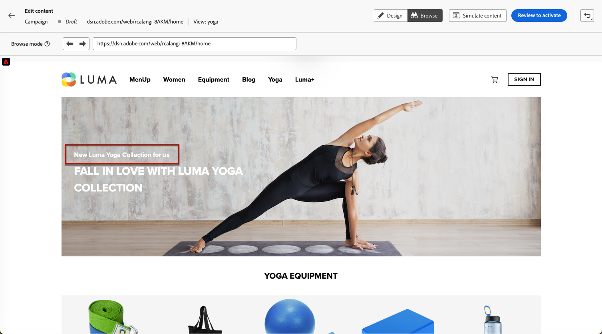

# 단일 페이지 애플리케이션 작성 {#web-author-spas}

## 보기 정보 {#about-views}

>[!CONTEXTUALHELP]
>id="ajo_web_designer_modifications_views"
>title="선택된 보기에 변경 사항 적용"
>abstract="선택된 보기에만 변경 사항이 적용됩니다. 보기는 **찾아보기** 모드를 사용하여 검색하고 해당 항목으로 이동할 수 있습니다. 원하는 보기를 찾으실 수 없습니까?"
>additional-url="https://experienceleague.adobe.com/docs/platform-learn/implement-web-sdk/overview.html?lang=ko-KR" text="자세히 알아보기"

이제 웹 디자이너 비주얼 편집기에서 **단일 페이지 응용 프로그램**(SPA)을 작성할 수 있습니다. 이를 통해 웹 페이지 수정 사항을 적용할 특정 **보기**&#x200B;를 선택할 수 있습니다.

[이 비디오에서는 단일 페이지 애플리케이션을 제작하는 방법에 대해 알아봅니다](#video)

보기는 전체 사이트 또는 홈 페이지, 전체 제품 사이트 또는 모든 체크아웃 페이지의 게재 환경 설정 프레임과 같은 사이트의 시각적 요소 그룹으로 정의할 수 있습니다.

Adobe Experience Platform Web SDK 구현에서 보기를 정의하려면 일회용 개발자 설정이 필요합니다. 이렇게 하면 SPA에서 Adobe Journey Optimizer 웹 캠페인을 만들고 실행할 수 있습니다.

## 웹 SDK 구현에서 보기 정의 {#define-views}

[!DNL Journey Optimizer] Adobe에서 XDM 보기를 활용하여 마케터가 웹 비주얼 편집기를 통해 SPA에서 웹 개인화 및 실험 캠페인을 실행할 수 있도록 할 수 있습니다. [자세히 알아보기](https://experienceleague.adobe.com/docs/experience-platform/edge/personalization/ajo/web-spa-implementation.html?lang=ko){target="_blank"}

[!DNL Journey Optimizer] 사용자 인터페이스에서 보기에 액세스하고 보기를 작성하려면 [이 섹션](https://experienceleague.adobe.com/docs/experience-platform/edge/personalization/ajo/web-spa-implementation.html?lang=ko#implement-xdm-views){target="_blank"}에 나열된 단계를 따라야 합니다.

## 웹 디자이너에서 보기 살펴보기 {#discover-views}

Adobe Experience Platform Web SDK 구현에서 SPA 설정이 완료되면 수정 사항을 적용할 웹 사이트의 모든 보기를 탐색해야 합니다. 아래 단계를 수행합니다.

1. [웹 여정 또는 캠페인을 만들고](create-web.md) [웹 디자이너에 액세스합니다](web-visual-editor.md).

   현재 있는 보기는 왼쪽 상단에 표시됩니다.

   

1. **[!UICONTROL 찾아보기]** 모드로 전환합니다. [자세히 알아보기](web-visual-editor.md#browse-mode)

   

1. 웹 사이트의 여러 페이지 사이를 이동하여 해당 페이지를 모두 검색합니다. 다른 페이지를 거칠 때 맨 위에 표시되는 보기 이름이 변경됩니다.

   

## 다른 보기에 수정 사항 적용 {#apply-modifications-views}

특정 보기에 있는 동안 수정 사항을 추가한 후에는 선택한 다른 보기에 적용할 수 있습니다. 아래 단계를 수행합니다.

>[!CAUTION]
>
>**[!UICONTROL 찾아보기]** 모드를 사용하여 보기를 검색하지 못한 경우 수정 사항을 적용할 보기를 선택할 수 없습니다. [자세히 알아보기](#discover-views)

1. **[!UICONTROL 수정 사항]** 아이콘을 선택하여 왼쪽에 해당 창을 표시합니다.

   

1. 수정 사항을 선택하고 옆에 있는 **[!UICONTROL 추가 작업]** 단추를 클릭합니다. **[!UICONTROL 더 많은 보기에 적용]**&#x200B;을 선택합니다.

   

1. 변경 사항을 적용할 보기를 선택합니다.

   

1. **[!UICONTROL 적용]**&#x200B;을 클릭합니다.

1. **[!UICONTROL 찾아보기]** 모드로 전환하여 원하는 페이지에 수정 사항이 적용되었는지 확인하십시오.

   

## 방법 비디오{#video}

이 비디오에서는 다음을 하는 방법을 설명합니다.

* **[!UICONTROL 찾아보기]** 모드를 사용하여 SPA 보기 검색
* 현재 보기에서 작성
* 여러 보기 또는 검색된 모든 보기에 웹 사이트 수정 사항 적용
* 수정 시 일괄 작업 수행

>[!VIDEO](https://video.tv.adobe.com/v/3446892/?quality=12&learn=on&captions=kor)
